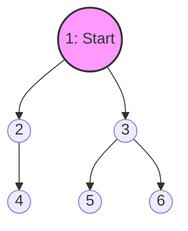
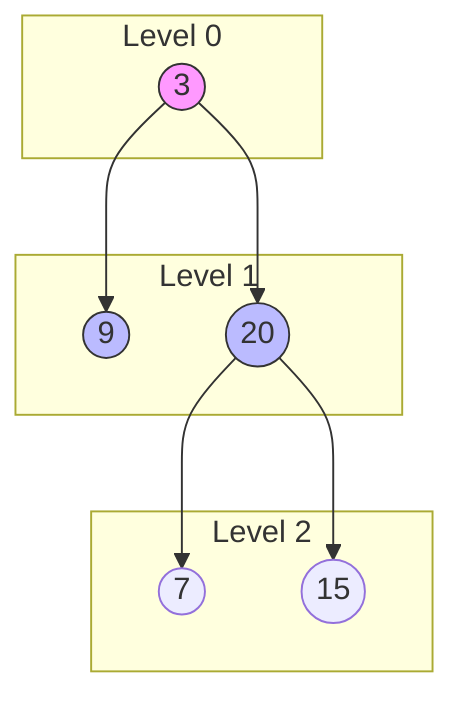
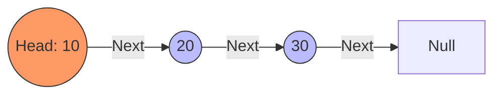
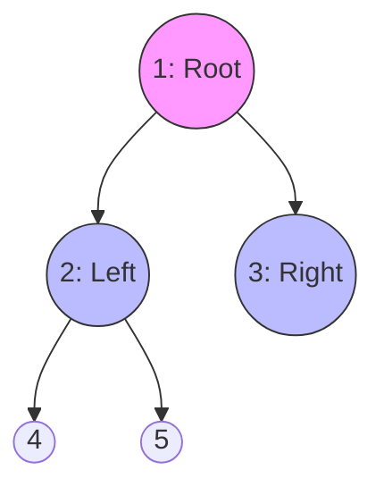
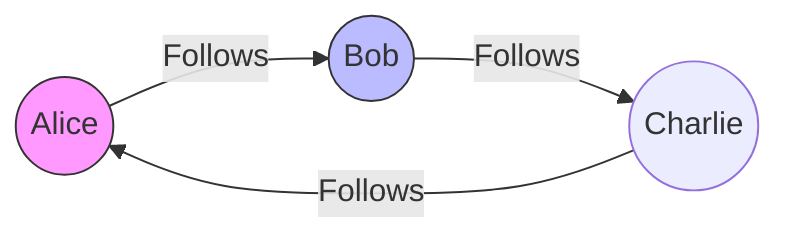
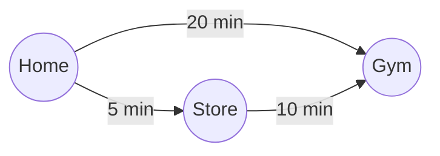
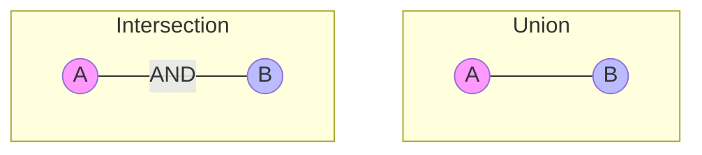

# Go Data Structures for Interviews

> Master the essential data structures with Go-specific implementations

This guide covers the data structures you'll use in 90% of coding interviews, with Go-specific idioms and complexity analysis.

---

## Table of Contents

1. [Slices](#slices)
2. [Maps](#maps)
3. [Stacks](#stacks)
4. [Queues](#queues)
5. [Heaps (Priority Queues)](#heaps-priority-queues---the-vip-line)
6. [Linked Lists](#linked-lists---the-scavenger-hunt)
7. [Trees](#trees---the-file-system)
8. [Graphs](#graphs---the-city-network)
9. [Sets](#sets---the-exclusive-club)
10. [Modern Generic Helpers](#modern-generic-helpers---the-swiss-army-knife)

---

## Slices

Slices are Go's dynamic arrays — the most important data structure for interviews.

### Anatomy of a Slice

```go
// A slice is a struct with three fields:
// - pointer to underlying array
// - length (number of elements)
// - capacity (size of underlying array)

nums := make([]int, 5, 10)
// len(nums) = 5
// cap(nums) = 10
```

### Creating Slices

```go
// Literal
nums := []int{1, 2, 3, 4, 5}

// make(type, length, capacity)
nums := make([]int, 5)       // len=5, cap=5, all zeros
nums := make([]int, 0, 100)  // len=0, cap=100 (pre-allocated)

// From array
arr := [5]int{1, 2, 3, 4, 5}
slice := arr[1:4]  // [2, 3, 4]

// Nil slice (valid, len=0, cap=0)
var nums []int  // nums == nil is true, JSON: null

// Empty non-nil slice (len=0, cap=0)
nums := []int{} // nums != nil, JSON: []
```

> **Note: Nil vs. Empty Slices**
>
> While both have a length and capacity of 0, there are important differences:
>
> * **Nil Slice** (`var s []int`):
>   * No underlying array allocated.
>   * Marshals to `null` in JSON.
>   * Functional equality: `s == nil`.
>   * Preferred for "no result" or variable declaration.
>
> * **Empty Slice** (`s := []int{}` or `make([]int, 0)`):
>   * Pointer is non-nil.
>   * Marshals to `[]` in JSON.
>   * Functional equality: `s != nil`.
>   * Preferred when you need to explicitly return an empty list (e.g., to a JSON client).

### Essential Operations

```go
// Access
first := nums[0]
last := nums[len(nums)-1]

// Modify
nums[0] = 100

// Length
n := len(nums)

// Append (may reallocate!)
nums = append(nums, 6)
nums = append(nums, 7, 8, 9)
nums = append(nums, otherSlice...)

// Copy
dst := make([]int, len(src))
copy(dst, src)

// Slicing [start:end] (end is exclusive)
subslice := nums[1:4]   // indices 1, 2, 3
prefix := nums[:3]       // indices 0, 1, 2
suffix := nums[3:]       // index 3 to end
clone := nums[:]         // full copy reference
```

### Common Slice Patterns

```go
// 1. Remove element at index i (Order doesn't matter)
// Efficiency: O(1) - Very fast!
// Logic: Since order doesn't matter, we can just fill the "hole" at index 'i'
// with the last element of the slice, then chop off the last element.
nums[i] = nums[len(nums)-1] // Copy last element to index i (overwrites target)
nums = nums[:len(nums)-1]   // Truncate slice by 1 (removes the duplicate at end)

// 2. Remove element at index i (Preserve order)
// Efficiency: O(n) - Slower, has to shift elements.
// Logic: "Cut" the slice at 'i' and rejoin the parts before and after it.
// append(part_before_i, part_after_i...)
nums = append(nums[:i], nums[i+1:]...)

// 3. Insert element at index i
// Efficiency: O(n) - Slower, triggers allocation and shifting.
// Logic: Create a new slice segment with [val, ...rest_of_elements] and append it
// to the start of the slice.
nums = append(nums[:i], append([]int{val}, nums[i:]...)...)
// Better: Use slices package (Go 1.21+) for readability and optimization
nums = slices.Insert(nums, i, val)

// 4. Reverse in place
// Logic: Walk inward from both ends (0 and len-1), swapping as we go.
// Stops when pointers meet or cross (i < j is false).
for i, j := 0, len(nums)-1; i < j; i, j = i+1, j-1 {
    nums[i], nums[j] = nums[j], nums[i] // Parallel assignment (swap)
}

// 5. Filter in place (Zero allocation)
// Logic: "Compact" the array. We maintain a pointer 'n' that tracks
// the position where the next "kept" item should go.
n := 0
for _, x := range nums {
    if x > 0 { // Condition: keep positive numbers
        nums[n] = x // Move valid item to position 'n'
        n++         // Advance the "write" head
    }
}
nums = nums[:n] // Reslice to keep only the valid items (0 to n)

// 6. Two-pointer technique
// Logic: Use two indices to traverse the slice, usually based on some condition.
// Often used for finding pairs (in sorted arrays), partitioning, or checking palindromes.
left, right := 0, len(nums)-1
for left < right {
    // Check condition (e.g., nums[left] + nums[right] == target)
    // Move left++ or right-- based on logic
}
```

### 2D Slices (Matrices)

```go
// Create m x n matrix (3 rows, 4 columns)
// Concept: A 2D slice is a "slice of slices".
// We must allocate the outer backbone first, then each row individually.
m, n := 3, 4
matrix := make([][]int, m) // 1. Allocate outer slice (holds 3 nil headers)

for i := range matrix {
    matrix[i] = make([]int, n) // 2. Allocate each inner slice (row)
}

/*
Visual Representation (Step-by-Step):
1. After make([][]int, m):
   matrix -> [ nil, nil, nil ]

2. After the loop runs:
   matrix
     |
     v
   [ ptr ] -> [ 0, 0, 0, 0 ] (Row 0)
   [ ptr ] -> [ 0, 0, 0, 0 ] (Row 1)
   [ ptr ] -> [ 0, 0, 0, 0 ] (Row 2)

Each row is independent in memory!
*/

// Access
matrix[row][col] = 42

// Iterate
for i := 0; i < len(matrix); i++ {
    for j := 0; j < len(matrix[0]); j++ {
        fmt.Print(matrix[i][j], " ")
    }
    fmt.Println()
}
```

### Sorting Slices

```go
import "sort"

// Sort integers
sort.Ints(nums)

// Sort strings
sort.Strings(strs)

// Custom sort
sort.Slice(items, func(i, j int) bool {
    return items[i].Score > items[j].Score // descending
})

// Check if sorted
sort.IntsAreSorted(nums)

// Binary search (slice must be sorted!)
idx := sort.SearchInts(nums, target)
// Returns insertion point; check if nums[idx] == target
```

### slices Package (Go 1.21+)

The `slices` package provides generic slice operations:

```go
import "slices"

nums := []int{3, 1, 4, 1, 5, 9}

// Sort (generic, modifies in place)
slices.Sort(nums)                     // [1, 1, 3, 4, 5, 9]

// Sort with custom comparison
slices.SortFunc(nums, func(a, b int) int {
    return b - a                       // Descending
})

// Binary search (returns index, found)
idx, found := slices.BinarySearch(nums, 4)

// Contains, Index
slices.Contains(nums, 5)              // true
slices.Index(nums, 4)                 // index or -1

// Min, Max
slices.Min(nums)                      // 1
slices.Max(nums)                      // 9

// Clone (deep copy for simple types)
copy := slices.Clone(nums)

// Compact (remove consecutive duplicates)
compact := slices.Compact(slices.Clone(nums))

// Reverse
slices.Reverse(nums)

// Equal (Value comparison, NOT reference comparison)
// Clarification: Although slices are reference types, Equal() compares the *content*.
// Logic: Checks length first, then compares elements one by one (O(n)).
// It returns true here even if the underlying arrays are at different memory addresses.
slices.Equal([]int{1, 2}, []int{1, 2})  // true

// Insert, Delete
nums = slices.Insert(nums, 2, 100)    // Insert 100 at index 2
nums = slices.Delete(nums, 1, 3)      // Remove indices 1 and 2
```

### Complexity

| Operation | Time | Notes |
|-----------|------|-------|
| Access by index | O(1) | |
| Append | O(1) amortized | May reallocate |
| Insert/Delete at index | O(n) | Shifts elements |
| Copy | O(n) | |
| Slice expression | O(1) | Shares underlying array |

---

## Maps

Go's hash maps provide O(1) average lookup — essential for complement searching patterns.

### Creating Maps

```go
// make()
m := make(map[string]int)

// Literal
m := map[string]int{
    "alice": 30,
    "bob":   25,
}

// Nil map (Be Careful!)
// Definition: A declared map without 'make' or literal initialization is nil.
var m map[string]int  // Just a pointer, nowhere to store data yet!

// READING is safe (Returns zero value)
val := m["key"]       // val = 0 (safe, no panic)
len(m)                // 0 (safe)

// WRITING panics (Crash!)
// m["key"] = 1       // PANIC: assignment to entry in nil map
// Why? There is no underlying hash table allocated to store the key-value pair.
// Analogy: Trying to put a book on a shelf that you haven't bought yet.
// Fix: Always initialize with 'make' before writing.
m = make(map[string]int)
m["key"] = 1          // Now it works
```

### Essential Operations

```go
// Insert/Update
m["key"] = value

// Lookup (The Ambiguity Problem)
value := m["key"]
// Returns value if key exists.
// If key is MISSING, it returns the "Zero Value" for the type:
// - int: 0
// - string: ""
// - bool: false
// - pointer: nil

// PROBLEM: If value == 0, is the real value 0, or is the key missing?
// You cannot tell just by looking at 'value'.

// Solution: "Comma-ok" idiom (Existence Check)
value, ok := m["key"] // 'ok' is a boolean
if !ok {
    // Key "key" does not exist in the map
} else {
    // Key exists (value might still be 0, but it's a "real" 0)
}

// Delete
delete(m, "key")

// Length
n := len(m)

// Iterate (Random Order Warning!)
// IMPORTANT: Go maps do NOT maintain insertion order.
// The iteration order is randomized by the runtime and changes between runs.
// Why? To force developers not to rely on implementation details (hash bucket order).
// Rule: If you need ordered data (e.g., sorted keys), do NOT use a map alone.
// Use a Slice alongside the map to track order.
for key, value := range m {
    fmt.Printf("%s: %d\n", key, value) // Output order is unpredictable
}

// Keys only
for key := range m {
    fmt.Println(key)
}
```

### Common Map Patterns

```go
// 1. Counting / Frequency map
counts := make(map[string]int)
for _, word := range words {
    counts[word]++  // zero value of int is 0
}

// ---------------------------------
// 2. Two Sum Pattern (The "Complement" Strategy)
// Goal: Find two numbers that add up to 'target'.
// Strategy: As we iterate, for every number 'x', we need 'target - x'.
// Instead of scanning back (O(n^2)), we check our "seen" map (O(1)).

seen := make(map[int]int)  // Map: [Number Value] -> [Index]

/*
Visual Walkthrough: nums = [2, 11, 7, 15], target = 9
------------------------------------------------------------------
Step | Current (num) | Needed (target-num)| Is Needed in Map? | Action
------------------------------------------------------------------
 1   | 2             | 7                  | No (map empty)    | Store 2: map{2:0}
 2   | 11            | -2                 | No                | Store 11: map{2:0, 11:1}
 3   | 7             | 2                  | YES! (at idx 0)   | Found pair! Return [0, 2]
------------------------------------------------------------------
*/

for i, num := range nums {
    complement := target - num // What number do we need to complete the pair?
    
    // Check if we've already seen that needed number
    if j, exists := seen[complement]; exists {
        return []int{j, i} // Found: j is index of complement, i is current index
    }
    
    // Remember this number and its index for future matches
    seen[num] = i
}

// ---------------------------------
// 3. Deduplication (Simulating a Set)
// Goal: Remove all duplicate values, keeping only unique ones.
// Logic: Maps require keys to be unique. If you add '5' twice, the second one just overwrites the first.
// The result is a collection of only unique keys.

// why struct{}?
// - bool: Uses 1 byte of memory per entry.
// - struct{}: Uses 0 bytes. It's truly empty. Ideally optimized.

unique := make(map[int]struct{})
for _, num := range nums {
    unique[num] = struct{}{} // "I have seen this number"
}
// Now 'unique' map keys are the strict set of numbers from 'nums'

// ---------------------------------
// 4. Grouping (The "Bucketing" Strategy)
// Goal: Organize items into categories, like specific bins.
// Real-World: Grouping orders by CustomerID, logs by ErrorLevel, or words by Anagrams.
// Logic: The Key is the "Category". The Value is a Slice (list) of items in that category.

groups := make(map[string][]string) // Map: [First Letter] -> [List of Names]

names := []string{"Alice", "Bob", "Anna", "Bill", "Charlie"}

for _, name := range names {
    // Logic: The "Key" is the first letter of the name.
    // In a real app, this could be customerID, date, category_id, etc.
    firstLetter := string(name[0]) 

    // Add name to that letter's bucket
    groups[firstLetter] = append(groups[firstLetter], name)
}
// Result:
// "A": ["Alice", "Anna"]
// "B": ["Bob", "Bill"]
// "C": ["Charlie"]

// ---------------------------------
// 5. Memoization (Caching Results)
// Goal: Avoid re-calculating expensive operations by remembering previous answers.
// Real-World: Dynamic Programming, caching database queries, recursive graph problems.
// Logic: Before doing work, check: "Have I seen this input before?"

memo := make(map[string]int) // Map: [Input State] -> [Computed Result]
var solve func(state string) int

solve = func(state string) int {
    // 1. Check Cache (O(1))
    if result, exists := memo[state]; exists {
        return result // Return saved answer immediately!
    }

    // 2. Compute (Expensive part)
    // result := heavyComputation(state)
    
    // 3. Save to Cache
    memo[state] = result 
    return result
}
```

### Map with Struct Keys (Composite Keys)

Go maps allow using structs as keys, provided all fields in the struct are comparable.

**Real-World Usefulness:**

* **Grid Systems**: Tracking visited coordinates in games or pathfinding algorithms (e.g., `x, y`).
* **Caches**: Memoizing functions with multiple arguments (e.g., `UserType` + `Region`).
* **Composite IDs**: Solving problems where uniqueness is defined by a combination of fields (e.g., `OrderID` + `ProductID`).

**Advantage**: You don't need to hack simple keys together (like `"1,2"`) which is error-prone and slow.

```go
// Example: 2D Grid Traversal (Visited Set)
type Point struct {
    X, Y int
}

// 1. Define map with Struct as the Key
visited := make(map[Point]bool)

// 2. Insert struct directly
current := Point{X: 0, Y: 0}
visited[current] = true

// 3. Lookup using a struct
next := Point{X: 1, Y: 1}
if visited[next] {
    // We have been here before
}

// WARNING: Struct keys must NOT contain slices, maps, or functions.
// Those types are not comparable using '==', so they break map lookups.
```

### Complexity

| Operation | Average | Worst |
| --------- | ------- | ----- |
| Insert    | O(1)    | O(n)  |
| Lookup    | O(1)    | O(n)  |
| Delete    | O(1)    | O(n)  |
| Iterate   | O(n)    | O(n)  |

---

## Stacks

**Definition**: A Stack is a **LIFO** (Last-In, First-Out) data structure.
Think of a stack of plates in a cafeteria:

1. **Push**: You put a new plate on top.
2. **Pop**: You take the top plate off.
You can't grab the bottom plate without removing the top ones first!

**Real-World Use Cases**:

1. **Undo/Redo**: Editors store your actions in a stack. Ctrl+Z pops the last action.
2. **Browser History**: The "Back" button pops the current page to return to the previous one.
3. **Call Stack**: Programming languages use stacks to track function calls (recursion).
4. **Syntax Parsing**: Compilers check matching brackets `(( ))` using stacks.

Go doesn't have a built-in stack type, but **Slices** are perfect for this.

### Stack Implementation

```go
// Stack using slice
// Defines 'Stack' as a nickname for an integer slice.
type Stack []int

// PUSH
// Receiver '(s *Stack)' is a POINTER because we need to modify the actual slice.
// If we used '(s Stack)', we would modify a copy, and the original stack wouldn't change.
func (s *Stack) Push(v int) {
    *s = append(*s, v)
}

// POP
func (s *Stack) Pop() int {
    // 1. Safety Check: Don't pop from an empty stack!
    if len(*s) == 0 {
        panic("Stack Empty: Cannot Pop")
    }

    // 2. Get the last element (Top of stack)
    // Note on (*s): We must "dereference" the pointer to get the actual slice.
    lastIndex := len(*s) - 1
    v := (*s)[lastIndex]

    // 3. Remove the last element (Shrink the slice)
    *s = (*s)[:lastIndex]

    return v
}

// PEEK (Look at top without removing)
func (s *Stack) Peek() int {
    if len(*s) == 0 { return 0 } // Handle empty case gracefully or panic
    return (*s)[len(*s)-1]
}

func (s *Stack) IsEmpty() bool {
    return len(*s) == 0
}
```

### Quick Stack Pattern (No Custom Type)

```go
// Just use a slice directly
// Note: Why no pointers here?
// In this pattern, we are using the 'stack' variable directly in the function.
// We update it by REASSIGNING it: "stack = append(...)" or "stack = stack[...]".
// We only need pointers involved when we want a separate Function/Method to modify our variable.
stack := []int{}

// Push
stack = append(stack, value)

// Pop
top := stack[len(stack)-1]
stack = stack[:len(stack)-1]

// Peek
top := stack[len(stack)-1]

// IsEmpty
if len(stack) == 0 { }
```

### Stack Applications

```go
// 1. Valid Parentheses
// Problem: Check if string has valid open/close pairs: "()[]{}" is true, "(]" is false.
func isValid(s string) bool {
    // State: Use a stack to keep track of 'OPEN' brackets waiting for a match.
    stack := []rune{}
    
    // Map: Closing bracket -> Matching Open bracket
    pairs := map[rune]rune{')': '(', '}': '{', ']': '['}

    for _, c := range s {
        // CASE 1: Opening Bracket? Push to stack.
        // Logic: We expect to see the closing partner later.
        if c == '(' || c == '{' || c == '[' {
            stack = append(stack, c)
        } else {
            // CASE 2: Closing Bracket? Check match.
            // Check A: Is stack empty? (Means we have a closing bracket with NO opening partner)
            // Check B: Does the top of stack NOT match? (Means Mismatch type, e.g. "{]")
            if len(stack) == 0 || stack[len(stack)-1] != pairs[c] {
                return false // Invalid!
            }
            // Logic: Match found! Remove the opening bracket from stack (Problem solved for this pair).
            stack = stack[:len(stack)-1]
        }
    }
    // Final Check: Stack must be empty.
    // If not empty, we have leftover opening brackets like "(()" -> stack has "("
    return len(stack) == 0
}

// 2. Monotonic Stack (Next Greater Element)
// Goal: For each number, find the FIRST number to its right that is larger.
// Analogy: Think of it as people standing in line. You are looking for the first person taller than you behind you.

// Input:  [2, 1, 5]
// Result: [5, 5, -1]
// - 2 sees 5 is taller.
// - 1 sees 5 is taller.
// - 5 sees no one.

func nextGreater(nums []int) []int {
    n := len(nums)
    result := make([]int, n)
    for i := range result { result[i] = -1 } // Default: if no greater element found

    // Stack stores INDICES of numbers that are "waiting" for a greater element.
    // Why indices? Because we need to update the 'result' array at that specific position.
    stack := []int{} 

    /*
    Visual Trace: nums = [2, 1, 5]
    -------------------------------------------------------------------------------
    i | Val | Stack (Waitlist) | Action
    -------------------------------------------------------------------------------
    0 | 2   | [0(2)]           | 2 is unmatched. Wait. Push index 0.
    1 | 1   | [0(2), 1(1)]     | 1 is NOT > 2. Wait. Push index 1.
    2 | 5   | [0(2)]           | 5 > 1? YES! Pop 1. result[1] = 5 (1 found match!)
      |     | []               | 5 > 2? YES! Pop 0. result[0] = 5 (2 found match!)
      |     | [2(5)]           | 5 unmatched. Wait. Push index 2.
    -------------------------------------------------------------------------------
    */

    for i := 0; i < n; i++ {
        // While stack not empty AND current number is BIGGER than the waiting number:
        for len(stack) > 0 && nums[i] > nums[stack[len(stack)-1]] {
            idx := stack[len(stack)-1] // Get the index of the waiting number
            stack = stack[:len(stack)-1] // Pop it (It found a match!)
            result[idx] = nums[i]        // Record the match
        }
        stack = append(stack, i) // Current number joins the waitlist
    }
    return result
}
```

---

## Queues

**Definition**: A Queue is a **FIFO** (First-In, First-Out) data structure.
Think of a line of people waiting to buy tickets:

1. **Enqueue**: You join the back of the line.
2. **Dequeue**: The person at the front gets served and leaves.
Fairness is key: The first one to arrive is the first one served.

**Real-World Use Cases**:

1. **Task Processing**: Background jobs (like sending emails) are processed in order.
2. **Printer Spool**: Documents wait in a queue; the first file sent is printed first.
3. **Web Server Requests**: Handling incoming HTTP requests when the server is busy.
4. **Breadth-First Search (BFS)**: Exploring graphs level-by-level (closest nodes first).

### Queue Implementation

```go
// 1. Slice-based Queue (Easiest to write, but performance trap!)
// Pros: Simple, valid for small queues (e.g., BFS on small graphs).
// Cons: Dequeue is O(n). Removing the first element forces ALL other elements to shift left in memory.
// Analogy: If the person at the front of a line leaves, everyone else must physically take a step forward.
queue := []int{}

// Enqueue (Add to back) -> O(1)
queue = append(queue, value)

// Dequeue (Remove from front) -> O(n) - SLOW for large data!
front := queue[0]
queue = queue[1:] // Slicing merely moves the "window", but eventually the underlying array grows huge.
// (In some languages/cases, this triggers a full memory copy).

// Recommendation: For heavy queue usage (1000+ ops), use a Linked List (O(1) pop).

// Better: Use container/list or circular buffer for large queues
```

### Using container/list for Queue

```go
import "container/list"

queue := list.New()

// Enqueue
queue.PushBack(value)

// Dequeue
front := queue.Front()
queue.Remove(front)
value := front.Value.(int)  // type assertion

// IsEmpty
queue.Len() == 0
```

> **Note: Type Assertion Required**
>
> The `container/list` package stores values as `interface{}` (any type), so you must assert the type when retrieving:
>
> ```go
> value := front.Value.(int)  // Convert interface{} back to int
> ```
>
> If you're unsure of the type, use the safe form to avoid panics:
>
> ```go
> if num, ok := front.Value.(int); ok {
>     // num is an int, safe to use
> }
> ```
>
> See [01-syntax-quick-reference.md#type-assertions--type-switches](01-syntax-quick-reference.md#type-assertions--type-switches) for full explanation.

### Breadth-First Search (BFS) - The "Ripple" Effect

**Definition**: BFS is a graph traversal algorithm that explores nodes layer-by-layer. It starts at a chosen node (the "root") and explores all its **immediate** neighbors before moving on to the neighbors' neighbors.

**Analogy**: Think of dropping a stone into a calm pond.

1. **Splash**: The stone hits the water (Start Node).
2. **Ring 1**: A small ripple forms around the center (Immediate Neighbors).
3. **Ring 2**: A larger ripple forms around the first ring (Neighbors of Neighbors).
4. **Ring 3...**: The ripples expand outward evenly.

BFS guarantees that you visit the **closest** nodes first.

**Key Characteristics**:

* **Data Structure**: Uses a **Queue** (FIFO) to keep track of what to visit next.
* **Shortest Path**: In an unweighted graph (where all edges are equal), BFS *always* finds the shortest path between the start node and any other node.
* **Completeness**: If a solution exists, BFS will find it (unlike DFS which might get lost in an infinite path).

**Real-World Examples**:

1. **GPS Navigation**: Finding the route with the fewest number of turns (unweighted).
2. **Social Networks**: "People you may know" (Friends of Friends = 2nd layer connections).
3. **Web Crawlers**: Google limits how deep it crawls a site; it explores the homepage links first before going deep.
4. **Peer-to-Peer Networks**: Finding the closest available peer to download a file from.

#### BFS Implementation Template

This template works for general graphs using an adjacency list.

```go
// BFS Graph Traversal
// Input: 'start' node ID, 'graph' adjacency list containing connections
func bfs(start int, graph map[int][]int) {
    // 1. Initialize Queue with the starting node
    queue := []int{start} // Slice acting as a FIFO queue

    // 2. Keep track of visited nodes to avoid infinite loops (cycles)
    visited := make(map[int]bool)
    visited[start] = true

    fmt.Println("BFS Starting from:", start)

    // 3. Loop until the queue is empty
    for len(queue) > 0 {
        // DEQUEUE: Remove the first element (front of line)
        current := queue[0]
        queue = queue[1:] // Shift slice window

        fmt.Printf("Visited: %d\n", current)

        // 4. Explore all immediate neighbors
        for _, neighbor := range graph[current] {
            // Only add neighbors we haven't seen yet
            if !visited[neighbor] {
                visited[neighbor] = true        // Mark as seen immediately!
                queue = append(queue, neighbor) // Enqueue for later visit
            }
        }
    }
}
```

#### Visualizing the Process (Trace)

Seeing the code run step-by-step helps lock in the concept of the **Queue**.

**The Scenario**:
We start at **Node 1**.
The graph looks like this:



**Step-by-Step Execution**:

| Step | Current Node | **Queue State** (Front ... Back) | Visited Set | Action |
| ---- | :----------: | -------------------------------- | ----------- | ------ |
| **Init** | - | `[1]` | `{1}` | **Splash!** Start with 1. |
| **1** | **1** | `[]` | `{1}` | Dequeue 1. |
| | | `[2, 3]` | `{1, 2, 3}` | Process 1's neighbors (2, 3). Enqueue them. |
| **2** | **2** | `[3]` | `{1, 2, 3}` | Dequeue 2. |
| | | `[3, 4]` | `{1, 2, 3, 4}` | Process 2's neighbors (4). Enqueue 4. |
| **3** | **3** | `[4]` | `{1, 2, 3, 4}` | Dequeue 3. |
| | | `[4, 5, 6]` | `{1...6}` | Process 3's neighbors (5, 6). Enqueue them. |
| **4** | **4** | `[5, 6]` | `{1...6}` | Dequeue 4. No new neighbors. |
| **5** | **5** | `[6]` | `{1...6}` | Dequeue 5. No new neighbors. |
| **6** | **6** | `[]` | `{1...6}` | Dequeue 6. Queue empty. **Done.** |

> **Visual Insight**:
> Notice how we cleared both **2** and **3** (Level 1) before we even touched **4** (Level 2).
> The **Queue** acts like a buffer, ensuring we don't jump ahead levels.

#### Level-Order Traversal (BFS on Trees) - The "Scanner"

**Concept**: Instead of following a path deep down (like a maze), we scan the tree **row by row**. We capture everyone on Level 0, then everyone on Level 1, and so on.

**Why no `visited` map?**: Unlike graphs, trees point downwards only (Parent -> Child). There are no loops, so we don't need to track visited nodes.

**Visualizing Rows**:



**The "Snapshot" Technique (Critical Logic)**:
To keep levels separate in a single Queue, we use a simple trick: **Freeze the size**.

1. **Snapshot**: At the start of the loop, we check `len(queue)`. Say it's **2**.
2. **Process Batch**: We loop exactly **2** times. We dequeue the 2 nodes from the *current* level.
3. **Queue Children**: If these nodes have children, we add them to the back. They represent the *next* level.

**Analogy**: Think of a roller coaster loading area.

1. The operator counts **4** people in the loading zone.
2. Those 4 get on the ride (Processed).
3. While they board, **6** new people arrive. They wait behind the gate for the *next* turn.

```go
// Binary Tree Level Order Traversal
func levelOrder(root *TreeNode) [][]int {
    if root == nil {
        return nil
    }

    result := [][]int{}
    queue := []*TreeNode{root}

    for len(queue) > 0 {
        // 1. FREEZE: Take a snapshot of the current level size
        levelSize := len(queue) 
        currentLevelValues := []int{}

        // 2. PROCESS BATCH: Iterate exactly 'levelSize' times
        for i := 0; i < levelSize; i++ {
            // Dequeue
            node := queue[0]
            queue = queue[1:]

            // Collect Value
            currentLevelValues = append(currentLevelValues, node.Val)

            // Enqueue Children (Wait for next level processing)
            if node.Left != nil {
                queue = append(queue, node.Left)
            }
            if node.Right != nil {
                queue = append(queue, node.Right)
            }
        }
        // 3. ARCHIVE: Store the finished level
        result = append(result, currentLevelValues)
    }
    return result
}
```

**Visual Trace (The "Snapshot" in Action)**:

Using the tree from the diagram above: `[3, 9, 20, 15, 7]`

| Round | Queue (Start) | LevelSize (Frozen) | Processing Nodes | Queue (End) (Children Added) | Result Added |
| :---: | ------------- | :----------------: | ---------------- | ---------------------------- | ------------ |
| **1** | `[3]` | **1** | Node 3 | `[9, 20]` | `[3]` |
| **2** | `[9, 20]` | **2** | Node 9, Node 20 | `[15, 7]` | `[9, 20]` |
| **3** | `[15, 7]` | **2** | Node 15, Node 7 | `[]` | `[15, 7]` |
| **4** | `[]` | **0** | - | - | (Stop) |

> **Key Takeaway**: By using `levelSize`, we ensure we never mix nodes from Level 1 with Level 2, even though they technically live in the same Queue slice!

**Real-World Usage**:

1. **Organizational Charts**: Printing an employee hierarchy layer-by-layer (CEO first, then all VPs, then all Directors).
2. **Product Categories**: Displaying main categories (Electronics, Clothing) before subcategories (Phones, Shirts).
3. **Skill Trees in Games**: You must unlock all "Level 1" skills before accessing "Level 2" powerful skills.
4. **Version Control**: Searching for a bug in the immediate history (Level 1 commits) before looking at ancient history (Level 100 commits).

---

## Heaps (Priority Queues) - The "VIP" Line

**Definition**: A Heap (specifically a Priority Queue) is a data structure where the "most important" element is always at the front.

* **Min Heap**: Smallest number is the VIP (First out).
* **Max Heap**: Largest number is the VIP (First out).

**Analogy**: Think of an Emergency Room Triage.

* Patients don't see the doctor based on when they arrived (Queue).
* They see the doctor based on **Severity** (Heap).
* A heart attack (Severity 10) cuts in front of a broken finger (Severity 3), even if the finger arrived an hour earlier.

**Real-World Usage**:

1. **Task Scheduling**: The CPU picks the "High Priority" task to run next, not just the oldest one.
2. **Bandwidth Management**: Routers prioritize Voice/Video packets over Email/Downloads to prevent lag.
3. **Dijkstra's Algorithm**: Finding the shortest path requires constantly picking the "closest" node to explore next.
4. **Top K Items**: Finding the "10 Trending Topics" out of millions of tweets.

---

### Implementing heap.Interface (The "Boilerplate")

Go's specific quirk: It doesn't have a built-in Heap class. Instead, it has a "Contract" (Interface). You bring your own Slice, teach it how to swap and compare, and Go handles the magic complex logic.

> **Note**: This boilerplate is standard in Go. You usually just copy-paste it and adjust the `Less` function.

```go
import "container/heap"

// 1. Define your type (it's just a slice!)
type MinHeap []int

// 2. Implement sort.Interface (Len, Less, Swap)
func (h MinHeap) Len() int           { return len(h) }
func (h MinHeap) Less(i, j int) bool { return h[i] < h[j] } // < for MinHeap, > for MaxHeap
func (h MinHeap) Swap(i, j int)      { h[i], h[j] = h[j], h[i] }

// 3. Implement heap.Interface (Push, Pop)
// Note: These use POINTER receivers (*h) because they modify the slice length.

func (h *MinHeap) Push(x any) {
    // Append to the list (The library handles re-ordering)
    *h = append(*h, x.(int))
}

func (h *MinHeap) Pop() any {
    old := *h
    n := len(old)
    x := old[n-1]     // Get the last item
    *h = old[:n-1]    // Shrink the slice
    return x          // Return the item
}
```

### Visualizing Heap Operations

A Heap is just an Array, but we *hallucinate* a Tree structure.

**The Rule**: Parent is always smaller than Children (MinHeap).

**Scenario**: Inserting `5` into existing heap `[10, 20]`.

**Step 1: Add to End**
We blindly append `5` to the array.

* Array: `[10, 20, 5]`
* Tree View:

    ```mermaid
    graph TD
        10((10)) --> 20((20))
        10 --> 5((5: NEW))
        style 5 fill:#f96,stroke:#333,stroke-width:2px
    ```

    *Uh oh! 10 > 5. The Board Member (5) is reporting to a Middle Manager (10). Violation!*

**Step 2: Bubble Up (Correction)**
We swap `5` with its parent `10`.

* Array: `[5, 20, 10]`
* Tree View:

    ```mermaid
    graph TD
        5((5)) --> 20((20))
        5 --> 10((10))
        style 5 fill:#9f9,stroke:#333,stroke-width:2px
    ```

    *Fixed! The VIP (5) is now at the top.*

**Array <-> Tree Mapping Guide**:
Since it's actually an array, how do we find parents/children?

* **Left Child**: `2*i + 1`
* **Right Child**: `2*i + 2`
* **Parent**: `(i-1) / 2`

### Common Usage Patterns

#### 1. The "Basics"

```go
// 1. Initialize
h := &MinHeap{3, 1, 4}
heap.Init(h) // Crucial! Turns a random slice into a valid heap. O(n)

// 2. Add Item
heap.Push(h, 2) // O(log n)

// 3. Get VIP (Smallest)
min := heap.Pop(h).(int) // Returns 1. O(log n)

// 4. Peek (Look at VIP without removing)
peek := (*h)[0] // Always at index 0. O(1)
```

#### 2. The "Top K" Pattern (Very Popular Interview Question)

**Goal**: Find the 3rd largest number in a stream.
**Trick**: Use a **MinHeap** of size K (3).
Why? If you keep the "Top 3 Candidates", the *smallest* of those candidates is the one on the bubble. If a new, bigger number comes in, it beats the smallest candidate.

```go
func findKthLargest(nums []int, k int) int {
    h := &MinHeap{}
    heap.Init(h)

    for _, num := range nums {
        // 1. Add number to our "Elite Club"
        heap.Push(h, num)
        
        // 2. If the club is too big, kick out the "weakest" member.
        // In a Top-K problem, the "weakest" of the large numbers is the smallest one.
        if h.Len() > k {
            heap.Pop(h)
        }
    }
    // The club has exactly k members. The "smallest" of them is the k-th largest overall.
    return (*h)[0]
}
```

### Complexity Recap

| Operation | Time | Why? |
| --------- | ---- | ---- |
| **Push** | `O(log n)` | Adds to end, then "swaps" up the height of tree. |
| **Pop** | `O(log n)` | Removes top, moves last to top, then "swaps" down. |
| **Peek** | `O(1)` | The winner is always at Index 0. |
| **Init** | `O(n)` | Faster than sorting `O(n log n)`! |

---

## Linked Lists - The "Scavenger Hunt"

**Definition**: A Linked List is a chain of nodes. Each node holds **Data** and a **Pointer** (clue) to the next node. Unlike Arrays, they are NOT stored in one contiguous block of memory.

**Analogy**: A **Scavenger Hunt**.

* **Array**: A row of lockers. You know exactly where Locker #5 is (Math = Index lookup).
* **Linked List**: You find a clue at the park. It says "Go to the Library". At the Library, a note says "Go to the Coffee Shop". You *must* visit the locations in order; you can't skip ahead.

**Visualizing the Chain**:



**Real-World Usage**:

1. **Music Playlist**: "Play Next" adds a song to the list. You can easily drag a song to a new position (swapping pointers) without rewriting the whole playlist file.
2. **Browser History**: (Doubly Linked List) `Back` goes to `Prev`, `Forward` goes to `Next`.
3. **Undo/Redo Functionality**: Maintaining a chain of states.

**Comparison**:

| Feature | Array | Linked List |
| :--- | :--- | :--- |
| **Memory** | Contiguous (One block) | Scattered (Nodes anywhere) |
| **Access** | O(1) Instant (Jump) | O(n) Slow (Travel) |
| **Insert/Delete** | O(n) Slow (Shift everyone) | O(1) Fast (Rewire pointers) |

### Node Definition

```go
type ListNode struct {
    Val  int
    Next *ListNode // The "Clue" to the next location
}

// Creating a Chain: 1 -> 2 -> 3
// Note: We use & (address) because Next expects a POINTER
head := &ListNode{Val: 1}
head.Next = &ListNode{Val: 2}
head.Next.Next = &ListNode{Val: 3}
```

### Common Operations

```go
// Traverse
for curr := head; curr != nil; curr = curr.Next {
    fmt.Println(curr.Val)
}

// Find length
func length(head *ListNode) int {
    count := 0
    for curr := head; curr != nil; curr = curr.Next {
        count++
    }
    return count
}

// Insert at head
newHead := &ListNode{Val: 0, Next: head}

// Insert after node
func insertAfter(node *ListNode, val int) {
    newNode := &ListNode{Val: val, Next: node.Next}
    node.Next = newNode
}

// Delete next node
func deleteNext(node *ListNode) {
    if node.Next != nil {
        node.Next = node.Next.Next
    }
}
```

### Linked List Patterns

```go
// 1. Dummy head (simplifies edge cases)
func removeElements(head *ListNode, val int) *ListNode {
    dummy := &ListNode{Next: head}
    prev := dummy

    for curr := head; curr != nil; curr = curr.Next {
        if curr.Val == val {
            prev.Next = curr.Next
        } else {
            prev = curr
        }
    }
    return dummy.Next
}

// 2. Two pointers: Find middle
func findMiddle(head *ListNode) *ListNode {
    slow, fast := head, head
    for fast != nil && fast.Next != nil {
        slow = slow.Next
        fast = fast.Next.Next
    }
    return slow
}

// 3. Detect cycle
func hasCycle(head *ListNode) bool {
    slow, fast := head, head
    for fast != nil && fast.Next != nil {
        slow = slow.Next
        fast = fast.Next.Next
        if slow == fast {
            return true
        }
    }
    return false
}

// 4. Reverse linked list
func reverseList(head *ListNode) *ListNode {
    var prev *ListNode
    curr := head
    for curr != nil {
        next := curr.Next
        curr.Next = prev
        prev = curr
        curr = next
    }
    return prev
}
```

---

## Trees - The "File System"

**Definition**: A Tree is a hierarchy. It has a **Root** (top) and **Children** (sub-items). Unlike Linked Lists, a node can point to multiple children.

**Analogy**: Your Computer's **File System**.

* **Root**: `C:/` or `/` directory.
* **Branches**: Folders.
* **Leaves**: Files (endpoints with no folders inside them).

**Visualizing a Binary Tree** (Each node has at most 2 children):



### Binary Tree Node

```go
type TreeNode struct {
    Val   int
    Left  *TreeNode
    Right *TreeNode
}

// Create
//       1
//      / \
//     2   3
root := &TreeNode{Val: 1}
root.Left = &TreeNode{Val: 2}
root.Right = &TreeNode{Val: 3}
```

### Tree Traversals (The "Walk")

How do we walk through the museum?

**1. Inorder (Left -> Root -> Right)**:

* **Use**: Prints sorted values if it's a BST (Binary Search Tree).
* **Route**: Visit Left Child, then Self, then Right Child.

**2. Preorder (Root -> Left -> Right)**:

* **Use**: Cloning a tree. You need to create the Parent first before you can attach Children.
* **Route**: Visit Self first, then Left Child, then Right Child.

**3. Postorder (Left -> Right -> Root)**:

* **Use**: Deleting a tree. You must delete Children before you can delete the Parent (otherwise you lose pointers).
* **Route**: Visit Left Child, then Right Child, then Self (last).

```go
// Inorder (Left, Root, Right)
func inorder(root *TreeNode, result *[]int) {
    if root == nil { return }
    inorder(root.Left, result)        // 1. Go Left
    *result = append(*result, root.Val) // 2. Visit Self
    inorder(root.Right, result)       // 3. Go Right
}

// Preorder (Root, Left, Right)
func preorder(root *TreeNode, result *[]int) {
    if root == nil { return }
    *result = append(*result, root.Val) // 1. Visit Self
    preorder(root.Left, result)       // 2. Go Left
    preorder(root.Right, result)      // 3. Go Right
}

// Postorder (Left, Right, Root)
func postorder(root *TreeNode, result *[]int) {
    if root == nil { return }
    postorder(root.Left, result)      // 1. Go Left
    postorder(root.Right, result)     // 2. Go Right
    *result = append(*result, root.Val) // 3. Visit Self
}
```

### Tree Patterns

```go
// 1. Max depth
func maxDepth(root *TreeNode) int {
    if root == nil {
        return 0
    }
    left := maxDepth(root.Left)
    right := maxDepth(root.Right)
    return max(left, right) + 1
}

// 2. Validate BST
func isValidBST(root *TreeNode) bool {
    return validate(root, nil, nil)
}

func validate(node *TreeNode, min, max *int) bool {
    if node == nil {
        return true
    }
    if min != nil && node.Val <= *min {
        return false
    }
    if max != nil && node.Val >= *max {
        return false
    }
    return validate(node.Left, min, &node.Val) &&
           validate(node.Right, &node.Val, max)
}

// 3. Lowest Common Ancestor
func lowestCommonAncestor(root, p, q *TreeNode) *TreeNode {
    if root == nil || root == p || root == q {
        return root
    }
    left := lowestCommonAncestor(root.Left, p, q)
    right := lowestCommonAncestor(root.Right, p, q)
    if left != nil && right != nil {
        return root
    }
    if left != nil {
        return left
    }
    return right
}
```

---

1. [Heaps (Priority Queues)](#heaps-priority-queues---the-vip-line)

...

## Graphs - The "City Network"

**Definition**: A collection of nodes (Cities) connected by edges (Roads).

* **Directed**: One-way streets (A -> B).
* **Undirected**: Two-way streets (A <-> B).
* **Weighted**: Roads with tolls or distances (A --5km--> B).

**Analogy**: An **Airline Network**.

* **Node**: Airport (JFK, LHR).
* **Edge**: Flight route.
* **Weight**: Ticket price or Flight duration.

**Visualizing Graph Types**:

#### 1. Directed Graph (Social Network: Follows)



#### 2. Weighted Graph (Google Maps)



### Representations (How to store them?)

#### 1. Adjacency List (The "Phone Book")

* **Best for**: Sparse graphs (Few roads per city).
* **Concept**: Every city has a list of destinations.
* **Memory**: Efficient. O(V + E).

```go
// Map: City ID -> List of Neighbors
graph := make(map[int][]int)
graph[1] = []int{2, 3} // City 1 connects to 2 and 3
```

#### 2. Adjacency Matrix (The "Grid")

* **Best for**: Dense graphs (Every city connects to everyone).
* **Concept**: A giant generic grid. `matrix[i][j] = 1` means connection exists.
* **Memory**: Heavy. O(V^2).

```go
// 2D Slice
// 0: No connection, 1: Connection
matrix := [][]int{
    {0, 1, 1}, // City 0 connects to 1 and 2
    {1, 0, 0}, // City 1 connects to 0
    {1, 0, 0}, // City 2 connects to 0
}
```

### Graph Traversals

```go
// DFS (recursive)
func dfs(node int, graph map[int][]int, visited map[int]bool) {
    if visited[node] {
        return
    }
    visited[node] = true
    fmt.Println(node)

    for _, neighbor := range graph[node] {
        dfs(neighbor, graph, visited)
    }
}

// DFS (iterative with stack)
func dfsIterative(start int, graph map[int][]int) {
    visited := make(map[int]bool)
    stack := []int{start}

    for len(stack) > 0 {
        node := stack[len(stack)-1]
        stack = stack[:len(stack)-1]

        if visited[node] {
            continue
        }
        visited[node] = true
        fmt.Println(node)

        for _, neighbor := range graph[node] {
            if !visited[neighbor] {
                stack = append(stack, neighbor)
            }
        }
    }
}

// BFS
func bfs(start int, graph map[int][]int) {
    visited := make(map[int]bool)
    queue := []int{start}
    visited[start] = true

    for len(queue) > 0 {
        node := queue[0]
        queue = queue[1:]
        fmt.Println(node)

        for _, neighbor := range graph[node] {
            if !visited[neighbor] {
                visited[neighbor] = true
                queue = append(queue, neighbor)
            }
        }
    }
}
```

---

## Sets - The "Exclusive Club"

**Definition**: A collection of unique items. No duplicates allowed. If you try to add "Alice" twice, the second one is ignored.

* **Search**: O(1) Instant.
* **Add/Remove**: O(1) Instant.

**Analogy**: A **Nightclub Bouncer**.

* **List**: You write "Alice" on a paper 5 times.
* **Set**: The bouncer checks the Guest List. "Alice is already inside. You can't enter twice."

**Visualizing Set Operations (Venn Diagram)**:

* `Union`: Everyone in Club A **OR** Club B.
* `Intersection`: VIPs who are members of **BOTH** clubs.



Go doesn't have a built-in set, but `map[T]struct{}` is idiomatic.

### Set Implementation

```go
// Using map with empty struct (zero memory for values)
type Set map[int]struct{}

func NewSet() Set {
    return make(Set)
}

func (s Set) Add(val int) {
    s[val] = struct{}{}
}

func (s Set) Remove(val int) {
    delete(s, val)
}

func (s Set) Contains(val int) bool {
    _, exists := s[val]
    return exists
}

func (s Set) Len() int {
    return len(s)
}

// Set operations
func (s Set) Union(other Set) Set {
    result := NewSet()
    for k := range s {
        result.Add(k)
    }
    for k := range other {
        result.Add(k)
    }
    return result
}

func (s Set) Intersection(other Set) Set {
    result := NewSet()
    for k := range s {
        if other.Contains(k) {
            result.Add(k)
        }
    }
    return result
}
```

### Quick Set Pattern

```go
// Just use map directly
seen := make(map[int]struct{})

// Add
seen[value] = struct{}{}

// Check
if _, exists := seen[value]; exists {
    // already seen
}

// For simple cases, map[int]bool works too
seen := make(map[int]bool)
seen[value] = true
if seen[value] {
    // already seen
}
```

---

## Complexity Cheat Sheet

| Structure | Access | Search | Insert | Delete |
|-----------|--------|--------|--------|--------|
| Slice | O(1) | O(n) | O(n)* | O(n) |
| Map | - | O(1) | O(1) | O(1) |
| Stack | O(n) | O(n) | O(1) | O(1) |
| Queue | O(n) | O(n) | O(1) | O(1)** |
| Heap | - | O(n) | O(log n) | O(log n) |
| Linked List | O(n) | O(n) | O(1)*** | O(1)*** |
| BST | - | O(log n) | O(log n) | O(log n) |

\* Append is O(1) amortized
\** O(n) with slice, O(1) with container/list
\*** If you have the node reference

---

## Modern Generic Helpers - The "Swiss Army Knife"

**Definition**: A set of powerful, type-safe utilities introduced in recent Go versions (1.21+). They allow you to write code that works with *any* type (int, string, struct) without rewriting it logic multiple times.

**Analogy**: A **Swiss Army Knife**.

* **Old Way**: You carry a screwdriver, a knife, and a bottle opener separately. If you need a *Phillips* screwdriver, you go back to the store (copy-paste code for a new type).
* **New Way (Generics)**: One tool adjusts to fit the task. The same `slices.Sort` works for numbers, strings, or custom objects.

### maps Package (Go 1.21+)

```go
import "maps"

m := map[string]int{"a": 1, "b": 2, "c": 3}

// Clone a map
copy := maps.Clone(m)

// Equal (compares keys and values)
maps.Equal(m, copy)                   // true

// Delete by predicate
maps.DeleteFunc(m, func(k string, v int) bool {
    return v < 2                       // Delete where value < 2
})

// Copy into existing map
dst := make(map[string]int)
maps.Copy(dst, m)
```

### maps Package with Iterators (Go 1.23+)

```go
import (
    "maps"
    "slices"
)

m := map[string]int{"a": 1, "b": 2}

// Iterate over keys
for k := range maps.Keys(m) {
    fmt.Println(k)
}

// Iterate over values
for v := range maps.Values(m) {
    fmt.Println(v)
}

// Collect keys/values to slices
keys := slices.Collect(maps.Keys(m))
values := slices.Collect(maps.Values(m))

// Sorted keys
keys := slices.Sorted(maps.Keys(m))  // []string{"a", "b"}
```

### Generic Stack (Type-Safe)

```go
// See 06-generics.md for full implementation
type Stack[T any] struct {
    items []T
}

func (s *Stack[T]) Push(item T) {
    s.items = append(s.items, item)
}

func (s *Stack[T]) Pop() (T, bool) {
    if len(s.items) == 0 {
        var zero T
        return zero, false
    }
    item := s.items[len(s.items)-1]
    s.items = s.items[:len(s.items)-1]
    return item, true
}

// Usage
intStack := &Stack[int]{}
intStack.Push(1)
intStack.Push(2)
val, ok := intStack.Pop()  // 2, true

stringStack := &Stack[string]{}
stringStack.Push("hello")
```

### Generic Set (Type-Safe)

```go
type Set[T comparable] map[T]struct{}

func NewSet[T comparable](items ...T) Set[T] {
    s := make(Set[T])
    for _, item := range items {
        s[item] = struct{}{}
    }
    return s
}

func (s Set[T]) Add(item T)      { s[item] = struct{}{} }
func (s Set[T]) Remove(item T)   { delete(s, item) }
func (s Set[T]) Contains(item T) bool {
    _, ok := s[item]
    return ok
}

// Usage
intSet := NewSet(1, 2, 3)
intSet.Contains(2)  // true

stringSet := NewSet("a", "b")
stringSet.Add("c")
```

### Generic Type Aliases (Go 1.24+)

```go
// Type aliases with type parameters
type Set[T comparable] = map[T]struct{}
type Pair[T, U any] = struct{ First T; Second U }

// Usage
var mySet Set[int] = make(Set[int])
mySet[42] = struct{}{}

pair := Pair[string, int]{First: "age", Second: 30}
```

### weak Package (Go 1.24+)

For advanced memory patterns with weak references:

```go
import "weak"

type Cache[K comparable, V any] struct {
    items map[K]weak.Pointer[V]
}

// Weak references allow GC to collect values
// Useful for caches that shouldn't prevent garbage collection
func (c *Cache[K, V]) Get(key K) (V, bool) {
    if wp, ok := c.items[key]; ok {
        if v := wp.Value(); v != nil {
            return *v, true
        }
        // Value was garbage collected
        delete(c.items, key)
    }
    var zero V
    return zero, false
}

func (c *Cache[K, V]) Set(key K, value *V) {
    c.items[key] = weak.Make(value)
}
```

### cmp Package (Go 1.21+)

```go
import "cmp"

// Compare returns -1, 0, or 1
cmp.Compare(3, 5)     // -1
cmp.Compare(5, 5)     // 0
cmp.Compare(7, 5)     // 1

// Less is shorthand
cmp.Less(3, 5)        // true

// Or returns first non-zero value
cmp.Or(0, 0, 1, 2)    // 1
cmp.Or("", "", "a")   // "a"

// Multi-field sorting
slices.SortFunc(people, func(a, b Person) int {
    if c := cmp.Compare(a.Age, b.Age); c != 0 {
        return c
    }
    return cmp.Compare(a.Name, b.Name)
})
```

### Swiss Tables (Go 1.24+)

Go 1.24 introduced Swiss Tables as the new map implementation, providing:

* **~60% faster** map operations on average
* Better memory locality
* Improved cache efficiency

No code changes needed — it's automatic for all map types:

```go
// These all benefit from Swiss Tables automatically
m := make(map[string]int)
m["key"] = value
v, ok := m["key"]
delete(m, "key")
```

---

**Next:** [03-concurrency-patterns.md](03-concurrency-patterns.md) — Master goroutines, channels, and sync primitives
