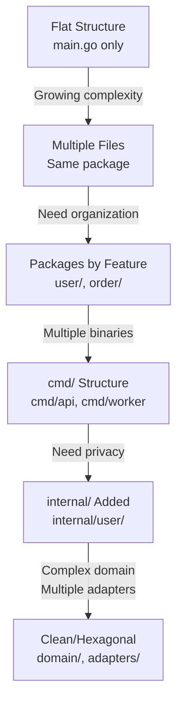
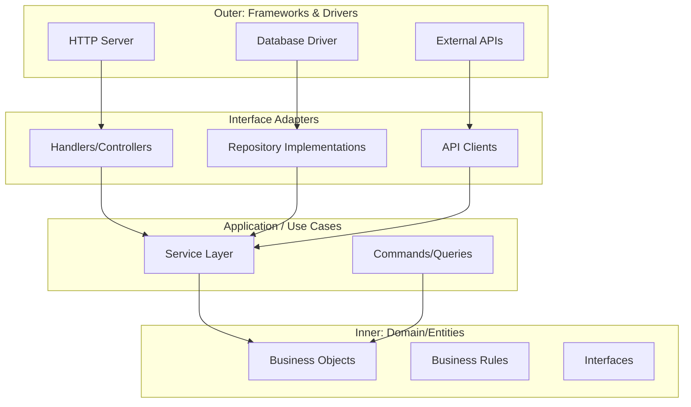
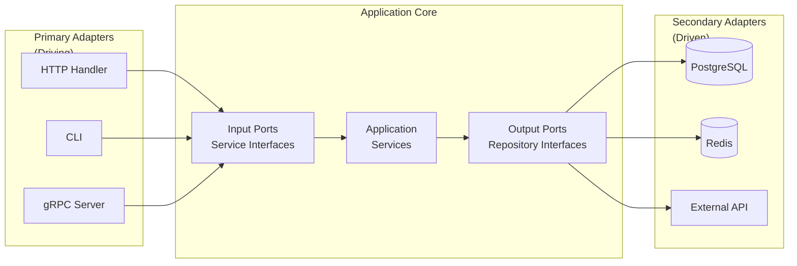

# Go System Design and Project Architecture

> Practical project organization for Go applications — from CLI tools to enterprise services

This guide covers Go project structure, architectural patterns, and when to apply (or avoid) them. We focus on Go-idiomatic approaches that embrace simplicity while providing patterns for when complexity is warranted.

**Reading time**: 90-100 minutes

---

## Table of Contents

1. [Philosophy: Start Simple](#philosophy-start-simple)
2. [Project Layout Fundamentals](#project-layout-fundamentals)
3. [The "golang-standards/project-layout" Controversy](#the-golang-standardsproject-layout-controversy)
4. [Minimal Project Structures](#minimal-project-structures)
5. [Growing Your Structure](#growing-your-structure)
6. [Clean Architecture in Go](#clean-architecture-in-go)
7. [Hexagonal Architecture (Ports & Adapters)](#hexagonal-architecture-ports--adapters)
8. [Domain-Driven Design Concepts](#domain-driven-design-concepts)
9. [Anti-Patterns to Avoid](#anti-patterns-to-avoid)
10. [Practical Examples](#practical-examples)
11. [Interview Questions](#interview-questions)
12. [Quick Reference](#quick-reference)
13. [Resources](#resources)

---

## Philosophy: Start Simple

> "A little copying is better than a little dependency."
> — Go Proverb

Go's design philosophy centers on simplicity, clarity, and pragmatism. Before reaching for complex architectural patterns, consider whether you actually need them.

### The Cost of Abstraction

Every layer of abstraction has costs:
- More files to navigate
- More indirection to follow
- More boilerplate to maintain
- Steeper learning curve for new team members

```go
// OVER-ENGINEERED: Hello world with Clean Architecture
myapp/
├── cmd/
│   └── myapp/
│       └── main.go
├── internal/
│   ├── domain/
│   │   └── greeting/
│   │       └── model.go
│   ├── application/
│   │   └── greeting/
│   │       └── service.go
│   └── infrastructure/
│       └── console/
│           └── adapter.go
└── pkg/
    └── greeting/
        └── interface.go

// APPROPRIATE: Hello world in Go
myapp/
├── main.go
└── go.mod
```

### YAGNI: You Aren't Gonna Need It

Start with the simplest structure that works. Add complexity only when:
- You have concrete evidence it's needed
- The current structure is causing real problems
- Multiple people are working on the same code

### When to Add Complexity

| Project Type | Lines of Code | Team Size | Suggested Structure |
|--------------|---------------|-----------|---------------------|
| Script/Tool | <500 | 1 | Flat (single package) |
| Small CLI | 500-2,000 | 1-2 | Minimal (few files) |
| Web API | 2,000-10,000 | 2-5 | Standard (packages by feature) |
| Microservice | 5,000-20,000 | 3-8 | Standard with `internal/` |
| Enterprise Service | 20,000+ | 5+ | Clean/Hexagonal Architecture |

### Go Proverbs Relevant to Structure

- **"Clear is better than clever."** — Obvious structure beats elegant abstraction
- **"The bigger the interface, the weaker the abstraction."** — Keep interfaces small
- **"Don't communicate by sharing memory; share memory by communicating."** — Prefer message passing
- **"Design the architecture, name the components, document the details."** — Good names reduce need for complex structure

---

## Project Layout Fundamentals

### Official Go Guidance

The Go team's official stance on project layout is minimal. According to the [official documentation](https://go.dev/doc/modules/layout):

> Put a LICENSE file in your root, put a go.mod file in your root, put Go code in your repo (in the root or organized into a directory tree as you see fit). That's it.

### Standard Directories

While not required, these directories have specific meanings in Go:

#### `cmd/` — Application Entry Points

Contains `main` packages for executable commands.

```go
cmd/
├── api/
│   └── main.go       // go build ./cmd/api
├── worker/
│   └── main.go       // go build ./cmd/worker
└── migrate/
    └── main.go       // go build ./cmd/migrate
```

Each subdirectory becomes a separate binary. Install with:
```bash
go install github.com/yourname/project/cmd/api@latest
```

#### `internal/` — Private Packages (Compiler-Enforced)

Code in `internal/` can only be imported by packages in the same module. This is enforced by the Go compiler.

```go
// myapp/internal/auth/auth.go
package auth

func HashPassword(p string) string { ... }

// Can be imported by: myapp/cmd/api, myapp/internal/user
// CANNOT be imported by: github.com/other/project
```

**Use `internal/` when:**
- You want to hide implementation details
- You're building a library and want private helpers
- You need to refactor without breaking external consumers

#### `pkg/` — Public Library Code (Controversial)

The `pkg/` directory is **not** an official Go convention. Some projects use it to distinguish "code meant to be imported" from "internal code."

```go
// If you're building a library others will import:
mylib/
├── pkg/
│   └── client/        // Public API: mylib/pkg/client
│       └── client.go
└── internal/
    └── protocol/      // Private: not importable externally
```

**Reality check:** Most applications don't need `pkg/`. If everything is internal to your service, just use `internal/`.

### Package Naming Conventions

| Do | Don't |
|-----|-------|
| `user`, `order` | `users`, `orders` (avoid plurals) |
| `auth` | `authentication` (prefer short) |
| `httputil` | `http_util` (no underscores) |
| `postgres` | `pg` (avoid cryptic abbreviations) |
| `strconv` | `stringconversion` (known stdlib style is fine) |

```go
// GOOD: Short, clear package names
package user
package order
package payment

// BAD: Verbose or unclear names
package usermanagement
package orderprocessingservice
package util  // Too generic
```

---

## The "golang-standards/project-layout" Controversy

### The Problem

The repository [golang-standards/project-layout](https://github.com/golang-standards/project-layout) has 50,000+ stars and appears in many "Go best practices" articles. However:

> "This is not a standard Go project layout... I do not see the Go project as having endorsed or blessed this project in any way."
> — Russ Cox, Go Team Lead

### What the Repository Shows

```
project/
├── cmd/
├── internal/
├── pkg/
├── vendor/
├── api/
├── web/
├── configs/
├── init/
├── scripts/
├── build/
├── deployments/
├── test/
├── docs/
├── tools/
├── examples/
├── third_party/
├── githooks/
├── assets/
└── website/
```

### Why It's Problematic

1. **Overkill for most projects** — Most Go applications don't need 18+ top-level directories
2. **Suggests `pkg/` is standard** — It's not; it doesn't make code "more public"
3. **Cargo-culting** — Teams copy the structure without understanding why
4. **Discourages simplicity** — Go's strength is starting simple

### What You Should Do Instead

```go
// Small project: Flat structure
myapp/
├── main.go
├── handler.go
├── store.go
└── go.mod

// Medium project: Packages by feature
myapp/
├── cmd/api/main.go
├── user/
│   ├── user.go
│   └── store.go
├── order/
│   ├── order.go
│   └── store.go
└── go.mod

// Large project: Internal for privacy
myapp/
├── cmd/
│   ├── api/main.go
│   └── worker/main.go
├── internal/
│   ├── user/
│   ├── order/
│   └── platform/
└── go.mod
```

---

## Minimal Project Structures

### Flat Structure: Scripts and Small Tools

For simple utilities, single-purpose tools, or scripts:

```go
mytool/
├── main.go           // Entry point + all logic
├── main_test.go      // Tests
└── go.mod
```

```go
// main.go — Everything in one file is fine
package main

import (
    "flag"
    "fmt"
    "os"
)

var verbose = flag.Bool("v", false, "verbose output")

func main() {
    flag.Parse()
    args := flag.Args()

    if len(args) == 0 {
        fmt.Fprintln(os.Stderr, "usage: mytool <file>")
        os.Exit(1)
    }

    if err := process(args[0]); err != nil {
        fmt.Fprintln(os.Stderr, err)
        os.Exit(1)
    }
}

func process(filename string) error {
    // Implementation
    if *verbose {
        fmt.Printf("Processing %s\n", filename)
    }
    return nil
}
```

**When appropriate:**
- Personal utilities
- One-off scripts
- < 500 lines of code
- Single developer

### Simple CLI with Commands

For CLIs with multiple commands but still simple logic:

```go
mycli/
├── main.go           // Entry point, flag parsing
├── cmd.go            // Command implementations
├── cmd_test.go       // Tests
├── config.go         // Configuration handling
└── go.mod
```

```go
// main.go
package main

import (
    "fmt"
    "os"
)

func main() {
    if len(os.Args) < 2 {
        printUsage()
        os.Exit(1)
    }

    switch os.Args[1] {
    case "init":
        if err := runInit(os.Args[2:]); err != nil {
            fatal(err)
        }
    case "build":
        if err := runBuild(os.Args[2:]); err != nil {
            fatal(err)
        }
    default:
        fmt.Fprintf(os.Stderr, "unknown command: %s\n", os.Args[1])
        os.Exit(1)
    }
}

func fatal(err error) {
    fmt.Fprintln(os.Stderr, err)
    os.Exit(1)
}
```

### Simple Web API

For basic REST APIs without complex domain logic:

```go
myapi/
├── main.go           // Entry point, server setup
├── handlers.go       // HTTP handlers
├── handlers_test.go  // Handler tests
├── models.go         // Data structures
├── store.go          // Database operations
├── store_test.go     // Store tests
└── go.mod
```

```go
// main.go
package main

import (
    "database/sql"
    "log"
    "net/http"

    _ "github.com/lib/pq"
)

func main() {
    db, err := sql.Open("postgres", "postgres://localhost/mydb")
    if err != nil {
        log.Fatal(err)
    }
    defer db.Close()

    store := &Store{db: db}
    handler := &Handler{store: store}

    mux := http.NewServeMux()
    mux.HandleFunc("GET /users", handler.ListUsers)
    mux.HandleFunc("POST /users", handler.CreateUser)
    mux.HandleFunc("GET /users/{id}", handler.GetUser)

    log.Println("Server starting on :8080")
    log.Fatal(http.ListenAndServe(":8080", mux))
}
```

---

## Growing Your Structure

### Signs You Need More Structure

- **File too long** — Single file exceeds 500-1000 lines
- **Hard to find things** — Spending time navigating code
- **Merge conflicts** — Multiple people editing same file
- **Circular dependencies** — Packages importing each other
- **Test isolation** — Can't test components independently

### Evolution Pattern



### Practical Evolution Example

**Stage 1: Single file**
```go
myapp/
├── main.go          // Everything here
└── go.mod
```

**Stage 2: Multiple files, same package**
```go
myapp/
├── main.go          // Entry point
├── user.go          // User logic
├── order.go         // Order logic
├── store.go         // Database
└── go.mod
```

**Stage 3: Packages by feature**
```go
myapp/
├── main.go
├── user/
│   ├── user.go      // User type + service
│   ├── store.go     // User storage
│   └── user_test.go
├── order/
│   ├── order.go
│   ├── store.go
│   └── order_test.go
└── go.mod
```

**Stage 4: Multiple binaries with cmd/**
```go
myapp/
├── cmd/
│   ├── api/
│   │   └── main.go  // HTTP server
│   └── worker/
│       └── main.go  // Background worker
├── user/
├── order/
└── go.mod
```

**Stage 5: Privacy with internal/**
```go
myapp/
├── cmd/
│   ├── api/main.go
│   └── worker/main.go
├── internal/        // Private packages
│   ├── user/
│   ├── order/
│   └── platform/    // Shared internal code
│       ├── database/
│       └── config/
└── go.mod
```

### Refactoring Strategy

1. **Extract one thing at a time** — Don't refactor everything at once
2. **Keep tests passing** — Refactor in small, tested steps
3. **Follow dependencies** — Move tightly-coupled code together
4. **Name for purpose** — Package names should describe what, not how

---

## Clean Architecture in Go

### Core Concepts

Clean Architecture organizes code into concentric layers with a strict dependency rule: **outer layers depend on inner layers, never the reverse**.



### The Dependency Rule

> "Source code dependencies must point only inward, toward higher-level policies."

- **Domain** — No dependencies (pure Go, no imports from outer layers)
- **Use Cases** — Depends only on Domain
- **Interface Adapters** — Depends on Use Cases and Domain
- **Frameworks** — Depends on everything (outermost layer)

### Go-Idiomatic Clean Architecture

```go
// Directory structure
myapp/
├── cmd/
│   └── api/
│       └── main.go           // Wiring/composition
├── internal/
│   ├── domain/               // Inner: no external deps
│   │   ├── user.go           // Entities
│   │   └── errors.go         // Domain errors
│   ├── usecase/              // Application logic
│   │   ├── user_service.go
│   │   └── user_service_test.go
│   ├── adapter/              // Interface adapters
│   │   ├── http/
│   │   │   └── handler.go
│   │   └── postgres/
│   │       └── user_repo.go
│   └── platform/             // Shared infrastructure
│       └── config/
└── go.mod
```

### Domain Layer (Innermost)

Contains business entities and interfaces. No external dependencies.

```go
// internal/domain/user.go
package domain

import "errors"

// Domain errors
var (
    ErrUserNotFound = errors.New("user not found")
    ErrEmailTaken   = errors.New("email already taken")
)

// Entity
type User struct {
    ID        string
    Email     string
    Name      string
    CreatedAt time.Time
}

// Business rule as method
func (u *User) Validate() error {
    if u.Email == "" {
        return errors.New("email is required")
    }
    if u.Name == "" {
        return errors.New("name is required")
    }
    return nil
}

// Repository interface (defined in domain, implemented in adapters)
type UserRepository interface {
    FindByID(ctx context.Context, id string) (*User, error)
    FindByEmail(ctx context.Context, email string) (*User, error)
    Save(ctx context.Context, user *User) error
    Delete(ctx context.Context, id string) error
}

// Other domain interfaces
type EventPublisher interface {
    Publish(ctx context.Context, event any) error
}
```

### Use Case Layer

Contains application-specific business logic. Depends only on domain.

```go
// internal/usecase/user_service.go
package usecase

import (
    "context"
    "myapp/internal/domain"
)

type UserService struct {
    repo   domain.UserRepository
    events domain.EventPublisher
}

func NewUserService(repo domain.UserRepository, events domain.EventPublisher) *UserService {
    return &UserService{repo: repo, events: events}
}

func (s *UserService) CreateUser(ctx context.Context, email, name string) (*domain.User, error) {
    // Check business rule: email must be unique
    existing, err := s.repo.FindByEmail(ctx, email)
    if err != nil && err != domain.ErrUserNotFound {
        return nil, err
    }
    if existing != nil {
        return nil, domain.ErrEmailTaken
    }

    user := &domain.User{
        ID:        generateID(),
        Email:     email,
        Name:      name,
        CreatedAt: time.Now(),
    }

    if err := user.Validate(); err != nil {
        return nil, err
    }

    if err := s.repo.Save(ctx, user); err != nil {
        return nil, err
    }

    // Publish domain event
    s.events.Publish(ctx, UserCreatedEvent{UserID: user.ID})

    return user, nil
}
```

### Adapter Layer

Implements interfaces defined in domain. Depends on external frameworks.

```go
// internal/adapter/postgres/user_repo.go
package postgres

import (
    "context"
    "database/sql"
    "myapp/internal/domain"
)

type UserRepository struct {
    db *sql.DB
}

func NewUserRepository(db *sql.DB) *UserRepository {
    return &UserRepository{db: db}
}

func (r *UserRepository) FindByID(ctx context.Context, id string) (*domain.User, error) {
    row := r.db.QueryRowContext(ctx,
        "SELECT id, email, name, created_at FROM users WHERE id = $1", id)

    var user domain.User
    err := row.Scan(&user.ID, &user.Email, &user.Name, &user.CreatedAt)
    if err == sql.ErrNoRows {
        return nil, domain.ErrUserNotFound
    }
    if err != nil {
        return nil, err
    }
    return &user, nil
}

func (r *UserRepository) Save(ctx context.Context, user *domain.User) error {
    _, err := r.db.ExecContext(ctx,
        `INSERT INTO users (id, email, name, created_at)
         VALUES ($1, $2, $3, $4)
         ON CONFLICT (id) DO UPDATE SET email = $2, name = $3`,
        user.ID, user.Email, user.Name, user.CreatedAt)
    return err
}
```

### Composition Root (main.go)

Wire everything together at the entry point:

```go
// cmd/api/main.go
package main

import (
    "database/sql"
    "log"
    "net/http"

    "myapp/internal/adapter/http"
    "myapp/internal/adapter/postgres"
    "myapp/internal/usecase"
)

func main() {
    // Infrastructure
    db, _ := sql.Open("postgres", os.Getenv("DATABASE_URL"))

    // Adapters (implement domain interfaces)
    userRepo := postgres.NewUserRepository(db)
    eventPub := NewNoopPublisher() // or kafka.NewPublisher()

    // Use cases (depend on domain interfaces)
    userService := usecase.NewUserService(userRepo, eventPub)

    // HTTP handlers (depend on use cases)
    handler := http.NewHandler(userService)

    // Start server
    log.Fatal(http.ListenAndServe(":8080", handler))
}
```

### When Clean Architecture is Overkill

Avoid Clean Architecture when:

| Situation | Why It's Overkill |
|-----------|-------------------|
| Simple CRUD API | No complex business rules to isolate |
| Solo developer | No team coordination benefits |
| < 5,000 LOC | Structure overhead exceeds benefits |
| One database, one API | No adapter flexibility needed |
| Prototype/MVP | Speed matters more than structure |

---

## Hexagonal Architecture (Ports & Adapters)

### Core Concepts

Hexagonal Architecture (also called Ports & Adapters) focuses on isolating the application core from external concerns.

- **Ports** — Interfaces that define how the application interacts with the outside world
- **Adapters** — Implementations of those interfaces for specific technologies
- **Primary/Driving Adapters** — Things that call your application (HTTP handlers, CLI, gRPC)
- **Secondary/Driven Adapters** — Things your application calls (databases, APIs, message queues)



### Hexagonal in Go

Go's implicit interfaces make Hexagonal Architecture natural:

```go
// Directory structure
myapp/
├── cmd/api/main.go
├── internal/
│   ├── core/                   // Application Core
│   │   ├── domain/             // Domain models
│   │   │   ├── user.go
│   │   │   └── order.go
│   │   ├── port/               // Interfaces (both in and out)
│   │   │   ├── input.go        // What we offer
│   │   │   └── output.go       // What we need
│   │   └── service/            // Application services
│   │       └── user.go
│   └── adapter/                // All adapters
│       ├── in/                 // Primary (driving)
│       │   ├── http/
│       │   └── grpc/
│       └── out/                // Secondary (driven)
│           ├── postgres/
│           └── redis/
└── go.mod
```

### Defining Ports

```go
// internal/core/port/input.go
// Input ports: What the application offers to the outside world
package port

import (
    "context"
    "myapp/internal/core/domain"
)

// UserService is an input port — primary adapters use this
type UserService interface {
    CreateUser(ctx context.Context, req CreateUserRequest) (*domain.User, error)
    GetUser(ctx context.Context, id string) (*domain.User, error)
    ListUsers(ctx context.Context, filter UserFilter) ([]*domain.User, error)
}

type CreateUserRequest struct {
    Email string
    Name  string
}

type UserFilter struct {
    Limit  int
    Offset int
}
```

```go
// internal/core/port/output.go
// Output ports: What the application needs from the outside world
package port

import (
    "context"
    "myapp/internal/core/domain"
)

// UserRepository is an output port — secondary adapters implement this
type UserRepository interface {
    Save(ctx context.Context, user *domain.User) error
    FindByID(ctx context.Context, id string) (*domain.User, error)
    FindAll(ctx context.Context, limit, offset int) ([]*domain.User, error)
}

// Cache is an output port
type Cache interface {
    Get(ctx context.Context, key string) ([]byte, error)
    Set(ctx context.Context, key string, value []byte, ttl time.Duration) error
}

// EventPublisher is an output port
type EventPublisher interface {
    Publish(ctx context.Context, topic string, event any) error
}
```

### Implementing the Core

```go
// internal/core/service/user.go
package service

import (
    "context"
    "myapp/internal/core/domain"
    "myapp/internal/core/port"
)

// userService implements port.UserService (input port)
// It uses output ports for external operations
type userService struct {
    repo   port.UserRepository // Output port
    cache  port.Cache          // Output port
    events port.EventPublisher // Output port
}

func NewUserService(
    repo port.UserRepository,
    cache port.Cache,
    events port.EventPublisher,
) port.UserService {
    return &userService{
        repo:   repo,
        cache:  cache,
        events: events,
    }
}

func (s *userService) CreateUser(ctx context.Context, req port.CreateUserRequest) (*domain.User, error) {
    user := &domain.User{
        ID:    generateID(),
        Email: req.Email,
        Name:  req.Name,
    }

    if err := s.repo.Save(ctx, user); err != nil {
        return nil, err
    }

    // Use output ports
    s.cache.Set(ctx, "user:"+user.ID, user.ToJSON(), time.Hour)
    s.events.Publish(ctx, "users", domain.UserCreated{UserID: user.ID})

    return user, nil
}
```

### Primary Adapter (HTTP)

```go
// internal/adapter/in/http/handler.go
package http

import (
    "encoding/json"
    "net/http"
    "myapp/internal/core/port"
)

type Handler struct {
    users port.UserService // Uses input port
}

func NewHandler(users port.UserService) *Handler {
    return &Handler{users: users}
}

func (h *Handler) CreateUser(w http.ResponseWriter, r *http.Request) {
    var req port.CreateUserRequest
    if err := json.NewDecoder(r.Body).Decode(&req); err != nil {
        http.Error(w, err.Error(), http.StatusBadRequest)
        return
    }

    user, err := h.users.CreateUser(r.Context(), req)
    if err != nil {
        http.Error(w, err.Error(), http.StatusInternalServerError)
        return
    }

    json.NewEncoder(w).Encode(user)
}
```

### Secondary Adapter (PostgreSQL)

```go
// internal/adapter/out/postgres/user_repo.go
package postgres

import (
    "context"
    "database/sql"
    "myapp/internal/core/domain"
    "myapp/internal/core/port"
)

// Verify interface compliance at compile time
var _ port.UserRepository = (*UserRepository)(nil)

type UserRepository struct {
    db *sql.DB
}

func NewUserRepository(db *sql.DB) *UserRepository {
    return &UserRepository{db: db}
}

func (r *UserRepository) Save(ctx context.Context, user *domain.User) error {
    _, err := r.db.ExecContext(ctx,
        "INSERT INTO users (id, email, name) VALUES ($1, $2, $3)",
        user.ID, user.Email, user.Name)
    return err
}

func (r *UserRepository) FindByID(ctx context.Context, id string) (*domain.User, error) {
    var user domain.User
    err := r.db.QueryRowContext(ctx,
        "SELECT id, email, name FROM users WHERE id = $1", id).
        Scan(&user.ID, &user.Email, &user.Name)
    if err == sql.ErrNoRows {
        return nil, domain.ErrNotFound
    }
    return &user, err
}
```

### Clean vs Hexagonal Comparison

| Aspect | Clean Architecture | Hexagonal Architecture |
|--------|-------------------|------------------------|
| **Focus** | Layers with dependency rule | Ports and adapters |
| **Mental Model** | Concentric circles | Hexagon with sides |
| **Terminology** | Entities, Use Cases, Adapters | Domain, Ports, Adapters |
| **Interface Location** | In domain layer | In port definitions |
| **Go Fit** | Requires more structure | Maps naturally to Go interfaces |
| **Complexity** | Higher ceremony | Simpler mental model |
| **When to Use** | Complex domains, large teams | Multiple integrations, testability focus |

Both achieve similar goals: isolating business logic from infrastructure. Choose based on team familiarity and project needs.

---

## Domain-Driven Design Concepts

### Bounded Contexts as Packages

In DDD, a Bounded Context is a boundary within which a domain model is defined and applicable. In Go, this maps to package or module boundaries.

```go
myapp/
├── internal/
│   ├── ordering/              // Bounded Context: Order Management
│   │   ├── domain/
│   │   │   ├── order.go       // Aggregate Root
│   │   │   ├── lineitem.go    // Entity
│   │   │   └── money.go       // Value Object
│   │   ├── service.go
│   │   └── repository.go
│   ├── inventory/             // Bounded Context: Inventory
│   │   ├── domain/
│   │   │   ├── product.go
│   │   │   └── stock.go
│   │   ├── service.go
│   │   └── repository.go
│   └── shipping/              // Bounded Context: Shipping
│       └── ...
└── go.mod
```

### Aggregates in Go

An Aggregate is a cluster of domain objects treated as a single unit for data changes.

```go
// internal/ordering/domain/order.go
package domain

import "errors"

// Order is the Aggregate Root
type Order struct {
    ID         string
    CustomerID string
    Items      []LineItem  // Entities within aggregate
    Status     OrderStatus
    Total      Money       // Value Object
}

// LineItem is an Entity within the Order aggregate
type LineItem struct {
    ProductID string
    Quantity  int
    Price     Money
}

// Business rules are methods on the aggregate root
func (o *Order) AddItem(productID string, qty int, price Money) error {
    if o.Status != StatusDraft {
        return errors.New("can only add items to draft orders")
    }
    if qty <= 0 {
        return errors.New("quantity must be positive")
    }

    o.Items = append(o.Items, LineItem{
        ProductID: productID,
        Quantity:  qty,
        Price:     price,
    })
    o.recalculateTotal()
    return nil
}

func (o *Order) Submit() error {
    if len(o.Items) == 0 {
        return errors.New("cannot submit empty order")
    }
    o.Status = StatusSubmitted
    return nil
}
```

### Value Objects

Value Objects are immutable and compared by value, not identity.

```go
// internal/ordering/domain/money.go
package domain

import "fmt"

// Money is a Value Object — immutable, compared by value
type Money struct {
    amount   int64  // in cents
    currency string
}

func NewMoney(amount int64, currency string) Money {
    return Money{amount: amount, currency: currency}
}

func (m Money) Amount() int64    { return m.amount }
func (m Money) Currency() string { return m.currency }

func (m Money) Add(other Money) (Money, error) {
    if m.currency != other.currency {
        return Money{}, fmt.Errorf("currency mismatch: %s vs %s", m.currency, other.currency)
    }
    return Money{amount: m.amount + other.amount, currency: m.currency}, nil
}

func (m Money) Multiply(factor int) Money {
    return Money{amount: m.amount * int64(factor), currency: m.currency}
}

// String implements fmt.Stringer
func (m Money) String() string {
    return fmt.Sprintf("%s %.2f", m.currency, float64(m.amount)/100)
}
```

### Repository Pattern

Repositories provide collection-like access to aggregates.

```go
// internal/ordering/domain/repository.go
package domain

import "context"

// OrderRepository provides access to Order aggregates
// Defined in domain, implemented in infrastructure
type OrderRepository interface {
    // Only aggregate root operations
    FindByID(ctx context.Context, id string) (*Order, error)
    Save(ctx context.Context, order *Order) error

    // Query methods return aggregate roots
    FindByCustomer(ctx context.Context, customerID string) ([]*Order, error)
    FindPending(ctx context.Context) ([]*Order, error)
}
```

---

## Anti-Patterns to Avoid

### 1. Over-Engineering Simple Projects

```go
// BAD: Enterprise architecture for a CLI tool that counts lines
linecounter/
├── cmd/linecounter/main.go
├── internal/
│   ├── domain/
│   │   ├── line.go
│   │   └── counter.go
│   ├── usecase/
│   │   └── count_service.go
│   ├── interface/
│   │   └── cli/
│   │       └── handler.go
│   └── infrastructure/
│       └── filesystem/
│           └── reader.go
└── pkg/
    └── counter/
        └── interface.go
```

```go
// GOOD: Simple structure for a simple tool
linecounter/
├── main.go
└── go.mod

// main.go
package main

import (
    "bufio"
    "fmt"
    "os"
)

func main() {
    if len(os.Args) < 2 {
        fmt.Fprintln(os.Stderr, "usage: linecounter <file>")
        os.Exit(1)
    }

    count, err := countLines(os.Args[1])
    if err != nil {
        fmt.Fprintln(os.Stderr, err)
        os.Exit(1)
    }
    fmt.Println(count)
}

func countLines(filename string) (int, error) {
    f, err := os.Open(filename)
    if err != nil {
        return 0, err
    }
    defer f.Close()

    scanner := bufio.NewScanner(f)
    count := 0
    for scanner.Scan() {
        count++
    }
    return count, scanner.Err()
}
```

### 2. Single Model Coupling (Tag Soup)

```go
// BAD: One struct with all concerns mixed
type User struct {
    ID           int       `json:"id" db:"id" gorm:"primaryKey" validate:"required"`
    Email        string    `json:"email" db:"email" gorm:"unique" validate:"email,required"`
    PasswordHash string    `json:"-" db:"password_hash" gorm:"column:password_hash"`
    Name         string    `json:"name" db:"name" validate:"required,min=2"`
    CreatedAt    time.Time `json:"created_at" db:"created_at" gorm:"autoCreateTime"`
}
// Problems:
// - JSON API is coupled to database schema
// - Changing database requires updating API
// - Password hash visibility is confusing
// - Hard to have different validation per context
```

```go
// GOOD: Separate models for each concern

// Domain model — pure business logic
type User struct {
    ID        string
    Email     string
    Name      string
    CreatedAt time.Time
}

// API request model
type CreateUserRequest struct {
    Email string `json:"email" validate:"email,required"`
    Name  string `json:"name" validate:"required,min=2"`
}

// API response model
type UserResponse struct {
    ID        string    `json:"id"`
    Email     string    `json:"email"`
    Name      string    `json:"name"`
    CreatedAt time.Time `json:"created_at"`
}

// Database model
type UserRow struct {
    ID           string    `db:"id"`
    Email        string    `db:"email"`
    PasswordHash string    `db:"password_hash"`
    Name         string    `db:"name"`
    CreatedAt    time.Time `db:"created_at"`
}

// Conversion functions
func (r UserRow) ToDomain() *User {
    return &User{ID: r.ID, Email: r.Email, Name: r.Name, CreatedAt: r.CreatedAt}
}

func (u *User) ToResponse() UserResponse {
    return UserResponse{ID: u.ID, Email: u.Email, Name: u.Name, CreatedAt: u.CreatedAt}
}
```

### 3. Mimicking Java/Spring Patterns

```go
// BAD: Java-style naming and organization
internal/
├── services/
│   └── UserServiceImpl.go      // "Impl" suffix
├── repositories/
│   └── UserRepositoryImpl.go
├── interfaces/
│   ├── IUserService.go         // "I" prefix
│   └── IUserRepository.go
├── dtos/
│   └── UserDTO.go              // "DTO" suffix
├── beans/
│   └── UserBean.go
└── factories/
    └── UserFactory.go
```

```go
// GOOD: Go-idiomatic organization
internal/
├── user/
│   ├── user.go           // User type + UserRepository interface
│   ├── service.go        // Business logic
│   ├── postgres.go       // Repository implementation
│   └── user_test.go
└── order/
    ├── order.go
    ├── service.go
    └── postgres.go
```

**Key differences:**
- No `I` prefix for interfaces — Go convention is `Reader`, not `IReader`
- No `Impl` suffix — the implementation's name describes what it is
- Interfaces defined where used, not in separate packages
- No "DTO" suffix — `UserRequest`, `UserResponse` are clear enough

### 4. Too Many Abstraction Layers

```go
// BAD: Unnecessary indirection
Handler → Controller → Service → Manager → UseCase → Repository → DAO → Database

// What each call looks like:
func (h *Handler) GetUser(w http.ResponseWriter, r *http.Request) {
    h.controller.GetUser(r.Context(), id)
}
func (c *Controller) GetUser(ctx context.Context, id string) {
    c.service.GetUser(ctx, id)
}
func (s *Service) GetUser(ctx context.Context, id string) {
    s.manager.GetUser(ctx, id)
}
func (m *Manager) GetUser(ctx context.Context, id string) {
    m.usecase.GetUser(ctx, id)
}
func (u *UseCase) GetUser(ctx context.Context, id string) {
    u.repo.GetUser(ctx, id)
}
func (r *Repository) GetUser(ctx context.Context, id string) {
    r.dao.GetUser(ctx, id)
}
// Finally hits the database...
```

```go
// GOOD: Minimal layers
Handler → Service → Repository → Database

func (h *Handler) GetUser(w http.ResponseWriter, r *http.Request) {
    user, err := h.service.GetUser(r.Context(), chi.URLParam(r, "id"))
    // ...
}

func (s *Service) GetUser(ctx context.Context, id string) (*User, error) {
    return s.repo.FindByID(ctx, id)
}

func (r *PostgresRepo) FindByID(ctx context.Context, id string) (*User, error) {
    // Direct database query
}
```

### 5. Dependency Cycles

```go
// BAD: Circular imports
package user
import "myapp/order"  // user → order

package order
import "myapp/user"   // order → user = CYCLE!

// This won't compile in Go
```

```go
// GOOD: Extract shared interface or third package
package domain

type User interface {
    ID() string
    Email() string
}

type Order interface {
    ID() string
    UserID() string
}

// Now both packages depend on domain, not each other
package user
import "myapp/domain"

package order
import "myapp/domain"
```

### Anti-Pattern Summary

| Anti-Pattern | Symptom | Fix |
|--------------|---------|-----|
| Over-engineering | 10 files for 100 lines of logic | Start flat, extract as needed |
| Model coupling | Structs with 5+ tag types | Separate models per concern |
| Java patterns | `IUserServiceImpl` naming | Use Go conventions |
| Too many layers | 6+ hops to database | 2-3 layers maximum |
| Dependency cycles | Compile errors | Extract interfaces to shared package |
| `utils` package | Dumping ground | Create focused packages |
| `pkg/` cargo cult | Empty `pkg/` directory | Remove if not needed |

---

## Practical Examples

### Example 1: Small CLI Tool

A simple command-line tool for file processing:

```go
// fileconvert/
// ├── main.go
// ├── convert.go
// ├── convert_test.go
// └── go.mod

// main.go
package main

import (
    "flag"
    "fmt"
    "os"
)

func main() {
    from := flag.String("from", "", "source format (json, yaml, toml)")
    to := flag.String("to", "", "target format (json, yaml, toml)")
    flag.Parse()

    if *from == "" || *to == "" || flag.NArg() != 1 {
        fmt.Fprintln(os.Stderr, "usage: fileconvert -from=json -to=yaml <file>")
        os.Exit(1)
    }

    if err := convert(flag.Arg(0), *from, *to, os.Stdout); err != nil {
        fmt.Fprintln(os.Stderr, err)
        os.Exit(1)
    }
}

// convert.go
package main

import (
    "encoding/json"
    "io"
    "os"

    "gopkg.in/yaml.v3"
)

func convert(filename, from, to string, out io.Writer) error {
    data, err := os.ReadFile(filename)
    if err != nil {
        return err
    }

    var v any
    switch from {
    case "json":
        if err := json.Unmarshal(data, &v); err != nil {
            return err
        }
    case "yaml":
        if err := yaml.Unmarshal(data, &v); err != nil {
            return err
        }
    default:
        return fmt.Errorf("unsupported source format: %s", from)
    }

    switch to {
    case "json":
        enc := json.NewEncoder(out)
        enc.SetIndent("", "  ")
        return enc.Encode(v)
    case "yaml":
        return yaml.NewEncoder(out).Encode(v)
    default:
        return fmt.Errorf("unsupported target format: %s", to)
    }
}
```

### Example 2: REST API Service

A medium-complexity API with database:

```go
// userapi/
// ├── cmd/
// │   └── api/
// │       └── main.go
// ├── internal/
// │   ├── config/
// │   │   └── config.go
// │   ├── handler/
// │   │   ├── handler.go
// │   │   ├── user.go
// │   │   └── user_test.go
// │   ├── model/
// │   │   └── user.go
// │   ├── service/
// │   │   ├── user.go
// │   │   └── user_test.go
// │   └── store/
// │       ├── postgres.go
// │       └── user.go
// ├── migrations/
// │   └── 001_create_users.sql
// └── go.mod

// cmd/api/main.go
package main

import (
    "database/sql"
    "log"
    "net/http"
    "os"

    "userapi/internal/config"
    "userapi/internal/handler"
    "userapi/internal/service"
    "userapi/internal/store"

    _ "github.com/lib/pq"
)

func main() {
    cfg := config.Load()

    db, err := sql.Open("postgres", cfg.DatabaseURL)
    if err != nil {
        log.Fatal(err)
    }
    defer db.Close()

    userStore := store.NewUserStore(db)
    userService := service.NewUserService(userStore)
    h := handler.New(userService)

    log.Printf("Starting server on %s", cfg.Addr)
    log.Fatal(http.ListenAndServe(cfg.Addr, h.Router()))
}

// internal/model/user.go
package model

import "time"

type User struct {
    ID        string    `json:"id"`
    Email     string    `json:"email"`
    Name      string    `json:"name"`
    CreatedAt time.Time `json:"created_at"`
}

type CreateUserRequest struct {
    Email string `json:"email"`
    Name  string `json:"name"`
}

// internal/service/user.go
package service

import (
    "context"
    "userapi/internal/model"
)

type UserStore interface {
    Create(ctx context.Context, user *model.User) error
    GetByID(ctx context.Context, id string) (*model.User, error)
    List(ctx context.Context, limit, offset int) ([]*model.User, error)
}

type UserService struct {
    store UserStore
}

func NewUserService(store UserStore) *UserService {
    return &UserService{store: store}
}

func (s *UserService) Create(ctx context.Context, req model.CreateUserRequest) (*model.User, error) {
    user := &model.User{
        ID:        generateID(),
        Email:     req.Email,
        Name:      req.Name,
        CreatedAt: time.Now(),
    }
    if err := s.store.Create(ctx, user); err != nil {
        return nil, err
    }
    return user, nil
}

// internal/handler/user.go
package handler

import (
    "encoding/json"
    "net/http"

    "userapi/internal/model"
    "userapi/internal/service"
)

type Handler struct {
    users *service.UserService
}

func New(users *service.UserService) *Handler {
    return &Handler{users: users}
}

func (h *Handler) Router() http.Handler {
    mux := http.NewServeMux()
    mux.HandleFunc("POST /users", h.createUser)
    mux.HandleFunc("GET /users/{id}", h.getUser)
    mux.HandleFunc("GET /users", h.listUsers)
    return mux
}

func (h *Handler) createUser(w http.ResponseWriter, r *http.Request) {
    var req model.CreateUserRequest
    if err := json.NewDecoder(r.Body).Decode(&req); err != nil {
        http.Error(w, err.Error(), http.StatusBadRequest)
        return
    }

    user, err := h.users.Create(r.Context(), req)
    if err != nil {
        http.Error(w, err.Error(), http.StatusInternalServerError)
        return
    }

    w.Header().Set("Content-Type", "application/json")
    w.WriteHeader(http.StatusCreated)
    json.NewEncoder(w).Encode(user)
}
```

### Example 3: Enterprise Microservice

A larger service with Clean Architecture:

```go
// orderservice/
// ├── cmd/
// │   ├── api/
// │   │   └── main.go
// │   ├── worker/
// │   │   └── main.go
// │   └── migrate/
// │       └── main.go
// ├── internal/
// │   ├── domain/
// │   │   ├── order.go
// │   │   ├── order_test.go
// │   │   ├── events.go
// │   │   └── repository.go
// │   ├── application/
// │   │   ├── order_service.go
// │   │   ├── order_service_test.go
// │   │   └── commands/
// │   │       ├── create_order.go
// │   │       └── cancel_order.go
// │   ├── infrastructure/
// │   │   ├── postgres/
// │   │   │   ├── order_repo.go
// │   │   │   └── order_repo_test.go
// │   │   ├── kafka/
// │   │   │   └── publisher.go
// │   │   └── redis/
// │   │       └── cache.go
// │   └── interfaces/
// │       ├── http/
// │       │   ├── router.go
// │       │   └── handlers/
// │       │       ├── order.go
// │       │       └── health.go
// │       └── grpc/
// │           └── server.go
// ├── api/
// │   ├── proto/
// │   │   └── order.proto
// │   └── openapi/
// │       └── order.yaml
// ├── configs/
// │   └── config.yaml
// ├── deployments/
// │   ├── docker/
// │   │   └── Dockerfile
// │   └── k8s/
// │       ├── deployment.yaml
// │       └── service.yaml
// ├── scripts/
// │   └── generate.sh
// └── go.mod
```

### Structure Selection Guide

| Scenario | Recommended | Why |
|----------|-------------|-----|
| Personal script | Flat (main.go) | Minimal overhead |
| CLI tool | main.go + cmd.go | Easy navigation |
| Small API (<2k LOC) | Packages by file type | Simple organization |
| Medium API | Packages by feature | Cohesive modules |
| Microservice | Standard with internal/ | Balance |
| Enterprise service | Clean/Hexagonal | Clear boundaries |
| Public library | pkg/ for public API | External API clarity |

---

## Interview Questions

### Q1: How do you decide on a project structure for a new Go service?

**Answer**: I follow the principle of starting simple and growing as needed:

1. **Start flat** — For MVPs and prototypes, everything in one package
2. **Add packages by feature** — When files exceed 500 lines or I need organization
3. **Add `internal/`** — When I need to hide implementation from potential external consumers
4. **Add `cmd/`** — When I need multiple entry points (API server, worker, CLI)
5. **Consider Clean/Hexagonal** — Only for complex domains with multiple integrations

Key questions I ask:
- How complex is the domain logic?
- How many external integrations?
- What's the team size?
- Will this code be imported by other modules?

### Q2: What is the `internal/` directory and why use it?

**Answer**: The `internal/` directory has special meaning to the Go compiler. Packages inside `internal/` can only be imported by packages in the same module (or packages within the same directory tree).

```go
// myapp/internal/auth — can be imported by myapp/* only
// External modules get compile error if they try to import it
```

**Use cases:**
- Hide implementation details from external consumers
- Prevent accidental coupling to unstable internal APIs
- Allow safe refactoring without breaking external users

**When to use:**
- Building a library and want private helpers
- Building a service and want clear public/private separation
- Any time you want compiler-enforced encapsulation

### Q3: Should I use the `pkg/` directory?

**Answer**: The `pkg/` directory is **not** an official Go convention and is often misused.

**Common misconception**: "Code in `pkg/` is public, code outside isn't"
**Reality**: Any exported identifier in any non-internal package is public

**When I might use `pkg/`:**
- Building a library where I want to clearly signal "this is the public API"
- Have both application code and a reusable client library

**When I skip `pkg/`:**
- Building a service (not a library)
- Everything is internal to my application
- Small to medium projects

Most applications don't need `pkg/`. If in doubt, leave it out.

### Q4: How do Clean Architecture and Hexagonal Architecture differ?

**Answer**: Both isolate business logic from infrastructure, but with different mental models:

**Clean Architecture:**
- Organizes code in concentric layers
- Strict dependency rule: outer depends on inner
- Terminology: Entities → Use Cases → Interface Adapters → Frameworks
- More structured, more ceremony

**Hexagonal Architecture:**
- Focuses on ports (interfaces) and adapters (implementations)
- Application core at center, adapters around the edges
- Primary adapters drive the app (HTTP, CLI)
- Secondary adapters are driven by the app (DB, APIs)
- Maps naturally to Go's interfaces

**In Go, Hexagonal often feels more natural because:**
- Go's implicit interfaces work like "ports"
- Adapter implementations are straightforward
- Less boilerplate than full Clean Architecture

**I choose Clean when:** Complex domain with many business rules
**I choose Hexagonal when:** Many integrations, testability is primary concern

### Q5: When is Clean Architecture overkill?

**Answer**: Clean Architecture is overkill when:

| Situation | Why It's Overkill |
|-----------|-------------------|
| Simple CRUD | No complex business rules to isolate |
| One database + one API | No need for adapter flexibility |
| Solo developer | No team coordination benefits |
| < 5,000 LOC | Structure overhead exceeds benefits |
| MVP/prototype | Speed matters more than structure |
| Short-lived project | Won't benefit from long-term maintainability |

**Signs you DO need it:**
- Complex domain with business rules that change independently of infrastructure
- Multiple databases or external services
- Need to swap implementations (e.g., PostgreSQL → MongoDB)
- Large team working on same codebase
- High test coverage requirements
- Long-lived project expected to evolve

---

## Quick Reference

### Directory Decision Tree

```
Start here
│
├─ Is this a library for external use?
│  ├─ Yes → Consider pkg/ for public API
│  └─ No → Use internal/ for privacy
│
├─ Multiple binaries?
│  └─ Yes → Add cmd/ with subdirectories
│
├─ Team size > 3?
│  └─ Yes → Packages by feature at minimum
│
├─ Complex domain + multiple integrations?
│  └─ Yes → Consider Clean or Hexagonal
│
└─ Otherwise → Start flat, extract as needed
```

### Package Naming Quick Guide

| Pattern | Example | Avoid |
|---------|---------|-------|
| Singular nouns | `user`, `order` | `users`, `orders` |
| Short names | `auth`, `db` | `authentication`, `database` |
| Lowercase | `httputil` | `httpUtil`, `HTTPUtil` |
| No underscores | `errorhandling` | `error_handling` |
| Describe content | `postgres` | `impl` |

### Layer Mapping

| Clean Architecture | Hexagonal | Go Package |
|-------------------|-----------|------------|
| Entities | Domain | `domain/` |
| Use Cases | Application Services | `service/` or `usecase/` |
| Interface Adapters | Adapters | `adapter/` or `handler/` |
| Frameworks | Infrastructure | `infrastructure/` |

### Common Directory Purposes

| Directory | Purpose | When to Add |
|-----------|---------|-------------|
| `cmd/` | Executable entry points | Multiple binaries |
| `internal/` | Private packages | Hide from external import |
| `pkg/` | Public library code | Rarely; for true libraries |
| `api/` | API definitions | OpenAPI, protobuf files |
| `configs/` | Config templates | Config file examples |
| `scripts/` | Build/dev scripts | Automation needed |
| `migrations/` | Database migrations | Using relational DB |
| `test/` | Test fixtures | Complex test data |

### Complexity Scale

```
Flat → Files by Type → Packages by Feature → cmd/internal → Clean/Hexagonal
|                                                                        |
Simplest                                                          Most Complex
(scripts)                                                    (enterprise apps)
```

---

## Resources

### Official Documentation
- [Organizing a Go Module](https://go.dev/doc/modules/layout) — Official Go team guidance
- [Effective Go](https://go.dev/doc/effective_go) — Official style and conventions
- [Package Names](https://go.dev/blog/package-names) — Naming conventions

### Project Structure
- [golang-standards Discussion](https://github.com/golang-standards/project-layout/issues/117) — Russ Cox's critique
- [11 Tips for Structuring Go Projects](https://www.alexedwards.net/blog/11-tips-for-structuring-your-go-projects) — Alex Edwards
- [Standard Package Layout](https://medium.com/@benbjohnson/standard-package-layout-7cdbc8391fc1) — Ben Johnson

### Architecture
- [Clean Architecture in Go](https://threedots.tech/post/introducing-clean-architecture/) — Three Dots Labs
- [Common Anti-Patterns in Go](https://threedots.tech/post/common-anti-patterns-in-go-web-applications/) — Three Dots Labs
- [Hexagonal Architecture in Go](https://medium.com/@matiasvarela/hexagonal-architecture-in-go-cfd4e436faa3) — Matías Varela

### DDD
- [DDD Lite in Go](https://threedots.tech/post/ddd-lite-in-go-introduction/) — Three Dots Labs
- [Domain-Driven Design with Go](https://www.calhoun.io/moving-towards-domain-driven-design-in-go/) — Jon Calhoun

---

**Previous**: [12-anti-patterns.md](12-anti-patterns.md) — Anti-Patterns and Code Smells

**Next:** [14-standard-library-essentials.md](14-standard-library-essentials.md) — Standard Library Packages for Production Go

---

<p align="center">
<b>Start simple. Grow structure as needed.</b><br>
The best architecture is the simplest one that works for your current needs.
</p>
