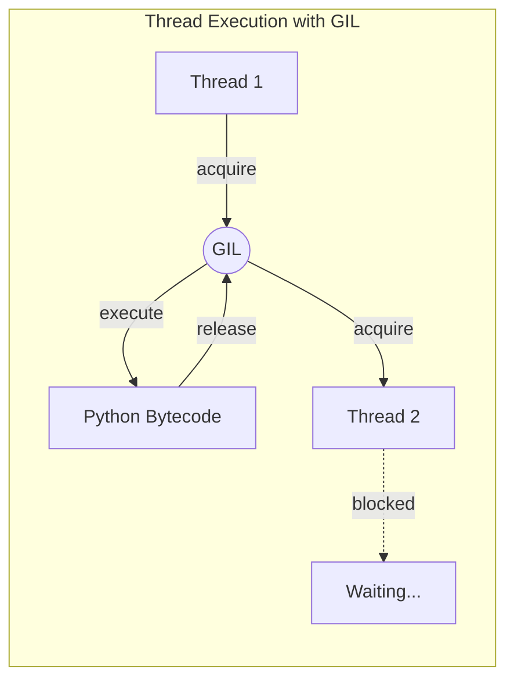
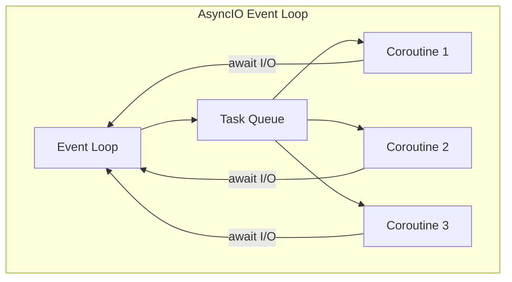
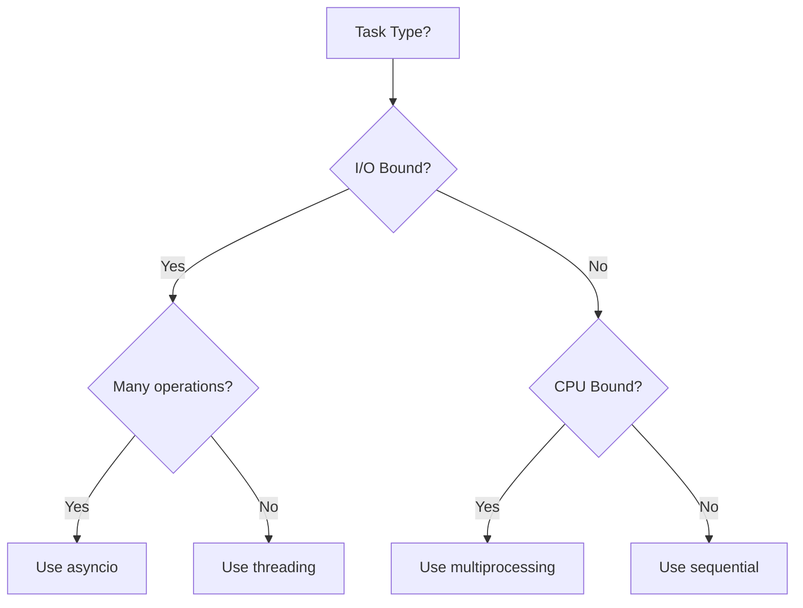

# Python Concurrency and Async

> Threading, multiprocessing, asyncio, and free-threaded Python (3.14)

---

## Table of Contents

1. [Concurrency vs Parallelism](#concurrency-vs-parallelism)
2. [The GIL](#the-gil)
3. [Threading](#threading)
4. [Multiprocessing](#multiprocessing)
5. [concurrent.futures](#concurrentfutures)
6. [Asyncio Fundamentals](#asyncio-fundamentals)
7. [Asyncio Patterns](#asyncio-patterns)
8. [Free-Threaded Python (3.14)](#free-threaded-python-314)
9. [Multiple Interpreters (3.14)](#multiple-interpreters-314)
10. [Interview Concurrency Problems](#interview-concurrency-problems)
11. [Comparison](#comparison)

---

## Concurrency vs Parallelism

```
Concurrency: Managing multiple tasks at once (may not run simultaneously)
Parallelism: Running multiple tasks at the same time (truly simultaneous)
```

| Scenario | Use |
|----------|-----|
| I/O-bound (network, file, database) | Threading or asyncio |
| CPU-bound (computation) | Multiprocessing |
| Many I/O operations | Asyncio |
| Simple background task | Threading |

---

## The GIL

The Global Interpreter Lock (GIL) prevents multiple threads from executing Python bytecode simultaneously.



### Impact

```python
import threading
import time

counter = 0

def increment():
    global counter
    for _ in range(1000000):
        counter += 1                # NOT thread-safe!

# Create threads
t1 = threading.Thread(target=increment)
t2 = threading.Thread(target=increment)

t1.start()
t2.start()
t1.join()
t2.join()

print(counter)                      # Usually NOT 2000000!
```

### When GIL Doesn't Matter

```python
# I/O-bound operations release the GIL
# - Network requests
# - File I/O
# - Database queries
# - time.sleep()

# Threads ARE useful for I/O-bound work
import threading
import urllib.request

def fetch(url):
    return urllib.request.urlopen(url).read()

# Multiple threads can make requests in parallel
```

---

## Threading

### Basic Thread Creation

```python
import threading

# Method 1: Pass function
def worker(name):
    print(f"Worker {name} starting")

t = threading.Thread(target=worker, args=("Alice",))
t.start()
t.join()                            # Wait for completion

# Method 2: Subclass Thread
class WorkerThread(threading.Thread):
    def __init__(self, name):
        super().__init__()
        self.name = name

    def run(self):
        print(f"Worker {self.name} starting")

t = WorkerThread("Bob")
t.start()
t.join()
```

### Thread Synchronization

```python
import threading

# Lock - mutual exclusion
lock = threading.Lock()
counter = 0

def safe_increment():
    global counter
    with lock:                      # Context manager (preferred)
        counter += 1

# Or manually
lock.acquire()
try:
    counter += 1
finally:
    lock.release()

# RLock - reentrant lock (same thread can acquire multiple times)
rlock = threading.RLock()

def recursive_function():
    with rlock:
        # Can call again from same thread
        pass
```

### Condition Variables

```python
import threading

condition = threading.Condition()
items = []

def producer():
    for i in range(5):
        with condition:
            items.append(i)
            condition.notify()      # Wake up one consumer

def consumer():
    while True:
        with condition:
            while not items:
                condition.wait()    # Release lock and wait
            item = items.pop(0)
            print(f"Consumed: {item}")
```

### Semaphore

```python
import threading

# Limit concurrent access
semaphore = threading.Semaphore(3)  # Max 3 at once

def limited_resource():
    with semaphore:
        # Only 3 threads can be here at once
        process()
```

### Event

```python
import threading

event = threading.Event()

def waiter():
    print("Waiting for event...")
    event.wait()                    # Block until set
    print("Event received!")

def setter():
    import time
    time.sleep(2)
    event.set()                     # Wake up all waiters

t1 = threading.Thread(target=waiter)
t2 = threading.Thread(target=setter)
t1.start()
t2.start()
```

### Thread-Safe Data Structures

```python
import queue

# Thread-safe queue (blocking)
q = queue.Queue()

def producer():
    for i in range(5):
        q.put(i)                    # Thread-safe
    q.put(None)                     # Sentinel

def consumer():
    while True:
        item = q.get()              # Blocks if empty
        if item is None:
            break
        print(f"Got: {item}")
        q.task_done()

# Wait for all tasks
q.join()
```

---

## Multiprocessing

Multiprocessing bypasses the GIL by using separate processes.

### Basic Process

```python
from multiprocessing import Process

def worker(name):
    print(f"Worker {name} in process {os.getpid()}")

if __name__ == "__main__":          # Required on Windows
    p = Process(target=worker, args=("Alice",))
    p.start()
    p.join()
```

### Process Pool

```python
from multiprocessing import Pool

def square(x):
    return x * x

if __name__ == "__main__":
    with Pool(4) as pool:           # 4 processes
        # map - apply function to each item
        results = pool.map(square, range(10))
        print(results)              # [0, 1, 4, 9, 16, 25, 36, 49, 64, 81]

        # imap - lazy iterator
        for result in pool.imap(square, range(10)):
            print(result)

        # apply_async - single async call
        result = pool.apply_async(square, (5,))
        print(result.get())         # 25
```

### Sharing Data Between Processes

```python
from multiprocessing import Process, Value, Array, Queue, Manager

# Shared value
counter = Value('i', 0)             # 'i' = integer

def increment(counter):
    for _ in range(1000):
        with counter.get_lock():
            counter.value += 1

# Shared array
arr = Array('d', [1.0, 2.0, 3.0])   # 'd' = double

# Queue for message passing
queue = Queue()

def producer(q):
    q.put("Hello from producer")

def consumer(q):
    msg = q.get()
    print(msg)

# Manager for complex objects
with Manager() as manager:
    shared_list = manager.list()
    shared_dict = manager.dict()
```

---

## concurrent.futures

High-level interface for thread and process pools.

### ThreadPoolExecutor

```python
from concurrent.futures import ThreadPoolExecutor, as_completed
import urllib.request

def fetch(url):
    return urllib.request.urlopen(url).read()

urls = [
    "https://example.com",
    "https://example.org",
    "https://example.net",
]

# Method 1: Context manager
with ThreadPoolExecutor(max_workers=5) as executor:
    # Submit all tasks
    futures = {executor.submit(fetch, url): url for url in urls}

    # Process as completed
    for future in as_completed(futures):
        url = futures[future]
        try:
            data = future.result()
            print(f"{url}: {len(data)} bytes")
        except Exception as e:
            print(f"{url}: {e}")

# Method 2: map (preserves order)
with ThreadPoolExecutor(max_workers=5) as executor:
    results = executor.map(fetch, urls)
    for url, data in zip(urls, results):
        print(f"{url}: {len(data)} bytes")
```

### ProcessPoolExecutor

```python
from concurrent.futures import ProcessPoolExecutor

def cpu_intensive(n):
    return sum(i * i for i in range(n))

if __name__ == "__main__":
    with ProcessPoolExecutor(max_workers=4) as executor:
        results = executor.map(cpu_intensive, [10**6, 10**7, 10**8])
        for result in results:
            print(result)
```

### Future Objects

```python
from concurrent.futures import ThreadPoolExecutor

with ThreadPoolExecutor() as executor:
    future = executor.submit(pow, 2, 10)

    # Check status
    future.done()                   # True if completed
    future.cancelled()              # True if cancelled
    future.running()                # True if running

    # Get result (blocks)
    result = future.result(timeout=5)

    # Add callback
    def callback(f):
        print(f"Result: {f.result()}")

    future.add_done_callback(callback)
```

---

## Asyncio Fundamentals

Asyncio provides single-threaded cooperative multitasking.



### Basic Coroutines

```python
import asyncio

async def greet(name):
    print(f"Hello, {name}")
    await asyncio.sleep(1)          # Non-blocking sleep
    print(f"Goodbye, {name}")

# Run coroutine
asyncio.run(greet("Alice"))

# Multiple coroutines
async def main():
    await greet("Alice")
    await greet("Bob")              # Runs after Alice

asyncio.run(main())
```

### Concurrent Execution

```python
import asyncio

async def fetch(url, delay):
    await asyncio.sleep(delay)      # Simulate I/O
    return f"Data from {url}"

async def main():
    # Run concurrently with gather
    results = await asyncio.gather(
        fetch("url1", 2),
        fetch("url2", 1),
        fetch("url3", 3),
    )
    print(results)                  # All results after 3 seconds

asyncio.run(main())
```

### Creating Tasks

```python
import asyncio

async def worker(name, delay):
    await asyncio.sleep(delay)
    return f"{name} done"

async def main():
    # Create tasks for concurrent execution
    task1 = asyncio.create_task(worker("A", 2))
    task2 = asyncio.create_task(worker("B", 1))

    # Tasks start immediately, await to get results
    result1 = await task1
    result2 = await task2

    print(result1, result2)

asyncio.run(main())
```

### Task Groups (Python 3.11+)

```python
import asyncio

async def worker(n):
    await asyncio.sleep(n)
    return n * 2

async def main():
    async with asyncio.TaskGroup() as tg:
        task1 = tg.create_task(worker(1))
        task2 = tg.create_task(worker(2))
        task3 = tg.create_task(worker(3))

    # All tasks completed here
    print(task1.result(), task2.result(), task3.result())

asyncio.run(main())
```

---

## Asyncio Patterns

### Timeouts

```python
import asyncio

async def slow_operation():
    await asyncio.sleep(10)
    return "Done"

async def main():
    try:
        result = await asyncio.wait_for(slow_operation(), timeout=2)
    except asyncio.TimeoutError:
        print("Operation timed out")

asyncio.run(main())
```

### Semaphore for Rate Limiting

```python
import asyncio

async def fetch(url, semaphore):
    async with semaphore:           # Limit concurrent requests
        await asyncio.sleep(1)      # Simulate request
        return f"Data from {url}"

async def main():
    semaphore = asyncio.Semaphore(3)  # Max 3 concurrent

    urls = [f"url{i}" for i in range(10)]
    tasks = [fetch(url, semaphore) for url in urls]
    results = await asyncio.gather(*tasks)
    print(results)

asyncio.run(main())
```

### Producer-Consumer with Queue

```python
import asyncio

async def producer(queue):
    for i in range(5):
        await asyncio.sleep(0.5)
        await queue.put(i)
        print(f"Produced: {i}")
    await queue.put(None)           # Sentinel

async def consumer(queue):
    while True:
        item = await queue.get()
        if item is None:
            break
        print(f"Consumed: {item}")
        await asyncio.sleep(1)

async def main():
    queue = asyncio.Queue()
    await asyncio.gather(
        producer(queue),
        consumer(queue),
    )

asyncio.run(main())
```

### Waiting for Multiple Tasks

```python
import asyncio

async def main():
    tasks = [
        asyncio.create_task(asyncio.sleep(1)),
        asyncio.create_task(asyncio.sleep(2)),
        asyncio.create_task(asyncio.sleep(3)),
    ]

    # wait_for - single task with timeout
    # gather - all tasks, get all results
    # wait - more control

    # Wait for first to complete
    done, pending = await asyncio.wait(
        tasks,
        return_when=asyncio.FIRST_COMPLETED
    )
    print(f"Done: {len(done)}, Pending: {len(pending)}")

    # Cancel pending
    for task in pending:
        task.cancel()

asyncio.run(main())
```

### Exception Handling

```python
import asyncio

async def might_fail(n):
    if n == 2:
        raise ValueError("Bad value")
    return n * 2

async def main():
    # gather with return_exceptions
    results = await asyncio.gather(
        might_fail(1),
        might_fail(2),
        might_fail(3),
        return_exceptions=True
    )

    for result in results:
        if isinstance(result, Exception):
            print(f"Error: {result}")
        else:
            print(f"Result: {result}")

asyncio.run(main())
```

---

## Free-Threaded Python (3.14)

Python 3.14 officially supports free-threaded builds (PEP 779) where the GIL is disabled.

### Checking Mode

```python
import sys

# Check if GIL is enabled
if sys._is_gil_enabled():
    print("Running with GIL")
else:
    print("Running free-threaded (no GIL)")
```

### Installation

```bash
# Free-threaded Python has 't' suffix
python3.14t --version

# Or build from source
./configure --disable-gil
make
```

### Performance Characteristics

```python
# Free-threaded mode:
# - Single-thread overhead: 5-10% (improved from 40% in 3.13)
# - Multi-thread CPU-bound: Up to 3.1x speedup

import threading
import time

def cpu_intensive(n):
    total = 0
    for i in range(n):
        total += i * i
    return total

# With free-threaded Python, threads run truly parallel
threads = []
start = time.time()
for _ in range(4):
    t = threading.Thread(target=cpu_intensive, args=(10**7,))
    threads.append(t)
    t.start()

for t in threads:
    t.join()

print(f"Time: {time.time() - start:.2f}s")
```

### Thread Safety Considerations

```python
import threading

# Still need locks for shared mutable state!
counter = 0
lock = threading.Lock()

def increment():
    global counter
    for _ in range(1000000):
        with lock:                  # Still required!
            counter += 1

# Built-in types are thread-safe for basic operations
# - Reading is safe
# - Appending to list is safe
# - But compound operations need locks
```

### Context-Aware Features

```python
# Python 3.14 adds context awareness
import threading

# Threads inherit context from parent
# Useful for contextvars, warnings, decimal settings

# New flag: -X context_aware_warnings
# Default True for free-threaded builds
```

---

## Multiple Interpreters (3.14)

Python 3.14 adds `concurrent.interpreters` for isolated Python interpreters in the same process.

### Basic Usage

```python
from concurrent.interpreters import create, list_all

# Create interpreter
interp = create()

# Run code in interpreter
interp.run('x = 1 + 1')
interp.run('print(x)')              # Prints: 2

# Interpreters are isolated
# Each has its own globals, modules, GIL

# List all interpreters
for i in list_all():
    print(i)
```

### Use Cases

```python
# 1. True parallelism without multiprocessing overhead
# 2. Isolation between plugins/modules
# 3. Running untrusted code safely

from concurrent.interpreters import create
import threading

def run_in_interpreter(code):
    interp = create()
    interp.run(code)

# Run in parallel threads (each interpreter has its own GIL)
threads = []
for i in range(4):
    code = f"result = sum(range({10**7}))"
    t = threading.Thread(target=run_in_interpreter, args=(code,))
    threads.append(t)
    t.start()

for t in threads:
    t.join()
```

### vs Multiprocessing

| Feature | Interpreters | Multiprocessing |
|---------|--------------|-----------------|
| Memory sharing | Limited | Requires IPC |
| Startup overhead | Lower | Higher |
| Isolation | Yes | Yes |
| Communication | Channels | Pipes, Queues |

---

## Interview Concurrency Problems

### Print in Order

```python
import threading

class Foo:
    def __init__(self):
        self.locks = [threading.Lock() for _ in range(2)]
        self.locks[0].acquire()
        self.locks[1].acquire()

    def first(self):
        print("first")
        self.locks[0].release()

    def second(self):
        with self.locks[0]:
            print("second")
            self.locks[1].release()

    def third(self):
        with self.locks[1]:
            print("third")
```

### Bounded Blocking Queue

```python
import threading
from collections import deque

class BoundedBlockingQueue:
    def __init__(self, capacity: int):
        self.capacity = capacity
        self.queue = deque()
        self.lock = threading.Lock()
        self.not_empty = threading.Condition(self.lock)
        self.not_full = threading.Condition(self.lock)

    def enqueue(self, element: int) -> None:
        with self.not_full:
            while len(self.queue) >= self.capacity:
                self.not_full.wait()
            self.queue.append(element)
            self.not_empty.notify()

    def dequeue(self) -> int:
        with self.not_empty:
            while not self.queue:
                self.not_empty.wait()
            element = self.queue.popleft()
            self.not_full.notify()
            return element

    def size(self) -> int:
        with self.lock:
            return len(self.queue)
```

### Rate Limiter

```python
import threading
import time

class RateLimiter:
    def __init__(self, max_requests: int, window_seconds: float):
        self.max_requests = max_requests
        self.window = window_seconds
        self.requests = []
        self.lock = threading.Lock()

    def allow(self) -> bool:
        with self.lock:
            now = time.time()
            # Remove old requests
            self.requests = [t for t in self.requests
                           if now - t < self.window]

            if len(self.requests) < self.max_requests:
                self.requests.append(now)
                return True
            return False
```

### Read-Write Lock

```python
import threading

class ReadWriteLock:
    def __init__(self):
        self.readers = 0
        self.lock = threading.Lock()
        self.write_lock = threading.Lock()

    def acquire_read(self):
        with self.lock:
            self.readers += 1
            if self.readers == 1:
                self.write_lock.acquire()

    def release_read(self):
        with self.lock:
            self.readers -= 1
            if self.readers == 0:
                self.write_lock.release()

    def acquire_write(self):
        self.write_lock.acquire()

    def release_write(self):
        self.write_lock.release()
```

---

## Comparison

### When to Use What

| Scenario | Best Choice |
|----------|-------------|
| Many network requests | asyncio |
| Simple background task | threading |
| CPU-intensive computation | multiprocessing |
| Mixed I/O + CPU | ProcessPoolExecutor |
| Need shared state | threading with locks |
| High concurrency, I/O-bound | asyncio |
| Parallel data processing | multiprocessing.Pool |



### Feature Comparison

| Feature | Threading | Multiprocessing | Asyncio |
|---------|-----------|-----------------|---------|
| GIL limitation | Yes | No | N/A (single-thread) |
| Memory sharing | Easy | Requires IPC | Easy |
| Best for | I/O-bound | CPU-bound | Many I/O ops |
| Overhead | Low | High | Very low |
| Scalability | Moderate | Good | Excellent |
| Complexity | Medium | Medium | Higher |

### Code Complexity

```python
# Threading - moderate complexity
import threading

def worker():
    pass

threads = [threading.Thread(target=worker) for _ in range(10)]
for t in threads:
    t.start()
for t in threads:
    t.join()

# Multiprocessing - similar to threading
from multiprocessing import Pool

with Pool(4) as pool:
    results = pool.map(worker, data)

# Asyncio - different paradigm
import asyncio

async def worker():
    await asyncio.sleep(1)

async def main():
    await asyncio.gather(*[worker() for _ in range(10)])

asyncio.run(main())
```

---

## Quick Reference

### Threading

```python
import threading

# Create and start
t = threading.Thread(target=func, args=(arg,))
t.start()
t.join()

# Synchronization
lock = threading.Lock()
with lock:
    # Critical section

# Thread-safe queue
import queue
q = queue.Queue()
q.put(item)
item = q.get()
```

### Multiprocessing

```python
from multiprocessing import Pool

if __name__ == "__main__":
    with Pool(4) as pool:
        results = pool.map(func, data)
```

### Asyncio

```python
import asyncio

async def main():
    results = await asyncio.gather(
        coro1(),
        coro2(),
    )

asyncio.run(main())
```

### concurrent.futures

```python
from concurrent.futures import ThreadPoolExecutor, ProcessPoolExecutor

# I/O-bound
with ThreadPoolExecutor(max_workers=10) as executor:
    results = executor.map(fetch, urls)

# CPU-bound
with ProcessPoolExecutor(max_workers=4) as executor:
    results = executor.map(compute, data)
```
