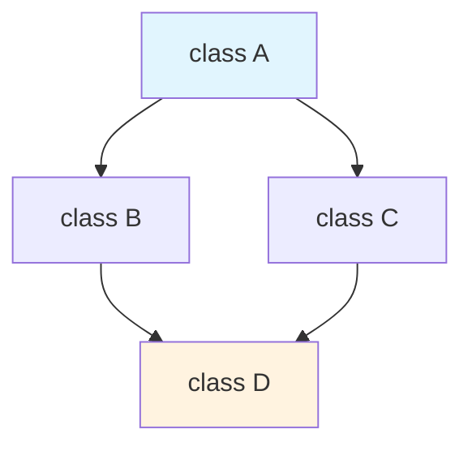
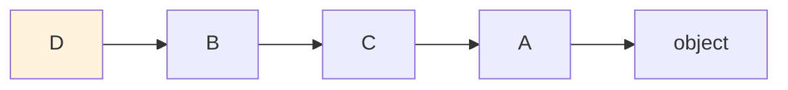

# Python Interview Trap Questions

> **Reading time**: 60-75 minutes | **Difficulty**: Intermediate to Advanced | **Python**: 3.10+

Master the tricky questions interviewers use to test your deep understanding of Python's internals, edge cases, and gotchas.

---

## Table of Contents

1. [Introduction](#introduction)
2. [Identity vs Equality](#identity-vs-equality)
3. [Mutable Default Arguments](#mutable-default-arguments)
4. [Late Binding Closures](#late-binding-closures)
5. [Shallow vs Deep Copy](#shallow-vs-deep-copy)
6. [Variable Scoping (LEGB)](#variable-scoping-legb)
7. [List Multiplication Trap](#list-multiplication-trap)
8. [Class vs Instance Attributes](#class-vs-instance-attributes)
9. [MRO and Multiple Inheritance](#mro-and-multiple-inheritance)
10. [Generator Exhaustion](#generator-exhaustion)
11. [Dictionary Behavior](#dictionary-behavior)
12. [`__new__` vs `__init__`](#__new__-vs-__init__)
13. [Descriptors](#descriptors)
14. [Reference Counting and GC](#reference-counting-and-gc)
15. [GIL Implications](#gil-implications)
16. [async/await Gotchas](#asyncawait-gotchas)
17. [String Interning](#string-interning)
18. [Metaclasses](#metaclasses)
19. [Quick Reference](#quick-reference)

---

## Introduction

These questions are specifically designed to test your understanding of Python's internal mechanics. They're common in senior-level interviews and help distinguish developers who truly understand the language from those who just use it.

### Why These Questions Matter

| Question Type | What It Tests |
|--------------|---------------|
| `is` vs `==` | Understanding of identity vs equality |
| Mutable defaults | Function definition mechanics |
| Late binding | Closure semantics |
| LEGB scoping | Name resolution |
| MRO | Inheritance mechanism |
| GIL | Concurrency model |
| `__new__` vs `__init__` | Object creation lifecycle |

---

## Identity vs Equality

### The Trap Question

```python
>>> a = 256
>>> b = 256
>>> a is b
???

>>> a = 257
>>> b = 257
>>> a is b
???

>>> a = "hello"
>>> b = "hello"
>>> a is b
???

>>> a = "hello world"
>>> b = "hello world"
>>> a is b
???
```

### The Answers

```python
>>> a = 256
>>> b = 256
>>> a is b
True  # Small integers are cached

>>> a = 257
>>> b = 257
>>> a is b
False  # Outside cache range

>>> a = "hello"
>>> b = "hello"
>>> a is b
True  # String interning for simple strings

>>> a = "hello world"
>>> b = "hello world"
>>> a is b
False  # Not interned (has space)
```

### Why This Happens

**Integer Caching:** Python pre-allocates integer objects for values from **-5 to 256** (inclusive). All references to these values point to the same object.

```python
# These are the same object
>>> id(100) == id(100)
True

# These are different objects
>>> x = 300
>>> y = 300
>>> id(x) == id(y)
False
```

**String Interning:** Python automatically interns strings that:
- Look like identifiers (letters, digits, underscores only)
- Are compile-time constants
- Are created through string operations in certain contexts

```python
# Interned (identifier-like)
>>> a = "hello"
>>> b = "hello"
>>> a is b
True

# Not interned (has space)
>>> a = "hello world"
>>> b = "hello world"
>>> a is b
False

# Force interning
>>> import sys
>>> a = sys.intern("hello world")
>>> b = sys.intern("hello world")
>>> a is b
True
```

### REPL vs Script Difference

```python
# In REPL:
>>> a = 257
>>> b = 257
>>> a is b
False  # Different objects

# In a script (same compilation unit):
a = 257
b = 257
print(a is b)  # True! Same compilation unit optimization
```

### The Correct Practice

```python
# WRONG: Using 'is' for value comparison
if user_id is 5:  # May work accidentally but wrong
    ...

if name is "admin":  # May work accidentally but wrong
    ...

# CORRECT: Use '==' for value comparison
if user_id == 5:
    ...

if name == "admin":
    ...

# 'is' is ONLY for:
# 1. None comparison
if x is None:
    ...

# 2. Explicit singleton comparison
if value is SENTINEL:
    ...

# 3. Type identity (rare)
if type(x) is int:  # Usually isinstance() is better
    ...
```

### Follow-Up Questions

**Q: Can you create two different integer objects with value 100?**

```python
# Direct assignment reuses cached object
a = 100
b = 100
print(a is b)  # True

# But you can force new objects
a = int("100")  # May still be cached
b = int(100.0)  # May still be cached

# Guaranteed different objects
a = 100 + 1 - 1  # Still may be optimized
```

**Q: What about tuples?**

```python
>>> a = (1, 2, 3)
>>> b = (1, 2, 3)
>>> a is b
False  # Tuples are NOT cached like small integers

>>> a = ()
>>> b = ()
>>> a is b
True  # Empty tuple IS a singleton
```

---

## Mutable Default Arguments

### The Trap Question

```python
def add_item(item, items=[]):
    items.append(item)
    return items

print(add_item("a"))
print(add_item("b"))
print(add_item("c"))
```

### The Answer

```python
['a']
['a', 'b']
['a', 'b', 'c']
```

### Why This Happens

Default arguments are evaluated **once** when the function is **defined**, not each time it's called. The empty list `[]` is created once and stored with the function object.

```python
def add_item(item, items=[]):
    items.append(item)
    return items

# The default list is stored in the function object
print(add_item.__defaults__)  # ([],)

add_item("a")
print(add_item.__defaults__)  # (['a'],)

add_item("b")
print(add_item.__defaults__)  # (['a', 'b'],)
```

### The Fix

```python
def add_item(item, items=None):
    if items is None:
        items = []
    items.append(item)
    return items

print(add_item("a"))  # ['a']
print(add_item("b"))  # ['b']
print(add_item("c"))  # ['c']
```

### Variation: When It's Intentional

```python
# Intentional caching using mutable default
def fibonacci(n, cache={}):
    if n in cache:
        return cache[n]
    if n < 2:
        return n
    cache[n] = fibonacci(n-1, cache) + fibonacci(n-2, cache)
    return cache[n]

# Better alternative: @functools.cache
from functools import cache

@cache
def fibonacci(n):
    if n < 2:
        return n
    return fibonacci(n-1) + fibonacci(n-2)
```

### Follow-Up: All Mutable Types

```python
# ALL of these have the same problem:
def bad_dict(key, value, data={}): ...
def bad_set(item, items=set()): ...
def bad_class(cls, instances=[]): ...

# Fix all with None sentinel
def good_dict(key, value, data=None):
    if data is None:
        data = {}
    ...
```

---

## Late Binding Closures

### The Trap Question

```python
def create_multipliers():
    multipliers = []
    for i in range(5):
        multipliers.append(lambda x: x * i)
    return multipliers

mults = create_multipliers()
print([m(2) for m in mults])
```

### The Answer

```python
[8, 8, 8, 8, 8]  # NOT [0, 2, 4, 6, 8]
```

### Why This Happens

Python closures capture **variables**, not **values**. The lambda captures a reference to `i`, not the value of `i` at the time the lambda was created. When the lambda is called, it looks up `i` in the enclosing scope—and by then, `i` is 4.

```python
def create_multipliers():
    multipliers = []
    for i in range(5):
        # All lambdas share the SAME variable 'i'
        multipliers.append(lambda x: x * i)
    # After loop: i = 4
    return multipliers

# When called, all lambdas look up 'i', which is 4
```

### The Fixes

**Fix 1: Default Argument Binding**
```python
def create_multipliers():
    multipliers = []
    for i in range(5):
        # i=i creates a new local variable in each lambda's closure
        multipliers.append(lambda x, i=i: x * i)
    return multipliers

print([m(2) for m in create_multipliers()])  # [0, 2, 4, 6, 8]
```

**Fix 2: Factory Function**
```python
def create_multipliers():
    def make_multiplier(n):
        return lambda x: x * n  # n is bound when make_multiplier returns

    return [make_multiplier(i) for i in range(5)]

print([m(2) for m in create_multipliers()])  # [0, 2, 4, 6, 8]
```

**Fix 3: functools.partial**
```python
from functools import partial

def multiply(x, factor):
    return x * factor

def create_multipliers():
    return [partial(multiply, factor=i) for i in range(5)]

print([m(2) for m in create_multipliers()])  # [0, 2, 4, 6, 8]
```

### Follow-Up: List Comprehension Variant

```python
# Same problem in list comprehension
functions = [lambda: i for i in range(5)]
print([f() for f in functions])  # [4, 4, 4, 4, 4]

# Fix
functions = [lambda i=i: i for i in range(5)]
print([f() for f in functions])  # [0, 1, 2, 3, 4]
```

---

## Shallow vs Deep Copy

### The Trap Question

```python
import copy

original = [[1, 2, 3], [4, 5, 6]]
shallow = copy.copy(original)
deep = copy.deepcopy(original)

original[0][0] = 'X'
original[1] = 'replaced'

print("original:", original)
print("shallow:", shallow)
print("deep:", deep)
```

### The Answer

```python
original: [['X', 2, 3], 'replaced']
shallow: [['X', 2, 3], [4, 5, 6]]  # First list modified, second unchanged
deep: [[1, 2, 3], [4, 5, 6]]  # Completely independent
```

### Why This Happens

**Shallow copy** creates a new container but keeps references to the same objects:

```
original → [ref_to_list1, ref_to_list2]
              ↓             ↓
           [1,2,3]       [4,5,6]
              ↑
shallow  → [ref_to_list1, ref_to_list2']
                          ↓
                       [4,5,6]  (same object)
```

**Deep copy** recursively copies all nested objects:

```
original → [ref_to_list1, ref_to_list2]
              ↓             ↓
           [1,2,3]       [4,5,6]

deep     → [ref_to_copy1, ref_to_copy2]
              ↓             ↓
           [1,2,3]       [4,5,6]  (completely separate objects)
```

### Copy Methods Comparison

```python
import copy

# Different ways to copy
original = [1, [2, 3]]

# 1. Assignment (no copy)
assigned = original  # Same object!

# 2. Slice (shallow)
sliced = original[:]

# 3. list() constructor (shallow)
constructed = list(original)

# 4. copy.copy (shallow)
shallow = copy.copy(original)

# 5. copy.deepcopy (deep)
deep = copy.deepcopy(original)

# Test
original[1].append(4)
print(assigned)     # [1, [2, 3, 4]] - affected
print(sliced)       # [1, [2, 3, 4]] - affected
print(constructed)  # [1, [2, 3, 4]] - affected
print(shallow)      # [1, [2, 3, 4]] - affected
print(deep)         # [1, [2, 3]] - NOT affected
```

### Custom Copy Behavior

```python
import copy

class MyClass:
    def __init__(self, value, reference):
        self.value = value
        self.reference = reference

    def __copy__(self):
        """Shallow copy - keep same reference."""
        return MyClass(self.value, self.reference)

    def __deepcopy__(self, memo):
        """Deep copy - copy everything."""
        return MyClass(
            copy.deepcopy(self.value, memo),
            copy.deepcopy(self.reference, memo)
        )
```

### Immutable Objects

```python
import copy

# Immutable objects aren't copied - they return themselves
a = (1, 2, 3)
b = copy.copy(a)
c = copy.deepcopy(a)

print(a is b)  # True - no copy needed
print(a is c)  # True - no copy needed

# But mutable contents ARE copied in deepcopy
a = ([1], [2])
b = copy.copy(a)
c = copy.deepcopy(a)

print(a is b)  # False - new tuple
print(a[0] is b[0])  # True - shallow: same list
print(a[0] is c[0])  # False - deep: different list
```

---

## Variable Scoping (LEGB)

### The Trap Question

```python
x = 10

def outer():
    x = 20

    def inner():
        x = x + 1  # What happens here?
        return x

    return inner()

print(outer())
```

### The Answer

```python
UnboundLocalError: local variable 'x' referenced before assignment
```

### Why This Happens

Python determines variable scope at **compile time**, not runtime. The assignment `x = x + 1` makes `x` a **local** variable for the entire function. But the right side tries to read `x` before it's assigned.

```python
def inner():
    # At compile time, Python sees 'x = ...' and marks x as LOCAL
    x = x + 1  # Reading local x (not assigned yet) + 1, then assign to local x
    return x
```

### LEGB Rule

Python looks up variables in this order:

1. **L**ocal: Inside the current function
2. **E**nclosing: In enclosing functions (closures)
3. **G**lobal: Module-level
4. **B**uilt-in: Python built-ins (`print`, `len`, etc.)

```python
x = 'global'

def outer():
    x = 'enclosing'

    def inner():
        x = 'local'
        print(x)  # 'local' (L)

    inner()
    print(x)  # 'enclosing' (E)

outer()
print(x)  # 'global' (G)
```

### The Fix: `global` and `nonlocal`

```python
# Fix with nonlocal (Python 3+)
x = 10

def outer():
    x = 20

    def inner():
        nonlocal x  # Refers to enclosing scope's x
        x = x + 1
        return x

    return inner()

print(outer())  # 21

# Fix with global
x = 10

def modify_global():
    global x  # Refers to global x
    x = x + 1

modify_global()
print(x)  # 11
```

### Tricky Variant: Conditional Assignment

```python
def tricky():
    if False:
        x = 10  # Never executed, but x is still local!
    return x  # UnboundLocalError

# Python sees 'x = 10' at compile time and makes x local
# At runtime, the assignment never happens
```

### Shadowing Built-ins

```python
# BAD: Shadows built-in
list = [1, 2, 3]  # Shadows built-in list
print(list([4, 5, 6]))  # TypeError: 'list' object is not callable

# BAD: Shadows in function
def bad_example():
    len = lambda x: 0  # Shadows built-in len
    return len([1, 2, 3])  # Returns 0, not 3

# Restore by deleting
del list
```

---

## List Multiplication Trap

### The Trap Question

```python
matrix = [[0] * 3] * 3
matrix[0][0] = 1
print(matrix)
```

### The Answer

```python
[[1, 0, 0], [1, 0, 0], [1, 0, 0]]  # All rows changed!
```

### Why This Happens

`[[0] * 3] * 3` creates **one** inner list and **three references** to it:

```python
inner = [0, 0, 0]
matrix = [inner, inner, inner]  # Three refs to SAME list

# Proof:
matrix = [[0] * 3] * 3
print(matrix[0] is matrix[1])  # True - same object!
print(matrix[1] is matrix[2])  # True - same object!
```

### The Fix: List Comprehension

```python
# Correct: Creates 3 separate lists
matrix = [[0] * 3 for _ in range(3)]
matrix[0][0] = 1
print(matrix)  # [[1, 0, 0], [0, 0, 0], [0, 0, 0]]

# Verify:
print(matrix[0] is matrix[1])  # False - different objects
```

### When Multiplication IS Safe

```python
# Safe: Immutable elements
row = [0] * 5  # [0, 0, 0, 0, 0] - integers are immutable
row[0] = 1     # [1, 0, 0, 0, 0] - only creates new reference

# Safe: 1D list of immutables
numbers = [None] * 10
strings = [""] * 10

# NOT safe: Mutable elements
lists = [[]] * 3  # Three refs to same empty list
dicts = [{}] * 3  # Three refs to same empty dict
```

### N-Dimensional Arrays

```python
# 2D matrix (correct)
matrix = [[0] * cols for _ in range(rows)]

# 3D matrix (correct)
tensor = [[[0] * depth for _ in range(cols)] for _ in range(rows)]

# Using numpy (much better for numerical work)
import numpy as np
matrix = np.zeros((rows, cols))
tensor = np.zeros((rows, cols, depth))
```

---

## Class vs Instance Attributes

### The Trap Question

```python
class Counter:
    count = 0
    items = []

    def increment(self):
        self.count += 1
        self.items.append(self.count)

c1 = Counter()
c2 = Counter()

c1.increment()
c1.increment()
c2.increment()

print(f"c1.count = {c1.count}, c1.items = {c1.items}")
print(f"c2.count = {c2.count}, c2.items = {c2.items}")
print(f"Counter.count = {Counter.count}")
```

### The Answer

```python
c1.count = 2, c1.items = [1, 2, 1]
c2.count = 1, c2.items = [1, 2, 1]
Counter.count = 0
```

### Why This Happens

**For `count` (immutable):**
- `self.count += 1` is `self.count = self.count + 1`
- First read: finds `count` in class (0)
- Assignment creates **instance** attribute `count`
- Class attribute unchanged

**For `items` (mutable):**
- `self.items.append()` mutates the list in-place
- No assignment, so no new instance attribute created
- All instances share the **class** attribute

```python
# After c1.increment() twice:
Counter.count = 0       # Class attr unchanged
Counter.items = [1, 2]  # Class attr mutated

c1.__dict__ = {'count': 2}  # Instance attr created
c2.__dict__ = {}            # No instance attrs yet
```

### The Fix

```python
class Counter:
    # Class attribute for shared data (immutable is fine)
    default_step = 1

    def __init__(self):
        # Instance attributes for per-instance data
        self.count = 0
        self.items = []

    def increment(self):
        self.count += self.default_step
        self.items.append(self.count)

c1 = Counter()
c2 = Counter()
c1.increment()
c1.increment()
c2.increment()

print(c1.items)  # [1, 2]
print(c2.items)  # [1] - independent!
```

### When Class Attributes ARE Appropriate

```python
class Circle:
    # Class constant - shared, immutable
    PI = 3.14159

    # Class method counter
    _instance_count = 0

    def __init__(self, radius):
        self.radius = radius
        Circle._instance_count += 1  # Explicitly update class attr

    @classmethod
    def get_instance_count(cls):
        return cls._instance_count

    @property
    def area(self):
        return self.PI * self.radius ** 2
```

---

## MRO and Multiple Inheritance

### The Trap Question

```python
class A:
    def method(self):
        print("A", end=" ")

class B(A):
    def method(self):
        print("B", end=" ")
        super().method()

class C(A):
    def method(self):
        print("C", end=" ")
        super().method()

class D(B, C):
    def method(self):
        print("D", end=" ")
        super().method()

d = D()
d.method()
```

### The Answer

```python
D B C A
```

### Why This Happens: C3 Linearization

Python uses **C3 Linearization** (MRO - Method Resolution Order) to determine the order classes are searched:

```python
print(D.__mro__)
# (<class 'D'>, <class 'B'>, <class 'C'>, <class 'A'>, <class 'object'>)
```

**The Diamond Problem:**



**MRO Linearization Order:**



`super()` doesn't mean "parent class"—it means "next in MRO":

```python
D.method() calls:
  print("D")
  super().method()  # Next in MRO is B

B.method() calls:
  print("B")
  super().method()  # Next in MRO is C (not A!)

C.method() calls:
  print("C")
  super().method()  # Next in MRO is A

A.method() calls:
  print("A")
```

### C3 Linearization Rules

1. Children come before parents
2. Order of parents is preserved
3. If a class appears in multiple inheritance paths, it's placed after all paths that include it

```python
class A: pass
class B(A): pass
class C(A): pass
class D(B, C): pass

# MRO calculation:
# D -> B -> C -> A -> object
# (D first, then B because B listed first in D(B, C), then C, then A last)
```

### When MRO Fails

```python
class A: pass
class B(A): pass
class C(A, B): pass  # ERROR!

# TypeError: Cannot create a consistent method resolution order (MRO)
# for bases A, B

# Why? B must come after A (B inherits from A)
# But C(A, B) says A should come before B
# Contradiction!
```

### Cooperative Multiple Inheritance

```python
class Base:
    def method(self):
        pass  # End of chain

class Mixin1(Base):
    def method(self):
        print("Mixin1")
        super().method()  # Continue chain

class Mixin2(Base):
    def method(self):
        print("Mixin2")
        super().method()  # Continue chain

class Combined(Mixin1, Mixin2):
    def method(self):
        print("Combined")
        super().method()  # Continue chain

c = Combined()
c.method()  # Combined, Mixin1, Mixin2
```

---

## Generator Exhaustion

### The Trap Question

```python
def numbers():
    for i in range(3):
        yield i

gen = numbers()
print(list(gen))
print(list(gen))
print(sum(gen))
```

### The Answer

```python
[0, 1, 2]
[]
0
```

### Why This Happens

Generators are **single-use iterators**. Once exhausted, they're empty forever.

```python
gen = numbers()

# First iteration - yields 0, 1, 2
for x in gen:
    print(x)  # 0, 1, 2

# Second iteration - already exhausted
for x in gen:
    print(x)  # Nothing prints!
```

### Checking Exhaustion

```python
gen = numbers()
list(gen)

# Generator is exhausted but not "False"
print(bool(gen))  # True! Generators are always truthy

# Can't check length either
print(len(gen))  # TypeError: object of type 'generator' has no len()
```

### Multiple Iteration Solutions

**Solution 1: Convert to list first**
```python
data = list(numbers())
print(sum(data))  # 3
print(max(data))  # 2
print(min(data))  # 0
```

**Solution 2: Create new generator each time**
```python
print(sum(numbers()))  # 3
print(list(numbers()))  # [0, 1, 2]
```

**Solution 3: Use itertools.tee (careful with memory)**
```python
from itertools import tee

gen = numbers()
gen1, gen2 = tee(gen, 2)

print(list(gen1))  # [0, 1, 2]
print(list(gen2))  # [0, 1, 2]
```

### Generator Expressions Are Also Single-Use

```python
gen_expr = (x**2 for x in range(5))
print(list(gen_expr))  # [0, 1, 4, 9, 16]
print(list(gen_expr))  # [] - exhausted!

# Vs list comprehension (creates list, reusable)
list_comp = [x**2 for x in range(5)]
print(list_comp)  # [0, 1, 4, 9, 16]
print(list_comp)  # [0, 1, 4, 9, 16] - still there!
```

---

## Dictionary Behavior

### The Trap Question

```python
d = {}
d[1] = "one"
d[1.0] = "one point zero"
d[True] = "true"

print(d)
print(len(d))
```

### The Answer

```python
{1: 'true'}
1
```

### Why This Happens

Dictionary keys use **equality** (`==`) and **hash**, not identity:

```python
# These are all equal!
print(1 == 1.0 == True)  # True

# And have the same hash!
print(hash(1) == hash(1.0) == hash(True))  # True
```

So `d[1]`, `d[1.0]`, and `d[True]` all refer to the **same key**. Each assignment overwrites the previous value.

### Dictionary Ordering (Python 3.7+)

```python
# Python 3.7+ guarantees insertion order
d = {"a": 1, "b": 2, "c": 3}
print(list(d.keys()))  # ['a', 'b', 'c'] - guaranteed order!

# But dict is NOT ordered for equality comparison
d1 = {"a": 1, "b": 2}
d2 = {"b": 2, "a": 1}
print(d1 == d2)  # True - order doesn't affect equality
```

### Dictionary Views

```python
d = {"a": 1, "b": 2}
keys = d.keys()
values = d.values()
items = d.items()

# Views are LIVE - reflect changes to dict
d["c"] = 3
print(list(keys))  # ['a', 'b', 'c'] - updated!

# Views support set operations
d1 = {"a": 1, "b": 2}
d2 = {"b": 2, "c": 3}
print(d1.keys() & d2.keys())  # {'b'}
print(d1.keys() | d2.keys())  # {'a', 'b', 'c'}
```

### The Merge Operator (Python 3.9+)

```python
d1 = {"a": 1, "b": 2}
d2 = {"b": 3, "c": 4}

# Merge operator
d3 = d1 | d2  # {'a': 1, 'b': 3, 'c': 4}

# Update operator
d1 |= d2  # d1 is now {'a': 1, 'b': 3, 'c': 4}
```

---

## `__new__` vs `__init__`

### The Trap Question

```python
class Singleton:
    _instance = None

    def __new__(cls):
        if cls._instance is None:
            cls._instance = super().__new__(cls)
        return cls._instance

    def __init__(self):
        self.data = []

s1 = Singleton()
s1.data.append(1)
s2 = Singleton()
print(s2.data)
```

### The Answer

```python
[]  # Empty! Not [1]
```

### Why This Happens

- `__new__` creates the instance (called first)
- `__init__` initializes the instance (called after `__new__` returns)

**The trap:** `__init__` is called every time, even if `__new__` returns an existing instance!

```python
s1 = Singleton()
# __new__ creates instance
# __init__ sets self.data = []

s1.data.append(1)
# data is now [1]

s2 = Singleton()
# __new__ returns EXISTING instance
# __init__ is STILL called! Sets self.data = [] again!
```

### The Fix

```python
class Singleton:
    _instance = None
    _initialized = False

    def __new__(cls):
        if cls._instance is None:
            cls._instance = super().__new__(cls)
        return cls._instance

    def __init__(self):
        if not self._initialized:
            self.data = []
            self._initialized = True

# Or simpler: Don't use __init__ for singleton
class Singleton:
    _instance = None

    def __new__(cls):
        if cls._instance is None:
            cls._instance = super().__new__(cls)
            cls._instance.data = []  # Initialize in __new__
        return cls._instance
```

### When to Use `__new__`

```python
# 1. Subclassing immutable types
class UpperStr(str):
    def __new__(cls, value):
        return super().__new__(cls, value.upper())

s = UpperStr("hello")
print(s)  # HELLO

# 2. Singleton pattern (as shown)

# 3. Factory-like behavior
class Shape:
    def __new__(cls, sides):
        if sides == 3:
            return object.__new__(Triangle)
        elif sides == 4:
            return object.__new__(Rectangle)
        return object.__new__(cls)
```

---

## Descriptors

### The Trap Question

```python
class Validator:
    def __get__(self, obj, objtype=None):
        print(f"Getting from {obj}")
        return obj._value

    def __set__(self, obj, value):
        print(f"Setting {value} on {obj}")
        obj._value = value

class MyClass:
    attr = Validator()

m = MyClass()
m.attr = 10
print(m.attr)
print(m.__dict__)
```

### The Answer

```python
Setting 10 on <__main__.MyClass object at 0x...>
Getting from <__main__.MyClass object at 0x...>
10
{'_value': 10}
```

### Why This Happens

Descriptors intercept attribute access when defined as **class attributes**:

- `__get__`: Called when attribute is accessed
- `__set__`: Called when attribute is assigned
- `__delete__`: Called when attribute is deleted

```python
m.attr = 10
# Python sees 'attr' is a descriptor on the class
# Calls Validator.__set__(descriptor, m, 10)
# NOT m.__dict__['attr'] = 10

print(m.attr)
# Calls Validator.__get__(descriptor, m, MyClass)
# NOT m.__dict__['attr']
```

### Data vs Non-Data Descriptors

```python
# Data descriptor: has __set__ or __delete__
class DataDescriptor:
    def __get__(self, obj, objtype=None):
        return "data descriptor"
    def __set__(self, obj, value):
        pass

# Non-data descriptor: only __get__
class NonDataDescriptor:
    def __get__(self, obj, objtype=None):
        return "non-data descriptor"

class MyClass:
    data = DataDescriptor()
    nondata = NonDataDescriptor()

m = MyClass()
m.__dict__['data'] = "instance attr"
m.__dict__['nondata'] = "instance attr"

print(m.data)     # "data descriptor" - descriptor wins!
print(m.nondata)  # "instance attr" - instance wins!
```

**Lookup order:**
1. Data descriptors (class level)
2. Instance `__dict__`
3. Non-data descriptors (class level)
4. Class `__dict__`

### Practical Descriptor Example

```python
class PositiveNumber:
    def __set_name__(self, owner, name):
        self.name = name
        self.private_name = f"_{name}"

    def __get__(self, obj, objtype=None):
        if obj is None:
            return self
        return getattr(obj, self.private_name, None)

    def __set__(self, obj, value):
        if value < 0:
            raise ValueError(f"{self.name} must be positive")
        setattr(obj, self.private_name, value)

class Product:
    price = PositiveNumber()
    quantity = PositiveNumber()

    def __init__(self, name, price, quantity):
        self.name = name
        self.price = price
        self.quantity = quantity

p = Product("Widget", 10, 5)
p.price = -5  # ValueError: price must be positive
```

---

## Reference Counting and GC

### The Trap Question

```python
import sys

a = []
print(sys.getrefcount(a))
```

### The Answer

```python
2  # NOT 1!
```

### Why This Happens

`sys.getrefcount()` itself creates a temporary reference to the object when passing it as an argument. So:
- `a` holds one reference
- The function parameter holds another
- Total: 2

```python
a = []
print(sys.getrefcount(a))  # 2

b = a
print(sys.getrefcount(a))  # 3 (a, b, and function arg)

del b
print(sys.getrefcount(a))  # 2
```

### Circular Reference Trap

```python
class Node:
    def __init__(self, value):
        self.value = value
        self.next = None

# Create circular reference
a = Node(1)
b = Node(2)
a.next = b
b.next = a  # Circular!

# Reference counting can't free these
del a
del b
# Memory not freed immediately!
# Requires garbage collector
```

### When Garbage Collector Runs

```python
import gc

# Force collection
gc.collect()

# Check stats
print(gc.get_stats())

# Disable GC (rarely needed)
gc.disable()

# Objects with __del__ and circular refs may not be collected
class Leaky:
    def __del__(self):
        print(f"Deleting {self}")

a = Leaky()
b = Leaky()
a.ref = b
b.ref = a

del a, b
# In older Python: May not be collected due to __del__ + circular ref
# Python 3.4+: Can handle this case
```

### Breaking Circular References

```python
import weakref

class Node:
    def __init__(self, value):
        self.value = value
        self._next_ref = None

    @property
    def next(self):
        if self._next_ref is not None:
            return self._next_ref()
        return None

    @next.setter
    def next(self, node):
        if node is not None:
            self._next_ref = weakref.ref(node)
        else:
            self._next_ref = None
```

---

## GIL Implications

### The Trap Question

```python
import threading

counter = 0

def increment():
    global counter
    for _ in range(1_000_000):
        counter += 1

threads = [threading.Thread(target=increment) for _ in range(2)]
for t in threads:
    t.start()
for t in threads:
    t.join()

print(counter)  # What's the result?
```

### The Answer

```python
# Something less than 2,000,000 (varies each run)
# e.g., 1,234,567
```

### Why This Happens

`counter += 1` is NOT atomic. It compiles to:
1. LOAD_GLOBAL counter
2. LOAD_CONST 1
3. BINARY_ADD
4. STORE_GLOBAL counter

The GIL releases between bytecode instructions, allowing race conditions:

```
Thread 1: LOAD (counter = 100)
Thread 2: LOAD (counter = 100)  <- GIL switch
Thread 1: ADD, STORE (counter = 101)  <- GIL switch
Thread 2: ADD, STORE (counter = 101)  <- Lost update!
```

### The Fix: Use Locks

```python
import threading

counter = 0
lock = threading.Lock()

def increment():
    global counter
    for _ in range(1_000_000):
        with lock:
            counter += 1

# Now always exactly 2,000,000
```

### When Threading DOES Help

```python
import threading
import time

def io_bound():
    time.sleep(1)  # GIL released during sleep

# Sequential: ~5 seconds
for _ in range(5):
    io_bound()

# Parallel: ~1 second
threads = [threading.Thread(target=io_bound) for _ in range(5)]
for t in threads:
    t.start()
for t in threads:
    t.join()
```

### When to Use multiprocessing

```python
import multiprocessing

def cpu_bound(n):
    return sum(i * i for i in range(n))

# Sequential: slow
results = [cpu_bound(10_000_000) for _ in range(4)]

# Parallel: faster on multi-core
with multiprocessing.Pool(4) as pool:
    results = pool.map(cpu_bound, [10_000_000] * 4)
```

---

## async/await Gotchas

### The Trap Question

```python
import asyncio

async def fetch_data():
    print("Fetching...")
    await asyncio.sleep(1)
    return "data"

async def main():
    result = fetch_data()  # Missing await!
    print(f"Got: {result}")

asyncio.run(main())
```

### The Answer

```python
# RuntimeWarning: coroutine 'fetch_data' was never awaited
Got: <coroutine object fetch_data at 0x...>
```

### Why This Happens

`fetch_data()` returns a **coroutine object**, not the result. Without `await`, the coroutine never executes.

```python
# Wrong
result = fetch_data()  # Returns coroutine object

# Correct
result = await fetch_data()  # Actually runs the coroutine
```

### Blocking Call in Async

```python
import asyncio
import time

async def bad_async():
    time.sleep(1)  # BLOCKS the event loop!
    return "done"

async def main():
    # These run SEQUENTIALLY despite gather()
    await asyncio.gather(
        bad_async(),
        bad_async(),
        bad_async(),
    )  # Takes 3 seconds!

# Fix: Use asyncio.sleep or run_in_executor
async def good_async():
    await asyncio.sleep(1)  # Non-blocking
    return "done"

async def main():
    await asyncio.gather(
        good_async(),
        good_async(),
        good_async(),
    )  # Takes 1 second!
```

### Event Loop Already Running (Jupyter)

```python
# In Jupyter notebook:
import asyncio

async def my_coroutine():
    return "result"

# This fails in Jupyter:
asyncio.run(my_coroutine())
# RuntimeError: This event loop is already running

# Fix for Jupyter:
await my_coroutine()

# Or use nest_asyncio
import nest_asyncio
nest_asyncio.apply()
asyncio.run(my_coroutine())  # Now works
```

### Fire-and-Forget Tasks

```python
async def background_task():
    await asyncio.sleep(1)
    print("Background done")

async def main():
    # Wrong: Task may never complete
    asyncio.create_task(background_task())
    print("Main done")
    # Program may exit before background_task finishes!

# Fix: Store reference and await if needed
async def main():
    task = asyncio.create_task(background_task())
    print("Main done")
    await task  # Ensure completion
```

---

## String Interning

### The Trap Question

```python
a = "hello"
b = "hello"
print(a is b)

c = "hello!"
d = "hello!"
print(c is d)

e = "".join(["h", "e", "l", "l", "o"])
f = "hello"
print(e is f)
```

### The Answer

```python
True   # Interned (simple identifier)
False  # Not interned (has punctuation)
False  # Not interned (runtime creation)
```

### Interning Rules

Python automatically interns strings that:
1. Look like identifiers (letters, digits, underscores)
2. Are compile-time constants
3. Are used as names (variable names, function names, etc.)

```python
# Interned (identifier-like)
"hello" is "hello"      # True
"hello_world" is "hello_world"  # True
"hello123" is "hello123"  # True

# Not interned (not identifier-like)
"hello world" is "hello world"  # False (has space)
"hello!" is "hello!"    # False (has punctuation)
"hello-world" is "hello-world"  # False (has hyphen)

# Runtime strings not interned
s = "".join(["a", "b"])
"ab" is s  # False
```

### Force Interning

```python
import sys

a = sys.intern("hello world")
b = sys.intern("hello world")
print(a is b)  # True - now interned!

# Useful for memory optimization with many repeated strings
words = [sys.intern(word) for word in text.split()]
```

---

## Metaclasses

### The Trap Question

```python
class Meta(type):
    def __new__(mcs, name, bases, namespace):
        print(f"Creating class: {name}")
        return super().__new__(mcs, name, bases, namespace)

class MyClass(metaclass=Meta):
    pass

print("After class definition")

obj = MyClass()
print("After instance creation")
```

### The Answer

```python
Creating class: MyClass
After class definition
After instance creation
```

### Why This Happens

Metaclass `__new__` is called when the **class is defined**, not when instances are created.

```python
# Timeline:
# 1. Python reads 'class MyClass:' and executes metaclass.__new__
# 2. Class object is created
# 3. Code continues after class definition
# 4. MyClass() calls MyClass.__call__ (inherited from metaclass)
```

### Metaclass Use Cases

```python
# 1. Automatic registration
registry = {}

class RegisteredMeta(type):
    def __new__(mcs, name, bases, namespace):
        cls = super().__new__(mcs, name, bases, namespace)
        registry[name] = cls
        return cls

class Plugin(metaclass=RegisteredMeta):
    pass

class MyPlugin(Plugin):
    pass

print(registry)  # {'Plugin': <class 'Plugin'>, 'MyPlugin': <class 'MyPlugin'>}

# 2. Attribute validation
class ValidatedMeta(type):
    def __new__(mcs, name, bases, namespace):
        # Ensure all methods have docstrings
        for key, value in namespace.items():
            if callable(value) and not key.startswith('_'):
                if not value.__doc__:
                    raise TypeError(f"Method {key} must have docstring")
        return super().__new__(mcs, name, bases, namespace)
```

### Metaclass vs `__init_subclass__`

```python
# Modern alternative to metaclasses for many use cases
class Base:
    def __init_subclass__(cls, **kwargs):
        super().__init_subclass__(**kwargs)
        print(f"Subclass created: {cls.__name__}")

class Child(Base):  # Prints: Subclass created: Child
    pass
```

---

## Quick Reference

### Trap Questions Summary

| Question | Expected Wrong Answer | Correct Answer | Key Insight |
|----------|----------------------|----------------|-------------|
| `256 is 256` | True | True | Integer caching (-5 to 256) |
| `257 is 257` | True | False (REPL), True (script) | Outside cache |
| `def f(x=[])` | Fresh list each call | Same list reused | Eval at definition |
| `[lambda: i for i in range(3)]` | `[0, 1, 2]` | `[2, 2, 2]` | Late binding |
| `[[0]*3]*3` mutation | One row changes | All rows change | Same list reference |
| `counter += 1` in threads | Atomic | Race condition | Not atomic |
| `sys.getrefcount(x)` | 1 | 2+ | Counts function arg |
| `fetch_data()` (no await) | Runs coroutine | Returns coroutine object | Must await |
| `D(B, C)` super() chain | D→B→A→C | D→B→C→A | MRO order |

### Memory Model Key Points

```
┌─────────────────────────────────────────────────────┐
│                    PYTHON MEMORY                    │
├─────────────────────────────────────────────────────┤
│  Small Integer Cache (-5 to 256)                    │
│  ├── All refs to 100 → same object                  │
│  └── Refs to 300 → different objects                │
├─────────────────────────────────────────────────────┤
│  String Interning                                   │
│  ├── Identifier-like strings → interned             │
│  └── Runtime strings → not interned (usually)       │
├─────────────────────────────────────────────────────┤
│  Mutable Default Arguments                          │
│  ├── Evaluated once at function definition          │
│  └── Stored in function.__defaults__                │
├─────────────────────────────────────────────────────┤
│  Closures                                           │
│  ├── Capture variables by reference                 │
│  └── Late binding (value at call time)              │
├─────────────────────────────────────────────────────┤
│  Class vs Instance Attributes                       │
│  ├── Class attrs shared by all instances            │
│  └── Assignment creates instance attr               │
└─────────────────────────────────────────────────────┘
```

### Quick Decision Guide

| Situation | Do This | Don't Do This |
|-----------|---------|---------------|
| Compare to None | `x is None` | `x == None` |
| Check type | `isinstance(x, int)` | `type(x) == int` |
| Default list arg | `def f(x=None)` | `def f(x=[])` |
| Capture loop var | `lambda i=i: i` | `lambda: i` |
| Copy nested list | `copy.deepcopy(x)` | `x[:]` or `copy.copy` |
| Iterate + index | `enumerate(items)` | `range(len(items))` |
| CPU-bound parallel | `multiprocessing` | `threading` |
| IO-bound parallel | `threading` or `asyncio` | `multiprocessing` |
| String concatenation | `''.join(parts)` | `result += s` in loop |
| Membership test | `x in my_set` | `x in my_list` (large) |
