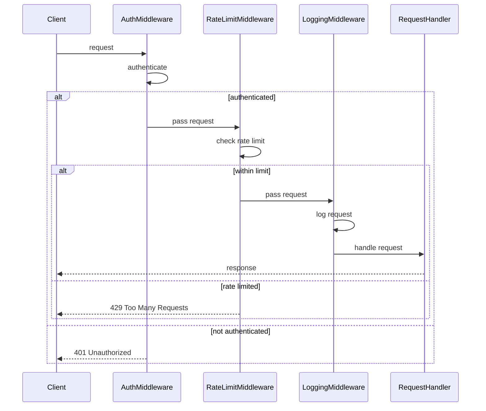
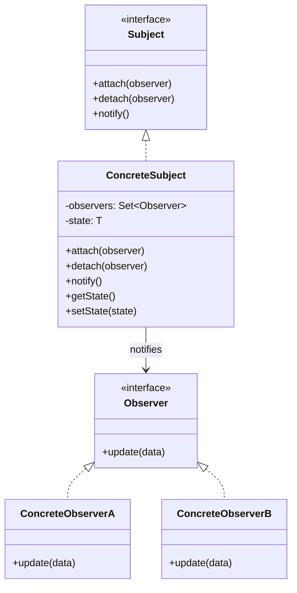
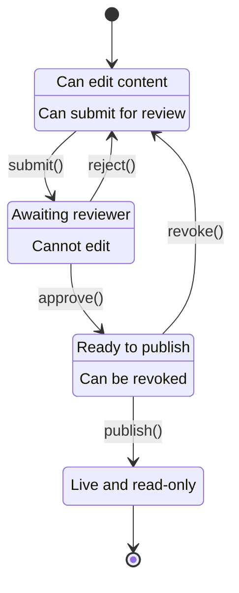

# TypeScript Behavioral Design Patterns

> Patterns for object collaboration and communication

Behavioral patterns are concerned with algorithms and the assignment of responsibilities between objects. They describe patterns of communication between objects.

---

## Table of Contents

1. [Pattern Selection Guide](#pattern-selection-guide)
2. [Chain of Responsibility](#chain-of-responsibility)
3. [Command](#command)
4. [Iterator](#iterator)
5. [Mediator](#mediator)
6. [Memento](#memento)
7. [Observer](#observer)
8. [State](#state)
9. [Strategy](#strategy)
10. [Template Method](#template-method)
11. [Visitor](#visitor)
12. [Interview Questions](#interview-questions)
13. [Quick Reference](#quick-reference)

---

## Pattern Selection Guide

### Decision Tree

```
Need to manage object behavior?
│
├── Pass request along a chain until handled? → Chain of Responsibility
│
├── Encapsulate actions as objects? → Command
│
├── Traverse collection without exposing internals? → Iterator
│
├── Reduce coupling between components? → Mediator
│
├── Save and restore object state? → Memento
│
├── Notify multiple objects of changes? → Observer
│
├── Change behavior based on internal state? → State
│
├── Select algorithm at runtime? → Strategy
│
├── Define algorithm skeleton with varying steps? → Template Method
│
└── Add operations without changing classes? → Visitor
```

### Quick Decision Table

| Pattern | Use When | Key Benefit |
|---------|----------|-------------|
| Chain of Responsibility | Multiple handlers, unknown which handles | Decoupling |
| Command | Queue, log, or undo operations | Encapsulation |
| Iterator | Sequential access to collection | Abstraction |
| Mediator | Complex object interactions | Loose coupling |
| Memento | Undo/redo functionality | State preservation |
| Observer | Event-driven communication | Notification |
| State | Behavior changes with state | State encapsulation |
| Strategy | Interchangeable algorithms | Flexibility |
| Template Method | Algorithm with varying steps | Code reuse |
| Visitor | Operations on object structures | Extensibility |

---

## Chain of Responsibility

Pass requests along a chain of handlers. Each handler decides either to process the request or pass it to the next handler.



### When to Use

- Multiple objects may handle a request
- Handler isn't known in advance
- Want to issue request without specifying receiver
- Middleware pattern

### Middleware Pattern

```typescript
// Handler interface
interface Middleware<T> {
    setNext(handler: Middleware<T>): Middleware<T>;
    handle(request: T): T | null;
}

// Abstract handler
abstract class BaseMiddleware<T> implements Middleware<T> {
    private nextHandler: Middleware<T> | null = null;

    setNext(handler: Middleware<T>): Middleware<T> {
        this.nextHandler = handler;
        return handler; // For chaining
    }

    handle(request: T): T | null {
        if (this.nextHandler) {
            return this.nextHandler.handle(request);
        }
        return request;
    }
}

// Request type
interface HttpRequest {
    headers: Record<string, string>;
    body: unknown;
    user?: { id: string; role: string };
    path: string;
    method: string;
}

// Concrete handlers
class AuthenticationMiddleware extends BaseMiddleware<HttpRequest> {
    handle(request: HttpRequest): HttpRequest | null {
        const token = request.headers["authorization"];

        if (!token) {
            console.log("[Auth] No token provided - request rejected");
            return null;
        }

        // Simulate token validation
        if (token.startsWith("Bearer ")) {
            request.user = { id: "user-123", role: "admin" };
            console.log("[Auth] User authenticated");
            return super.handle(request);
        }

        console.log("[Auth] Invalid token");
        return null;
    }
}

class AuthorizationMiddleware extends BaseMiddleware<HttpRequest> {
    constructor(private requiredRole: string) {
        super();
    }

    handle(request: HttpRequest): HttpRequest | null {
        if (!request.user) {
            console.log("[AuthZ] No user - request rejected");
            return null;
        }

        if (request.user.role !== this.requiredRole) {
            console.log(`[AuthZ] User role ${request.user.role} doesn't match required ${this.requiredRole}`);
            return null;
        }

        console.log("[AuthZ] User authorized");
        return super.handle(request);
    }
}

class LoggingMiddleware extends BaseMiddleware<HttpRequest> {
    handle(request: HttpRequest): HttpRequest | null {
        console.log(`[Log] ${request.method} ${request.path}`);
        const result = super.handle(request);
        console.log(`[Log] Request ${result ? "completed" : "failed"}`);
        return result;
    }
}

class RateLimitMiddleware extends BaseMiddleware<HttpRequest> {
    private requests = new Map<string, number[]>();
    private limit: number;
    private windowMs: number;

    constructor(limit = 100, windowMs = 60000) {
        super();
        this.limit = limit;
        this.windowMs = windowMs;
    }

    handle(request: HttpRequest): HttpRequest | null {
        const key = request.headers["x-forwarded-for"] || "unknown";
        const now = Date.now();
        const windowStart = now - this.windowMs;

        const timestamps = (this.requests.get(key) || [])
            .filter(t => t > windowStart);

        if (timestamps.length >= this.limit) {
            console.log("[RateLimit] Too many requests");
            return null;
        }

        timestamps.push(now);
        this.requests.set(key, timestamps);
        console.log(`[RateLimit] ${timestamps.length}/${this.limit} requests`);
        return super.handle(request);
    }
}

// Build chain
const logging = new LoggingMiddleware();
const rateLimit = new RateLimitMiddleware(5, 10000);
const auth = new AuthenticationMiddleware();
const authz = new AuthorizationMiddleware("admin");

logging
    .setNext(rateLimit)
    .setNext(auth)
    .setNext(authz);

// Usage
const request: HttpRequest = {
    headers: { authorization: "Bearer valid-token" },
    body: { data: "test" },
    path: "/api/admin/users",
    method: "GET",
};

const result = logging.handle(request);
console.log("Final result:", result);
```

### Validation Chain

```typescript
// Validation result
interface ValidationResult {
    valid: boolean;
    errors: string[];
}

// Validator interface
interface Validator<T> {
    setNext(validator: Validator<T>): Validator<T>;
    validate(data: T): ValidationResult;
}

// Abstract validator
abstract class BaseValidator<T> implements Validator<T> {
    private next: Validator<T> | null = null;

    setNext(validator: Validator<T>): Validator<T> {
        this.next = validator;
        return validator;
    }

    validate(data: T): ValidationResult {
        const result = this.doValidate(data);

        if (!result.valid) {
            return result;
        }

        if (this.next) {
            const nextResult = this.next.validate(data);
            return {
                valid: nextResult.valid,
                errors: [...result.errors, ...nextResult.errors],
            };
        }

        return result;
    }

    protected abstract doValidate(data: T): ValidationResult;
}

// User registration data
interface RegistrationData {
    username: string;
    email: string;
    password: string;
    age: number;
}

// Concrete validators
class UsernameValidator extends BaseValidator<RegistrationData> {
    protected doValidate(data: RegistrationData): ValidationResult {
        const errors: string[] = [];

        if (data.username.length < 3) {
            errors.push("Username must be at least 3 characters");
        }

        if (!/^[a-zA-Z0-9_]+$/.test(data.username)) {
            errors.push("Username can only contain letters, numbers, and underscores");
        }

        return { valid: errors.length === 0, errors };
    }
}

class EmailValidator extends BaseValidator<RegistrationData> {
    protected doValidate(data: RegistrationData): ValidationResult {
        const errors: string[] = [];
        const emailRegex = /^[^\s@]+@[^\s@]+\.[^\s@]+$/;

        if (!emailRegex.test(data.email)) {
            errors.push("Invalid email format");
        }

        return { valid: errors.length === 0, errors };
    }
}

class PasswordValidator extends BaseValidator<RegistrationData> {
    protected doValidate(data: RegistrationData): ValidationResult {
        const errors: string[] = [];

        if (data.password.length < 8) {
            errors.push("Password must be at least 8 characters");
        }

        if (!/[A-Z]/.test(data.password)) {
            errors.push("Password must contain at least one uppercase letter");
        }

        if (!/[0-9]/.test(data.password)) {
            errors.push("Password must contain at least one number");
        }

        return { valid: errors.length === 0, errors };
    }
}

class AgeValidator extends BaseValidator<RegistrationData> {
    protected doValidate(data: RegistrationData): ValidationResult {
        const errors: string[] = [];

        if (data.age < 18) {
            errors.push("Must be at least 18 years old");
        }

        if (data.age > 120) {
            errors.push("Invalid age");
        }

        return { valid: errors.length === 0, errors };
    }
}

// Build validation chain
const usernameValidator = new UsernameValidator();
const emailValidator = new EmailValidator();
const passwordValidator = new PasswordValidator();
const ageValidator = new AgeValidator();

usernameValidator
    .setNext(emailValidator)
    .setNext(passwordValidator)
    .setNext(ageValidator);

// Usage
const registration: RegistrationData = {
    username: "jo",
    email: "invalid-email",
    password: "weak",
    age: 15,
};

const result = usernameValidator.validate(registration);
console.log(result);
// { valid: false, errors: ["Username must be at least 3 characters", ...] }
```

---

## Command

Encapsulate a request as an object, allowing you to parameterize clients with different requests, queue or log requests, and support undoable operations.

### When to Use

- Parameterize objects with actions
- Queue operations for later execution
- Support undo/redo
- Log changes for recovery

### Command with Undo/Redo

```typescript
// Command interface
interface Command {
    execute(): void;
    undo(): void;
    getDescription(): string;
}

// Receiver
class TextEditor {
    private content = "";
    private cursorPosition = 0;

    getContent(): string {
        return this.content;
    }

    getCursor(): number {
        return this.cursorPosition;
    }

    insertText(text: string, position: number): void {
        this.content =
            this.content.slice(0, position) +
            text +
            this.content.slice(position);
        this.cursorPosition = position + text.length;
    }

    deleteText(start: number, length: number): string {
        const deleted = this.content.slice(start, start + length);
        this.content = this.content.slice(0, start) + this.content.slice(start + length);
        this.cursorPosition = start;
        return deleted;
    }

    setCursor(position: number): void {
        this.cursorPosition = Math.min(Math.max(0, position), this.content.length);
    }
}

// Concrete commands
class InsertTextCommand implements Command {
    private previousCursor: number = 0;

    constructor(
        private editor: TextEditor,
        private text: string,
        private position: number
    ) {}

    execute(): void {
        this.previousCursor = this.editor.getCursor();
        this.editor.insertText(this.text, this.position);
    }

    undo(): void {
        this.editor.deleteText(this.position, this.text.length);
        this.editor.setCursor(this.previousCursor);
    }

    getDescription(): string {
        return `Insert "${this.text}" at position ${this.position}`;
    }
}

class DeleteTextCommand implements Command {
    private deletedText = "";
    private previousCursor: number = 0;

    constructor(
        private editor: TextEditor,
        private start: number,
        private length: number
    ) {}

    execute(): void {
        this.previousCursor = this.editor.getCursor();
        this.deletedText = this.editor.deleteText(this.start, this.length);
    }

    undo(): void {
        this.editor.insertText(this.deletedText, this.start);
        this.editor.setCursor(this.previousCursor);
    }

    getDescription(): string {
        return `Delete ${this.length} characters at position ${this.start}`;
    }
}

// Invoker - manages command history
class CommandManager {
    private history: Command[] = [];
    private redoStack: Command[] = [];

    execute(command: Command): void {
        command.execute();
        this.history.push(command);
        this.redoStack = []; // Clear redo stack on new command
        console.log(`Executed: ${command.getDescription()}`);
    }

    undo(): void {
        const command = this.history.pop();
        if (command) {
            command.undo();
            this.redoStack.push(command);
            console.log(`Undone: ${command.getDescription()}`);
        }
    }

    redo(): void {
        const command = this.redoStack.pop();
        if (command) {
            command.execute();
            this.history.push(command);
            console.log(`Redone: ${command.getDescription()}`);
        }
    }

    getHistory(): string[] {
        return this.history.map(cmd => cmd.getDescription());
    }
}

// Usage
const editor = new TextEditor();
const manager = new CommandManager();

manager.execute(new InsertTextCommand(editor, "Hello", 0));
console.log(editor.getContent()); // "Hello"

manager.execute(new InsertTextCommand(editor, " World", 5));
console.log(editor.getContent()); // "Hello World"

manager.execute(new DeleteTextCommand(editor, 5, 6));
console.log(editor.getContent()); // "Hello"

manager.undo();
console.log(editor.getContent()); // "Hello World"

manager.undo();
console.log(editor.getContent()); // "Hello"

manager.redo();
console.log(editor.getContent()); // "Hello World"
```

### Macro Command

```typescript
// Macro command - executes multiple commands
class MacroCommand implements Command {
    private commands: Command[] = [];

    add(command: Command): this {
        this.commands.push(command);
        return this;
    }

    execute(): void {
        this.commands.forEach(cmd => cmd.execute());
    }

    undo(): void {
        // Undo in reverse order
        [...this.commands].reverse().forEach(cmd => cmd.undo());
    }

    getDescription(): string {
        return `Macro: [${this.commands.map(c => c.getDescription()).join(", ")}]`;
    }
}

// Usage - create reusable macros
const formatParagraph = new MacroCommand()
    .add(new InsertTextCommand(editor, "\n\n", 0))
    .add(new InsertTextCommand(editor, "  ", 2)); // Indent

manager.execute(formatParagraph);
```

---

## Iterator

Provide a way to access elements of a collection sequentially without exposing its underlying representation.

### When to Use

- Access collection without exposing internals
- Support multiple traversals simultaneously
- Provide uniform interface for different collections

### Custom Iterator

```typescript
// Iterator interface
interface Iterator<T> {
    hasNext(): boolean;
    next(): T;
    current(): T;
    reset(): void;
}

// Iterable interface
interface IterableCollection<T> {
    createIterator(): Iterator<T>;
}

// Concrete collection
class TreeNode<T> {
    children: TreeNode<T>[] = [];

    constructor(public value: T) {}

    add(child: TreeNode<T>): void {
        this.children.push(child);
    }
}

class Tree<T> implements IterableCollection<T> {
    constructor(public root: TreeNode<T>) {}

    createIterator(): Iterator<T> {
        return new BreadthFirstIterator(this.root);
    }

    createDepthFirstIterator(): Iterator<T> {
        return new DepthFirstIterator(this.root);
    }
}

// Breadth-first iterator
class BreadthFirstIterator<T> implements Iterator<T> {
    private queue: TreeNode<T>[] = [];
    private currentNode: TreeNode<T>;

    constructor(private root: TreeNode<T>) {
        this.currentNode = root;
        this.reset();
    }

    hasNext(): boolean {
        return this.queue.length > 0;
    }

    next(): T {
        if (!this.hasNext()) {
            throw new Error("No more elements");
        }

        this.currentNode = this.queue.shift()!;
        this.queue.push(...this.currentNode.children);
        return this.currentNode.value;
    }

    current(): T {
        return this.currentNode.value;
    }

    reset(): void {
        this.queue = [this.root];
        this.currentNode = this.root;
    }
}

// Depth-first iterator
class DepthFirstIterator<T> implements Iterator<T> {
    private stack: TreeNode<T>[] = [];
    private currentNode: TreeNode<T>;

    constructor(private root: TreeNode<T>) {
        this.currentNode = root;
        this.reset();
    }

    hasNext(): boolean {
        return this.stack.length > 0;
    }

    next(): T {
        if (!this.hasNext()) {
            throw new Error("No more elements");
        }

        this.currentNode = this.stack.pop()!;
        // Add children in reverse order for correct traversal
        for (let i = this.currentNode.children.length - 1; i >= 0; i--) {
            this.stack.push(this.currentNode.children[i]);
        }
        return this.currentNode.value;
    }

    current(): T {
        return this.currentNode.value;
    }

    reset(): void {
        this.stack = [this.root];
        this.currentNode = this.root;
    }
}

// Usage
const root = new TreeNode(1);
const child1 = new TreeNode(2);
const child2 = new TreeNode(3);
const child3 = new TreeNode(4);
const child4 = new TreeNode(5);

root.add(child1);
root.add(child2);
child1.add(child3);
child1.add(child4);

const tree = new Tree(root);

console.log("Breadth-first:");
const bfs = tree.createIterator();
while (bfs.hasNext()) {
    console.log(bfs.next()); // 1, 2, 3, 4, 5
}

console.log("Depth-first:");
const dfs = tree.createDepthFirstIterator();
while (dfs.hasNext()) {
    console.log(dfs.next()); // 1, 2, 4, 5, 3
}
```

### Generator-Based Iterator

```typescript
// Using TypeScript/JavaScript generators
class Collection<T> {
    constructor(private items: T[]) {}

    // Generator function
    *[Symbol.iterator](): Generator<T> {
        for (const item of this.items) {
            yield item;
        }
    }

    // Custom iteration methods
    *filter(predicate: (item: T) => boolean): Generator<T> {
        for (const item of this.items) {
            if (predicate(item)) {
                yield item;
            }
        }
    }

    *map<U>(fn: (item: T) => U): Generator<U> {
        for (const item of this.items) {
            yield fn(item);
        }
    }

    *take(n: number): Generator<T> {
        let count = 0;
        for (const item of this.items) {
            if (count >= n) break;
            yield item;
            count++;
        }
    }
}

// Usage
const collection = new Collection([1, 2, 3, 4, 5, 6, 7, 8, 9, 10]);

// Use with for...of
for (const item of collection) {
    console.log(item);
}

// Chain operations
const result = [...collection.filter(x => x % 2 === 0)]; // [2, 4, 6, 8, 10]
const mapped = [...collection.map(x => x * 2)];          // [2, 4, 6, ...]
const first3 = [...collection.take(3)];                   // [1, 2, 3]

// Async iterator
class AsyncCollection<T> {
    constructor(private items: T[]) {}

    async *[Symbol.asyncIterator](): AsyncGenerator<T> {
        for (const item of this.items) {
            // Simulate async operation
            await new Promise(resolve => setTimeout(resolve, 100));
            yield item;
        }
    }
}

// Usage with for await...of
async function main(): Promise<void> {
    const asyncCollection = new AsyncCollection([1, 2, 3]);

    for await (const item of asyncCollection) {
        console.log(item);
    }
}
```

---

## Mediator

Define an object that encapsulates how a set of objects interact. Mediator promotes loose coupling by keeping objects from referring to each other explicitly.

### When to Use

- Objects communicate in complex ways
- Reusing an object is difficult due to dependencies
- Want to customize behavior without subclassing

### Chat Room Mediator

```typescript
// Mediator interface
interface ChatMediator {
    sendMessage(message: string, sender: User): void;
    addUser(user: User): void;
    removeUser(user: User): void;
}

// Colleague
class User {
    constructor(
        public name: string,
        private mediator: ChatMediator
    ) {
        mediator.addUser(this);
    }

    send(message: string): void {
        console.log(`${this.name} sends: ${message}`);
        this.mediator.sendMessage(message, this);
    }

    receive(message: string, from: User): void {
        console.log(`${this.name} received from ${from.name}: ${message}`);
    }

    leave(): void {
        this.mediator.removeUser(this);
    }
}

// Concrete mediator
class ChatRoom implements ChatMediator {
    private users: User[] = [];

    addUser(user: User): void {
        this.users.push(user);
        console.log(`${user.name} joined the chat`);
    }

    removeUser(user: User): void {
        const index = this.users.indexOf(user);
        if (index > -1) {
            this.users.splice(index, 1);
            console.log(`${user.name} left the chat`);
        }
    }

    sendMessage(message: string, sender: User): void {
        this.users
            .filter(user => user !== sender)
            .forEach(user => user.receive(message, sender));
    }
}

// Usage
const chatRoom = new ChatRoom();

const alice = new User("Alice", chatRoom);
const bob = new User("Bob", chatRoom);
const charlie = new User("Charlie", chatRoom);

alice.send("Hello everyone!");
bob.send("Hi Alice!");
charlie.leave();
alice.send("Goodbye Charlie!");
```

### Event Bus Mediator

```typescript
// Type-safe event bus
type EventHandler<T = unknown> = (data: T) => void;

interface EventBus {
    subscribe<T>(event: string, handler: EventHandler<T>): () => void;
    publish<T>(event: string, data: T): void;
}

class ApplicationEventBus implements EventBus {
    private handlers = new Map<string, Set<EventHandler>>();

    subscribe<T>(event: string, handler: EventHandler<T>): () => void {
        if (!this.handlers.has(event)) {
            this.handlers.set(event, new Set());
        }
        this.handlers.get(event)!.add(handler as EventHandler);

        // Return unsubscribe function
        return () => {
            this.handlers.get(event)?.delete(handler as EventHandler);
        };
    }

    publish<T>(event: string, data: T): void {
        const eventHandlers = this.handlers.get(event);
        if (eventHandlers) {
            eventHandlers.forEach(handler => handler(data));
        }
    }
}

// Typed event definitions
interface AppEvents {
    "user:login": { userId: string; timestamp: Date };
    "user:logout": { userId: string };
    "cart:add": { productId: string; quantity: number };
    "cart:remove": { productId: string };
    "order:created": { orderId: string; total: number };
}

// Type-safe event bus wrapper
class TypedEventBus {
    private bus = new ApplicationEventBus();

    on<K extends keyof AppEvents>(
        event: K,
        handler: EventHandler<AppEvents[K]>
    ): () => void {
        return this.bus.subscribe(event, handler);
    }

    emit<K extends keyof AppEvents>(event: K, data: AppEvents[K]): void {
        this.bus.publish(event, data);
    }
}

// Component using event bus
class AuthService {
    constructor(private eventBus: TypedEventBus) {}

    login(userId: string): void {
        console.log(`User ${userId} logged in`);
        this.eventBus.emit("user:login", {
            userId,
            timestamp: new Date(),
        });
    }

    logout(userId: string): void {
        console.log(`User ${userId} logged out`);
        this.eventBus.emit("user:logout", { userId });
    }
}

class AnalyticsService {
    constructor(eventBus: TypedEventBus) {
        eventBus.on("user:login", (data) => {
            console.log(`[Analytics] User ${data.userId} logged in at ${data.timestamp}`);
        });

        eventBus.on("order:created", (data) => {
            console.log(`[Analytics] Order ${data.orderId} created, total: $${data.total}`);
        });
    }
}

class NotificationService {
    constructor(eventBus: TypedEventBus) {
        eventBus.on("order:created", (data) => {
            console.log(`[Notification] Order ${data.orderId} confirmation sent`);
        });
    }
}

// Usage
const eventBus = new TypedEventBus();
const authService = new AuthService(eventBus);
const analyticsService = new AnalyticsService(eventBus);
const notificationService = new NotificationService(eventBus);

authService.login("user-123");
eventBus.emit("order:created", { orderId: "order-456", total: 99.99 });
```

---

## Memento

Capture and externalize an object's internal state so it can be restored later, without violating encapsulation.

### When to Use

- Need undo/redo functionality
- Need to save snapshots of state
- Direct access to state would violate encapsulation

### Editor with History

```typescript
// Memento - stores state
class EditorMemento {
    constructor(
        private readonly content: string,
        private readonly cursorPosition: number,
        private readonly timestamp: Date
    ) {}

    getContent(): string {
        return this.content;
    }

    getCursorPosition(): number {
        return this.cursorPosition;
    }

    getTimestamp(): Date {
        return this.timestamp;
    }
}

// Originator - creates and restores from mementos
class Editor {
    private content = "";
    private cursorPosition = 0;

    type(text: string): void {
        this.content =
            this.content.slice(0, this.cursorPosition) +
            text +
            this.content.slice(this.cursorPosition);
        this.cursorPosition += text.length;
    }

    delete(count: number): void {
        const start = Math.max(0, this.cursorPosition - count);
        this.content =
            this.content.slice(0, start) +
            this.content.slice(this.cursorPosition);
        this.cursorPosition = start;
    }

    moveCursor(position: number): void {
        this.cursorPosition = Math.max(0, Math.min(position, this.content.length));
    }

    getContent(): string {
        return this.content;
    }

    // Create memento
    save(): EditorMemento {
        return new EditorMemento(
            this.content,
            this.cursorPosition,
            new Date()
        );
    }

    // Restore from memento
    restore(memento: EditorMemento): void {
        this.content = memento.getContent();
        this.cursorPosition = memento.getCursorPosition();
    }
}

// Caretaker - manages history
class EditorHistory {
    private history: EditorMemento[] = [];
    private currentIndex = -1;

    push(memento: EditorMemento): void {
        // Remove any "future" states when new state is added
        this.history = this.history.slice(0, this.currentIndex + 1);
        this.history.push(memento);
        this.currentIndex = this.history.length - 1;
    }

    undo(): EditorMemento | null {
        if (this.currentIndex > 0) {
            this.currentIndex--;
            return this.history[this.currentIndex];
        }
        return null;
    }

    redo(): EditorMemento | null {
        if (this.currentIndex < this.history.length - 1) {
            this.currentIndex++;
            return this.history[this.currentIndex];
        }
        return null;
    }

    getHistory(): { content: string; timestamp: Date }[] {
        return this.history.map(m => ({
            content: m.getContent(),
            timestamp: m.getTimestamp(),
        }));
    }
}

// Usage
const editor = new Editor();
const history = new EditorHistory();

// Save initial state
history.push(editor.save());

editor.type("Hello");
history.push(editor.save());

editor.type(" World");
history.push(editor.save());

editor.type("!");
history.push(editor.save());

console.log(editor.getContent()); // "Hello World!"

// Undo
const previousState = history.undo();
if (previousState) editor.restore(previousState);
console.log(editor.getContent()); // "Hello World"

const prevState2 = history.undo();
if (prevState2) editor.restore(prevState2);
console.log(editor.getContent()); // "Hello"

// Redo
const nextState = history.redo();
if (nextState) editor.restore(nextState);
console.log(editor.getContent()); // "Hello World"
```

### Game State Memento

```typescript
// Game state
interface GameState {
    level: number;
    health: number;
    score: number;
    inventory: string[];
    position: { x: number; y: number };
}

// Memento with serialization
class GameMemento {
    private readonly state: string;
    private readonly savedAt: Date;

    constructor(state: GameState) {
        this.state = JSON.stringify(state);
        this.savedAt = new Date();
    }

    getState(): GameState {
        return JSON.parse(this.state);
    }

    getSavedAt(): Date {
        return this.savedAt;
    }
}

// Originator
class Game {
    private state: GameState = {
        level: 1,
        health: 100,
        score: 0,
        inventory: [],
        position: { x: 0, y: 0 },
    };

    play(): void {
        this.state.score += Math.floor(Math.random() * 100);
        this.state.health -= Math.floor(Math.random() * 10);
        this.state.position.x += 10;
        console.log(`Playing... Score: ${this.state.score}, Health: ${this.state.health}`);
    }

    collectItem(item: string): void {
        this.state.inventory.push(item);
        console.log(`Collected: ${item}`);
    }

    levelUp(): void {
        this.state.level++;
        this.state.health = 100;
        console.log(`Level up! Now at level ${this.state.level}`);
    }

    getState(): GameState {
        return { ...this.state };
    }

    save(): GameMemento {
        console.log("Game saved!");
        return new GameMemento(this.state);
    }

    load(memento: GameMemento): void {
        this.state = memento.getState();
        console.log(`Game loaded from ${memento.getSavedAt()}`);
    }
}

// Caretaker with multiple save slots
class SaveManager {
    private saves = new Map<string, GameMemento>();

    saveGame(game: Game, slot: string): void {
        this.saves.set(slot, game.save());
    }

    loadGame(game: Game, slot: string): boolean {
        const memento = this.saves.get(slot);
        if (memento) {
            game.load(memento);
            return true;
        }
        console.log(`No save found in slot: ${slot}`);
        return false;
    }

    listSaves(): string[] {
        return Array.from(this.saves.keys());
    }
}

// Usage
const game = new Game();
const saveManager = new SaveManager();

game.play();
game.collectItem("Sword");
saveManager.saveGame(game, "checkpoint1");

game.play();
game.play();
game.levelUp();
saveManager.saveGame(game, "checkpoint2");

console.log("\nLoading checkpoint1...");
saveManager.loadGame(game, "checkpoint1");
console.log(game.getState());
```

---

## Observer

Define a one-to-many dependency between objects so that when one object changes state, all its dependents are notified and updated automatically.



### When to Use

- Changes to one object require changing others
- Object should notify others without knowing who they are
- Event-driven architectures

### Type-Safe Observer

```typescript
// Observer interface
interface Observer<T> {
    update(data: T): void;
}

// Subject interface
interface Subject<T> {
    attach(observer: Observer<T>): void;
    detach(observer: Observer<T>): void;
    notify(data: T): void;
}

// Concrete subject
class Observable<T> implements Subject<T> {
    private observers: Set<Observer<T>> = new Set();

    attach(observer: Observer<T>): void {
        this.observers.add(observer);
    }

    detach(observer: Observer<T>): void {
        this.observers.delete(observer);
    }

    notify(data: T): void {
        this.observers.forEach(observer => observer.update(data));
    }
}

// Stock price example
interface StockPrice {
    symbol: string;
    price: number;
    change: number;
    timestamp: Date;
}

class StockTicker extends Observable<StockPrice> {
    private prices = new Map<string, number>();

    updatePrice(symbol: string, price: number): void {
        const previousPrice = this.prices.get(symbol) || price;
        const change = ((price - previousPrice) / previousPrice) * 100;

        this.prices.set(symbol, price);

        this.notify({
            symbol,
            price,
            change,
            timestamp: new Date(),
        });
    }
}

// Concrete observers
class PriceDisplay implements Observer<StockPrice> {
    update(data: StockPrice): void {
        const direction = data.change >= 0 ? "+" : "";
        console.log(
            `[Display] ${data.symbol}: $${data.price.toFixed(2)} (${direction}${data.change.toFixed(2)}%)`
        );
    }
}

class PriceAlert implements Observer<StockPrice> {
    constructor(
        private symbol: string,
        private threshold: number
    ) {}

    update(data: StockPrice): void {
        if (data.symbol === this.symbol && data.price > this.threshold) {
            console.log(
                `[ALERT] ${data.symbol} exceeded $${this.threshold}! Current: $${data.price}`
            );
        }
    }
}

class TradingBot implements Observer<StockPrice> {
    update(data: StockPrice): void {
        if (data.change < -5) {
            console.log(`[Bot] BUY signal for ${data.symbol} (down ${data.change.toFixed(2)}%)`);
        } else if (data.change > 5) {
            console.log(`[Bot] SELL signal for ${data.symbol} (up ${data.change.toFixed(2)}%)`);
        }
    }
}

// Usage
const ticker = new StockTicker();

ticker.attach(new PriceDisplay());
ticker.attach(new PriceAlert("AAPL", 150));
ticker.attach(new TradingBot());

ticker.updatePrice("AAPL", 145);
ticker.updatePrice("AAPL", 152);
ticker.updatePrice("GOOGL", 2800);
```

### Using Node.js EventEmitter

```typescript
import { EventEmitter } from "events";

// Typed event emitter
interface UserEvents {
    login: [userId: string, ip: string];
    logout: [userId: string];
    purchase: [userId: string, productId: string, amount: number];
}

class TypedEventEmitter<T extends Record<string, unknown[]>> {
    private emitter = new EventEmitter();

    on<K extends keyof T & string>(
        event: K,
        listener: (...args: T[K]) => void
    ): this {
        this.emitter.on(event, listener as (...args: unknown[]) => void);
        return this;
    }

    once<K extends keyof T & string>(
        event: K,
        listener: (...args: T[K]) => void
    ): this {
        this.emitter.once(event, listener as (...args: unknown[]) => void);
        return this;
    }

    emit<K extends keyof T & string>(event: K, ...args: T[K]): boolean {
        return this.emitter.emit(event, ...args);
    }

    off<K extends keyof T & string>(
        event: K,
        listener: (...args: T[K]) => void
    ): this {
        this.emitter.off(event, listener as (...args: unknown[]) => void);
        return this;
    }
}

// Usage
const userEvents = new TypedEventEmitter<UserEvents>();

userEvents.on("login", (userId, ip) => {
    console.log(`User ${userId} logged in from ${ip}`);
});

userEvents.on("purchase", (userId, productId, amount) => {
    console.log(`User ${userId} purchased ${productId} for $${amount}`);
});

userEvents.emit("login", "user-123", "192.168.1.1");
userEvents.emit("purchase", "user-123", "prod-456", 29.99);
```

---

## State

Allow an object to alter its behavior when its internal state changes. The object will appear to change its class.



### When to Use

- Object behavior depends on state
- Operations have large switch/if-else on object state
- State transitions are complex

### Document Workflow

```typescript
// State interface
interface DocumentState {
    getName(): string;
    edit(doc: Document): void;
    review(doc: Document): void;
    approve(doc: Document): void;
    reject(doc: Document): void;
    publish(doc: Document): void;
}

// Context
class Document {
    private state: DocumentState;
    public content = "";
    public reviewComments: string[] = [];

    constructor() {
        this.state = new DraftState();
    }

    setState(state: DocumentState): void {
        console.log(`Document state changed: ${this.state.getName()} -> ${state.getName()}`);
        this.state = state;
    }

    getStateName(): string {
        return this.state.getName();
    }

    edit(): void {
        this.state.edit(this);
    }

    review(): void {
        this.state.review(this);
    }

    approve(): void {
        this.state.approve(this);
    }

    reject(): void {
        this.state.reject(this);
    }

    publish(): void {
        this.state.publish(this);
    }
}

// Concrete states
class DraftState implements DocumentState {
    getName(): string {
        return "Draft";
    }

    edit(doc: Document): void {
        console.log("Editing draft...");
        doc.content += " [edited]";
    }

    review(doc: Document): void {
        console.log("Submitting for review...");
        doc.setState(new ReviewState());
    }

    approve(): void {
        console.log("Cannot approve - document is still in draft");
    }

    reject(): void {
        console.log("Cannot reject - document is still in draft");
    }

    publish(): void {
        console.log("Cannot publish - document must be approved first");
    }
}

class ReviewState implements DocumentState {
    getName(): string {
        return "Under Review";
    }

    edit(): void {
        console.log("Cannot edit - document is under review");
    }

    review(): void {
        console.log("Document is already under review");
    }

    approve(doc: Document): void {
        console.log("Document approved!");
        doc.setState(new ApprovedState());
    }

    reject(doc: Document): void {
        console.log("Document rejected - returning to draft");
        doc.reviewComments.push("Needs revision");
        doc.setState(new DraftState());
    }

    publish(): void {
        console.log("Cannot publish - document must be approved first");
    }
}

class ApprovedState implements DocumentState {
    getName(): string {
        return "Approved";
    }

    edit(): void {
        console.log("Cannot edit - document is approved");
    }

    review(): void {
        console.log("Document is already approved");
    }

    approve(): void {
        console.log("Document is already approved");
    }

    reject(doc: Document): void {
        console.log("Revoking approval - returning to draft");
        doc.setState(new DraftState());
    }

    publish(doc: Document): void {
        console.log("Publishing document!");
        doc.setState(new PublishedState());
    }
}

class PublishedState implements DocumentState {
    getName(): string {
        return "Published";
    }

    edit(): void {
        console.log("Cannot edit published document");
    }

    review(): void {
        console.log("Document is already published");
    }

    approve(): void {
        console.log("Document is already published");
    }

    reject(): void {
        console.log("Cannot reject published document");
    }

    publish(): void {
        console.log("Document is already published");
    }
}

// Usage
const doc = new Document();
console.log(`State: ${doc.getStateName()}`); // Draft

doc.edit();     // OK
doc.publish();  // Cannot - not approved

doc.review();   // Submits for review
console.log(`State: ${doc.getStateName()}`); // Under Review

doc.edit();     // Cannot - under review
doc.reject();   // Returns to draft

doc.edit();     // OK again
doc.review();   // Resubmit
doc.approve();  // Approved!

doc.publish();  // Published!
console.log(`State: ${doc.getStateName()}`); // Published
```

### State with Discriminated Union

```typescript
// Using TypeScript discriminated unions for type-safe state
type OrderState =
    | { status: "pending"; createdAt: Date }
    | { status: "confirmed"; confirmedAt: Date }
    | { status: "shipped"; shippedAt: Date; trackingNumber: string }
    | { status: "delivered"; deliveredAt: Date }
    | { status: "cancelled"; cancelledAt: Date; reason: string };

class Order {
    private state: OrderState;

    constructor(public readonly id: string) {
        this.state = { status: "pending", createdAt: new Date() };
    }

    getState(): OrderState {
        return this.state;
    }

    confirm(): void {
        if (this.state.status !== "pending") {
            throw new Error(`Cannot confirm order in ${this.state.status} state`);
        }
        this.state = { status: "confirmed", confirmedAt: new Date() };
    }

    ship(trackingNumber: string): void {
        if (this.state.status !== "confirmed") {
            throw new Error(`Cannot ship order in ${this.state.status} state`);
        }
        this.state = {
            status: "shipped",
            shippedAt: new Date(),
            trackingNumber,
        };
    }

    deliver(): void {
        if (this.state.status !== "shipped") {
            throw new Error(`Cannot deliver order in ${this.state.status} state`);
        }
        this.state = { status: "delivered", deliveredAt: new Date() };
    }

    cancel(reason: string): void {
        if (this.state.status === "delivered" || this.state.status === "cancelled") {
            throw new Error(`Cannot cancel order in ${this.state.status} state`);
        }
        this.state = { status: "cancelled", cancelledAt: new Date(), reason };
    }

    // Type-safe state-dependent operations
    getTrackingNumber(): string | undefined {
        if (this.state.status === "shipped" || this.state.status === "delivered") {
            // TypeScript knows trackingNumber exists for shipped state
            return this.state.status === "shipped" ? this.state.trackingNumber : undefined;
        }
        return undefined;
    }
}
```

---

## Strategy

Define a family of algorithms, encapsulate each one, and make them interchangeable. Strategy lets the algorithm vary independently from clients that use it.

### When to Use

- Many related classes differ only in behavior
- Need different variants of an algorithm
- Algorithm uses data clients shouldn't know about
- Class has many conditional behaviors

### Sorting Strategies

```typescript
// Strategy interface
interface SortStrategy<T> {
    sort(data: T[]): T[];
    getName(): string;
}

// Concrete strategies
class QuickSort<T> implements SortStrategy<T> {
    constructor(private compareFn: (a: T, b: T) => number) {}

    sort(data: T[]): T[] {
        const arr = [...data];
        if (arr.length <= 1) return arr;

        const pivot = arr[Math.floor(arr.length / 2)];
        const left = arr.filter(x => this.compareFn(x, pivot) < 0);
        const middle = arr.filter(x => this.compareFn(x, pivot) === 0);
        const right = arr.filter(x => this.compareFn(x, pivot) > 0);

        return [...this.sort(left), ...middle, ...this.sort(right)];
    }

    getName(): string {
        return "QuickSort";
    }
}

class MergeSort<T> implements SortStrategy<T> {
    constructor(private compareFn: (a: T, b: T) => number) {}

    sort(data: T[]): T[] {
        const arr = [...data];
        if (arr.length <= 1) return arr;

        const mid = Math.floor(arr.length / 2);
        const left = this.sort(arr.slice(0, mid));
        const right = this.sort(arr.slice(mid));

        return this.merge(left, right);
    }

    private merge(left: T[], right: T[]): T[] {
        const result: T[] = [];
        let i = 0, j = 0;

        while (i < left.length && j < right.length) {
            if (this.compareFn(left[i], right[j]) <= 0) {
                result.push(left[i++]);
            } else {
                result.push(right[j++]);
            }
        }

        return [...result, ...left.slice(i), ...right.slice(j)];
    }

    getName(): string {
        return "MergeSort";
    }
}

class BubbleSort<T> implements SortStrategy<T> {
    constructor(private compareFn: (a: T, b: T) => number) {}

    sort(data: T[]): T[] {
        const arr = [...data];
        for (let i = 0; i < arr.length; i++) {
            for (let j = 0; j < arr.length - i - 1; j++) {
                if (this.compareFn(arr[j], arr[j + 1]) > 0) {
                    [arr[j], arr[j + 1]] = [arr[j + 1], arr[j]];
                }
            }
        }
        return arr;
    }

    getName(): string {
        return "BubbleSort";
    }
}

// Context
class Sorter<T> {
    private strategy: SortStrategy<T>;

    constructor(strategy: SortStrategy<T>) {
        this.strategy = strategy;
    }

    setStrategy(strategy: SortStrategy<T>): void {
        console.log(`Switching to ${strategy.getName()}`);
        this.strategy = strategy;
    }

    sort(data: T[]): T[] {
        console.log(`Sorting using ${this.strategy.getName()}`);
        return this.strategy.sort(data);
    }
}

// Usage
const numbers = [64, 34, 25, 12, 22, 11, 90];
const compareFn = (a: number, b: number) => a - b;

const sorter = new Sorter(new QuickSort(compareFn));
console.log(sorter.sort(numbers));

sorter.setStrategy(new MergeSort(compareFn));
console.log(sorter.sort(numbers));

// For small arrays, use simpler algorithm
sorter.setStrategy(new BubbleSort(compareFn));
console.log(sorter.sort([3, 1, 2]));
```

### Function-Based Strategy

```typescript
// Strategy as function type
type PricingStrategy = (basePrice: number, quantity: number) => number;

// Strategy implementations as functions
const regularPricing: PricingStrategy = (basePrice, quantity) => {
    return basePrice * quantity;
};

const bulkPricing: PricingStrategy = (basePrice, quantity) => {
    const discount = quantity >= 10 ? 0.1 : quantity >= 5 ? 0.05 : 0;
    return basePrice * quantity * (1 - discount);
};

const premiumPricing: PricingStrategy = (basePrice, quantity) => {
    // Premium customers get 15% off always
    return basePrice * quantity * 0.85;
};

const seasonalPricing = (seasonDiscount: number): PricingStrategy => {
    return (basePrice, quantity) => {
        return basePrice * quantity * (1 - seasonDiscount);
    };
};

// Context
class ShoppingCart {
    private items: { name: string; price: number; quantity: number }[] = [];
    private pricingStrategy: PricingStrategy = regularPricing;

    addItem(name: string, price: number, quantity: number): void {
        this.items.push({ name, price, quantity });
    }

    setPricingStrategy(strategy: PricingStrategy): void {
        this.pricingStrategy = strategy;
    }

    calculateTotal(): number {
        return this.items.reduce((total, item) => {
            return total + this.pricingStrategy(item.price, item.quantity);
        }, 0);
    }
}

// Usage
const cart = new ShoppingCart();
cart.addItem("Widget", 10, 5);
cart.addItem("Gadget", 20, 3);

console.log("Regular:", cart.calculateTotal()); // 110

cart.setPricingStrategy(bulkPricing);
console.log("Bulk:", cart.calculateTotal()); // 107.25

cart.setPricingStrategy(premiumPricing);
console.log("Premium:", cart.calculateTotal()); // 93.5

cart.setPricingStrategy(seasonalPricing(0.2)); // 20% seasonal discount
console.log("Seasonal:", cart.calculateTotal()); // 88
```

---

## Template Method

Define the skeleton of an algorithm in a method, deferring some steps to subclasses. Template Method lets subclasses redefine certain steps of an algorithm without changing its structure.

### When to Use

- Implement invariant parts of algorithm once
- Common behavior should be in one class
- Control subclass extensions

### Data Processing Template

```typescript
// Abstract class with template method
abstract class DataProcessor {
    // Template method - defines algorithm skeleton
    process(): void {
        this.readData();
        this.parseData();
        this.validateData();
        this.transformData();

        // Hook - optional step
        if (this.shouldSaveData()) {
            this.saveData();
        }

        this.cleanup();
    }

    // Abstract methods - must be implemented
    protected abstract readData(): void;
    protected abstract parseData(): void;
    protected abstract transformData(): void;
    protected abstract saveData(): void;

    // Concrete methods - common implementation
    protected validateData(): void {
        console.log("Validating data...");
    }

    protected cleanup(): void {
        console.log("Cleaning up resources...");
    }

    // Hook method - can be overridden
    protected shouldSaveData(): boolean {
        return true;
    }
}

// Concrete implementations
class CSVProcessor extends DataProcessor {
    private data: string[][] = [];

    protected readData(): void {
        console.log("Reading CSV file...");
        // Simulate reading
        this.data = [
            ["name", "age", "city"],
            ["Alice", "30", "NYC"],
            ["Bob", "25", "LA"],
        ];
    }

    protected parseData(): void {
        console.log("Parsing CSV format...");
        // Parse CSV-specific format
    }

    protected transformData(): void {
        console.log("Transforming CSV data...");
        // Transform to internal format
    }

    protected saveData(): void {
        console.log("Saving to database...");
    }
}

class JSONProcessor extends DataProcessor {
    private data: object[] = [];

    protected readData(): void {
        console.log("Reading JSON file...");
        this.data = [
            { name: "Alice", age: 30, city: "NYC" },
            { name: "Bob", age: 25, city: "LA" },
        ];
    }

    protected parseData(): void {
        console.log("Parsing JSON format...");
    }

    protected transformData(): void {
        console.log("Transforming JSON data...");
    }

    protected saveData(): void {
        console.log("Saving to JSON storage...");
    }
}

class XMLProcessor extends DataProcessor {
    protected readData(): void {
        console.log("Reading XML file...");
    }

    protected parseData(): void {
        console.log("Parsing XML format...");
    }

    protected transformData(): void {
        console.log("Transforming XML data...");
    }

    protected saveData(): void {
        console.log("Saving to XML storage...");
    }

    // Override hook - don't save
    protected shouldSaveData(): boolean {
        return false;
    }
}

// Usage
console.log("Processing CSV:");
new CSVProcessor().process();

console.log("\nProcessing JSON:");
new JSONProcessor().process();

console.log("\nProcessing XML:");
new XMLProcessor().process();
```

### React-Style Component Template

```typescript
// Component lifecycle template
abstract class Component<P, S> {
    protected props: P;
    protected state: S;

    constructor(props: P) {
        this.props = props;
        this.state = this.getInitialState();
    }

    // Template method
    mount(): string {
        this.componentWillMount();
        const html = this.render();
        this.componentDidMount();
        return html;
    }

    update(newProps: Partial<P>): string {
        const shouldUpdate = this.shouldComponentUpdate(newProps);
        if (!shouldUpdate) {
            return this.render();
        }

        this.componentWillUpdate();
        this.props = { ...this.props, ...newProps };
        const html = this.render();
        this.componentDidUpdate();
        return html;
    }

    unmount(): void {
        this.componentWillUnmount();
    }

    // Abstract methods
    protected abstract getInitialState(): S;
    protected abstract render(): string;

    // Lifecycle hooks with default implementations
    protected componentWillMount(): void {}
    protected componentDidMount(): void {}
    protected shouldComponentUpdate(_newProps: Partial<P>): boolean {
        return true;
    }
    protected componentWillUpdate(): void {}
    protected componentDidUpdate(): void {}
    protected componentWillUnmount(): void {}

    // State management
    protected setState(newState: Partial<S>): void {
        this.state = { ...this.state, ...newState };
    }
}

// Concrete component
interface ButtonProps {
    label: string;
    disabled: boolean;
}

interface ButtonState {
    clicked: boolean;
}

class Button extends Component<ButtonProps, ButtonState> {
    protected getInitialState(): ButtonState {
        return { clicked: false };
    }

    protected componentDidMount(): void {
        console.log("Button mounted");
    }

    protected shouldComponentUpdate(newProps: Partial<ButtonProps>): boolean {
        return newProps.label !== this.props.label ||
               newProps.disabled !== this.props.disabled;
    }

    protected render(): string {
        const disabled = this.props.disabled ? "disabled" : "";
        return `<button ${disabled}>${this.props.label}</button>`;
    }

    protected componentWillUnmount(): void {
        console.log("Button unmounting");
    }
}

// Usage
const button = new Button({ label: "Click me", disabled: false });
console.log(button.mount());
console.log(button.update({ label: "Updated!" }));
button.unmount();
```

---

## Visitor

Represent an operation to be performed on elements of an object structure. Visitor lets you define a new operation without changing the classes of the elements on which it operates.

### When to Use

- Object structure contains many classes
- Need to perform many distinct operations
- Classes defining structure rarely change but operations do

### AST Visitor

```typescript
// Element interface
interface ASTNode {
    accept(visitor: ASTVisitor): unknown;
}

// Concrete elements
class NumberNode implements ASTNode {
    constructor(public value: number) {}

    accept(visitor: ASTVisitor): unknown {
        return visitor.visitNumber(this);
    }
}

class BinaryOpNode implements ASTNode {
    constructor(
        public operator: "+" | "-" | "*" | "/",
        public left: ASTNode,
        public right: ASTNode
    ) {}

    accept(visitor: ASTVisitor): unknown {
        return visitor.visitBinaryOp(this);
    }
}

class UnaryOpNode implements ASTNode {
    constructor(
        public operator: "-" | "!",
        public operand: ASTNode
    ) {}

    accept(visitor: ASTVisitor): unknown {
        return visitor.visitUnaryOp(this);
    }
}

class VariableNode implements ASTNode {
    constructor(public name: string) {}

    accept(visitor: ASTVisitor): unknown {
        return visitor.visitVariable(this);
    }
}

// Visitor interface
interface ASTVisitor {
    visitNumber(node: NumberNode): unknown;
    visitBinaryOp(node: BinaryOpNode): unknown;
    visitUnaryOp(node: UnaryOpNode): unknown;
    visitVariable(node: VariableNode): unknown;
}

// Concrete visitors
class Evaluator implements ASTVisitor {
    constructor(private variables: Map<string, number>) {}

    visitNumber(node: NumberNode): number {
        return node.value;
    }

    visitBinaryOp(node: BinaryOpNode): number {
        const left = node.left.accept(this) as number;
        const right = node.right.accept(this) as number;

        switch (node.operator) {
            case "+": return left + right;
            case "-": return left - right;
            case "*": return left * right;
            case "/": return left / right;
        }
    }

    visitUnaryOp(node: UnaryOpNode): number {
        const operand = node.operand.accept(this) as number;
        return node.operator === "-" ? -operand : operand;
    }

    visitVariable(node: VariableNode): number {
        const value = this.variables.get(node.name);
        if (value === undefined) {
            throw new Error(`Unknown variable: ${node.name}`);
        }
        return value;
    }
}

class PrettyPrinter implements ASTVisitor {
    visitNumber(node: NumberNode): string {
        return node.value.toString();
    }

    visitBinaryOp(node: BinaryOpNode): string {
        const left = node.left.accept(this);
        const right = node.right.accept(this);
        return `(${left} ${node.operator} ${right})`;
    }

    visitUnaryOp(node: UnaryOpNode): string {
        const operand = node.operand.accept(this);
        return `${node.operator}${operand}`;
    }

    visitVariable(node: VariableNode): string {
        return node.name;
    }
}

class Optimizer implements ASTVisitor {
    visitNumber(node: NumberNode): ASTNode {
        return node;
    }

    visitBinaryOp(node: BinaryOpNode): ASTNode {
        const left = node.left.accept(this) as ASTNode;
        const right = node.right.accept(this) as ASTNode;

        // Constant folding
        if (left instanceof NumberNode && right instanceof NumberNode) {
            switch (node.operator) {
                case "+": return new NumberNode(left.value + right.value);
                case "-": return new NumberNode(left.value - right.value);
                case "*": return new NumberNode(left.value * right.value);
                case "/": return new NumberNode(left.value / right.value);
            }
        }

        return new BinaryOpNode(node.operator, left, right);
    }

    visitUnaryOp(node: UnaryOpNode): ASTNode {
        const operand = node.operand.accept(this) as ASTNode;

        if (operand instanceof NumberNode && node.operator === "-") {
            return new NumberNode(-operand.value);
        }

        return new UnaryOpNode(node.operator, operand);
    }

    visitVariable(node: VariableNode): ASTNode {
        return node;
    }
}

// Usage
// Expression: (x + 2) * (3 + 4)
const expr = new BinaryOpNode(
    "*",
    new BinaryOpNode("+", new VariableNode("x"), new NumberNode(2)),
    new BinaryOpNode("+", new NumberNode(3), new NumberNode(4))
);

const printer = new PrettyPrinter();
console.log("Expression:", expr.accept(printer));
// ((x + 2) * (3 + 4))

const optimizer = new Optimizer();
const optimized = expr.accept(optimizer) as ASTNode;
console.log("Optimized:", optimized.accept(printer));
// ((x + 2) * 7)

const evaluator = new Evaluator(new Map([["x", 5]]));
console.log("Result:", optimized.accept(evaluator));
// 49
```

---

## Interview Questions

### Basic Questions

**Q1: What's the difference between Strategy and State?**
- **Strategy**: Interchangeable algorithms, client chooses strategy
- **State**: Behavior changes automatically based on internal state

**Q2: When would you use Observer vs Mediator?**
- **Observer**: One-to-many notifications, loose coupling
- **Mediator**: Complex many-to-many interactions, centralized control

**Q3: Explain Command pattern with an example.**
Command encapsulates a request as an object. Example: Text editor with undo - each action (insert, delete) is a command object with execute() and undo() methods.

### Intermediate Questions

**Q4: How does Chain of Responsibility differ from Decorator?**
- **Chain of Responsibility**: One handler processes the request, others pass it along
- **Decorator**: All wrappers add behavior, building on each other

Both can form chains, but CoR is about "who handles this?" while Decorator is about "add more functionality."

**Q5: What problem does Memento solve?**
Memento captures and externalizes object state for later restoration without exposing implementation. It's essential for undo/redo, checkpointing, and state snapshots.

**Q6: Template Method vs Strategy - when to use which?**
- **Template Method**: Algorithm steps are fixed, only some steps vary (inheritance)
- **Strategy**: Entire algorithm can be swapped (composition)

Prefer Strategy for runtime flexibility; use Template Method for compile-time structure.

### Advanced Questions

**Q7: How would you implement a type-safe Event Bus in TypeScript?**

```typescript
interface Events {
    [event: string]: unknown[];
}

class TypedEventBus<T extends Events> {
    private handlers = new Map<keyof T, Set<Function>>();

    on<K extends keyof T>(event: K, handler: (...args: T[K]) => void): () => void {
        if (!this.handlers.has(event)) {
            this.handlers.set(event, new Set());
        }
        this.handlers.get(event)!.add(handler);
        return () => this.handlers.get(event)?.delete(handler);
    }

    emit<K extends keyof T>(event: K, ...args: T[K]): void {
        this.handlers.get(event)?.forEach(h => h(...args));
    }
}
```

**Q8: Visitor vs adding methods to classes - tradeoffs?**
- **Visitor**: Easy to add operations, hard to add new element types
- **Methods**: Easy to add elements, hard to add new operations

Choose Visitor when element hierarchy is stable but operations change frequently.

---

## Quick Reference

### Pattern Summary

| Pattern | Intent | Key Classes |
|---------|--------|-------------|
| Chain of Responsibility | Pass request along chain | Handler, ConcreteHandler |
| Command | Encapsulate request | Command, Invoker, Receiver |
| Iterator | Sequential access | Iterator, Iterable |
| Mediator | Centralize interactions | Mediator, Colleague |
| Memento | Save/restore state | Memento, Originator, Caretaker |
| Observer | Notify on changes | Subject, Observer |
| State | Behavior from state | State, Context |
| Strategy | Interchangeable algorithms | Strategy, Context |
| Template Method | Algorithm skeleton | AbstractClass |
| Visitor | Operations on structure | Visitor, Element |

### When to Use Each

```
Object Communication:
├── Need to notify multiple objects? → Observer
├── Complex many-to-many interactions? → Mediator
└── Request handled by one in chain? → Chain of Responsibility

Algorithm Selection:
├── Select algorithm at runtime? → Strategy
├── Algorithm skeleton with varying steps? → Template Method
└── Operations on object structure? → Visitor

State Management:
├── Save/restore object state? → Memento
├── Behavior changes with state? → State
└── Encapsulate requests for undo/queue? → Command

Collection Access:
└── Traverse without exposing internals? → Iterator
```

### TypeScript Features

| Pattern | TypeScript Feature |
|---------|-------------------|
| Chain of Responsibility | Generic handlers |
| Command | Function types |
| Iterator | Generators, Symbol.iterator |
| Mediator | Generic event types |
| Memento | JSON serialization |
| Observer | Generic Subject<T> |
| State | Discriminated unions |
| Strategy | Function types |
| Template Method | Abstract classes |
| Visitor | Method overloading |
