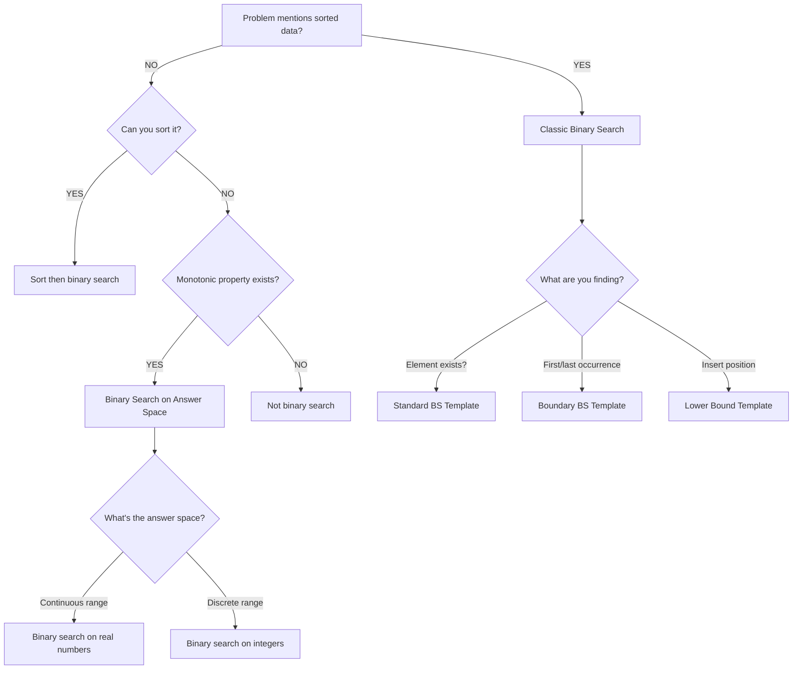

# Binary Search Pattern Drill

Master binary search through progressive practice. This fundamental pattern appears in 25%+ of technical interviews and serves as the foundation for many advanced algorithms.

## Pattern Overview

**Binary Search** efficiently locates elements or boundaries in sorted data by repeatedly halving the search space.

**Core Principle:** If you can determine which half contains your answer, you can eliminate the other half entirely.

**When to use:**
- Searching in sorted arrays
- Finding boundaries (first/last occurrence)
- Optimization problems with monotonic properties
- Searching answer space (binary search on answer)
- Finding minimum/maximum with constraints

## Pattern Recognition Flowchart



## Sub-Patterns

### 1. Classic Binary Search
**Find if element exists**

**Template:**
```python
def binary_search(arr, target):
    left, right = 0, len(arr) - 1

    while left <= right:
        mid = left + (right - left) // 2  # Prevent overflow

        if arr[mid] == target:
            return mid  # Found
        elif arr[mid] < target:
            left = mid + 1  # Search right half
        else:
            right = mid - 1  # Search left half

    return -1  # Not found
```

**Key Points:**
- Use `left + (right - left) // 2` to avoid integer overflow
- Loop condition: `left <= right` (not `<`)
- Update: `left = mid + 1` and `right = mid - 1` (not `mid`)

**Time:** O(log n), **Space:** O(1)

### 2. Find Boundary (First/Last Occurrence)
**Find leftmost or rightmost position**

**Template (Find First):**
```python
def find_first(arr, target):
    left, right = 0, len(arr) - 1
    result = -1

    while left <= right:
        mid = left + (right - left) // 2

        if arr[mid] == target:
            result = mid       # Found, but keep searching left
            right = mid - 1    # Continue to find earlier occurrence
        elif arr[mid] < target:
            left = mid + 1
        else:
            right = mid - 1

    return result
```

**Template (Find Last):**
```python
def find_last(arr, target):
    left, right = 0, len(arr) - 1
    result = -1

    while left <= right:
        mid = left + (right - left) // 2

        if arr[mid] == target:
            result = mid       # Found, but keep searching right
            left = mid + 1     # Continue to find later occurrence
        elif arr[mid] < target:
            left = mid + 1
        else:
            right = mid - 1

    return result
```

**Key Points:**
- Don't return immediately when found
- Continue searching in direction of desired boundary
- Track result throughout search

### 3. Lower/Upper Bound (STL-style)
**Find insertion position**

**Template (Lower Bound - first position ≥ target):**
```python
def lower_bound(arr, target):
    left, right = 0, len(arr)  # Note: right = len(arr), not len(arr)-1

    while left < right:  # Note: <, not <=
        mid = left + (right - left) // 2

        if arr[mid] < target:
            left = mid + 1
        else:
            right = mid  # Not mid - 1!

    return left  # Insertion position
```

**Template (Upper Bound - first position > target):**
```python
def upper_bound(arr, target):
    left, right = 0, len(arr)

    while left < right:
        mid = left + (right - left) // 2

        if arr[mid] <= target:  # Note: <=, not <
            left = mid + 1
        else:
            right = mid

    return left
```

**Key Differences from Classic:**
- `right = len(arr)` not `len(arr) - 1`
- `while left < right` not `left <= right`
- `right = mid` not `right = mid - 1`

### 4. Binary Search on Answer Space
**Search for optimal value, not array element**

**Template:**
```python
def binary_search_answer(arr, check_function):
    """
    Find minimum/maximum value that satisfies condition.
    check_function(mid) returns True if mid is valid.
    """
    left, right = min_possible, max_possible

    while left < right:
        mid = left + (right - left) // 2

        if check_function(mid):
            # mid works, try to find smaller (for minimization)
            right = mid
        else:
            # mid doesn't work, must go higher
            left = mid + 1

    return left  # Optimal answer
```

**Use cases:**
- Minimize maximum (e.g., minimize max pages per student)
- Maximize minimum (e.g., maximize min distance)
- Find threshold value

### 5. Rotated/Modified Arrays
**Binary search on rotated sorted arrays**

**Template:**
```python
def search_rotated(arr, target):
    left, right = 0, len(arr) - 1

    while left <= right:
        mid = left + (right - left) // 2

        if arr[mid] == target:
            return mid

        # Determine which half is sorted
        if arr[left] <= arr[mid]:
            # Left half is sorted
            if arr[left] <= target < arr[mid]:
                right = mid - 1  # Target in sorted left half
            else:
                left = mid + 1   # Target in unsorted right half
        else:
            # Right half is sorted
            if arr[mid] < target <= arr[right]:
                left = mid + 1   # Target in sorted right half
            else:
                right = mid - 1  # Target in unsorted left half

    return -1
```

**Key Points:**
- Identify which half is sorted
- Check if target is in sorted half
- Search appropriate half

## Problem Set

### Easy Problems (Warmup)

| ID | Problem | Time | BS Variant | Key Insight |
|----|---------|------|------------|-------------|
| E220 | Binary Search | 10min | Classic | Standard template - master this first |
| E021 | Search Insert Position | 15min | Lower Bound | Return left when not found = insertion pos |
| E020 | Find First and Last Position | 20min | Boundary | Two searches: find_first() and find_last() |
| E228 | Find Smallest Letter Greater Than Target | 15min | Upper Bound | Circular array - use modulo after search |

**Practice Goals (Easy):**
- Master classic binary search template
- Understand lower/upper bound distinction
- Handle edge cases (empty, not found, boundaries)
- Avoid off-by-one errors
- Total Time: ~60 minutes

### Medium Problems (Core Practice)

| ID | Problem | Time | BS Variant | Key Insight |
|----|---------|------|------------|-------------|
| M008 | Search in Rotated Sorted Array | 30min | Rotated | Identify sorted half, check if target in that range |
| M007 | Divide Two Integers | 25min | Answer Space | Binary search on quotient; use bit shifting for efficiency |
| M063 | Find Minimum in Rotated Sorted Array | 25min | Rotated | If arr[mid] > arr[right], min is in right half |
| M064 | Find Minimum in Rotated Sorted Array II | 30min | Rotated + Dups | With duplicates, worst case O(n) when all equal |
| M249 | Single Element in Sorted Array | 25min | Modified | Use parity: if mid even and arr[mid]=arr[mid+1], search right |
| M026 | Search a 2D Matrix | 20min | 2D Binary Search | Treat as 1D: index i → row i//n, col i%n |

**Practice Goals (Medium):**
- Handle modified sorted arrays (rotated, 2D)
- Binary search on non-array domains (answer space)
- Combine with other concepts (bit manipulation, math)
- Total Time: ~155 minutes

### Hard Problems (Mastery)

| ID | Problem | Time | BS Variant | Key Insight |
|----|---------|------|------------|-------------|
| H001 | Median of Two Sorted Arrays | 45min | Partition Search | Binary search on partition point, not elements |
| M029 | Search in Rotated Sorted Array II | 30min | Rotated + Dups | When arr[left]=arr[mid]=arr[right], can't determine sorted half - worst O(n) |
| M342 | Search in Sorted Array of Unknown Size | 25min | Infinite Array | Exponential search to find bounds: try 2, 4, 8, 16... then BS |

**Practice Goals (Hard):**
- Master partition-based binary search
- Handle worst-case scenarios with duplicates
- Combine exponential search with binary search
- Total Time: ~100 minutes

## Template Code Reference

### Template 1: Standard Binary Search

```python
def binary_search(arr, target):
    """Find index of target, or -1 if not present."""
    left, right = 0, len(arr) - 1

    while left <= right:
        mid = left + (right - left) // 2

        if arr[mid] == target:
            return mid
        elif arr[mid] < target:
            left = mid + 1
        else:
            right = mid - 1

    return -1
```

**Invariants:**
- All elements before `left` are < target
- All elements after `right` are > target
- When loop ends: `left > right` (no valid range)

### Template 2: Find Range (First and Last)

```python
def search_range(arr, target):
    """Return [first_pos, last_pos] or [-1, -1]."""

    def find_boundary(arr, target, find_first):
        left, right = 0, len(arr) - 1
        result = -1

        while left <= right:
            mid = left + (right - left) // 2

            if arr[mid] == target:
                result = mid
                if find_first:
                    right = mid - 1  # Continue left
                else:
                    left = mid + 1   # Continue right
            elif arr[mid] < target:
                left = mid + 1
            else:
                right = mid - 1

        return result

    first = find_boundary(arr, target, True)
    if first == -1:
        return [-1, -1]

    last = find_boundary(arr, target, False)
    return [first, last]
```

### Template 3: Binary Search on Answer

```python
def minimize_maximum(arr, k, feasible):
    """
    Find minimum possible value of maximum.

    Args:
        arr: Input array
        k: Constraint parameter
        feasible: Function that returns True if mid is achievable

    Returns:
        Minimum value where feasible(value) is True
    """
    left, right = min(arr), sum(arr)

    while left < right:
        mid = left + (right - left) // 2

        if feasible(mid, arr, k):
            right = mid  # mid works, try smaller
        else:
            left = mid + 1  # mid too small, need larger

    return left
```

**Example Use Case: Split Array Largest Sum**
```python
def split_array(arr, k):
    """Minimize the largest sum among k subarrays."""

    def can_split(max_sum, arr, k):
        """Check if we can split into ≤k subarrays with each sum ≤ max_sum."""
        splits = 1
        current_sum = 0

        for num in arr:
            if current_sum + num > max_sum:
                splits += 1
                current_sum = num
                if splits > k:
                    return False
            else:
                current_sum += num

        return True

    left, right = max(arr), sum(arr)

    while left < right:
        mid = left + (right - left) // 2
        if can_split(mid, arr, k):
            right = mid
        else:
            left = mid + 1

    return left
```

## Off-by-One Prevention Guide

Binary search is notorious for off-by-one errors. Here's how to avoid them:

### 1. Loop Condition: `<=` vs `<`

**Rule:** Use `left <= right` for classic search, `left < right` for lower/upper bound.

```python
# Classic: Use <= because we want to check when left == right
while left <= right:
    # This handles single-element ranges

# Lower/Upper Bound: Use < because right is exclusive
while left < right:
    # right = len(arr), not len(arr) - 1
```

### 2. Midpoint Calculation

**Rule:** Always use `left + (right - left) // 2` to prevent overflow.

```python
# WRONG (can overflow in some languages)
mid = (left + right) // 2

# CORRECT
mid = left + (right - left) // 2

# Also correct (Python-specific, biases left for even ranges)
mid = (left + right) // 2  # OK in Python (arbitrary precision)
```

### 3. Updating Pointers: Include `mid` or Not?

**Rule:** For classic BS, exclude mid (`mid + 1` or `mid - 1`). For bound search, include on one side.

```python
# Classic: Mid already checked, exclude it
if arr[mid] < target:
    left = mid + 1  # Exclude mid
else:
    right = mid - 1  # Exclude mid

# Lower Bound: Right is exclusive boundary
if arr[mid] < target:
    left = mid + 1
else:
    right = mid  # Include mid in next range
```

### 4. Initializing Right Boundary

**Rule:** Classic uses `len(arr) - 1`, bound search uses `len(arr)`.

```python
# Classic: Last valid index
right = len(arr) - 1

# Lower/Upper Bound: Exclusive upper bound
right = len(arr)
```

### 5. Return Value

**Rule:** Classic returns found index or -1. Bound search returns `left` (insertion point).

```python
# Classic: Return index or not-found indicator
return mid  # if found
return -1   # if not found

# Lower/Upper Bound: Return insertion point
return left  # Always valid (0 to len(arr))
```

## Common Mistakes & Fixes

### Mistake 1: Infinite Loop Due to Wrong Update

```python
# WRONG: Can cause infinite loop
while left < right:
    mid = (left + right) // 2
    if arr[mid] < target:
        left = mid  # BUG: If mid == left, no progress!
    else:
        right = mid - 1

# CORRECT: Always make progress
while left < right:
    mid = (left + right) // 2
    if arr[mid] < target:
        left = mid + 1  # Advance past mid
    else:
        right = mid
```

### Mistake 2: Not Handling Empty Array

```python
# WRONG: Crashes on empty input
left, right = 0, len(arr) - 1  # -1 when arr is empty!

# CORRECT: Check first
if not arr:
    return -1

left, right = 0, len(arr) - 1
```

### Mistake 3: Returning Mid Instead of Left for Insertion

```python
# WRONG: Returns -1 when not found
def search_insert(arr, target):
    left, right = 0, len(arr) - 1
    while left <= right:
        mid = (left + right) // 2
        if arr[mid] == target:
            return mid
        elif arr[mid] < target:
            left = mid + 1
        else:
            right = mid - 1
    return -1  # Should return insertion point!

# CORRECT: Return left
return left  # Left is where target should be inserted
```

### Mistake 4: Rotated Array - Not Checking Both Conditions

```python
# WRONG: Assumes left half always sorted
if arr[left] <= target < arr[mid]:
    right = mid - 1
else:
    left = mid + 1

# CORRECT: First determine WHICH half is sorted
if arr[left] <= arr[mid]:
    # Now we know left half is sorted
    if arr[left] <= target < arr[mid]:
        right = mid - 1
    else:
        left = mid + 1
else:
    # Right half is sorted
    if arr[mid] < target <= arr[right]:
        left = mid + 1
    else:
        right = mid - 1
```

## Pattern Mastery Checklist

### Level 1: Foundation (Understanding)
- [ ] Can explain binary search in plain English
- [ ] Understand why it's O(log n) not O(n)
- [ ] Can draw diagram showing search space halving
- [ ] Can identify when binary search applies vs doesn't

### Level 2: Classic Implementation
- [ ] Solve E220 (Binary Search) without hints in < 5 minutes
- [ ] Can code classic template from memory
- [ ] Handle all edge cases: empty, not found, single element
- [ ] Never make off-by-one errors

### Level 3: Boundary Search
- [ ] Solve E020 (Find First and Last) independently
- [ ] Understand why two separate searches needed
- [ ] Can explain difference between find_first and find_last
- [ ] Solve E021 (Search Insert Position) understanding lower bound

### Level 4: Modified Arrays
- [ ] Solve M008 (Rotated Array) without hints
- [ ] Can identify sorted vs unsorted half
- [ ] Solve M063 (Find Min in Rotated) understanding pivot
- [ ] Handle duplicates in M064, understand O(n) worst case

### Level 5: Answer Space Search
- [ ] Understand binary search on non-array domains
- [ ] Can formulate feasibility function for problems
- [ ] Solve "minimize maximum" / "maximize minimum" problems
- [ ] Recognize monotonic properties enabling BS

### Level 6: Mastery
- [ ] Solve H001 (Median of Two Sorted Arrays) - partition search
- [ ] Can explain when BS works and when it doesn't
- [ ] Can derive complexity: T(n) = T(n/2) + O(1) = O(log n)
- [ ] Can teach pattern to others without notes

### Level 7: Interview Ready
- [ ] Solve new binary search problems in 15-20 minutes
- [ ] Can discuss trade-offs (BS vs linear scan vs hashing)
- [ ] Can identify hidden binary search in complex problems
- [ ] Never struggle with off-by-one errors

## Common Variations Table

| Variation | Example Problem | Key Modification |
|-----------|----------------|------------------|
| **Standard Search** | E220 | Classic template |
| **Boundary (First/Last)** | E020 | Continue searching after finding target |
| **Insertion Position** | E021 | Return `left` when not found |
| **Rotated Array** | M008 | Identify sorted half first |
| **Duplicates** | M064, M029 | May degrade to O(n); handle equal elements |
| **2D Matrix** | M026 | Convert 2D index to 1D |
| **Unknown Length** | M342 | Exponential search for bounds first |
| **Answer Space** | Split Array | Binary search on possible answer values |
| **Minimize Maximum** | Various | Feasibility check with mid value |
| **Find Peak** | Find Peak Element | Modified comparison logic |

## Decision Tree: When to Use Binary Search

```
Q: Is the data sorted?
└─> YES: Classic binary search likely applicable
└─> NO: Check below

Q: Can you sort it?
└─> YES, and sorting cost acceptable: Sort then BS
└─> NO: Check below

Q: Is there a monotonic property?
   (If X works, then X+1 works, or vice versa)
└─> YES: Binary search on answer space
└─> NO: Binary search not applicable

Q: Finding first/last occurrence?
└─> Boundary binary search (two searches)

Q: Finding insertion position?
└─> Lower/upper bound template

Q: Array rotated or modified?
└─> Modified BS (identify sorted portion)

Q: Optimization problem with feasibility check?
└─> BS on answer space (minimize max / maximize min)
```

## Practice Schedule

**Week 1: Foundations**
- Day 1: E220 - Master classic template, code 5 times from memory
- Day 2: E021 - Understand lower bound, return value
- Day 3: E020 - Boundary search, find first AND last
- Day 4: Review - solve all three in < 30 minutes total

**Week 2: Modified Arrays**
- Day 1: M008 - Rotated array, understand sorted-half logic
- Day 2: M063, M064 - Find minimum in rotated arrays
- Day 3: M026 - 2D matrix search, index conversion
- Day 4: Review - can explain rotated array approach?

**Week 3: Advanced**
- Day 1: Study answer space BS - minimize maximum problems
- Day 2: M007 - Divide integers using BS (answer space)
- Day 3: M249 - Single element (modified comparison)
- Day 4: H001 - Median of two arrays (partition search)

**Week 4: Mastery**
- Day 1-2: H001 deep dive - this is the hardest BS problem
- Day 3: Mixed practice - random selection from all levels
- Day 4: Speed drill - solve E220, E021, E020, M008 in 40 min

## Additional Resources

**After completing this drill:**
1. Study [Binary Search Pattern Guide](../../strategies/patterns/binary-search.md)
2. Practice on mixed problem sets (identify BS vs other patterns)
3. Advanced topics:
   - Binary search on real numbers (precision-based termination)
   - Ternary search (for unimodal functions)
   - Exponential search (unbounded arrays)
4. Related patterns:
   - [Divide and Conquer](../../strategies/patterns/divide-and-conquer.md)
   - [Two Pointers](./two-pointers-drill.md) (for sorted arrays)

## Progress Tracking

- [ ] Completed Easy tier (4 problems)
- [ ] Completed Medium tier (6 problems)
- [ ] Completed Hard tier (3 problems)
- [ ] Can implement classic BS template from memory
- [ ] Can implement boundary search from memory
- [ ] Can solve rotated array problems without hints
- [ ] Understand answer space binary search
- [ ] Can solve new BS problems in 15-20 minutes
- [ ] Ready for interview binary search questions

---

**Strategy Reference:** [Binary Search Pattern](../../strategies/patterns/binary-search.md)

**Related Patterns:**
- [Divide and Conquer](../../strategies/patterns/divide-and-conquer.md) - BS is a D&C algorithm
- [Two Pointers](./two-pointers-drill.md) - Use on sorted arrays for pair finding
