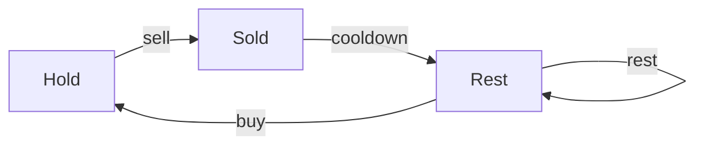

# Dynamic Programming Pattern Drill

## Purpose

This drill systematically builds your dynamic programming intuition by covering all major DP patterns. Complete these problems in order to develop a structured approach to DP problems.

## Learning Objectives

After completing this drill, you should be able to:
- Identify when a problem requires dynamic programming
- Distinguish between 1D, 2D, and state machine DP
- Choose between memoization and tabulation approaches
- Optimize space complexity from O(n²) to O(n) or O(1)
- Recognize common DP recurrence patterns

---

## Pattern Recognition Guide

### When to Use Dynamic Programming

Look for these signals:
1. **Optimal substructure**: Solution to problem depends on solutions to smaller subproblems
2. **Overlapping subproblems**: Same subproblems computed multiple times
3. **Counting/optimization keywords**: "minimum", "maximum", "number of ways", "longest", "shortest"
4. **Decision at each step**: Choose/skip, include/exclude, buy/sell

### DP Categories in This Drill

| Category | Description | Space | Examples |
|----------|-------------|-------|----------|
| **1D DP** | Single array state | O(n) | Climbing stairs, house robber |
| **2D DP** | Grid or two-sequence state | O(mn) | Unique paths, edit distance |
| **Interval DP** | Subproblems on ranges [i,j] | O(n²) | Longest palindrome substring |
| **State Machine** | Multiple states at each step | O(n×k) | Stock trading with cooldown |

---

## Memoization vs. Tabulation Comparison

### Memoization (Top-Down)
```
✓ Natural recursion flow (matches problem thinking)
✓ Only computes needed subproblems
✓ Easy to implement from recursive solution
✗ Extra space for call stack (O(n) depth)
✗ Slower due to function call overhead
```

**When to use:** Complex state transitions, not all subproblems needed

### Tabulation (Bottom-Up)
```
✓ No recursion overhead
✓ Easier to optimize space (rolling arrays)
✓ Predictable performance
✗ Must compute all subproblems
✗ Less intuitive for some problems
```

**When to use:** All subproblems needed, space optimization important

---

## Problem Set

### Section 1: 1D Dynamic Programming (4 problems)

#### 1. Climbing Stairs
- **ID**: Find in problems/easy/
- **Pattern**: 1D DP, Fibonacci-like
- **Concepts**: Base cases, recurrence relation
- **Time Target**: 10 minutes
- **Key Insight**: `dp[i] = dp[i-1] + dp[i-2]`

**Why start here:**
- Simplest DP pattern
- Clear recurrence relation
- Easy to visualize state transitions
- Can optimize to O(1) space

**State Transition:**
```
dp[i] = number of ways to reach step i
Recurrence: dp[i] = dp[i-1] + dp[i-2]
Base: dp[0] = 1, dp[1] = 1
```

---

#### 2. House Robber
- **ID**: Find in problems/easy/
- **Pattern**: 1D DP with constraint
- **Concepts**: Include/exclude decisions
- **Time Target**: 15 minutes
- **Key Insight**: `dp[i] = max(dp[i-1], dp[i-2] + nums[i])`

**Why this problem:**
- Introduces decision-making in DP
- Classic include/exclude pattern
- Teaches constraint handling

**State Transition:**
```
dp[i] = maximum money robbing houses 0..i
Recurrence: dp[i] = max(rob house i, skip house i)
           = max(dp[i-2] + nums[i], dp[i-1])
```

---

#### 3. Maximum Subarray (Kadane's Algorithm)
- **ID**: M015
- **Pattern**: 1D DP, local vs. global optimum
- **Concepts**: Greedy + DP hybrid, state compression
- **Time Target**: 20 minutes
- **Key Insight**: At each position, restart or extend current subarray

**Why this problem:**
- Elegant O(1) space solution
- Teaches local vs. global optimization
- Foundation for many array DP problems

**State Transition:**
```
current_max = best sum ending at position i
max_so_far = best sum seen anywhere
Recurrence: current_max = max(nums[i], current_max + nums[i])
            max_so_far = max(max_so_far, current_max)
```

**Space Optimization:**
- 2D approach: O(n) space to store all dp[i] values
- Kadane's: O(1) space - only track two variables

---

#### 4. Min Cost Climbing Stairs
- **ID**: M373
- **Pattern**: 1D DP with costs
- **Concepts**: Minimization, choice between two options
- **Time Target**: 15 minutes
- **Key Insight**: `dp[i] = cost[i] + min(dp[i-1], dp[i-2])`

**Why this problem:**
- Variation on climbing stairs
- Introduces cost optimization
- Practice with min instead of count

---

### Section 2: 2D Dynamic Programming - Grid Traversal (3 problems)

#### 5. Unique Paths
- **ID**: M022
- **Pattern**: 2D DP, grid counting
- **Concepts**: Base cases on edges, path accumulation
- **Time Target**: 20 minutes
- **Key Insight**: `dp[i][j] = dp[i-1][j] + dp[i][j-1]`

**Why this problem:**
- Introduction to 2D DP
- Clear base cases (first row/column)
- Foundation for grid problems

**State Transition:**
```
dp[i][j] = number of paths to reach cell (i,j)
Recurrence: dp[i][j] = dp[i-1][j] + dp[i][j-1]
Base: dp[0][j] = 1, dp[i][0] = 1
```

**Space Optimization:**
```
2D table: O(m×n)
1D array: O(n) - only need previous row
Rolling: O(min(m,n)) - use smaller dimension
```

---

#### 6. Minimum Path Sum
- **ID**: M024
- **Pattern**: 2D DP, grid optimization
- **Concepts**: Path cost minimization
- **Time Target**: 20 minutes
- **Key Insight**: `dp[i][j] = grid[i][j] + min(dp[i-1][j], dp[i][j-1])`

**Why this problem:**
- Variation on Unique Paths
- Teaches minimization in grids
- Practice with weighted paths

---

#### 7. Unique Paths II (with obstacles)
- **ID**: Find in problems/medium/
- **Pattern**: 2D DP with constraints
- **Concepts**: Conditional state transitions
- **Time Target**: 25 minutes
- **Key Insight**: Set `dp[i][j] = 0` if obstacle at (i,j)

**Why this problem:**
- Adds conditional logic to grid DP
- Handles edge cases (start/end blocked)
- More realistic path planning

---

### Section 3: 2D DP - Sequence Alignment (2 problems)

#### 8. Longest Common Subsequence
- **ID**: Find in problems/medium/ (search "longest common subsequence")
- **Pattern**: 2D DP, two sequences
- **Concepts**: Character matching, sequence comparison
- **Time Target**: 25 minutes
- **Key Insight**: If chars match: `dp[i][j] = dp[i-1][j-1] + 1`

**Why this problem:**
- Foundation for sequence alignment
- Teaches character-by-character comparison
- Prerequisite for Edit Distance

**State Transition:**
```
dp[i][j] = LCS length for s1[0..i-1] and s2[0..j-1]
If s1[i-1] == s2[j-1]:
    dp[i][j] = dp[i-1][j-1] + 1
Else:
    dp[i][j] = max(dp[i-1][j], dp[i][j-1])
```

---

#### 9. Edit Distance (Levenshtein Distance)
- **ID**: H014
- **Pattern**: 2D DP, three operations
- **Concepts**: Insert/delete/replace operations, string transformation
- **Time Target**: 30 minutes
- **Key Insight**: Three choices: `1 + min(insert, delete, replace)`

**Why this problem:**
- Classic 2D DP problem
- Three-way decision at each step
- Real-world applications (spell check, DNA alignment)

**State Transition:**
```
dp[i][j] = edit distance from word1[0..i-1] to word2[0..j-1]
If word1[i-1] == word2[j-1]:
    dp[i][j] = dp[i-1][j-1]
Else:
    dp[i][j] = 1 + min(
        dp[i][j-1],    # insert
        dp[i-1][j],    # delete
        dp[i-1][j-1]   # replace
    )
```

---

### Section 4: Interval/Substring DP (2 problems)

#### 10. Longest Palindromic Substring
- **ID**: M003
- **Pattern**: Interval DP, expand from center
- **Concepts**: Two-pointer expansion, even/odd length palindromes
- **Time Target**: 25 minutes
- **Key Insight**: Expand around center, check both odd and even lengths

**Why this problem:**
- Introduces interval DP thinking
- Two approaches: DP table vs. expand from center
- Practice with substring problems

**DP Approach:**
```
dp[i][j] = true if s[i..j] is palindrome
Recurrence:
    dp[i][j] = (s[i] == s[j]) && dp[i+1][j-1]
Base:
    dp[i][i] = true
    dp[i][i+1] = (s[i] == s[i+1])
```

---

#### 11. Palindrome Partitioning II
- **ID**: H025
- **Pattern**: Interval DP + 1D DP
- **Concepts**: Minimum cuts, combining DP approaches
- **Time Target**: 35 minutes
- **Key Insight**: Precompute palindrome table, then find min cuts

**Why this problem:**
- Combines multiple DP patterns
- Two-phase approach: preprocessing + optimization
- Advanced interval DP

---

### Section 5: State Machine DP (3 problems)

#### 12. Best Time to Buy and Sell Stock with Cooldown
- **ID**: M129
- **Pattern**: State machine DP
- **Concepts**: Multiple states per position, state transitions
- **Time Target**: 30 minutes
- **Key Insight**: Track states: holding, sold, cooldown

**Why this problem:**
- Introduction to state machine DP
- Multiple states at each step
- Models real-world constraints

**State Machine:**


**State Transition:**
```
hold[i] = max(hold[i-1], rest[i-1] - price[i])
sold[i] = hold[i-1] + price[i]
rest[i] = max(rest[i-1], sold[i-1])
```

---

#### 13. Best Time to Buy and Sell Stock IV
- **ID**: M074
- **Pattern**: State machine with transaction limit
- **Concepts**: 3D DP, transaction tracking
- **Time Target**: 40 minutes
- **Key Insight**: `dp[i][k][0/1]` = max profit at day i, k transactions, holding or not

**Why this problem:**
- Extends state machine to 3D
- Handles transaction limits
- Most general stock problem

---

#### 14. Domino and Tromino Tiling
- **ID**: M411
- **Pattern**: State machine, tile placement
- **Concepts**: Multiple tile shapes, state transitions
- **Time Target**: 35 minutes
- **Key Insight**: Track states based on how previous column ends

**Why this problem:**
- Complex state transitions
- Visual state machine
- Pattern recognition in states

---

## Practice Strategies

### First Pass (Focus on Understanding)
1. Read problem carefully, identify the DP pattern
2. Define state: What does dp[i] or dp[i][j] represent?
3. Find base cases: Smallest subproblems
4. Derive recurrence relation: How to build from smaller problems
5. Implement bottom-up or top-down
6. Test with examples

### Second Pass (Focus on Optimization)
1. Solve with 2D/1D table first
2. Identify which previous states are needed
3. Optimize space: rolling arrays, state compression
4. Measure improvement: O(n²) → O(n), O(n) → O(1)

### Pattern Recognition Practice
For each problem, identify:
- **Pattern type**: 1D, 2D, interval, state machine
- **Decision type**: Include/exclude, min/max, count
- **Dependencies**: Which subproblems does dp[i] depend on?
- **Optimization potential**: Can space be reduced?

---

## Common DP Mistakes to Avoid

### 1. Index Confusion
```python
# WRONG: dp[i] represents i+1 elements
dp[i] = dp[i-1] + nums[i]  # Off by one!

# CORRECT: Be consistent with indexing
dp[i] = dp[i-1] + nums[i-1]  # If dp[i] = first i elements
```

### 2. Missing Base Cases
```python
# WRONG: No initialization
dp = [0] * n

# CORRECT: Initialize base cases
dp[0] = nums[0]
dp[1] = max(nums[0], nums[1])
```

### 3. Wrong Direction in Tabulation
```python
# WRONG: Computing dp[i] before dp[i-1]
for i in range(n, -1, -1):  # Backwards when should be forward
    dp[i] = dp[i-1] + dp[i-2]

# CORRECT: Build from smaller to larger
for i in range(2, n):
    dp[i] = dp[i-1] + dp[i-2]
```

### 4. Not Copying in Memoization
```python
# WRONG: Returning mutable reference
memo[(i,j)] = current_list
return current_list  # Other calls modify this!

# CORRECT: Return copy
memo[(i,j)] = current_list.copy()
return memo[(i,j)]
```

---

## Complexity Reference

| Problem | Naive | DP Time | DP Space | Optimized Space |
|---------|-------|---------|----------|-----------------|
| Climbing Stairs | O(2^n) | O(n) | O(n) | O(1) |
| House Robber | O(2^n) | O(n) | O(n) | O(1) |
| Maximum Subarray | O(n²) | O(n) | O(n) | O(1) |
| Unique Paths | O(2^(m+n)) | O(mn) | O(mn) | O(n) |
| Edit Distance | O(3^(m+n)) | O(mn) | O(mn) | O(min(m,n)) |
| LCS | O(2^(m+n)) | O(mn) | O(mn) | O(min(m,n)) |
| Stock Cooldown | O(3^n) | O(n) | O(n) | O(1) |
| Stock K Trans | O(k×2^n) | O(nk) | O(nk) | O(k) |

---

## Completion Checklist

### Understanding
- [ ] Can explain when to use DP vs. greedy vs. recursion
- [ ] Can identify the DP pattern from problem description
- [ ] Can define dp[i] or dp[i][j] for any problem
- [ ] Can derive recurrence relations from scratch

### Implementation
- [ ] Comfortable with both memoization and tabulation
- [ ] Can implement 1D DP in < 10 minutes
- [ ] Can implement 2D DP in < 20 minutes
- [ ] Can optimize space complexity

### Problem-Solving
- [ ] Completed all 14 problems
- [ ] Solved each within time target
- [ ] Can explain state transitions for each
- [ ] Can draw state diagrams for state machine DP

---

## Next Steps

After completing this drill:
1. **Review mistakes**: Identify which patterns were hardest
2. **Practice variations**: Solve related problems in problems/
3. **Timed practice**: Resolve problems under time pressure
4. **Teach someone**: Explain your approach to solidify understanding

**Related Drills:**
- Backtracking Drill (pattern-drills/backtracking-drill.md)
- Graph Traversal Drill (pattern-drills/graph-drill.md)
- Two Pointers Drill (pattern-drills/two-pointers-drill.md)

**Strategy Reference:** See [Dynamic Programming Patterns](../../strategies/patterns/dynamic-programming.md)
