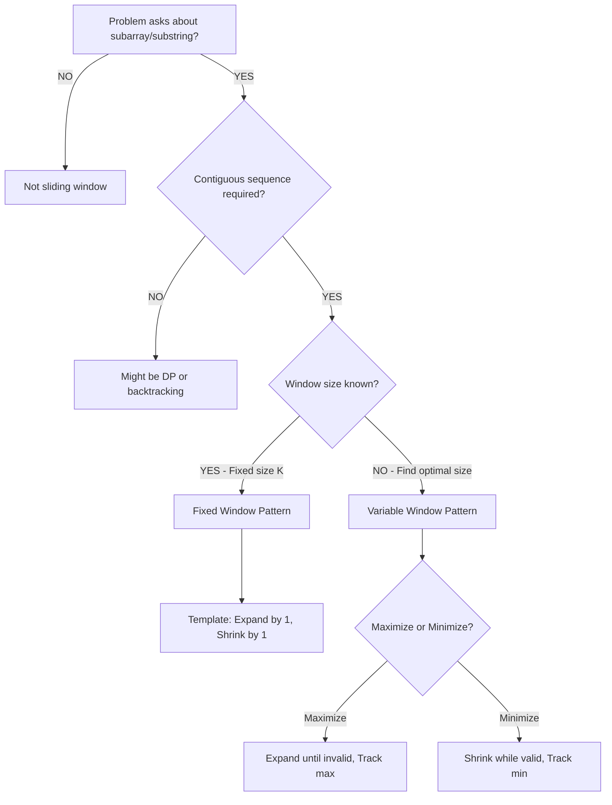

# Sliding Window Pattern Drill

Master the sliding window technique through systematic practice. This pattern appears in 15-20% of array/string interview problems and is crucial for substring and subarray optimization problems.

## Pattern Overview

**Sliding Window** maintains a range (window) of elements that satisfies certain constraints, expanding and contracting as needed to find optimal solutions.

**Core Idea:** Instead of recalculating from scratch for each subarray, maintain a window and update incrementally as you slide it.

**When to use:**
- Find longest/shortest substring with property X
- Find all subarrays with sum/product within range
- Character frequency problems
- Maximum/minimum in subarrays
- Contiguous sequence optimization

## Pattern Recognition Flowchart



## Sub-Patterns

### 1. Fixed-Size Window
**Window size K is given**

**Template:**
```python
def fixed_window(arr, k):
    if len(arr) < k:
        return None

    # Initialize first window
    window_sum = sum(arr[:k])
    result = window_sum

    # Slide window
    for i in range(k, len(arr)):
        # Add new element entering window
        window_sum += arr[i]
        # Remove element leaving window
        window_sum -= arr[i - k]

        # Update result
        result = max(result, window_sum)  # or min, or other operation

    return result
```

**Time Complexity:** O(n) - each element added/removed exactly once

**Use cases:**
- Maximum sum of K consecutive elements
- Average of K elements
- Maximum in sliding window (with deque)

### 2. Variable-Size Window (Expandable)
**Find optimal window size**

**Template:**
```python
def variable_window(arr, target):
    left = 0
    current = 0  # Window state (sum, count, etc.)
    result = 0  # or float('inf') for minimization

    for right in range(len(arr)):
        # Expand: Add arr[right] to window
        current += arr[right]

        # Shrink: Remove from left while window invalid
        while window_invalid(current, target):
            current -= arr[left]
            left += 1

        # Update result with valid window
        result = max(result, right - left + 1)  # maximization

    return result
```

**Time Complexity:** O(n) - each element added once, removed at most once

**Use cases:**
- Longest substring without repeating characters
- Minimum window substring
- Longest substring with at most K distinct characters
- Subarray sum equals K

### 3. Variable Window with Frequency Map
**Track character/element frequencies**

**Template:**
```python
def window_with_frequency(s, target):
    from collections import defaultdict

    char_count = defaultdict(int)
    left = 0
    result = 0

    for right in range(len(s)):
        # Expand: Add character
        char_count[s[right]] += 1

        # Shrink: While window violates constraint
        while violates_constraint(char_count):
            char_count[s[left]] -= 1
            if char_count[s[left]] == 0:
                del char_count[s[left]]
            left += 1

        # Update result
        result = max(result, right - left + 1)

    return result
```

**Space Complexity:** O(k) where k is unique elements in window

## Problem Set

### Easy Problems (Warmup)

| ID | Problem | Time | Window Type | Key Insight |
|----|---------|------|-------------|-------------|
| E206 | Maximum Average Subarray I | 15min | Fixed | Classic fixed window - sum of K elements |
| E213 | Longest Continuous Increasing Subsequence | 15min | Variable | Reset window on decrease; track max length |
| E220 | Binary Search | 10min | N/A | Not sliding window - included for contrast |
| E263 | Squares of Sorted Array | 15min | Two Pointers | Sometimes two pointers better than window |

**Practice Goals (Easy):**
- Understand fixed vs variable window distinction
- Master the expand-then-shrink pattern
- Handle edge cases (empty input, single element)
- Total Time: ~55 minutes

### Medium Problems (Core Practice)

| ID | Problem | Time | Window Type | Key Insight |
|----|---------|------|-------------|-------------|
| M002 | Longest Substring Without Repeating Characters | 30min | Variable + Map | Use hash map to track last seen index; jump left pointer |
| M015 | Maximum Subarray | 25min | Variable (Kadane's) | Can also use DP; window = positive prefix sum |
| M184 | Longest Repeating Character Replacement | 30min | Variable + Count | Track max frequency; window valid if (length - max_freq) ≤ K |
| M348 | Subarray Product Less Than K | 25min | Variable | Shrink while product ≥ K; count subarrays ending at right |
| M216 | Sliding Window Median | 35min | Fixed + Heaps | Use two heaps to maintain median in O(log k) per slide |
| M236 | Contiguous Array | 30min | Variable + Map | Convert 0→-1; find longest subarray with sum=0 using prefix sum |

**Practice Goals (Medium):**
- Combine sliding window with hash maps
- Handle character frequency constraints
- Understand when to expand vs when to shrink
- Count subarrays (not just find one)
- Total Time: ~175 minutes

### Hard Problems (Mastery)

| ID | Problem | Time | Window Type | Key Insight |
|----|---------|------|-------------|-------------|
| H015 | Minimum Window Substring | 40min | Variable + Map | Track required chars; shrink to minimum when all present |
| H036 | Sliding Window Maximum | 35min | Fixed + Deque | Use deque to maintain max in current window O(n) total |
| H058 | Longest Substring with At Most K Distinct | 30min | Variable + Map | Shrink when distinct count > K; similar to M002 |

**Practice Goals (Hard):**
- Optimize complex window state tracking
- Use advanced data structures (deque, heaps) with windows
- Handle multiple constraints simultaneously
- Total Time: ~105 minutes

## Template Code Reference

### Template 1: Fixed Window (Sum/Average)

```python
def max_sum_fixed_window(arr, k):
    """Find maximum sum of k consecutive elements."""
    if not arr or len(arr) < k:
        return 0

    # Initialize first window
    window_sum = sum(arr[:k])
    max_sum = window_sum

    # Slide window: add right, remove left
    for i in range(k, len(arr)):
        window_sum = window_sum + arr[i] - arr[i - k]
        max_sum = max(max_sum, window_sum)

    return max_sum
```

**Time:** O(n), **Space:** O(1)

### Template 2: Variable Window (At Most Constraint)

```python
def longest_subarray_at_most_k(arr, k):
    """Find longest subarray with sum ≤ k."""
    left = 0
    current_sum = 0
    max_length = 0

    for right in range(len(arr)):
        # Expand window
        current_sum += arr[right]

        # Shrink while invalid
        while current_sum > k:
            current_sum -= arr[left]
            left += 1

        # Update result
        max_length = max(max_length, right - left + 1)

    return max_length
```

**Time:** O(n), **Space:** O(1)

### Template 3: Variable Window with Character Frequency

```python
def longest_substring_k_distinct(s, k):
    """Find longest substring with at most K distinct characters."""
    from collections import defaultdict

    char_count = defaultdict(int)
    left = 0
    max_length = 0

    for right in range(len(s)):
        # Expand: add character
        char_count[s[right]] += 1

        # Shrink: while too many distinct
        while len(char_count) > k:
            char_count[s[left]] -= 1
            if char_count[s[left]] == 0:
                del char_count[s[left]]
            left += 1

        # Update result
        max_length = max(max_length, right - left + 1)

    return max_length
```

**Time:** O(n), **Space:** O(k)

## Edge Cases to Watch For

### 1. Empty Input
```python
# Always check
if not arr or len(arr) == 0:
    return default_value
```

### 2. Window Larger Than Array
```python
# For fixed window
if len(arr) < k:
    return None  # or appropriate value
```

### 3. All Elements Invalid
```python
# Variable window might never find valid window
# Example: all chars distinct but k=2
# Return 0 or appropriate "not found" value
```

### 4. Single Element Array
```python
# Fixed window with k=1
if k == 1:
    return max(arr)  # or handle specially

# Variable window
# Should work naturally if templates correct
```

### 5. Negative Numbers (for sum problems)
```python
# Cannot use window if negatives present!
# Example: max sum subarray with negatives → Use Kadane's
# Window shrinking doesn't guarantee improvement
```

### 6. Integer Overflow
```python
# For product problems
if product > MAX_INT:
    # Handle overflow
    pass
```

## Common Mistakes & Fixes

### Mistake 1: Not Updating Window State Correctly

```python
# WRONG: Forgetting to remove left element
for right in range(len(arr)):
    current_sum += arr[right]
    while current_sum > k:
        left += 1  # BUG: Didn't subtract arr[left-1]!

# CORRECT
for right in range(len(arr)):
    current_sum += arr[right]
    while current_sum > k:
        current_sum -= arr[left]
        left += 1
```

### Mistake 2: Off-by-One in Window Length

```python
# WRONG: Doesn't include right endpoint
window_length = right - left

# CORRECT: Both endpoints inclusive
window_length = right - left + 1
```

### Mistake 3: Updating Result at Wrong Time

```python
# WRONG: Update before window is valid
current_sum += arr[right]
max_length = max(max_length, right - left + 1)  # Might be invalid!
while current_sum > k:
    # shrink...

# CORRECT: Update after ensuring validity
current_sum += arr[right]
while current_sum > k:
    current_sum -= arr[left]
    left += 1
max_length = max(max_length, right - left + 1)  # Now valid
```

### Mistake 4: Not Handling Duplicates in Map

```python
# WRONG: Not cleaning up zero counts
char_count[s[left]] -= 1
left += 1
# char_count now has s[left-1] with count 0 → wrong distinct count!

# CORRECT: Remove zero-count entries
char_count[s[left]] -= 1
if char_count[s[left]] == 0:
    del char_count[s[left]]
left += 1
```

## Pattern Mastery Checklist

### Level 1: Recognition (Understanding)
- [ ] Can identify fixed vs variable window from problem statement
- [ ] Understand why sliding window is O(n) not O(n²)
- [ ] Can explain expand vs shrink phases
- [ ] Can draw diagram showing window movement

### Level 2: Fixed Window (Basic Implementation)
- [ ] Solve E206 (Max Average Subarray) without hints
- [ ] Can implement fixed window template from memory
- [ ] Handle edge cases: k > n, k = 1, k = n
- [ ] Understand when NOT to use fixed window

### Level 3: Variable Window (Core Skill)
- [ ] Solve M002 (Longest Substring No Repeat) independently
- [ ] Understand the "at most" vs "exactly" vs "at least" distinction
- [ ] Can choose correct while-loop shrinking condition
- [ ] Combine window with hash map/set naturally

### Level 4: Advanced Window (Complex State)
- [ ] Solve M184 (Longest Repeating Char Replacement)
- [ ] Solve M348 (Subarray Product Less Than K)
- [ ] Can count all valid subarrays (not just find longest/shortest)
- [ ] Handle multiple constraints (frequency + length)

### Level 5: Mastery (Optimization)
- [ ] Solve H015 (Minimum Window Substring)
- [ ] Solve H036 (Sliding Window Maximum with Deque)
- [ ] Can optimize brute force O(n²) to O(n) using window
- [ ] Can explain when window WON'T work (e.g., non-contiguous requirements)

### Level 6: Teaching (Deep Understanding)
- [ ] Can teach pattern to someone without notes
- [ ] Can prove why each element is added/removed at most once
- [ ] Can derive amortized complexity analysis
- [ ] Can compare/contrast with two pointers pattern

## Common Variations Table

| Variation | Example | Window Type | Special Handling |
|-----------|---------|-------------|------------------|
| **Fixed size K** | Max sum K consecutive | Fixed | Simple add/remove |
| **At most K distinct** | Longest substring ≤K chars | Variable | Shrink when distinct > K |
| **Exactly K distinct** | Substring with K chars | Variable | Two windows: at-most-K minus at-most-(K-1) |
| **No duplicates** | Longest no repeat | Variable + Set | Track last seen index |
| **Sum equals K** | Subarray sum = K | Prefix Sum + Map | Not pure window - use prefix sums |
| **Product < K** | Subarray product < K | Variable | Shrink while product ≥ K, count subarrays |
| **Count subarrays** | All subarrays with property | Variable | Add (right - left + 1) at each step |
| **With replacements** | K char replacements allowed | Variable | Track max_freq, valid if (len - max_freq) ≤ K |

## Practice Schedule

**Week 1: Foundations**
- Day 1: Understand templates - code fixed window from scratch
- Day 2: E206, E213 (easy variable windows)
- Day 3: M002 (classic variable + map) - spend time understanding
- Day 4: Review - can you solve M002 in 15 minutes?

**Week 2: Core Skills**
- Day 1: M348 (product < K) - learn counting technique
- Day 2: M184 (repeating char replacement) - frequency tracking
- Day 3: M236 (contiguous array) - prefix sum variation
- Day 4: Review all medium problems

**Week 3: Advanced**
- Day 1: H015 (minimum window substring) - hardest sliding window problem
- Day 2: H036 (window maximum with deque) - learn deque optimization
- Day 3: Mixed practice - random selection
- Day 4: Speed drill - solve M002, M348, M184 back-to-back

**Week 4: Mastery**
- Practice identifying window problems in mixed problem sets
- Time yourself: aim for 20 minutes on medium, 30 on hard
- Teach the pattern to someone or write explanation

## Decision Tree: Window vs Other Patterns

```
Q: Is it about contiguous subarray/substring?
└─> NO: Not sliding window (try DP, backtracking, etc.)
└─> YES: Continue...

Q: Do you need ALL elements or just a RANGE?
└─> ALL elements: Might be prefix sum or DP
└─> RANGE: Continue...

Q: Is window size fixed?
└─> YES: Fixed window template (easy!)
└─> NO: Continue...

Q: Maximize or minimize what?
└─> Maximize length: Expand fast, shrink when invalid
└─> Minimize length: Expand until valid, shrink while valid
└─> Count subarrays: Add (right - left + 1) each iteration

Q: What constraint?
└─> Sum/product ≤ K: Shrink while > K
└─> Distinct chars ≤ K: Shrink while distinct > K
└─> No duplicates: Shrink from left until duplicate removed
└─> Exact match (sum = K): Use prefix sum + hash map instead
```

## Additional Resources

**After completing this drill:**
1. Study [Sliding Window Pattern Guide](../../strategies/patterns/sliding-window.md)
2. Compare with Two Pointers pattern (often confused)
3. Practice mixed problems where you choose pattern
4. Try these advanced variations:
   - M067: Longest Substring with At Most Two Distinct
   - M174: Longest Substring with At Least K Repeating
   - M302: Maximum Average Subarray II (binary search + window)

## Progress Tracking

- [ ] Completed Easy tier (4 problems)
- [ ] Completed Medium tier (6 problems)
- [ ] Completed Hard tier (3 problems)
- [ ] Can identify window problems in < 30 seconds
- [ ] Can implement variable window template from memory
- [ ] Can solve new medium window problems in 20-25 minutes
- [ ] Ready for interview sliding window questions

---

**Strategy Reference:** [Sliding Window Pattern](../../strategies/patterns/sliding-window.md)

**Related Patterns:**
- [Two Pointers](./two-pointers-drill.md) - Often confused; use when pairs needed
- [Prefix Sum](../../strategies/patterns/prefix-sum.md) - For non-contiguous or exact-sum problems
