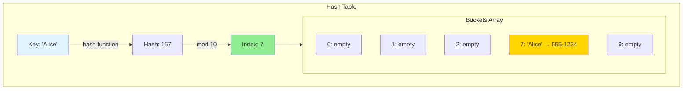
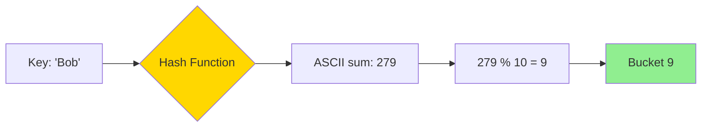
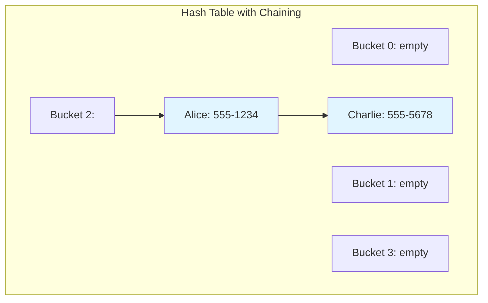
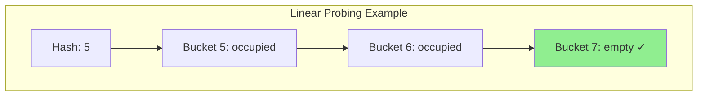
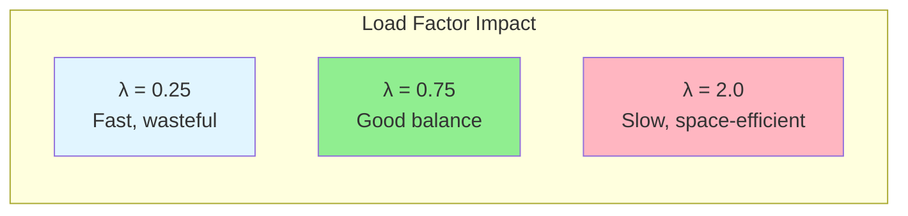
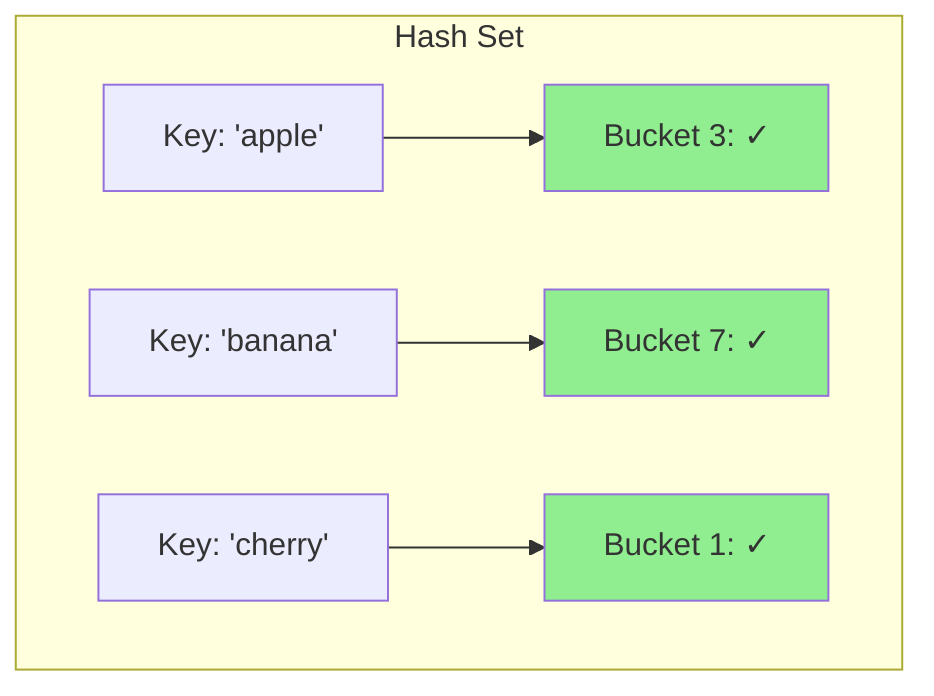
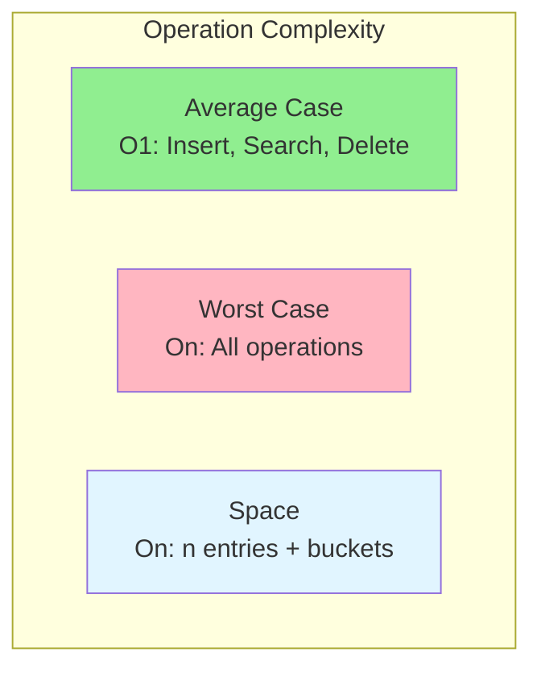

# Hash Tables

## What is a Hash Table?

A **hash table** (also called hash map, dictionary, or associative array) is a data structure that maps **keys** to **values** for highly efficient lookup, insertion, and deletion.

**Core Idea:** Use a hash function to compute an index where the value should be stored in an underlying array.

## The Phone Book Analogy

Think of a phone book:
- **Without hash table:** Linear search through every name (slow)
- **With hash table:** Jump directly to section based on first letter (fast)

The first letter acts like a "hash function" that tells you where to look!

## How Hash Tables Work



### Key Components

1. **Hash Function:** Converts key → integer
2. **Bucket Array:** Stores the key-value pairs
3. **Collision Resolution:** Handles when two keys hash to same index

## Hash Function Explained

A good hash function should:
- Be deterministic (same input → same output)
- Distribute keys uniformly across buckets
- Be fast to compute

### Example Hash Function
```
hash("Alice") = sum of ASCII values = 157
index = 157 % table_size = 157 % 10 = 7
```

### Hash Function Visualization



## Collision Handling

When two keys hash to the same index, we have a **collision**.

### Method 1: Chaining

Each bucket stores a linked list of key-value pairs.



**Process:**
1. Hash key to find bucket
2. Walk through linked list
3. Find matching key or insert new node

**Complexity:**
- Average: O(1)
- Worst case: O(n) if all keys hash to same bucket

### Method 2: Open Addressing

Store all entries in the array itself. On collision, probe for next open slot.

**Linear Probing:**
```
index = (hash + i) % size, where i = 0, 1, 2, ...
```

**Quadratic Probing:**
```
index = (hash + i²) % size
```

**Double Hashing:**
```
index = (hash1 + i × hash2) % size
```



## Time Complexity

| Operation | Average Case | Worst Case | Notes |
|-----------|-------------|------------|-------|
| Search | O(1) | O(n) | Worst: all keys hash to same bucket |
| Insert | O(1) | O(n) | May need resizing |
| Delete | O(1) | O(n) | Same as search |
| Space | O(n) | O(n) | n = number of entries |

**Key Insight:** Hash tables trade space for time. They use extra memory to achieve near-constant time operations.

## Load Factor and Resizing

**Load Factor** = number of entries / number of buckets



**When to resize:**
- Typically when load factor > 0.75
- Create new array (usually 2× size)
- Rehash all entries (expensive but amortized O(1))

## Sets as Special Case

A **set** is a hash table that stores only keys (no values).



**Use cases:**
- Checking membership: "Is x in the set?"
- Removing duplicates
- Mathematical set operations (union, intersection)

## Common Hash Table Patterns

### Pattern 1: Frequency Counting

Count occurrences of elements.

```
array: [1, 2, 2, 3, 3, 3]
map:   {1: 1, 2: 2, 3: 3}
```

**Applications:**
- Character frequency in string
- Word count
- Finding duplicates

### Pattern 2: Two Sum Problem

Find two numbers that add up to target.

```
array: [2, 7, 11, 15], target: 9
map:   {2: 0, 7: 1}  ← seen numbers with indices
When we see 7, check if (9-7=2) exists in map ✓
```

**Algorithm:**
1. For each number, check if (target - number) exists
2. Add current number to map

**Complexity:** O(n) time, O(n) space

### Pattern 3: Grouping/Bucketing

Group items by some property.

```
Anagrams: ["eat", "tea", "ate", "bat"]
map: {
  "aet": ["eat", "tea", "ate"],
  "abt": ["bat"]
}
```

**Key:** Sorted characters or frequency array

### Pattern 4: Caching/Memoization

Store computed results to avoid recomputation.

```
fibonacci(n):
  if n in cache: return cache[n]
  result = fibonacci(n-1) + fibonacci(n-2)
  cache[n] = result
  return result
```

### Pattern 5: Index Mapping

Map values to their positions.

```
array: [10, 20, 30, 40]
map:   {10: 0, 20: 1, 30: 2, 40: 3}
```

## When to Use Hash Tables

### Hash Tables Excel At:
- ✅ Fast lookup by key (O(1) average)
- ✅ Checking if element exists
- ✅ Counting frequencies
- ✅ Grouping related items
- ✅ Caching/memoization
- ✅ Finding pairs/complements

### Avoid Hash Tables When:
- ❌ Need sorted order (use TreeMap/BST)
- ❌ Need range queries (use BST)
- ❌ Need min/max efficiently (use heap)
- ❌ Memory is very limited (hash tables have overhead)
- ❌ Need to iterate in insertion order (use LinkedHashMap)

## Hash Table vs Other Structures

| Need | Structure | Time Complexity |
|------|-----------|----------------|
| Fast lookup by key | Hash Table | O(1) average |
| Sorted order | BST | O(log n) |
| Range queries | BST | O(log n + k) |
| Min/Max | Heap | O(1) peek |
| Fast index access | Array | O(1) |

## Language-Specific Implementations

### Common Names
- **Python:** `dict`, `set`
- **Java:** `HashMap`, `HashSet`, `Hashtable`
- **C++:** `unordered_map`, `unordered_set`
- **JavaScript:** `Map`, `Set`, `Object`
- **Go:** `map`

### Dictionary vs Hash Table
- **Dictionary:** Abstract concept (key-value mapping)
- **Hash Table:** Specific implementation technique
- In practice, often used interchangeably

## Real-World Applications

### 1. Database Indexing
Fast record lookup by primary key.

### 2. Caching
LRU cache, DNS cache, browser cache.

### 3. Symbol Tables
Compilers use hash tables for variable names.

### 4. Routing Tables
Network routers use hash tables for fast packet forwarding.

### 5. Spell Checkers
Dictionary of valid words stored in hash set.

## Advanced Topics (Brief Overview)

### Perfect Hashing
No collisions possible (for static sets).

### Consistent Hashing
Used in distributed systems (load balancing).

### Cryptographic Hash Functions
SHA-256, MD5 (one-way, collision-resistant).

## Common Pitfalls

1. **Using mutable objects as keys:** Keys must be immutable
2. **Poor hash function:** Leads to many collisions
3. **Not handling null keys/values:** Some implementations allow, some don't
4. **Assuming order:** Hash tables are unordered (use LinkedHashMap for order)
5. **Memory usage:** Hash tables use more memory than arrays
6. **Worst-case O(n):** Rare but possible with many collisions

## Complexity Analysis



### Why O(1) Average?

Good hash function + proper resizing → few collisions → short chains → O(1)

## Practice Strategy

Master these problems in order:

**Basic:**
1. Two Sum (complement lookup)
2. Contains Duplicate (set membership)
3. Valid Anagram (frequency counting)
4. Intersection of Two Arrays (set operations)

**Intermediate:**
5. Group Anagrams (grouping pattern)
6. Longest Substring Without Repeating Characters (sliding window + set)
7. Subarray Sum Equals K (prefix sum + map)

**Advanced:**
8. LRU Cache (hash map + doubly linked list)
9. Design Twitter (multiple hash maps)

## Key Takeaways

1. Hash tables provide **O(1) average-case** operations
2. Trade-off: Use extra space for speed
3. Critical for **frequency counting** and **fast lookup** problems
4. Understand collision handling (chaining vs open addressing)
5. Most interview problems involving "find in O(1)" use hash tables
6. Hash sets are perfect for **membership testing**

Hash tables are one of the most important data structures in computer science - master them early and use them often!
