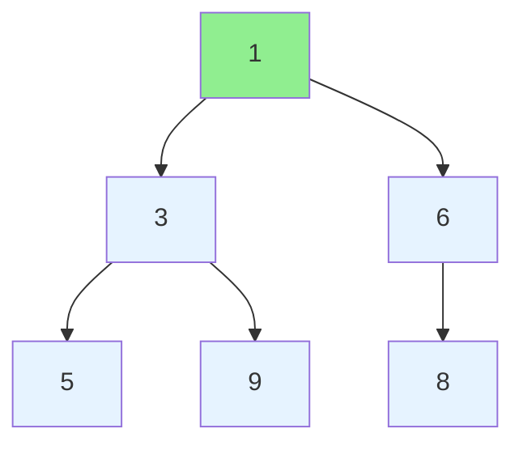

# Heaps and Priority Queues

## What is a Heap?

A **heap** is a specialized tree-based data structure that satisfies the **heap property**. While conceptually a tree, heaps are typically implemented using arrays for efficiency. The most common use case for heaps is implementing **priority queues**, where you need to efficiently access and remove the minimum (or maximum) element.

## Min-Heap vs Max-Heap

There are two types of heaps:

- **Min-Heap**: Parent nodes are always smaller than or equal to their children. The minimum element is at the root.
- **Max-Heap**: Parent nodes are always greater than or equal to their children. The maximum element is at the root.

### Heap Structure Visualization



**Min-Heap Example**: The root (1) is the smallest element, and each parent is smaller than its children.

**Array Representation**: `[1, 3, 6, 5, 9, 8]`

For any element at index `i`:
- Left child: `2*i + 1`
- Right child: `2*i + 2`
- Parent: `(i-1) // 2`

## The Heap Property Explained

The **heap property** is a simple invariant that must be maintained:

- **Min-Heap Property**: For every node `i` other than the root: `heap[parent(i)] <= heap[i]`
- **Max-Heap Property**: For every node `i` other than the root: `heap[parent(i)] >= heap[i]`

This property ensures that:
1. The root always contains the min/max element
2. No global sorting is required - only partial ordering
3. Operations can be performed efficiently

## Core Operations

### 1. Heapify (Bubble Down)

After removing the root or inserting at a wrong position, we need to restore the heap property by moving an element down the tree.

**Time Complexity**: O(log n)

**How it works**:
- Compare node with its children
- Swap with smaller child (min-heap) or larger child (max-heap)
- Repeat until heap property is satisfied

### 2. Insert (Bubble Up)

Add a new element to the heap.

**Time Complexity**: O(log n)

**How it works**:
- Add element at the end of the array
- Compare with parent and swap if needed
- Repeat until heap property is satisfied

### 3. Extract Min/Max

Remove and return the root element.

**Time Complexity**: O(log n)

**How it works**:
- Store root value to return
- Replace root with last element
- Remove last element
- Heapify down from root

### 4. Peek

Return the root without removing it.

**Time Complexity**: O(1)

## Building a Heap in O(n)

While inserting n elements one by one takes O(n log n), there's a clever way to build a heap from an unsorted array in **O(n)** time:

1. Start from the last non-leaf node (at index `n//2 - 1`)
2. Heapify each node moving backwards to the root
3. This works because leaves are already valid heaps

**Why O(n)?** Most nodes are near the bottom and require few swaps. The mathematical proof involves summing the series: Σ(h * n/2^(h+1)) where h is height.

## Common Use Cases

### 1. Top K Problems

**Problem**: Find the K largest/smallest elements from a stream or array.

**Solution**:
- Use a min-heap of size K for K largest elements
- Use a max-heap of size K for K smallest elements

**Why it works**: The heap maintains the K best elements, and the root is the threshold for inclusion.

### 2. Merge K Sorted Lists/Arrays

**Problem**: Efficiently merge K sorted lists into one sorted list.

**Solution**: Use a min-heap containing the current smallest element from each list.

**Time Complexity**: O(N log K) where N is total elements and K is number of lists.

### 3. Real-Time Median

Maintain median of a stream using two heaps:
- Max-heap for lower half
- Min-heap for upper half

### 4. Dijkstra's Shortest Path

Priority queue (heap) to always process the closest unvisited node.

### 5. Task Scheduling

Process tasks based on priority or deadline.

## Python heapq Usage

Python's `heapq` module provides a min-heap implementation:

```python
import heapq

# Create a min-heap
heap = []

# Insert elements - O(log n)
heapq.heappush(heap, 5)
heapq.heappush(heap, 3)
heapq.heappush(heap, 7)
heapq.heappush(heap, 1)

# Extract minimum - O(log n)
min_val = heapq.heappop(heap)  # Returns 1

# Peek at minimum - O(1)
min_val = heap[0]  # Don't pop, just look

# Build heap from list - O(n)
nums = [5, 3, 7, 1, 9, 2]
heapq.heapify(nums)  # nums is now [1, 3, 2, 5, 9, 7]

# Get K largest elements
k_largest = heapq.nlargest(3, nums)  # [9, 7, 5]

# Get K smallest elements
k_smallest = heapq.nsmallest(3, nums)  # [1, 2, 3]
```

### Max-Heap in Python

Since `heapq` only provides min-heap, use these techniques for max-heap:

**Option 1: Negate values**
```python
# For numbers, negate them
heap = []
heapq.heappush(heap, -5)
heapq.heappush(heap, -3)
max_val = -heapq.heappop(heap)  # Returns 5
```

**Option 2: Custom comparator with tuples**
```python
# Use tuples with negated priority
heap = []
heapq.heappush(heap, (-priority, value))
```

### Heap with Custom Objects

```python
import heapq
from dataclasses import dataclass, field
from typing import Any

@dataclass(order=True)
class PrioritizedItem:
    priority: int
    item: Any = field(compare=False)

heap = []
heapq.heappush(heap, PrioritizedItem(3, "task1"))
heapq.heappush(heap, PrioritizedItem(1, "task2"))
heapq.heappush(heap, PrioritizedItem(2, "task3"))

# Pop in priority order: task2, task3, task1
```

## When to Use Heaps

**Use a heap when**:
- You need repeated access to min/max element
- Processing elements in priority order
- K largest/smallest problems
- Merging sorted sequences

**Don't use a heap when**:
- You need to search for arbitrary elements (use hash table)
- You need all elements sorted (use sorting)
- You only need min/max once (use linear scan)
- You need to access elements in insertion order (use queue)

## Key Insights

1. **Partial ordering is enough**: Heaps don't fully sort, making them more efficient than full sorting for many problems.

2. **Array implementation**: Despite being a tree conceptually, array storage makes heaps cache-friendly and space-efficient.

3. **Versatility**: The same structure solves diverse problems from finding medians to graph algorithms.

4. **Trade-offs**: O(log n) operations vs O(1) for hash tables, but heaps maintain ordering that hash tables don't provide.

## Practice Problems

Start with these qb5 problems to master heaps:
- Top K Frequent Elements
- Kth Largest Element in an Array
- Merge K Sorted Lists
- Find Median from Data Stream
- Task Scheduler
- Meeting Rooms II
