# Stacks and Queues

## Overview

Stacks and queues are **abstract data types** that define behavior, not implementation. They're essential for managing ordered data with specific access patterns.

## Stack: Last In, First Out (LIFO)

### Real-World Examples
- Stack of plates (add/remove from top)
- Browser back button (most recent page first)
- Undo/redo functionality
- Function call stack in programming

### Visualization

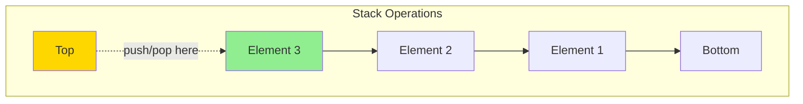

### Operations

| Operation | Description | Time Complexity |
|-----------|-------------|-----------------|
| `push(x)` | Add element to top | O(1) |
| `pop()` | Remove and return top element | O(1) |
| `peek()/top()` | View top element without removing | O(1) |
| `isEmpty()` | Check if stack is empty | O(1) |
| `size()` | Get number of elements | O(1) |

### Stack Behavior Example

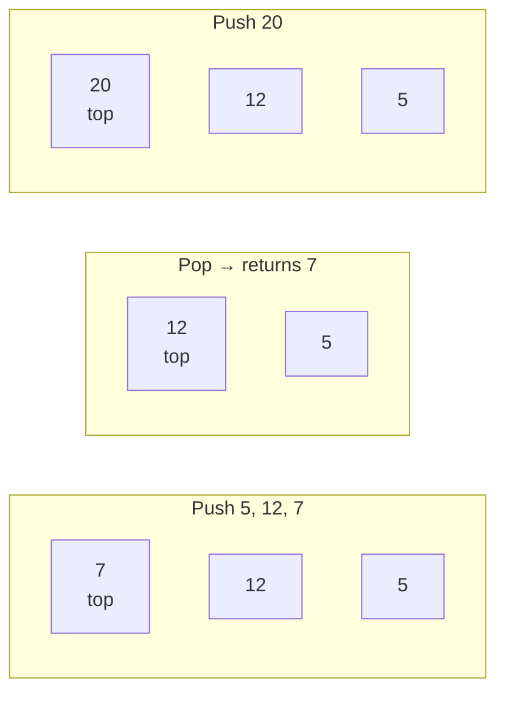

## Queue: First In, First Out (FIFO)

### Real-World Examples
- Line at a store (first person in is first served)
- Print job queue
- Breadth-First Search (BFS)
- Task scheduling

### Visualization

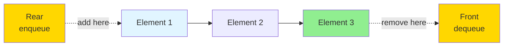

### Operations

| Operation | Description | Time Complexity |
|-----------|-------------|-----------------|
| `enqueue(x)` | Add element to rear | O(1) |
| `dequeue()` | Remove and return front element | O(1) |
| `front()/peek()` | View front element without removing | O(1) |
| `isEmpty()` | Check if queue is empty | O(1) |
| `size()` | Get number of elements | O(1) |

### Queue Behavior Example

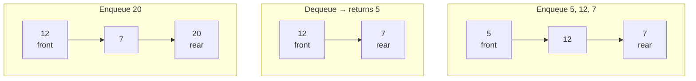

## Implementation Options

### Stack Implementation

#### Option 1: Array-Based Stack
```
push: arr[++top] = x
pop:  return arr[top--]
```
**Pros:** Simple, cache-friendly
**Cons:** Fixed capacity (or need resizing)

#### Option 2: Linked List Stack
```
push: newNode.next = head; head = newNode
pop:  value = head.data; head = head.next
```
**Pros:** No capacity limit
**Cons:** Extra memory for pointers

### Queue Implementation

#### Option 1: Array-Based (Circular)
Use circular array with front and rear pointers.

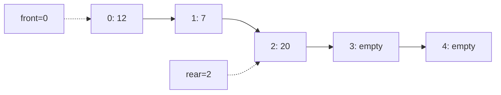

**Pros:** Cache-friendly, no pointer overhead
**Cons:** Fixed capacity (or need resizing)

#### Option 2: Linked List Queue
Maintain head (front) and tail (rear) pointers.

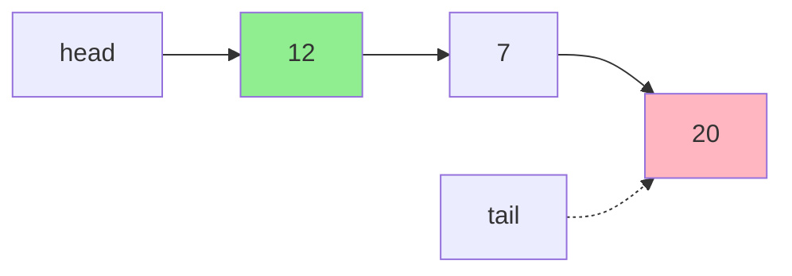

**Pros:** No capacity limit, O(1) operations
**Cons:** Extra memory for pointers

## Deque: Double-Ended Queue

A **deque** (pronounced "deck") allows insertion and deletion at both ends.

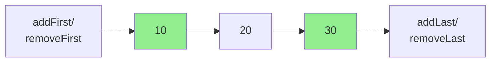

### Deque as Generalization
- Stack = Deque with operations on one end only
- Queue = Deque with enqueue at one end, dequeue at other

## Common Stack Use Cases

### 1. Parentheses Matching
Check if brackets are balanced: `{[()]}` ✓ vs `{[(])}` ✗

**Algorithm:**
- Push opening brackets
- Pop and match closing brackets
- Stack empty at end → balanced

### 2. Expression Evaluation
Convert infix to postfix or evaluate expressions.

### 3. Backtracking
DFS, path finding, puzzle solving.

### 4. Function Call Stack
How programming languages manage function calls.

### 5. Monotonic Stack
Maintain elements in monotonic order for problems like:
- Next greater element
- Largest rectangle in histogram

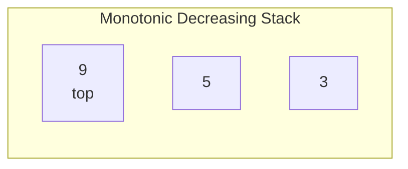

## Common Queue Use Cases

### 1. Breadth-First Search (BFS)
Level-order traversal of trees/graphs.

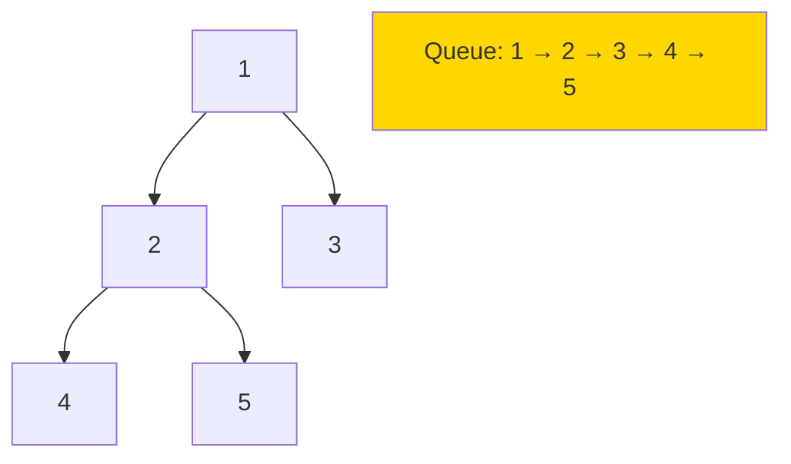

### 2. Level-Order Traversal
Process tree/graph level by level.

### 3. Task Scheduling
First-come, first-served scheduling.

### 4. Buffer Management
Managing data streams, print spoolers.

### 5. Sliding Window
When combined with deque for optimization.

## Stack vs Queue Decision Guide

| Scenario | Use This |
|----------|----------|
| Process in reverse order | Stack |
| Undo/redo functionality | Stack |
| Depth-First Search (DFS) | Stack |
| Recursion simulation | Stack |
| Process in order received | Queue |
| Breadth-First Search (BFS) | Queue |
| Level-order traversal | Queue |
| Task scheduling (FCFS) | Queue |
| Need both ends access | Deque |

## Complexity Summary

### Time Complexity
Both stack and queue (with proper implementation):
- Insert: O(1)
- Delete: O(1)
- Peek: O(1)
- Search: O(n) - not designed for search

### Space Complexity
- O(n) for n elements
- Array implementation may have wasted space if not full

## Common Patterns and Techniques

### Pattern 1: Two Stacks to Simulate Queue
Use two stacks to implement queue operations in amortized O(1).

### Pattern 2: Queue with Two Stacks
Stack 1 for enqueue, Stack 2 for dequeue.

### Pattern 3: Monotonic Stack/Queue
Maintain monotonic order for optimization:
- Next greater/smaller element
- Sliding window maximum

### Pattern 4: Stack for Parsing
Use stack to parse expressions, HTML, etc.

### Pattern 5: Queue for BFS
Standard BFS template uses queue.

## Implementation Examples

### Stack Operations Flow
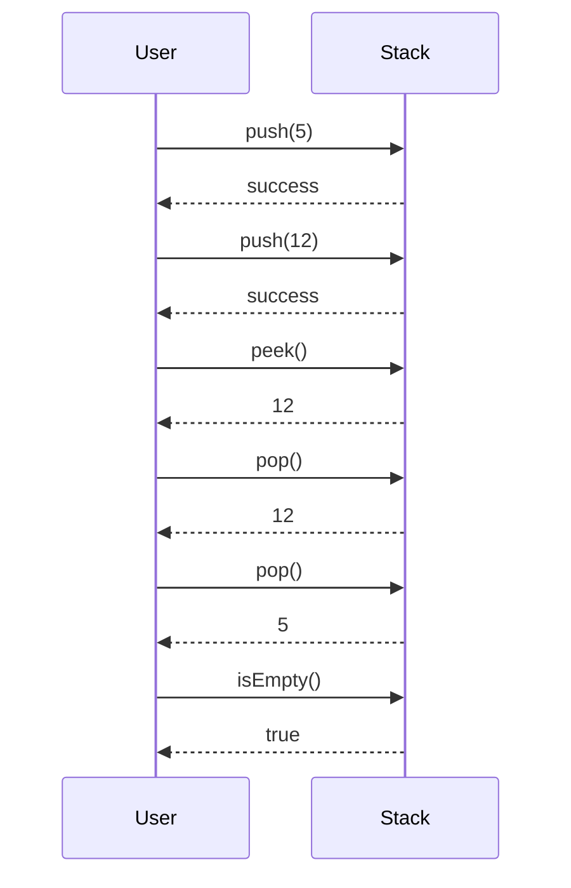

### Queue Operations Flow
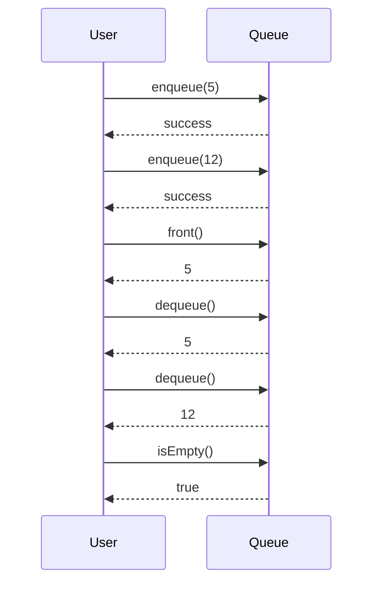

## Common Pitfalls

1. **Stack overflow**: Pushing too many elements (array-based)
2. **Queue underflow**: Dequeuing from empty queue
3. **Not checking isEmpty**: Before pop/dequeue operations
4. **Circular queue pointer arithmetic**: Getting front/rear indices wrong
5. **Memory leaks**: In linked list implementations, not freeing nodes

## Related Data Structures

### Priority Queue
Queue where elements have priorities, not FIFO order.
- Typically implemented with heap
- Used in Dijkstra's algorithm, task scheduling

### Circular Queue
Array-based queue that wraps around.
- Efficient use of array space
- Common in buffer implementations

## Practice Strategy

Master these problems in order:

**Stack:**
1. Valid Parentheses (basic stack usage)
2. Min Stack (stack with O(1) min operation)
3. Evaluate Reverse Polish Notation (expression evaluation)
4. Daily Temperatures (monotonic stack)

**Queue:**
1. Implement Queue using Stacks (understanding both structures)
2. Binary Tree Level Order Traversal (BFS)
3. Number of Recent Calls (queue for sliding window)
4. Sliding Window Maximum (monotonic deque)

**Combined:**
5. Design Browser History (stacks for back/forward)

Understanding stacks and queues is fundamental - they appear everywhere from parsing to graph algorithms to system design!
