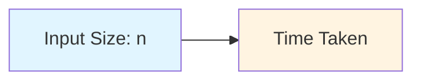

# Understanding Time Complexity

## What is Time Complexity?

Imagine you're looking for a specific book in a library. The way you search affects how long it takes:

- **Scenario 1**: The librarian tells you exactly which shelf the book is on → Takes 1 step (very fast!)
- **Scenario 2**: You check each shelf one by one → Takes as many steps as there are shelves
- **Scenario 3**: For every shelf, you check every book on it → Takes shelves × books steps (very slow!)

**Time complexity** is how we measure how long an algorithm takes to run as the input size grows. We don't measure in seconds (because computers vary in speed), but in the number of operations needed.

## Big O Notation: The Universal Language

Big O notation describes the **worst-case scenario** - how slow your algorithm could be. Think of it as a speed limit sign for your code.

### The Common Time Complexities (From Fastest to Slowest)

#### O(1) - Constant Time
**"The Flash"** - Always takes the same time, no matter the input size.

```python
def get_first_element(arr):
    return arr[0]  # Always just 1 operation
```

**Real-world analogy**: Getting a book when you know its exact location.

---

#### O(log n) - Logarithmic Time
**"The Smart Searcher"** - Cuts the problem in half each time.

```python
def binary_search(sorted_arr, target):
    left, right = 0, len(sorted_arr) - 1

    while left <= right:
        mid = (left + right) // 2
        if sorted_arr[mid] == target:
            return mid
        elif sorted_arr[mid] < target:
            left = mid + 1
        else:
            right = mid - 1
    return -1
```

**Real-world analogy**: Finding a word in a dictionary by opening to the middle, then the middle of the relevant half, etc.

---

#### O(n) - Linear Time
**"The Thorough Checker"** - Looks at each item once.

```python
def find_maximum(arr):
    max_val = arr[0]
    for num in arr:  # Checks each element once
        if num > max_val:
            max_val = num
    return max_val
```

**Real-world analogy**: Reading every page of a book to find a specific word.

---

#### O(n log n) - Linearithmic Time
**"The Efficient Organizer"** - The sweet spot for sorting.

```python
def merge_sort(arr):
    if len(arr) <= 1:
        return arr

    mid = len(arr) // 2
    left = merge_sort(arr[:mid])
    right = merge_sort(arr[mid:])

    return merge(left, right)
```

**Real-world analogy**: Organizing a deck of cards by repeatedly splitting and merging.

---

#### O(n²) - Quadratic Time
**"The Double Checker"** - For each item, checks all items.

```python
def has_duplicates(arr):
    for i in range(len(arr)):
        for j in range(len(arr)):
            if i != j and arr[i] == arr[j]:
                return True
    return False
```

**Real-world analogy**: Comparing every person's birthday with every other person's birthday to find matches.

---

#### O(2ⁿ) - Exponential Time
**"The Exponential Exploder"** - Doubles with each new element (VERY SLOW!).

```python
def fibonacci_recursive(n):
    if n <= 1:
        return n
    return fibonacci_recursive(n-1) + fibonacci_recursive(n-2)
```

**Real-world analogy**: A chain letter that asks each person to send to 2 friends, who each send to 2 friends...

---

## Visual Growth Comparison

```mermaid
%%{init: {'theme':'base'}}%%
graph TD
    subgraph "Time Complexity Growth (n = 10)"
        O1["O(1) = 1 operation<br/>⚡ Instant"]
        Ologn["O(log n) = 3 operations<br/>🚀 Very Fast"]
        On["O(n) = 10 operations<br/>✅ Fast"]
        Onlogn["O(n log n) = 33 operations<br/>👍 Good"]
        On2["O(n²) = 100 operations<br/>⚠️ Slow"]
        O2n["O(2ⁿ) = 1,024 operations<br/>❌ Very Slow"]
    end

    style O1 fill:#90EE90
    style Ologn fill:#98FB98
    style On fill:#FFFF99
    style Onlogn fill:#FFD700
    style On2 fill:#FFA500
    style O2n fill:#FF6347
```





### As Input Grows:

| Input Size | O(1) | O(log n) | O(n) | O(n log n) | O(n²) | O(2ⁿ) |
|------------|------|----------|------|------------|-------|-------|
| 10         | 1    | 3        | 10   | 33         | 100   | 1,024 |
| 100        | 1    | 7        | 100  | 664        | 10,000| 1.27×10³⁰ |
| 1,000      | 1    | 10       | 1,000| 9,966      | 1,000,000 | ∞ |

---

## Common Operations and Their Complexities

### Array Operations

```python
# O(1) - Constant Time
arr[0]                    # Access by index
arr.append(5)             # Add to end (Python list)

# O(n) - Linear Time
5 in arr                  # Search for element
arr.insert(0, 5)          # Insert at beginning
arr.remove(5)             # Remove element
max(arr)                  # Find maximum
```

### Hash Table / Dictionary Operations

```python
# O(1) average - Constant Time
hash_map[key]             # Access by key
hash_map[key] = value     # Set value
key in hash_map           # Check if key exists
del hash_map[key]         # Delete key
```

### Sorting Operations

```python
# O(n log n) - Linearithmic Time
sorted(arr)               # Python's Timsort
arr.sort()                # In-place sort

# O(n²) - Quadratic Time
bubble_sort(arr)          # Bubble sort
selection_sort(arr)       # Selection sort
```

---

## How to Analyze Code Step by Step

### Rule 1: Count the Operations

```python
def example1(arr):
    print(arr[0])        # 1 operation
    print(arr[0])        # 1 operation
    print(arr[0])        # 1 operation
    # Total: 3 operations
    # Big O: O(1) - constant, we ignore constants
```

### Rule 2: Loops Mean Multiplication

```python
def example2(arr):
    for i in arr:              # n times
        print(i)               # 1 operation
    # Total: n × 1 = n operations
    # Big O: O(n)
```

### Rule 3: Nested Loops Multiply Together

```python
def example3(arr):
    for i in arr:              # n times
        for j in arr:          # n times
            print(i, j)        # 1 operation
    # Total: n × n × 1 = n² operations
    # Big O: O(n²)
```

### Rule 4: Sequential Steps Add Up

```python
def example4(arr):
    for i in arr:              # O(n)
        print(i)

    for i in arr:              # O(n)
        print(i)

    # Total: O(n) + O(n) = O(2n)
    # Big O: O(n) - we drop constants
```

### Rule 5: Drop Non-Dominant Terms

```python
def example5(arr):
    # Step 1: O(n)
    for i in arr:
        print(i)

    # Step 2: O(n²)
    for i in arr:
        for j in arr:
            print(i, j)

    # Total: O(n) + O(n²)
    # Big O: O(n²) - n² dominates, so we drop n
```

---

## Detailed Example: Step-by-Step Analysis

```python
def find_pairs_with_sum(arr, target):
    """Find all pairs that sum to target"""

    # Step 1: Create empty list - O(1)
    pairs = []

    # Step 2: Nested loops - O(n²)
    for i in range(len(arr)):           # Outer: n times
        for j in range(i + 1, len(arr)): # Inner: n times (worst case)
            # Step 3: Check sum - O(1)
            if arr[i] + arr[j] == target:
                # Step 4: Append pair - O(1)
                pairs.append((arr[i], arr[j]))

    # Step 5: Return - O(1)
    return pairs

# Analysis:
# O(1) + O(n²) + O(1) + O(1) + O(1)
# = O(n²)  ← Final answer
```

### Better Solution with Hash Map:

```python
def find_pairs_with_sum_optimized(arr, target):
    """Find all pairs that sum to target - optimized version"""

    # Step 1: Create hash map - O(1)
    seen = set()
    pairs = []

    # Step 2: Single loop - O(n)
    for num in arr:
        complement = target - num

        # Step 3: Hash lookup - O(1)
        if complement in seen:
            pairs.append((complement, num))

        # Step 4: Add to set - O(1)
        seen.add(num)

    return pairs

# Analysis:
# O(1) + O(n) × [O(1) + O(1)]
# = O(n)  ← Much better!
```

---

## Common Mistakes to Avoid

### Mistake 1: Confusing O(n) with O(n²)

```python
# This is O(n), NOT O(n²)
def process_array(arr):
    for i in range(len(arr)):    # n times
        do_something()            # O(1) operation
    # Just because there's a range() doesn't make it O(n²)!
```

### Mistake 2: Forgetting About Hidden Loops

```python
# This is O(n²), NOT O(n)
def has_duplicate(arr):
    for num in arr:              # n times
        if arr.count(num) > 1:   # count() is O(n) - HIDDEN LOOP!
            return True
    return False
# Total: O(n) × O(n) = O(n²)
```

### Mistake 3: Not Dropping Constants

```python
# This is O(n), NOT O(3n)
def triple_loop(arr):
    for i in arr:        # O(n)
        print(i)
    for i in arr:        # O(n)
        print(i)
    for i in arr:        # O(n)
        print(i)
# Total: O(3n) = O(n) - we always drop constants!
```

### Mistake 4: Thinking All Operations are O(1)

```python
# Common operations that are NOT O(1):
arr.insert(0, x)     # O(n) - shifts all elements
arr.remove(x)        # O(n) - finds then shifts elements
arr.sort()           # O(n log n)
list(arr)            # O(n) - creates new list
arr.copy()           # O(n)
```

---

## Quick Reference Table

| Complexity | Name | Example | When Input Doubles |
|------------|------|---------|-------------------|
| O(1) | Constant | Array access, hash lookup | Same time |
| O(log n) | Logarithmic | Binary search | +1 step |
| O(n) | Linear | Simple loop, array scan | 2× time |
| O(n log n) | Linearithmic | Merge sort, quick sort | ~2× time |
| O(n²) | Quadratic | Nested loops | 4× time |
| O(n³) | Cubic | Triple nested loops | 8× time |
| O(2ⁿ) | Exponential | Recursive fibonacci | Squares time |
| O(n!) | Factorial | Permutations | Explodes! |

---

## Practice Exercises

### Exercise 1: Basic Analysis
Determine the time complexity:

```python
def mystery1(arr):
    total = 0
    for num in arr:
        total += num
    return total
```

<details>
<summary>Answer</summary>
O(n) - single loop through array
</details>

### Exercise 2: Nested Loops
Determine the time complexity:

```python
def mystery2(arr):
    for i in range(len(arr)):
        for j in range(i, len(arr)):
            print(arr[i], arr[j])
```

<details>
<summary>Answer</summary>
O(n²) - nested loops, even though inner loop is shorter on average
</details>

### Exercise 3: Multiple Steps
Determine the time complexity:

```python
def mystery3(arr):
    # Part 1
    max_val = max(arr)

    # Part 2
    for i in range(len(arr)):
        for j in range(len(arr)):
            if arr[i] + arr[j] == max_val:
                return True
    return False
```

<details>
<summary>Answer</summary>
O(n²) - max() is O(n), nested loops are O(n²), so O(n) + O(n²) = O(n²)
</details>

### Exercise 4: Hidden Complexity
Determine the time complexity:

```python
def mystery4(arr):
    result = []
    for num in arr:
        if num not in result:
            result.append(num)
    return result
```

<details>
<summary>Answer</summary>
O(n²) - 'in' operator on list is O(n), done n times = O(n²)
</details>

### Exercise 5: Optimization Challenge
How can you optimize this from O(n²) to O(n)?

```python
def find_first_duplicate(arr):
    for i in range(len(arr)):
        for j in range(i + 1, len(arr)):
            if arr[i] == arr[j]:
                return arr[i]
    return None
```

<details>
<summary>Answer</summary>

```python
def find_first_duplicate_optimized(arr):
    seen = set()
    for num in arr:
        if num in seen:
            return num
        seen.add(num)
    return None
# O(n) - single loop with O(1) set operations
```
</details>

---

## Key Takeaways

1. **Time complexity measures how runtime grows with input size**, not actual seconds
2. **Big O describes worst-case scenario** - the slowest your algorithm could be
3. **Drop constants and non-dominant terms**: O(3n²+ 5n + 2) → O(n²)
4. **Nested loops multiply**: Two nested loops = O(n²)
5. **Sequential steps add**: Two separate loops = O(n) + O(n) = O(n)
6. **Watch for hidden loops** in built-in functions like `list.count()`, `list.remove()`, `in` operator
7. **Hash tables are your friend** for optimizing from O(n²) to O(n)

Remember: The goal isn't always to get the fastest algorithm, but to understand the trade-offs and choose appropriately for your use case!
