# Trees

## What is a Tree?

A **tree** is a hierarchical data structure consisting of nodes connected by edges, with a single root node and no cycles.

Think of a family tree, file system, or organizational chart - trees naturally represent hierarchical relationships.

## Tree Terminology

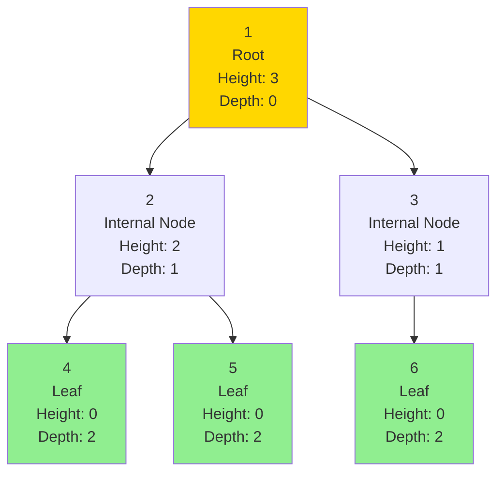

### Key Terms

- **Root:** Top node (no parent)
- **Parent:** Node with children
- **Child:** Node with a parent
- **Sibling:** Nodes with same parent
- **Leaf:** Node with no children
- **Internal Node:** Node with at least one child
- **Edge:** Connection between nodes
- **Path:** Sequence of nodes connected by edges
- **Height:** Longest path from node to leaf
- **Depth:** Distance from root to node
- **Level:** All nodes at same depth

### Important Properties

| Property | Definition | Example |
|----------|------------|---------|
| Height of tree | Height of root | 3 in diagram above |
| Depth of node | Distance from root | Node 4 has depth 2 |
| Height of node | Longest path to leaf | Node 2 has height 2 |
| Level | Set of nodes at depth d | Level 1: {2, 3} |

## Binary Trees vs N-ary Trees

### Binary Tree
Each node has **at most 2 children** (left and right).

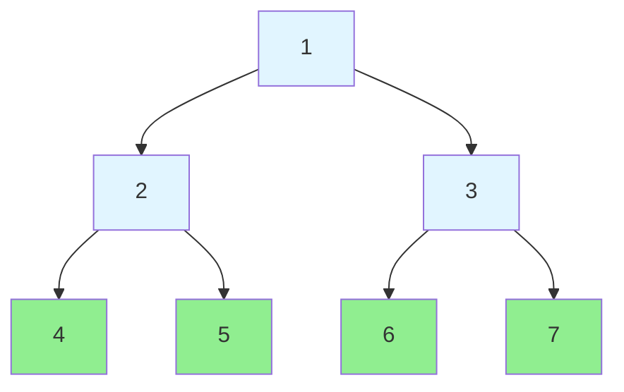

**Node Structure:**
```
class TreeNode:
    value
    left  → TreeNode
    right → TreeNode
```

### N-ary Tree
Each node can have **any number of children**.

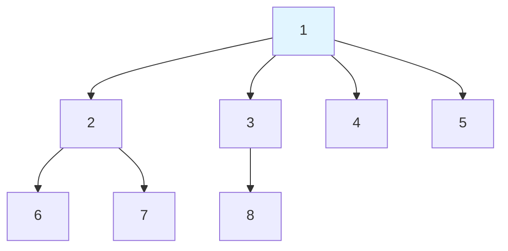

**Node Structure:**
```
class TreeNode:
    value
    children → List[TreeNode]
```

## Tree Traversals

Different ways to visit all nodes in a tree.

### 1. Depth-First Traversals (DFS)

#### Inorder (Left, Root, Right)
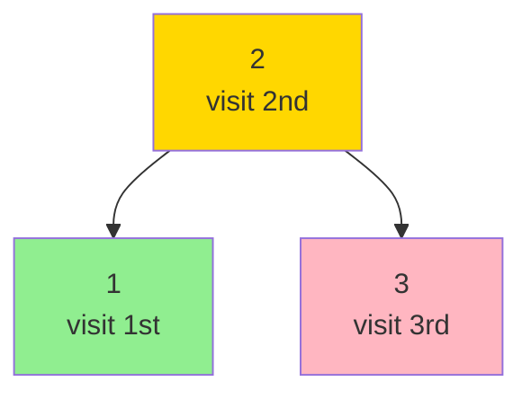

**Order:** 1 → 2 → 3
**Use:** Get sorted order in BST

#### Preorder (Root, Left, Right)
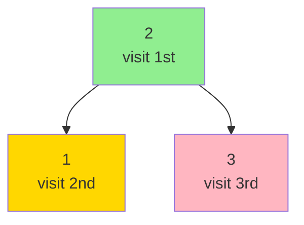

**Order:** 2 → 1 → 3
**Use:** Create copy of tree, prefix expression

#### Postorder (Left, Right, Root)
```mermaid
graph TB
    A[2<br/>visit 3rd] --> B[1<br/>visit 1st]
    A --> C[3<br/>visit 2nd]

    style A fill:#FFB6C1
    style B fill:#90EE90
    style C fill="#FFD700"
```

**Order:** 1 → 3 → 2
**Use:** Delete tree, postfix expression

### Visual Comparison of DFS Traversals

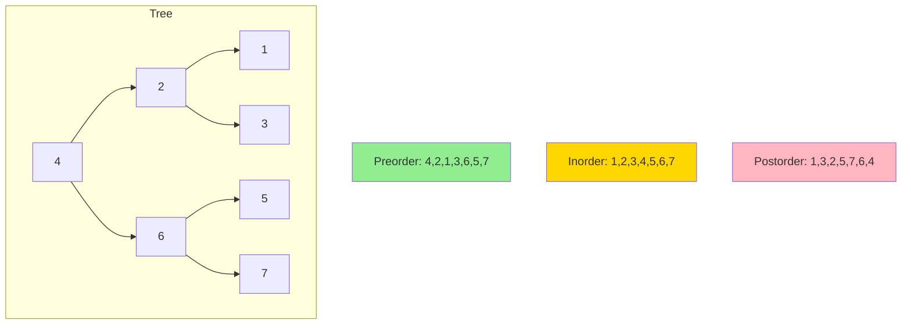

### 2. Breadth-First Traversal (BFS)

Also called **level-order traversal** - visit nodes level by level.

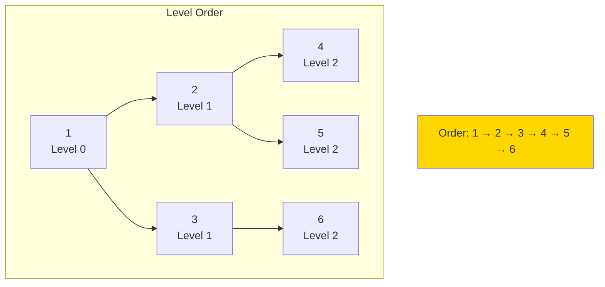

**Implementation:** Use a queue
**Use:** Find shortest path, level-by-level processing

### Traversal Visualization

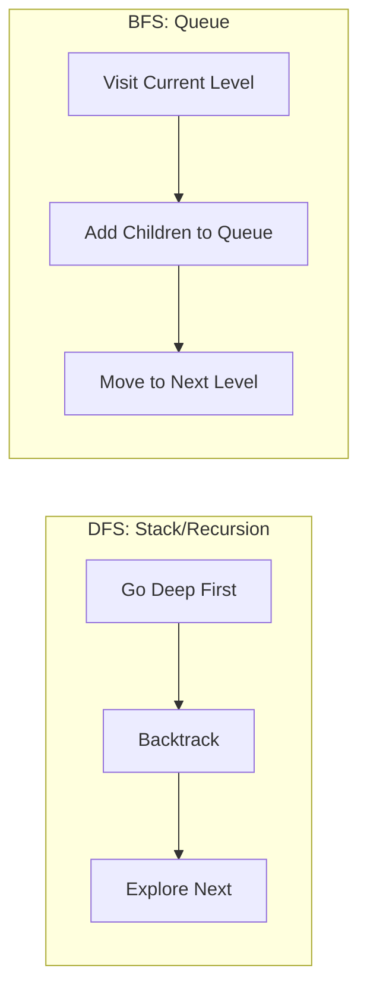

## Binary Search Trees (BST)

A **binary search tree** has a special property:
- Left subtree < Node value
- Right subtree > Node value
- This property holds for **every node**

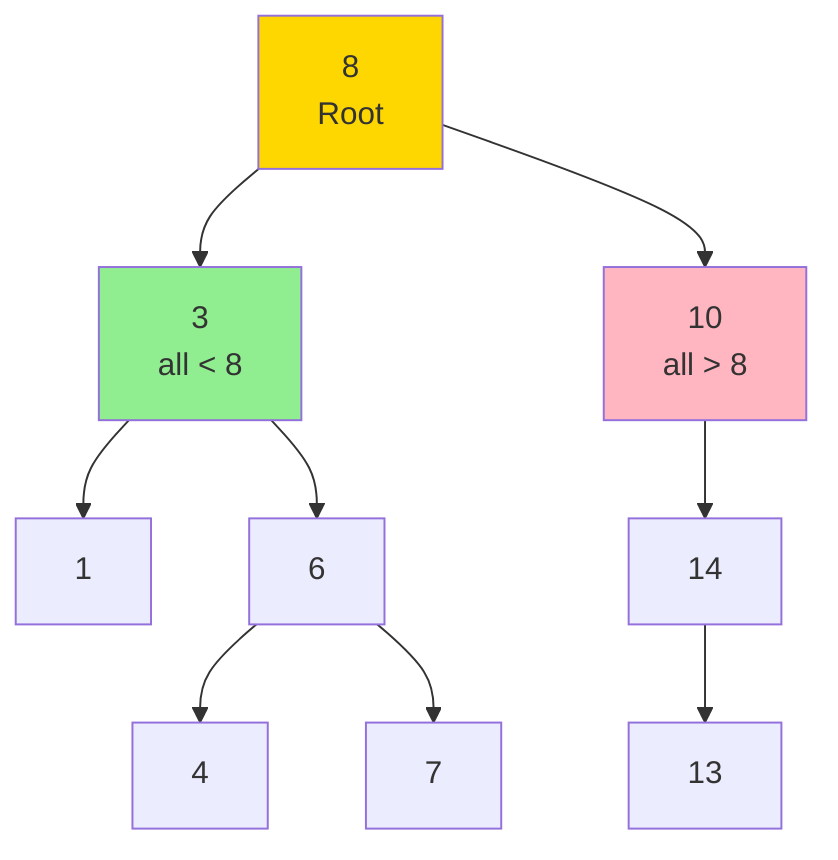

**BST Property Visualization:**
```
For node 8:
  Left subtree: {1, 3, 4, 6, 7} all < 8 ✓
  Right subtree: {10, 13, 14} all > 8 ✓
```

### BST Operations

| Operation | Average Case | Worst Case | Notes |
|-----------|-------------|------------|-------|
| Search | O(log n) | O(n) | O(n) if unbalanced |
| Insert | O(log n) | O(n) | Insert at correct leaf |
| Delete | O(log n) | O(n) | Complex: 3 cases |
| Min/Max | O(log n) | O(n) | Leftmost/rightmost |
| Inorder | O(n) | O(n) | Gives sorted order |

### BST Search Example

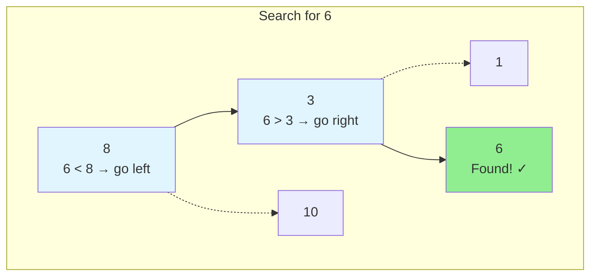

### BST Insert Example

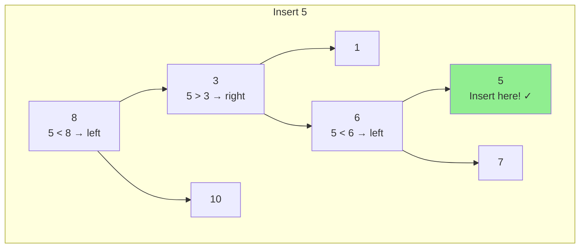

## Balanced vs Unbalanced Trees

### Balanced Tree
Height ≈ log(n) - each subtree has similar size.

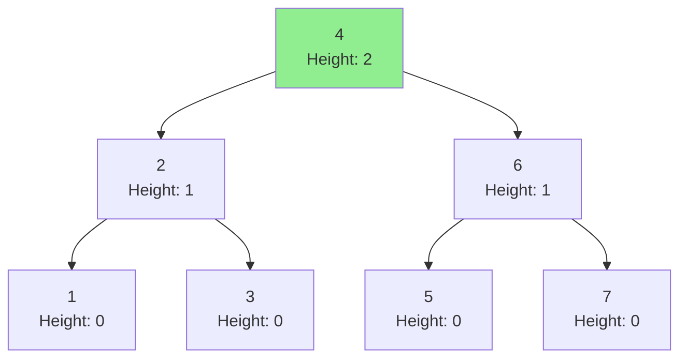

**Properties:**
- Height = O(log n)
- Operations = O(log n)
- Well-distributed nodes

### Unbalanced Tree (Degenerate)
Height = n - like a linked list!

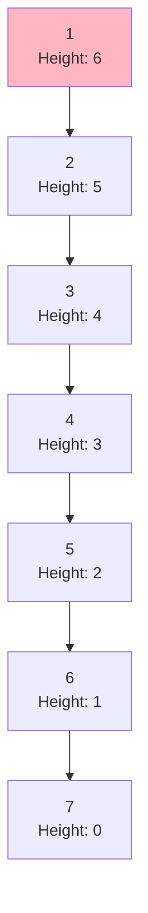

**Problems:**
- Height = O(n)
- Operations = O(n)
- No better than linked list!

### Why Balance Matters

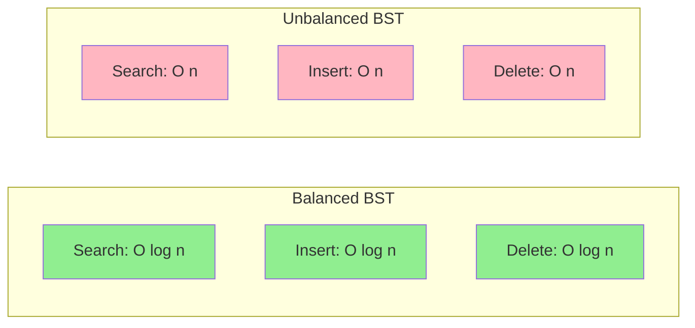

### Self-Balancing Trees (Overview)

- **AVL Tree:** Strict balancing (height diff ≤ 1)
- **Red-Black Tree:** Relaxed balancing (used in Java TreeMap)
- **B-Tree:** Multi-way tree (used in databases)
- **Splay Tree:** Move accessed items to root

All maintain O(log n) operations through rotations.

## Common Tree Properties

### Complete Binary Tree
All levels filled except possibly last, which fills left to right.

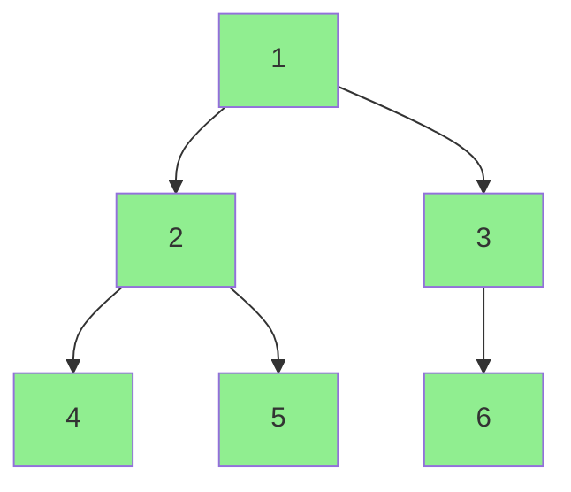

**Use:** Heaps are complete binary trees

### Full Binary Tree
Every node has 0 or 2 children (no nodes with 1 child).

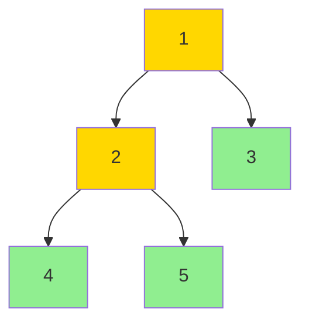

### Perfect Binary Tree
All internal nodes have 2 children, all leaves at same level.

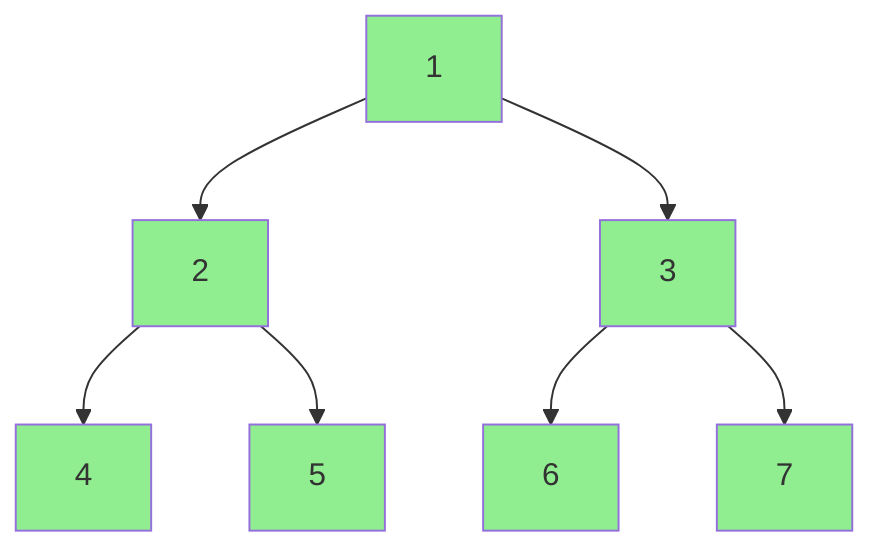

**Properties:**
- Total nodes = 2^h - 1
- Leaf nodes = 2^(h-1)
- Most "efficient" shape

## Common Tree Patterns

### Pattern 1: Recursive Traversal
Most tree problems are naturally recursive:
```
function traverse(node):
    if node is null: return
    process(node)
    traverse(node.left)
    traverse(node.right)
```

### Pattern 2: Level-Order (BFS)
Use queue for level-by-level processing:
```
queue = [root]
while queue not empty:
    node = queue.dequeue()
    process(node)
    enqueue left and right children
```

### Pattern 3: Path Problems
Track path from root to current node:
- Sum root-to-leaf paths
- Find path with target sum
- All paths to leaves

### Pattern 4: Subtree Problems
Check property recursively:
- Is valid BST?
- Is balanced?
- Is symmetric?

### Pattern 5: Ancestor Problems
Use recursion return values:
- Lowest common ancestor
- Distance between nodes
- Path between nodes

## Tree Complexity Summary

| Property | Binary Tree | BST (Balanced) | BST (Unbalanced) |
|----------|-------------|----------------|------------------|
| Height | O(n) | O(log n) | O(n) |
| Search | O(n) | O(log n) | O(n) |
| Insert | N/A | O(log n) | O(n) |
| Delete | N/A | O(log n) | O(n) |
| Space | O(n) | O(n) | O(n) |
| Traversal | O(n) | O(n) | O(n) |

## When to Use Trees

### Trees Excel At:
- ✅ Hierarchical data (file system, org chart)
- ✅ Fast search in sorted data (BST)
- ✅ Range queries (BST)
- ✅ Priority operations (heap - special tree)
- ✅ Expression parsing (syntax trees)

### Avoid Trees When:
- ❌ Need constant-time access by index
- ❌ Frequent insertions/deletions at arbitrary positions
- ❌ Data is not hierarchical
- ❌ Simple sequential processing

## Common Pitfalls

1. **Null pointer errors:** Always check if node is null
2. **Not handling edge cases:** Empty tree, single node
3. **Wrong traversal order:** Choose correct traversal for problem
4. **Modifying tree during traversal:** Can break iteration
5. **Stack overflow:** Deep recursion on unbalanced tree
6. **Confusing height and depth:** Height goes down, depth goes up

## Practice Strategy

Master these problems in order:

**Basic Traversals:**
1. Binary Tree Inorder Traversal (recursion and iteration)
2. Binary Tree Level Order Traversal (BFS)
3. Maximum Depth of Binary Tree (recursion)

**BST Operations:**
4. Validate Binary Search Tree (property checking)
5. Lowest Common Ancestor of BST (BST property usage)
6. Insert into BST (BST modification)

**Advanced:**
7. Path Sum (root-to-leaf paths)
8. Symmetric Tree (recursion pattern)
9. Serialize/Deserialize Binary Tree (encoding/decoding)

## Key Takeaways

1. Trees are **recursive structures** - most solutions use recursion
2. **BST property** enables O(log n) operations when balanced
3. **Traversal order matters** - choose based on problem needs
4. **Balanced trees** maintain O(log n) height
5. **Inorder traversal of BST** gives sorted order
6. Many problems combine multiple patterns (traversal + path tracking)

Understanding trees is fundamental for advanced data structures (heaps, tries, segment trees) and graph algorithms!
