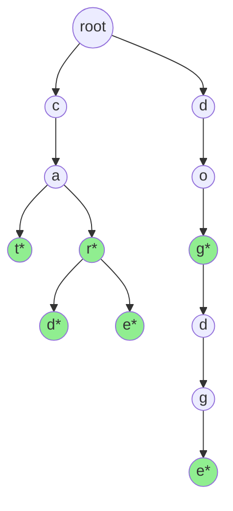

# Tries (Prefix Trees)

## What is a Trie?

A **trie** (pronounced "try") is a tree-like data structure specialized for storing and searching strings. The name comes from "retrieval" - tries excel at retrieving words with common prefixes. Each node represents a character, and paths from root to leaf spell out words.

Also called a **prefix tree** because it efficiently handles prefix-based operations.

## Trie Structure Visualization

Let's visualize a trie containing the words: "cat", "car", "card", "care", "dog", "dodge"



**Key observations**:
- Nodes marked with `*` indicate end of a valid word
- Common prefixes share the same path (e.g., "car", "card", "care" share "c-a-r")
- Each edge represents a character transition
- Root node is empty

## Trie Properties

1. **Prefix sharing**: Words with common prefixes share nodes, saving space
2. **Fast lookups**: Search time is O(m) where m is the word length, independent of how many words are stored
3. **Lexicographic ordering**: In-order traversal yields alphabetically sorted words
4. **No hash collisions**: Unlike hash tables, no collision resolution needed

## Trie Implementation

### Basic Trie Node

```python
class TrieNode:
    def __init__(self):
        self.children = {}  # Character -> TrieNode mapping
        self.is_end_of_word = False  # True if this node marks end of a word
        # Optional: store the word itself, count of words, etc.

class Trie:
    def __init__(self):
        self.root = TrieNode()
```

### Alternative with Array (for lowercase letters only)

```python
class TrieNode:
    def __init__(self):
        self.children = [None] * 26  # For 'a' to 'z'
        self.is_end_of_word = False

    def get_index(self, char):
        return ord(char) - ord('a')
```

**Trade-off**: Array is faster but uses more memory if alphabet is large or sparse.

## Core Operations

### 1. Insert Operation

Add a word to the trie.

**Time Complexity**: O(m) where m is word length
**Space Complexity**: O(m) in worst case (new word with no shared prefix)

```python
def insert(self, word: str) -> None:
    node = self.root

    for char in word:
        if char not in node.children:
            node.children[char] = TrieNode()
        node = node.children[char]

    node.is_end_of_word = True
```

**Step-by-step example** inserting "cat":
1. Start at root
2. 'c' not in root's children → create new node for 'c'
3. 'a' not in 'c' node's children → create new node for 'a'
4. 't' not in 'a' node's children → create new node for 't'
5. Mark 't' node as end of word

### 2. Search Operation

Check if a word exists in the trie.

**Time Complexity**: O(m) where m is word length

```python
def search(self, word: str) -> bool:
    node = self.root

    for char in word:
        if char not in node.children:
            return False
        node = node.children[char]

    return node.is_end_of_word
```

**Important**: Must check `is_end_of_word`. If trie contains "car" and "card", searching for "car" should traverse to 'r' node and verify it's marked as end of word.

### 3. Starts With (Prefix Search)

Check if any word in the trie starts with given prefix.

**Time Complexity**: O(m) where m is prefix length

```python
def starts_with(self, prefix: str) -> bool:
    node = self.root

    for char in prefix:
        if char not in node.children:
            return False
        node = node.children[char]

    return True  # Reached end of prefix
```

**Note**: Unlike search, we don't check `is_end_of_word` because we only care about prefix existence.

### 4. Delete Operation

Remove a word from the trie.

**Time Complexity**: O(m)

```python
def delete(self, word: str) -> bool:
    def _delete(node, word, index):
        if index == len(word):
            if not node.is_end_of_word:
                return False  # Word doesn't exist

            node.is_end_of_word = False

            # Return True if node has no children (can be deleted)
            return len(node.children) == 0

        char = word[index]
        if char not in node.children:
            return False  # Word doesn't exist

        child = node.children[char]
        should_delete_child = _delete(child, word, index + 1)

        if should_delete_child:
            del node.children[char]
            # Return True if current node can also be deleted
            return len(node.children) == 0 and not node.is_end_of_word

        return False

    return _delete(self.root, word, 0)
```

**Key insight**: Only delete nodes that are not part of other words and are not marked as end of another word.

## Common Use Cases

### 1. Autocomplete / Typeahead

**Problem**: As user types, suggest completions.

**Solution**: Use `starts_with` to find the prefix node, then DFS to collect all words from that point.

```python
def autocomplete(self, prefix: str) -> List[str]:
    node = self.root

    # Navigate to prefix node
    for char in prefix:
        if char not in node.children:
            return []
        node = node.children[char]

    # Collect all words with this prefix
    results = []

    def dfs(node, path):
        if node.is_end_of_word:
            results.append(prefix + path)

        for char, child in node.children.items():
            dfs(child, path + char)

    dfs(node, "")
    return results
```

### 2. Spell Checker

Check if word exists, suggest corrections based on:
- Words one edit distance away
- Words with common prefix
- Most frequently used words (store frequency in nodes)

### 3. Word Games (Boggle, Scrabble)

**Boggle**: Given a grid of letters, find all valid words.

**Advantage**: Instead of checking each possible string against a word list (expensive), build a trie of valid words and prune search early when prefix doesn't exist in trie.

```python
def boggle(board, word_dict):
    trie = build_trie(word_dict)
    results = set()

    def dfs(i, j, node, path):
        if node.is_end_of_word:
            results.add(path)

        if not (0 <= i < len(board) and 0 <= j < len(board[0])):
            return

        char = board[i][j]
        if char not in node.children:
            return  # Prune: this path won't lead to valid word

        # Mark visited and explore
        board[i][j] = '#'
        for di, dj in [(0,1), (1,0), (0,-1), (-1,0)]:
            dfs(i+di, j+dj, node.children[char], path + char)
        board[i][j] = char  # Unmark

    for i in range(len(board)):
        for j in range(len(board[0])):
            dfs(i, j, trie.root, "")

    return results
```

### 4. IP Routing / Longest Prefix Matching

Routers use tries to match IP addresses to routing rules by longest matching prefix.

### 5. String Matching and Pattern Search

Find all strings matching a pattern with wildcards (e.g., "c.t" matches "cat", "cot").

## When Trie Beats Hash Table

### Trie Advantages:
1. **Prefix operations**: O(m) prefix search vs O(k*m) for hash table (where k is number of words)
2. **Lexicographic ordering**: Get sorted results easily
3. **Memory with common prefixes**: Shares storage for common prefixes
4. **No hash collisions**: Deterministic performance
5. **Range queries**: Find all words in alphabetical range

### Hash Table Advantages:
1. **Simple exact match**: O(1) average vs O(m) for trie
2. **Implementation simplicity**: One-liner in most languages
3. **Memory for unique strings**: Less overhead if few shared prefixes
4. **Integer keys**: Hash tables work with any hashable type

### Choose Trie When:
- Prefix searching is needed (autocomplete, typeahead)
- Many strings share common prefixes (dictionaries, URLs)
- Lexicographic ordering matters
- Wildcard or pattern matching needed

### Choose Hash Table When:
- Only exact matching needed
- Strings are mostly unique with few shared prefixes
- You need O(1) average lookup
- Working with non-string keys

## Space Optimization

### Problem:
Standard trie can use a lot of memory:
- Each node stores a hash map or array
- Sparse children (many null pointers in array representation)

### Solutions:

**1. Compressed Trie (Radix Tree)**
Merge single-child chains into one node storing edge labels.

```
Standard Trie:        Compressed Trie:
root                  root
 |                     |
 c                     car
 |                    /   \
 a                  d*     e*
 |
 r*
/ \
d*  e*
```

**2. Ternary Search Tree**
Each node has three children: less than, equal to, greater than current character.
Balances memory and speed.

**3. Hash Map Children**
Use hash map instead of array (only store existing children, not all 26 slots).

## Implementation Variations

### Store Additional Data

```python
class TrieNode:
    def __init__(self):
        self.children = {}
        self.is_end_of_word = False
        self.word = None  # Store complete word at end nodes
        self.frequency = 0  # For autocomplete ranking
        self.word_count = 0  # Count of words in subtree
```

### Case-Insensitive Trie

```python
def insert(self, word: str) -> None:
    word = word.lower()  # Convert to lowercase
    # ... rest of insert logic
```

### Wildcard Support

Support patterns like "c.t" where '.' matches any character:

```python
def search_with_wildcard(self, word: str) -> bool:
    def dfs(node, index):
        if index == len(word):
            return node.is_end_of_word

        char = word[index]

        if char == '.':
            # Try all possible characters
            for child in node.children.values():
                if dfs(child, index + 1):
                    return True
            return False
        else:
            if char not in node.children:
                return False
            return dfs(node.children[char], index + 1)

    return dfs(self.root, 0)
```

## Key Insights

1. **Time-space tradeoff**: Tries trade memory for speed on prefix operations.

2. **Early pruning**: In search problems (like Boggle), tries enable early termination when prefix doesn't exist.

3. **Not just for words**: Tries work with any sequence - DNA sequences, binary strings, URL paths.

4. **Frequency matters**: For autocomplete, storing word frequency in nodes enables ranking suggestions.

5. **DFS is your friend**: Most trie algorithms involve DFS traversal from a starting node.

## Complexity Summary

| Operation | Time | Space |
|-----------|------|-------|
| Insert | O(m) | O(m) worst case |
| Search | O(m) | O(1) |
| Prefix search | O(m) | O(1) |
| Delete | O(m) | O(1) |
| Autocomplete (n results) | O(m + n) | O(n) |

Where m = length of word/prefix, n = number of results

## Practice Problems

Master tries with these qb5 problems:
- Implement Trie (Prefix Tree)
- Add and Search Word - Data structure design (with wildcards)
- Word Search II (Boggle variant)
- Design Search Autocomplete System
- Replace Words
- Longest Word in Dictionary
- Map Sum Pairs
- Design Add and Search Words Data Structure
