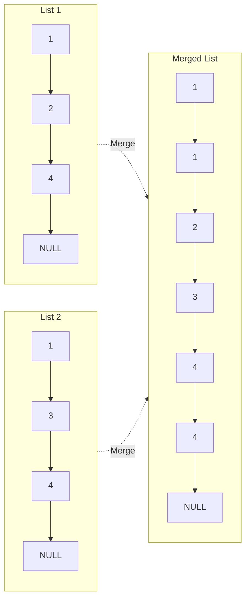

# Merge Two Sorted Lists

## Problem

Combine two sorted linked lists into one sorted list by splicing nodes together.

**Diagram:**




## Why This Matters

This problem is fundamental to understanding linked list manipulation and merging algorithms. It teaches:
- **Pointer manipulation**: Managing multiple pointers simultaneously
- **In-place modifications**: Rewiring nodes without extra space
- **Merge patterns**: Foundation for merge sort and k-way merges

**Real-world applications:**
- Database merge operations (sorted result sets)
- Version control systems merging sorted commits
- Priority queue implementations merging sorted runs

## Examples

**Example 1:**
- Input: `list1 = [], list2 = []`
- Output: `[]`

**Example 2:**
- Input: `list1 = [], list2 = [0]`
- Output: `[0]`

## Constraints

- The number of nodes in both lists is in the range [0, 50].
- -100 <= Node.val <= 100
- Both list1 and list2 are sorted in **non-decreasing** order.

## Think About

1. How would you merge two sorted arrays? Can the same logic apply to lists?
2. What happens when one list is exhausted before the other?
3. Do you need to create new nodes or can you reuse existing ones?
4. How does a dummy node simplify edge cases?

---

## Approach Hints

<details>
<summary>💡 Hint 1: How do you merge sorted arrays?</summary>

In sorted arrays, you compare elements at two pointers and take the smaller one.

For linked lists, the concept is identical, but instead of array indices, you manage **node pointers**.

**Think about:**
- What happens when list1 is empty? Or list2?
- How do you advance to the next node after choosing one?
- How do you maintain the "tail" of your merged list?

</details>

<details>
<summary>🎯 Hint 2: The dummy head technique</summary>

Use a **dummy node** to avoid special-casing the first element.

The dummy's `next` pointer will eventually point to the actual merged list head.

**Key insight:** Keep a `current` pointer that advances as you build the merged list. Compare `list1.val` and `list2.val`, attach the smaller to `current.next`, then advance both `current` and the chosen list.

When one list is exhausted, attach the remainder of the other list directly.

</details>

<details>
<summary>📝 Hint 3: Merge algorithm</summary>

```
create dummy node
current = dummy

while list1 is not None AND list2 is not None:
    if list1.val <= list2.val:
        current.next = list1
        list1 = list1.next
    else:
        current.next = list2
        list2 = list2.next
    current = current.next

# Attach remaining nodes (at most one list has nodes left)
if list1 is not None:
    current.next = list1
else:
    current.next = list2

return dummy.next
```

**Why dummy node?** It eliminates the need to handle "what if the list is empty?" separately for the first element.

</details>

---

## Complexity Analysis

| Approach | Time | Space | Trade-off |
|----------|------|-------|-----------|
| Iterative (Two Pointers) | O(n + m) | O(1) | Optimal; single pass, in-place |
| Recursive | O(n + m) | O(n + m) | Elegant but uses call stack |
| Collect + Sort | O((n+m) log(n+m)) | O(n + m) | Wasteful; ignores sorted property |

**Why Iterative Wins:**
- Linear time: visit each node exactly once
- Constant space: only a few pointers needed
- In-place: reuses existing nodes

---

## Common Mistakes

### 1. Forgetting to handle empty lists
```python
# WRONG: Crashes if list1 or list2 is None
def merge(list1, list2):
    if list1.val < list2.val:  # NoneType has no attribute 'val'
        ...

# CORRECT: Check for None first
def merge(list1, list2):
    if list1 is None:
        return list2
    if list2 is None:
        return list1
    # Now safe to access .val
```

### 2. Not advancing the current pointer
```python
# WRONG: current never moves; infinite loop
while list1 and list2:
    if list1.val < list2.val:
        current.next = list1
        list1 = list1.next
    # Forgot: current = current.next

# CORRECT: Always advance current
current = current.next
```

### 3. Creating new nodes instead of reusing
```python
# WRONG: Wastes space creating new nodes
current.next = ListNode(list1.val)  # Don't do this!

# CORRECT: Reuse existing nodes
current.next = list1
```

### 4. Forgetting to attach remaining nodes
```python
# WRONG: Drops remaining nodes
while list1 and list2:
    # ... merge logic
# Missing: current.next = list1 or list2

# CORRECT: Attach the remainder
if list1:
    current.next = list1
else:
    current.next = list2
```

---

## Variations

| Variation | Change | Approach Adjustment |
|-----------|--------|---------------------|
| **K sorted lists** | Merge k lists instead of 2 | Use min-heap or divide & conquer |
| **Merge in-place** | Modify list1 to be the result | Same algorithm, no dummy needed |
| **Descending order** | Lists sorted high to low | Reverse comparison logic |
| **Doubly linked list** | Nodes have prev pointers | Update both next and prev |
| **Return length** | Count merged nodes | Increment counter in loop |

**Recursive Approach:**
```python
def merge(list1, list2):
    if not list1:
        return list2
    if not list2:
        return list1

    if list1.val < list2.val:
        list1.next = merge(list1.next, list2)
        return list1
    else:
        list2.next = merge(list1, list2.next)
        return list2
```

---

## Practice Checklist

**Correctness:**
- [ ] Handles both empty lists
- [ ] Handles one empty list
- [ ] Handles lists of different lengths
- [ ] Maintains sorted order

**Optimization:**
- [ ] Achieved O(n + m) time complexity
- [ ] Used O(1) extra space (iterative)
- [ ] Reuses existing nodes

**Interview Readiness:**
- [ ] Can explain dummy node technique
- [ ] Can code iterative solution in 5 minutes
- [ ] Can code recursive solution
- [ ] Can discuss merge sort connection

**Spaced Repetition Tracker:**
- [ ] Day 1: Initial solve
- [ ] Day 3: Solve without hints
- [ ] Day 7: Implement recursive version
- [ ] Day 14: Solve k-way merge variation
- [ ] Day 30: Quick review

---

**Strategy**: See [Linked List Pattern](../prerequisites/linked-lists.md)
