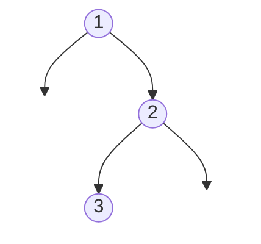

# Binary Tree Inorder Traversal

## Problem

Given the root of a binary tree, return the values of all nodes visited in inorder sequence. Inorder traversal is a specific way of visiting tree nodes that follows this pattern: visit the left subtree, then the current node, then the right subtree. This process is applied recursively to every node in the tree.

A binary tree is a hierarchical data structure where each node has at most two children: a left child and a right child. Some nodes may have no children (leaf nodes) or only one child.

**Understanding inorder traversal:**
Think of inorder traversal as reading a tree "from left to right at the bottom level first." For a binary search tree, inorder traversal produces values in sorted order—a property that makes this traversal particularly useful for tree validation and searching.

**Key details:**
- Start at the root node
- Recursively visit all nodes in the left subtree (if it exists)
- Visit the current node (record its value)
- Recursively visit all nodes in the right subtree (if it exists)
- For an empty tree (null root), return an empty list

**Diagram:**

Example: Input: root = [1,null,2,3]


Inorder traversal: [1,3,2]
- Visit left subtree (none)
- Visit root (1)
- Visit right subtree:
  - Visit left (3)
  - Visit root (2)
  - Visit right (none)


## Why This Matters

Tree traversals are fundamental algorithms that appear everywhere in computer science: from compilers parsing expression trees to database systems querying indexes to file systems navigating directory structures. Inorder traversal specifically is crucial because it visits nodes of a binary search tree in sorted order, making it the foundation for range queries, validation, and in-order iteration. Learning this pattern teaches you recursive problem decomposition and helps you understand the relationship between recursive and iterative algorithms (both using stacks, one implicit and one explicit). Mastering tree traversals is a gateway to understanding more complex graph algorithms used in AI, networking, and data processing.

## Examples

**Example 1:**
- Input: `root = []`
- Output: `[]`

**Example 2:**
- Input: `root = [1]`
- Output: `[1]`

## Constraints

- The number of nodes in the tree is in the range [0, 100].
- -100 <= Node.val <= 100

## Think About

1. What's the brute force approach? What's its time complexity?
2. Can you identify any patterns in the examples?
3. What data structure would help organize the information?

## Approach Hints

<details>
<summary>💡 Hint 1: Recursive Definition</summary>

Inorder traversal follows the pattern: Left → Root → Right.

For any node:
1. First, traverse the entire left subtree
2. Then, visit the current node
3. Finally, traverse the entire right subtree

How would you express this as a recursive function?

</details>

<details>
<summary>🎯 Hint 2: Iterative with Stack</summary>

The recursive solution uses the call stack implicitly. Can you simulate this with an explicit stack?

Key insight: Keep going left and pushing nodes onto the stack. When you can't go left anymore, pop from the stack (visit), then try going right.

</details>

<details>
<summary>📝 Hint 3: Two Implementations</summary>

**Recursive:**
```
function inorder(node, result):
    if node is null:
        return

    inorder(node.left, result)
    result.append(node.val)
    inorder(node.right, result)
```

**Iterative:**
```
stack = []
current = root
result = []

while current or stack:
    # Go as far left as possible
    while current:
        stack.push(current)
        current = current.left

    # Visit node
    current = stack.pop()
    result.append(current.val)

    # Go right
    current = current.right

return result
```

</details>

## Complexity Analysis

| Approach | Time | Space | Notes |
|----------|------|-------|-------|
| **Recursive** | **O(n)** | **O(h)** | **h is tree height, worst case O(n) for skewed tree** |
| Iterative (Stack) | O(n) | O(h) | Explicit stack instead of call stack |
| Morris Traversal | O(n) | O(1) | Modifies tree structure temporarily |

## Common Mistakes

### 1. Wrong Traversal Order
```python
# WRONG: Preorder (Root-Left-Right) instead of Inorder
def inorderTraversal(root):
    result = []
    if root:
        result.append(root.val)  # Visiting root first!
        result.extend(inorderTraversal(root.left))
        result.extend(inorderTraversal(root.right))
    return result

# CORRECT: Inorder (Left-Root-Right)
def inorderTraversal(root):
    result = []
    if root:
        result.extend(inorderTraversal(root.left))
        result.append(root.val)
        result.extend(inorderTraversal(root.right))
    return result
```

### 2. Iterative Stack Logic Error
```python
# WRONG: Doesn't properly track current node
def inorderTraversal(root):
    stack, result = [root], []
    while stack:
        node = stack.pop()
        if node:
            result.append(node.val)  # Visits too early!
            stack.append(node.right)
            stack.append(node.left)

# CORRECT: Push left nodes, then visit, then go right
def inorderTraversal(root):
    stack, result = [], []
    current = root
    while current or stack:
        while current:
            stack.append(current)
            current = current.left
        current = stack.pop()
        result.append(current.val)
        current = current.right
```

### 3. Not Handling Empty Tree
```python
# WRONG: Doesn't handle None root
def inorderTraversal(root):
    result = []
    inorder(root, result)  # Crashes if root is None
    return result

# CORRECT: Check for None
def inorderTraversal(root):
    result = []
    if root:
        inorder(root, result)
    return result
```

## Variations

| Variation | Change | Approach Adjustment |
|-----------|--------|---------------------|
| Preorder Traversal | Root-Left-Right order | Visit root before left subtree |
| Postorder Traversal | Left-Right-Root order | Visit root after both subtrees |
| Level Order Traversal | Level by level | Use queue (BFS) instead of stack |
| Reverse Inorder | Right-Root-Left order | Swap left and right in traversal |
| Morris Traversal | O(1) space | Use threaded tree technique |
| Kth Smallest in BST | Find kth element in inorder | Stop after visiting k nodes |

## Practice Checklist

**Correctness:**
- [ ] Handles empty tree (null root)
- [ ] Handles single node tree
- [ ] Returns correct order: left-root-right
- [ ] Works with skewed trees (all left or all right)
- [ ] Works with complete/balanced trees

**Interview Readiness:**
- [ ] Can explain approach in 2 minutes
- [ ] Can code recursive solution in 5 minutes
- [ ] Can code iterative solution in 8 minutes
- [ ] Can discuss time/space complexity
- [ ] Can explain difference from preorder/postorder

**Spaced Repetition Tracker:**
- [ ] Day 1: Initial solve
- [ ] Day 3: Solve without hints
- [ ] Day 7: Solve variations
- [ ] Day 14: Explain to someone
- [ ] Day 30: Quick review

---

**Strategy**: See [Tree Traversal](../../strategies/data-structures/trees.md)
