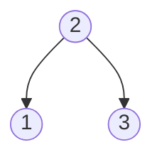
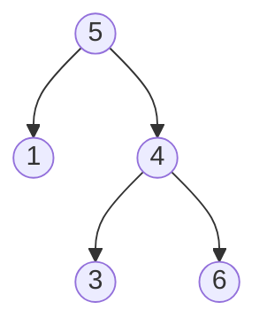

# Validate Binary Search Tree

## Problem

Given the root of a binary tree, determine whether it is a valid binary search tree (BST). A binary search tree is a special type of binary tree that maintains a strict ordering property: for every node, all values in its left subtree must be strictly less than the node's value, and all values in its right subtree must be strictly greater than the node's value. This property must hold for every single node in the tree.

**Critical distinction:** It's not enough to just check that each node's left child is smaller and right child is larger. The BST property must hold for entire subtrees. For example, in the tree below, node 4 is greater than its parent 5, which violates the BST property, even though 4 > 3 and 4 < 6 when comparing to its own children.

**Example 1 (Valid BST):**


All nodes in the left subtree (just 1) are less than 2, and all nodes in the right subtree (just 3) are greater than 2. This is valid.

**Example 2 (Invalid BST):**


Node 4 is in the right subtree of 5, so it should be greater than 5. Since 4 < 5, this violates the BST property. The tree is invalid even though each node respects its immediate children.

**Key validation rules:**
- Every node's value must be within a valid range determined by its ancestors
- The left subtree of a node must contain only values less than the node's value
- The right subtree must contain only values greater than the node's value
- An empty tree (null) is considered a valid BST
- Duplicate values are not allowed in a valid BST


## Why This Matters

Binary search trees are one of the most important data structures in computing, powering database indexes, in-memory search structures, and efficient sorted collections. Validating BSTs is crucial for maintaining data integrity in systems that rely on the BST property for fast search, insertion, and deletion operations. This problem teaches you a common pitfall in recursive tree algorithms: the difference between local constraints (comparing with immediate children) and global constraints (maintaining valid ranges throughout the tree). This distinction appears in many verification problems, from checking heap properties to validating tree balancing constraints in AVL trees and red-black trees.

## Constraints

- The number of nodes in the tree is in the range [1, 10⁴].
- -2³¹ <= Node.val <= 2³¹ - 1

## Think About

1. What's the brute force approach? What's its time complexity?
2. Can you identify any patterns in the examples?
3. What data structure would help organize the information?

## Approach Hints

<details>
<summary>💡 Hint 1: BST Property</summary>

A valid Binary Search Tree has the property that for every node:
- All nodes in the left subtree have values < node.val
- All nodes in the right subtree have values > node.val
- Both left and right subtrees are also valid BSTs

The common mistake is only checking immediate children. Consider the tree:
```
    5
   / \
  1   4
     / \
    3   6
```
Node 4 is greater than parent 5, violating BST property, even though each node is greater than its left child and less than its right child.

</details>

<details>
<summary>🎯 Hint 2: Range Validation</summary>

As you traverse the tree, maintain valid ranges for each node:
- Root can be any value (range: -∞ to +∞)
- Left child must be in range (min, parent.val)
- Right child must be in range (parent.val, max)

This ensures the BST property holds for the entire subtree, not just immediate children.

</details>

<details>
<summary>📝 Hint 3: Two Validation Approaches</summary>

**Approach 1: Range Validation**
```
function isValid(node, min_val, max_val):
    if node is null:
        return true

    if node.val <= min_val or node.val >= max_val:
        return false

    return isValid(node.left, min_val, node.val) and
           isValid(node.right, node.val, max_val)
```

**Approach 2: Inorder Traversal**
```
# Inorder traversal of BST produces sorted sequence
prev = -infinity
function isValidBST(node):
    if node is null:
        return true

    if not isValidBST(node.left):
        return false

    if node.val <= prev:
        return false
    prev = node.val

    return isValidBST(node.right)
```

</details>

## Complexity Analysis

| Approach | Time | Space | Notes |
|----------|------|-------|-------|
| **Range Validation** | **O(n)** | **O(h)** | **Visit each node once, h is height** |
| Inorder Traversal | O(n) | O(h) | Check if inorder is sorted |
| Inorder Iterative | O(n) | O(h) | Stack-based inorder |

## Common Mistakes

### 1. Only Checking Immediate Children
```python
# WRONG: Doesn't validate entire subtree ranges
def isValidBST(root):
    if not root:
        return True
    if root.left and root.left.val >= root.val:
        return False
    if root.right and root.right.val <= root.val:
        return False
    return isValidBST(root.left) and isValidBST(root.right)

# CORRECT: Track valid ranges
def isValidBST(root):
    def validate(node, min_val, max_val):
        if not node:
            return True
        if node.val <= min_val or node.val >= max_val:
            return False
        return (validate(node.left, min_val, node.val) and
                validate(node.right, node.val, max_val))

    return validate(root, float('-inf'), float('inf'))
```

### 2. Using Local Variable for Previous Value
```python
# WRONG: prev doesn't persist across recursive calls
def isValidBST(root):
    prev = float('-inf')

    def inorder(node):
        if not node:
            return True
        if not inorder(node.left):
            return False
        if node.val <= prev:  # prev doesn't change!
            return False
        prev = node.val  # Local assignment
        return inorder(node.right)

    return inorder(root)

# CORRECT: Use nonlocal or pass as reference
def isValidBST(root):
    prev = [float('-inf')]  # Use list as reference

    def inorder(node):
        if not node:
            return True
        if not inorder(node.left):
            return False
        if node.val <= prev[0]:
            return False
        prev[0] = node.val
        return inorder(node.right)

    return inorder(root)
```

### 3. Incorrect Boundary Conditions
```python
# WRONG: Uses < and > instead of <= and >=
def isValidBST(root):
    def validate(node, min_val, max_val):
        if not node:
            return True
        if node.val < min_val or node.val > max_val:
            return False  # Should be <= and >=

# CORRECT: Use <= and >= for exclusive bounds
def isValidBST(root):
    def validate(node, min_val, max_val):
        if not node:
            return True
        if node.val <= min_val or node.val >= max_val:
            return False
```

## Variations

| Variation | Change | Approach Adjustment |
|-----------|--------|---------------------|
| Allow duplicates | Left subtree allows equal values | Change <= to < in one direction |
| Find BST violations | Return invalid nodes | Track and return violating nodes |
| Largest valid BST subtree | Find largest valid BST in tree | Bottom-up validation with size tracking |
| BST within range | Check if all values in [L, R] | Add range check to validation |
| Recover BST | Two nodes swapped, fix it | Inorder find anomalies, swap back |

## Practice Checklist

**Correctness:**
- [ ] Handles empty tree
- [ ] Handles single node
- [ ] Detects violations in left subtree
- [ ] Detects violations in right subtree
- [ ] Handles trees with negative values
- [ ] Handles duplicate values correctly

**Interview Readiness:**
- [ ] Can explain approach in 2 minutes
- [ ] Can code solution in 10 minutes
- [ ] Can discuss time/space complexity
- [ ] Can explain both range and inorder approaches
- [ ] Can handle follow-up about duplicates

**Spaced Repetition Tracker:**
- [ ] Day 1: Initial solve
- [ ] Day 3: Solve without hints
- [ ] Day 7: Solve variations
- [ ] Day 14: Explain to someone
- [ ] Day 30: Quick review

---

**Strategy**: See [Binary Search Trees](../../prerequisites/trees.md)
