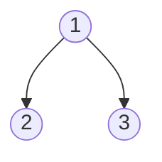
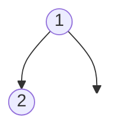
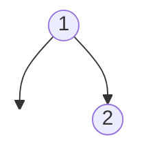
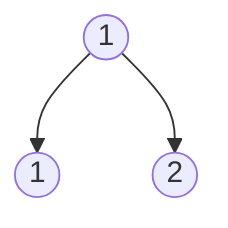

# Same Tree

## Problem

Given the roots of two binary trees `p` and `q`, determine whether they are identical. Two binary trees are considered the same if they have the exact same structure and every corresponding node in both trees has the same value.

This means both trees must match in three ways:
1. **Structure:** The shape of the trees must be identical—if one tree has a left child at a certain position, the other tree must also have a left child at that position
2. **Values:** Every corresponding node must have the same value
3. **Null positions:** If one tree has null (no child) at a position, the other must also have null at that position

**Example 1: Same trees**

Tree p:


Tree q:


Output: true (same structure, same values)

**Example 2: Different structure**

Tree p:


Tree q:


Output: false (node with value 2 is on left in p, but on right in q)

**Example 3: Different values**

Tree p:


Tree q:


Output: false (same structure, but left child values differ)


## Why This Matters

Comparing tree structures is fundamental in many applications: version control systems comparing file directory trees, document diff tools comparing XML/HTML DOM trees, and database systems comparing query execution plans. This problem teaches you how to elegantly express structural recursion—the idea that a property of a complex structure can be verified by checking that same property on its smaller components. This recursive thinking pattern extends beyond trees to lists, graphs, and any hierarchical data. The ability to compare trees efficiently is also a building block for more complex problems like finding tree isomorphisms, detecting subtrees, and implementing tree equality operators in data structure libraries.

## Constraints

- The number of nodes in both trees is in the range [0, 100].
- -10⁴ <= Node.val <= 10⁴

## Think About

1. What's the brute force approach? What's its time complexity?
2. Can you identify any patterns in the examples?
3. What data structure would help organize the information?

## Approach Hints

<details>
<summary>💡 Hint 1: Definition of Sameness</summary>

Two trees are the same if:
1. Both are null (empty), OR
2. Both have the same value at the root, AND
3. Their left subtrees are the same, AND
4. Their right subtrees are the same

What's the base case for this recursive definition?

</details>

<details>
<summary>🎯 Hint 2: Edge Cases</summary>

Consider these edge cases:
- Both trees are null → true
- One tree is null, other is not → false
- Both trees have same root value but different structures → false
- Same structure, different values → false

How do you check these conditions efficiently?

</details>

<details>
<summary>📝 Hint 3: Recursive Algorithm</summary>

```
function isSameTree(p, q):
    # Both null - same
    if p is null and q is null:
        return true

    # One null, one not - different
    if p is null or q is null:
        return false

    # Different values - different
    if p.val != q.val:
        return false

    # Check both subtrees recursively
    return isSameTree(p.left, q.left) and
           isSameTree(p.right, q.right)
```

Alternative iterative approach using queue/stack for BFS/DFS traversal of both trees simultaneously.

</details>

## Complexity Analysis

| Approach | Time | Space | Notes |
|----------|------|-------|-------|
| **Recursive DFS** | **O(min(n, m))** | **O(min(h₁, h₂))** | **n, m are node counts; h is height** |
| Iterative BFS | O(min(n, m)) | O(min(w₁, w₂)) | w is max width of tree |
| Iterative DFS | O(min(n, m)) | O(min(h₁, h₂)) | Using stack |

Note: Stops early when mismatch found, so visits at most min(n, m) nodes.

## Common Mistakes

### 1. Not Handling Both Null Cases
```python
# WRONG: Doesn't handle when both are null
def isSameTree(p, q):
    if not p or not q:
        return False  # Wrong when both are null!
    if p.val != q.val:
        return False
    return isSameTree(p.left, q.left) and isSameTree(p.right, q.right)

# CORRECT: Check both null first
def isSameTree(p, q):
    if not p and not q:
        return True
    if not p or not q:
        return False
    if p.val != q.val:
        return False
    return isSameTree(p.left, q.left) and isSameTree(p.right, q.right)
```

### 2. Not Checking Both Subtrees
```python
# WRONG: Only checks left subtree
def isSameTree(p, q):
    if not p and not q:
        return True
    if not p or not q:
        return False
    return p.val == q.val and isSameTree(p.left, q.left)
    # Missing: check right subtree!

# CORRECT: Check both subtrees
def isSameTree(p, q):
    if not p and not q:
        return True
    if not p or not q:
        return False
    return (p.val == q.val and
            isSameTree(p.left, q.left) and
            isSameTree(p.right, q.right))
```

### 3. Inefficient Traversal
```python
# WRONG: Traverses entire trees even after finding difference
def isSameTree(p, q):
    p_values = []
    q_values = []
    inorder(p, p_values)
    inorder(q, q_values)
    return p_values == q_values  # Doesn't preserve structure!

# CORRECT: Compare node by node, stop early
def isSameTree(p, q):
    if not p and not q:
        return True
    if not p or not q:
        return False
    return (p.val == q.val and
            isSameTree(p.left, q.left) and
            isSameTree(p.right, q.right))
```

## Variations

| Variation | Change | Approach Adjustment |
|-----------|--------|---------------------|
| Symmetric Tree | Check if tree is mirror of itself | Compare left subtree with mirrored right subtree |
| Subtree Check | Is p a subtree of q? | Find matching root in q, then check sameness |
| Same Structure | Ignore values, check structure only | Don't compare node values |
| Isomorphic Trees | Allow left-right swap | Try both (left, left) + (right, right) AND (left, right) + (right, left) |
| Same Level Order | Same BFS traversal | Compare level by level |

## Practice Checklist

**Correctness:**
- [ ] Handles both trees null
- [ ] Handles one tree null
- [ ] Handles different structures
- [ ] Handles different values
- [ ] Handles identical trees

**Interview Readiness:**
- [ ] Can explain approach in 2 minutes
- [ ] Can code solution in 5 minutes
- [ ] Can discuss time/space complexity
- [ ] Can code iterative version
- [ ] Can handle follow-up about symmetric trees

**Spaced Repetition Tracker:**
- [ ] Day 1: Initial solve
- [ ] Day 3: Solve without hints
- [ ] Day 7: Solve variations
- [ ] Day 14: Explain to someone
- [ ] Day 30: Quick review

---

**Strategy**: See [Tree Traversal](../../strategies/data-structures/trees.md)
