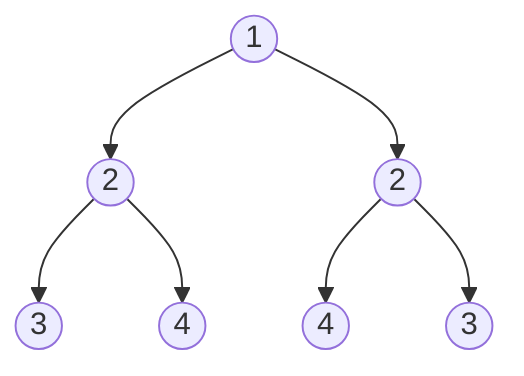
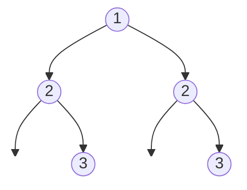

# Symmetric Tree

## Problem

Given the root of a binary tree, determine whether the tree is symmetric around its vertical center. A tree is symmetric if you could draw a vertical line through the root and the left half would be a mirror reflection of the right half—both in structure and in values.

Imagine folding the tree along a vertical line through the root. In a symmetric tree, every node on the left side would perfectly overlap with its corresponding node on the right side. This means:
- The left subtree must be a mirror image of the right subtree
- For any two mirrored positions, the values must match
- If one side has a left child, the mirrored position on the other side must have a right child with the same value
- Null positions must also be mirrored (if left side has no child at a position, right side must also have no child at the corresponding position)

**Example 1: Symmetric tree**



Output: true

The left subtree [2, 3, 4] mirrors the right subtree [2, 4, 3]. Notice how 3 is the outer left child on the left side and the outer right child on the right side—perfectly mirrored.

**Example 2: Asymmetric tree**



Output: false

Both sides have value 3 as the inner child, but for symmetry, one should be an inner child and the other should be an outer child. The structure doesn't mirror.


## Why This Matters

Symmetry detection in tree structures has practical applications in computer graphics (detecting symmetric 3D models), image processing (finding reflective symmetry), and computational geometry. This problem is particularly valuable for teaching the concept of mirrored recursion—where you compare structures that are "reflected" rather than identical. This pattern appears in problems involving palindromes, mirror images, and bidirectional graph traversals. Understanding how to compare mirrored trees builds intuition for problems that require simultaneous traversal from multiple starting points or directions, a technique used in bidirectional search algorithms and parallel tree processing.

## Constraints

- The number of nodes in the tree is in the range [1, 1000].
- -100 <= Node.val <= 100

## Think About

1. What's the brute force approach? What's its time complexity?
2. Can you identify any patterns in the examples?
3. What data structure would help organize the information?

## Approach Hints

<details>
<summary>💡 Hint 1: Mirror Definition</summary>

A tree is symmetric if the left subtree is a mirror reflection of the right subtree.

Two trees are mirrors if:
1. Their roots have the same value
2. The left subtree of one is a mirror of the right subtree of the other
3. The right subtree of one is a mirror of the left subtree of the other

Notice how we compare left-right and right-left, not left-left and right-right!

</details>

<details>
<summary>🎯 Hint 2: Helper Function Approach</summary>

Create a helper function `isMirror(left, right)` that checks if two trees are mirrors of each other.

For the main tree to be symmetric, call `isMirror(root.left, root.right)`.

What are the base cases?
- Both null → mirror
- One null → not mirror
- Different values → not mirror
- Otherwise, check children in mirrored order

</details>

<details>
<summary>📝 Hint 3: Mirror Checking Algorithm</summary>

**Recursive:**
```
function isSymmetric(root):
    if root is null:
        return true
    return isMirror(root.left, root.right)

function isMirror(left, right):
    # Both null - mirror
    if left is null and right is null:
        return true

    # One null - not mirror
    if left is null or right is null:
        return false

    # Different values - not mirror
    if left.val != right.val:
        return false

    # Check outer pair and inner pair
    return isMirror(left.left, right.right) and
           isMirror(left.right, right.left)
```

**Iterative (using queue):**
```
queue = [root.left, root.right]

while queue is not empty:
    left = queue.pop()
    right = queue.pop()

    if left is null and right is null:
        continue
    if left is null or right is null:
        return false
    if left.val != right.val:
        return false

    # Add in mirror order
    queue.append(left.left)
    queue.append(right.right)
    queue.append(left.right)
    queue.append(right.left)

return true
```

</details>

## Complexity Analysis

| Approach | Time | Space | Notes |
|----------|------|-------|-------|
| **Recursive** | **O(n)** | **O(h)** | **Visit each node once, h is height** |
| Iterative (Queue) | O(n) | O(w) | w is max width of tree |
| Iterative (Stack) | O(n) | O(h) | DFS approach |

## Common Mistakes

### 1. Comparing Same-Side Children
```python
# WRONG: Compares left.left with right.left
def isMirror(left, right):
    if not left and not right:
        return True
    if not left or not right:
        return False
    return (left.val == right.val and
            isMirror(left.left, right.left) and  # Wrong!
            isMirror(left.right, right.right))    # Wrong!

# CORRECT: Compare opposite children
def isMirror(left, right):
    if not left and not right:
        return True
    if not left or not right:
        return False
    return (left.val == right.val and
            isMirror(left.left, right.right) and  # Correct
            isMirror(left.right, right.left))     # Correct
```

### 2. Not Handling Null Root
```python
# WRONG: Doesn't handle null root
def isSymmetric(root):
    return isMirror(root.left, root.right)  # Crashes if root is null

# CORRECT: Check null root first
def isSymmetric(root):
    if not root:
        return True
    return isMirror(root.left, root.right)
```

### 3. Queue Order Error in Iterative
```python
# WRONG: Adds children in wrong order
def isSymmetric(root):
    queue = [root.left, root.right]
    while queue:
        left = queue.pop(0)
        right = queue.pop(0)
        # ...
        queue.append(left.left)
        queue.append(left.right)  # Wrong order!
        queue.append(right.left)
        queue.append(right.right)

# CORRECT: Add in mirror pairs
def isSymmetric(root):
    queue = [root.left, root.right]
    while queue:
        left = queue.pop(0)
        right = queue.pop(0)
        # ...
        queue.append(left.left)
        queue.append(right.right)  # Mirror pair
        queue.append(left.right)
        queue.append(right.left)   # Mirror pair
```

## Variations

| Variation | Change | Approach Adjustment |
|-----------|--------|---------------------|
| Same Tree | Check if two trees are identical | Compare same sides: left-left, right-right |
| Flip to symmetric | Minimum flips to make symmetric | Count differences between mirrored positions |
| Symmetric about vertical line | Horizontal symmetry only | Only check values, not structure |
| N-ary tree symmetry | Trees with multiple children | Compare children arrays in reverse |
| Count symmetric subtrees | Find all symmetric subtrees | Apply check to every node |

## Practice Checklist

**Correctness:**
- [ ] Handles null root
- [ ] Handles single node (symmetric)
- [ ] Detects asymmetric structure
- [ ] Detects asymmetric values
- [ ] Handles perfect symmetric trees

**Interview Readiness:**
- [ ] Can explain approach in 2 minutes
- [ ] Can code recursive solution in 7 minutes
- [ ] Can code iterative solution in 10 minutes
- [ ] Can discuss time/space complexity
- [ ] Can explain difference from "same tree" problem

**Spaced Repetition Tracker:**
- [ ] Day 1: Initial solve
- [ ] Day 3: Solve without hints
- [ ] Day 7: Solve variations
- [ ] Day 14: Explain to someone
- [ ] Day 30: Quick review

---

**Strategy**: See [Tree Traversal](../../prerequisites/trees.md)
