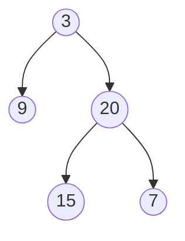

# Maximum Depth of Binary Tree

## Problem

Given the root of a binary tree, find its maximum depth. The maximum depth is the number of nodes along the longest path from the root node all the way down to the farthest leaf node. In other words, it's a count of levels in the tree, where the root is at level 1.

A leaf node is a node with no children (both left and right children are null). The depth is measured by counting nodes, not edges. So a tree with just a root node has a depth of 1, and a tree with a root and one child has a depth of 2.

**Key points:**
- An empty tree (null root) has depth 0
- A single node (the root alone) has depth 1
- The depth is the maximum of (left subtree depth, right subtree depth) plus 1 for the current node
- You need to explore all paths to find the deepest one

**Example:**



Input: root = [3,9,20,null,null,15,7]
Output: 3

The longest path is: 3 → 20 → 15 (or 3 → 20 → 7), which contains 3 nodes.

**Another example:**
```
Input: root = [1, null, 2]
    1
     \
      2
Output: 2 (path: 1 → 2)
```


## Why This Matters

Computing tree depth is a fundamental operation used in assessing tree balance (balanced trees like AVL trees maintain logarithmic depth), optimizing database indexes, and analyzing algorithm complexity. Tree depth directly impacts performance: a search in a balanced tree takes O(log n) time, while in a skewed tree (effectively a linked list) it degrades to O(n). This problem introduces you to the elegant recursive structure of trees: the depth of a tree is simply one plus the maximum depth of its subtrees. This recursive decomposition pattern is the foundation for solving hundreds of tree problems and appears in divide-and-conquer algorithms throughout computer science. Understanding depth calculations also helps you reason about stack overflow risks in recursive algorithms and when to switch to iterative approaches.

## Examples

**Example 1:**
- Input: `root = [1,null,2]`
- Output: `2`

## Constraints

- The number of nodes in the tree is in the range [0, 10⁴].
- -100 <= Node.val <= 100

## Think About

1. What's the brute force approach? What's its time complexity?
2. Can you identify any patterns in the examples?
3. What data structure would help organize the information?

## Approach Hints

<details>
<summary>💡 Hint 1: Recursive Definition</summary>

The depth (or height) of a tree is defined recursively:
- Depth of an empty tree (null) is 0
- Depth of a tree with root is 1 + max(depth of left subtree, depth of right subtree)

For a leaf node, both subtrees are null, so depth = 1 + max(0, 0) = 1.

Can you express this as a simple recursive function?

</details>

<details>
<summary>🎯 Hint 2: DFS vs BFS Approaches</summary>

Two main approaches:

**DFS (Depth-First Search):**
- Recursively find depth of left and right subtrees
- Return 1 + max of the two depths
- Natural and elegant solution

**BFS (Breadth-First Search):**
- Use a queue to traverse level by level
- Count the number of levels
- Useful when you need level information

Which approach feels more natural for this problem?

</details>

<details>
<summary>📝 Hint 3: Implementation Approaches</summary>

**Recursive DFS:**
```
function maxDepth(root):
    if root is null:
        return 0

    left_depth = maxDepth(root.left)
    right_depth = maxDepth(root.right)

    return 1 + max(left_depth, right_depth)
```

**Iterative BFS:**
```
if root is null:
    return 0

queue = [(root, 1)]  # (node, depth)
max_depth = 0

while queue is not empty:
    node, depth = queue.pop()
    max_depth = max(max_depth, depth)

    if node.left:
        queue.append((node.left, depth + 1))
    if node.right:
        queue.append((node.right, depth + 1))

return max_depth
```

**Iterative BFS (Level by Level):**
```
if root is null:
    return 0

queue = [root]
depth = 0

while queue is not empty:
    depth += 1
    level_size = len(queue)

    for i in range(level_size):
        node = queue.pop(0)
        if node.left:
            queue.append(node.left)
        if node.right:
            queue.append(node.right)

return depth
```

</details>

## Complexity Analysis

| Approach | Time | Space | Notes |
|----------|------|-------|-------|
| **Recursive DFS** | **O(n)** | **O(h)** | **h is height, worst case O(n) for skewed tree** |
| Iterative DFS (Stack) | O(n) | O(h) | Explicit stack |
| Iterative BFS (Queue) | O(n) | O(w) | w is max width, worst case O(n) |

## Common Mistakes

### 1. Not Handling Null Root
```python
# WRONG: Crashes on null root
def maxDepth(root):
    left = maxDepth(root.left)   # root.left crashes if root is None
    right = maxDepth(root.right)
    return 1 + max(left, right)

# CORRECT: Check null first
def maxDepth(root):
    if not root:
        return 0
    left = maxDepth(root.left)
    right = maxDepth(root.right)
    return 1 + max(left, right)
```

### 2. Returning Depth Instead of Incrementing
```python
# WRONG: Returns max child depth without adding current level
def maxDepth(root):
    if not root:
        return 0
    left = maxDepth(root.left)
    right = maxDepth(root.right)
    return max(left, right)  # Missing + 1

# CORRECT: Add 1 for current node
def maxDepth(root):
    if not root:
        return 0
    left = maxDepth(root.left)
    right = maxDepth(root.right)
    return 1 + max(left, right)
```

### 3. BFS Not Tracking Levels Correctly
```python
# WRONG: Doesn't properly count levels
def maxDepth(root):
    if not root:
        return 0
    queue = [root]
    depth = 0
    while queue:
        node = queue.pop(0)
        depth += 1  # Increments for each node, not level!
        if node.left:
            queue.append(node.left)
        if node.right:
            queue.append(node.right)
    return depth

# CORRECT: Process level by level
def maxDepth(root):
    if not root:
        return 0
    queue = [root]
    depth = 0
    while queue:
        depth += 1
        level_size = len(queue)
        for _ in range(level_size):
            node = queue.pop(0)
            if node.left:
                queue.append(node.left)
            if node.right:
                queue.append(node.right)
    return depth
```

## Variations

| Variation | Change | Approach Adjustment |
|-----------|--------|---------------------|
| Minimum depth | Shortest path to leaf | BFS stops at first leaf; DFS takes min instead of max |
| Diameter of tree | Longest path between any two nodes | At each node, track left_depth + right_depth |
| Maximum width | Max nodes at any level | BFS, track max queue size per level |
| Balanced tree check | Depth difference ≤ 1 everywhere | Track depths and check difference at each node |
| Count nodes at depth k | Nodes at specific level | BFS with level counter or DFS with depth parameter |
| Path to deepest node | Return path to deepest leaf | Track path during DFS, return when max depth found |

## Practice Checklist

**Correctness:**
- [ ] Handles null root (returns 0)
- [ ] Handles single node (returns 1)
- [ ] Handles skewed tree (all left or all right)
- [ ] Handles balanced tree
- [ ] Returns correct depth for example trees

**Interview Readiness:**
- [ ] Can explain approach in 2 minutes
- [ ] Can code recursive solution in 3 minutes
- [ ] Can code iterative BFS solution in 7 minutes
- [ ] Can discuss time/space complexity
- [ ] Can handle follow-up about minimum depth

**Spaced Repetition Tracker:**
- [ ] Day 1: Initial solve
- [ ] Day 3: Solve without hints
- [ ] Day 7: Solve variations
- [ ] Day 14: Explain to someone
- [ ] Day 30: Quick review

---

**Strategy**: See [Tree Traversal](../../prerequisites/trees.md)
