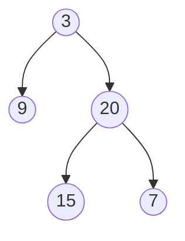
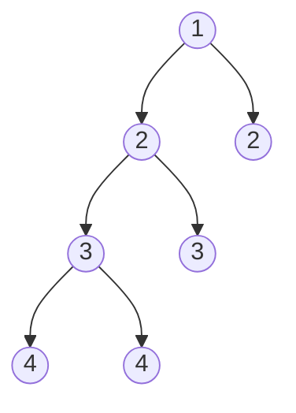

# Balanced Binary Tree

## Problem

A **height-balanced binary tree** is one where, for every node, the heights of its left and right subtrees differ by at most 1. Think of it like a well-balanced mobile sculpture where no branch is drastically longer than its sibling.

Given the root of a binary tree, determine if the tree is height-balanced.

**What's tree height?** The height of a node is the number of edges on the longest path from that node down to a leaf. An empty tree has height 0, a single node has height 0, and a node with children has height 1 + max(left height, right height).

**Watch out for:** A tree can have balanced children but still be unbalanced overall. You need to check balance at every level, not just the root.

**Diagram:**

Example 1: Balanced tree [3,9,20,null,null,15,7] - Returns true



Example 2: Unbalanced tree [1,2,2,3,3,null,null,4,4] - Returns false




## Why This Matters

Balanced trees are crucial in database indexing and search systems. Self-balancing trees like AVL trees and Red-Black trees maintain this property to guarantee O(log n) search times. If a binary search tree becomes too unbalanced, it degrades to O(n) performance - essentially becoming a linked list.

This problem teaches you to think recursively about tree properties and recognize when to propagate information bottom-up. The pattern of "check a property while computing a value" appears frequently in tree algorithms.

## Examples

**Example 1:**
- Input: `root = []`
- Output: `true`

## Constraints

- The number of nodes in the tree is in the range [0, 5000].
- -10⁴ <= Node.val <= 10⁴

## Think About

1. What's the brute force approach? What's its time complexity?
2. Can you identify any patterns in the examples?
3. What data structure would help organize the information?

## Approach Hints

<details>
<summary>💡 Hint 1: Understanding Balance</summary>

A tree is balanced if, for every node, the heights of its left and right subtrees differ by at most 1. Think about how you can compute the height of a subtree. What information do you need to determine if a node is balanced?

</details>

<details>
<summary>🎯 Hint 2: Recursive Height Calculation</summary>

You can use a depth-first approach where you calculate the height of each subtree recursively. At each node, compute the heights of the left and right children. If the difference is greater than 1, the tree is unbalanced. How can you efficiently detect imbalance early without checking every node unnecessarily?

</details>

<details>
<summary>📝 Hint 3: Bottom-up Approach</summary>

Use a helper function that returns both the height and balance status:
1. Base case: If node is null, return height 0 and balanced = true
2. Recursively get left subtree height and balance status
3. Recursively get right subtree height and balance status
4. If either subtree is unbalanced OR |left_height - right_height| > 1, mark as unbalanced
5. Return height as max(left_height, right_height) + 1
6. Return balance status

Alternatively, return -1 as a sentinel value to indicate imbalance and propagate it up.

</details>

## Complexity Analysis

| Approach | Time | Space | Notes |
|----------|------|-------|-------|
| Naive (check each node) | O(n²) | O(h) | Recalculate heights for each node |
| **Optimal (bottom-up)** | **O(n)** | **O(h)** | Calculate height once per node, h = tree height |

## Common Mistakes

### 1. Recalculating heights multiple times
```python
# WRONG: Calculating height separately for each node leads to O(n²)
def isBalanced(root):
    if not root:
        return True
    left_height = height(root.left)
    right_height = height(root.right)
    return abs(left_height - right_height) <= 1 and \
           isBalanced(root.left) and isBalanced(root.right)

# CORRECT: Calculate height and check balance in one pass
def isBalanced(root):
    def check_height(node):
        if not node:
            return 0
        left_h = check_height(node.left)
        if left_h == -1:
            return -1  # Early exit
        right_h = check_height(node.right)
        if right_h == -1:
            return -1
        if abs(left_h - right_h) > 1:
            return -1
        return max(left_h, right_h) + 1

    return check_height(root) != -1
```

### 2. Forgetting null checks
```python
# WRONG: Not handling empty tree
def isBalanced(root):
    left_h = height(root.left)
    right_h = height(root.right)
    # Will crash on empty tree!

# CORRECT: Handle base case
def isBalanced(root):
    if not root:
        return True
    # Then proceed with checks
```

### 3. Not propagating imbalance upward
```python
# WRONG: Checking only current node
def isBalanced(root):
    if not root:
        return True
    left_h = height(root.left)
    right_h = height(root.right)
    return abs(left_h - right_h) <= 1
    # Missing: check if subtrees themselves are balanced!

# CORRECT: Check subtree balance recursively
def isBalanced(root):
    return check_height(root) != -1
    # Where check_height propagates -1 for any imbalance
```

## Variations

| Variation | Change | Approach Adjustment |
|-----------|--------|---------------------|
| k-balanced tree | Heights can differ by up to k | Change condition from `abs(diff) > 1` to `abs(diff) > k` |
| Return imbalanced node | Find first unbalanced node | Store reference to node when imbalance detected |
| Count balanced nodes | Count all balanced subtrees | Return count instead of boolean |
| N-ary tree balance | Tree with multiple children | Check balance for all child pairs or use different balance definition |

## Practice Checklist

**Correctness:**
- [ ] Handles empty tree (returns true)
- [ ] Handles single node (returns true)
- [ ] Detects unbalanced left-heavy trees
- [ ] Detects unbalanced right-heavy trees
- [ ] Returns correct result for balanced trees

**Interview Readiness:**
- [ ] Can explain approach in 2 minutes
- [ ] Can code solution in 10 minutes
- [ ] Can discuss time/space complexity
- [ ] Can explain why O(n) is optimal

**Spaced Repetition Tracker:**
- [ ] Day 1: Initial solve
- [ ] Day 3: Solve without hints
- [ ] Day 7: Solve variations (k-balanced)
- [ ] Day 14: Explain to someone
- [ ] Day 30: Quick review

---

**Strategy**: See [Tree Pattern](../../prerequisites/trees.md)
