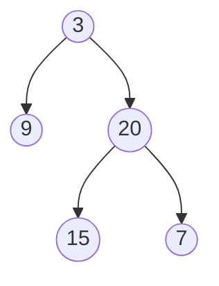

# Minimum Depth of Binary Tree

## Problem

Given a binary tree, find the **minimum depth** - the shortest path from the root to any leaf node.

**Important distinction:** Depth is measured by counting nodes (not edges) along the path. A single node has depth 1, and each step deeper adds 1.

**What's a leaf node?** A node with NO children at all. Both left and right pointers are null. This is crucial - a node with only one child is NOT a leaf.

For example, in a tree that looks like a straight line going left [1, 2, null], the minimum depth is 2 (root→left child), not 1. The root isn't a leaf because it has a left child.

**Why this matters:** This catches many people off guard. Make sure your solution distinguishes between "null child" and "leaf node".

**Diagram:**

Example: Input: root = [3,9,20,null,null,15,7], Output: 2



The minimum depth is 2 (path: 3 -> 9)


## Why This Matters

Finding minimum depth is essential in game trees (chess, checkers) and decision trees where you want the quickest path to a conclusion. In AI search algorithms, this represents the shallowest winning move or fastest solution.

This problem also teaches you when to choose BFS over DFS. While many tree problems favor DFS (simpler recursion), BFS wins here because it can stop immediately upon finding the first leaf - no need to explore deeper levels.

## Examples

**Example 1:**
- Input: `root = [2,null,3,null,4,null,5,null,6]`
- Output: `5`

## Constraints

- The number of nodes in the tree is in the range [0, 10⁵].
- -1000 <= Node.val <= 1000

## Think About

1. What's the brute force approach? What's its time complexity?
2. Can you identify any patterns in the examples?
3. What data structure would help organize the information?

## Approach Hints

<details>
<summary>💡 Hint 1: What is a Leaf Node?</summary>

The minimum depth is the shortest path from root to a leaf node. A leaf node is a node with NO children (both left and right are null). Be careful: a node with only one child is NOT a leaf. How does this affect your recursion?

</details>

<details>
<summary>🎯 Hint 2: BFS vs DFS Trade-offs</summary>

Two approaches exist:
- **BFS (Level-order)**: Traverse level by level. The first leaf you encounter is guaranteed to be at minimum depth. This can be more efficient for wide, shallow trees.
- **DFS (Recursive)**: Explore all paths and return the minimum. Simpler to code but explores unnecessary paths.

Which approach terminates earlier when the minimum depth is shallow?

</details>

<details>
<summary>📝 Hint 3: Implementation Strategies</summary>

**BFS Approach:**
1. Use a queue with (node, depth) pairs
2. Start with root at depth 1
3. For each node, check if it's a leaf (no children)
4. If leaf, return current depth immediately
5. Otherwise, add children to queue with depth + 1

**DFS Approach:**
1. Base case: if node is null, return 0
2. If node has no left child, return 1 + minDepth(right)
3. If node has no right child, return 1 + minDepth(left)
4. If both children exist, return 1 + min(minDepth(left), minDepth(right))

Note the special handling for nodes with one child!

</details>

## Complexity Analysis

| Approach | Time | Space | Notes |
|----------|------|-------|-------|
| DFS (Recursive) | O(n) | O(h) | h = tree height, worst case visits all nodes |
| **BFS (Level-order)** | **O(n)** | **O(w)** | w = max width, stops at first leaf (better for shallow min) |

## Common Mistakes

### 1. Treating one-child nodes as leaves
```python
# WRONG: Incorrectly handles nodes with one child
def minDepth(root):
    if not root:
        return 0
    if not root.left or not root.right:
        return 1  # WRONG: node with one child is not a leaf!
    return 1 + min(minDepth(root.left), minDepth(root.right))

# CORRECT: Only both null means we should return 0
def minDepth(root):
    if not root:
        return 0
    if not root.left:
        return 1 + minDepth(root.right)
    if not root.right:
        return 1 + minDepth(root.left)
    return 1 + min(minDepth(root.left), minDepth(root.right))
```

### 2. Using max instead of special cases
```python
# WRONG: Returns 0 for single-child paths
def minDepth(root):
    if not root:
        return 0
    left = minDepth(root.left)
    right = minDepth(root.right)
    return 1 + min(left, right)  # min(0, depth) = 0, incorrect!

# CORRECT: Handle zero values specially
def minDepth(root):
    if not root:
        return 0
    left = minDepth(root.left)
    right = minDepth(root.right)
    if left == 0:
        return 1 + right
    if right == 0:
        return 1 + left
    return 1 + min(left, right)
```

### 3. Not using BFS for early termination
```python
# SUBOPTIMAL: DFS always explores full tree
def minDepth(root):
    # recursive DFS...
    # No early exit possible

# BETTER: BFS stops at first leaf
def minDepth(root):
    if not root:
        return 0
    queue = [(root, 1)]
    while queue:
        node, depth = queue.pop(0)
        if not node.left and not node.right:
            return depth  # First leaf found!
        if node.left:
            queue.append((node.left, depth + 1))
        if node.right:
            queue.append((node.right, depth + 1))
```

## Variations

| Variation | Change | Approach Adjustment |
|-----------|--------|---------------------|
| Maximum depth | Find deepest leaf | Use max instead of min, no special one-child handling |
| Path to minimum leaf | Return actual path | Store parent pointers or path in BFS |
| K-th minimum depth | Find k-th shallowest leaf | Use BFS, count leaves until k-th found |
| Sum of all leaf depths | Sum depths of all leaves | DFS tracking all leaf depths |

## Practice Checklist

**Correctness:**
- [ ] Handles empty tree (returns 0)
- [ ] Handles single node (returns 1)
- [ ] Handles skewed tree (only left or right children)
- [ ] Handles complete binary tree
- [ ] Distinguishes leaves from one-child nodes

**Interview Readiness:**
- [ ] Can explain both BFS and DFS approaches
- [ ] Can code solution in 10 minutes
- [ ] Can discuss which approach is better when
- [ ] Can explain the one-child edge case

**Spaced Repetition Tracker:**
- [ ] Day 1: Initial solve
- [ ] Day 3: Solve without hints (both BFS and DFS)
- [ ] Day 7: Solve variations (maximum depth)
- [ ] Day 14: Explain to someone
- [ ] Day 30: Quick review

---

**Strategy**: See [Tree Pattern](../../strategies/data-structures/trees.md)
