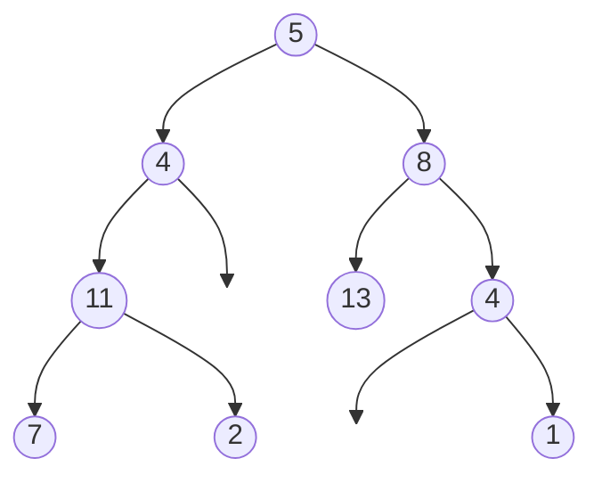
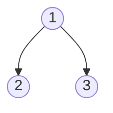

# Path Sum

## Problem

Given a binary tree and a target sum, determine if there exists a **root-to-leaf path** where the sum of all node values equals the target.

**What's a root-to-leaf path?** A sequence of nodes starting at the root and ending at a leaf (node with no children). You must travel downward following parent-child links - no skipping nodes or going sideways.

**Critical detail:** The path MUST end at a leaf. If you reach the target sum at an internal node (one that has children), that doesn't count. For example, if the tree is [5, 4, 8] with target 5, the answer is false even though the root equals 5, because the root isn't a leaf.

**Watch out for:** Negative numbers are allowed in both the tree and the target sum. You can't stop early when you reach the target - you must continue to a leaf.

**Diagram:**

Example 1: Input: root = [5,4,8,11,null,13,4,7,2,null,null,null,1], targetSum = 22
Output: true (Path: 5 -> 4 -> 11 -> 2 = 22)



Example 2: Input: root = [1,2,3], targetSum = 5
Output: false




## Why This Matters

Path sum problems model real-world scenarios like budget allocation, resource planning, and game tree evaluation. For example, determining if a sequence of financial transactions reaches a target balance, or if a series of moves in a game achieves a winning score.

This problem teaches you the fundamental "accumulate and check at endpoint" pattern used throughout tree algorithms. The technique of tracking a running sum while traversing appears in more complex problems like finding all paths, maximum path sums, and tree diameter calculations.

## Examples

**Example 1:**
- Input: `root = [], targetSum = 0`
- Output: `false`
- Explanation: Since the tree is empty, there are no root-to-leaf paths.

## Constraints

- The number of nodes in the tree is in the range [0, 5000].
- -1000 <= Node.val <= 1000
- -1000 <= targetSum <= 1000

## Think About

1. What's the brute force approach? What's its time complexity?
2. Can you identify any patterns in the examples?
3. What data structure would help organize the information?

## Approach Hints

<details>
<summary>💡 Hint 1: Leaf Node Definition</summary>

Remember: a path must end at a LEAF node (node with no children). A node with one child is NOT a leaf. How does your recursion need to check for this condition? What happens if you reach the target sum at an internal node?

</details>

<details>
<summary>🎯 Hint 2: Tracking Remaining Sum</summary>

Instead of tracking the current sum, track the remaining sum needed. At each node, subtract the current node's value from the target. When you reach a leaf, check if the remaining sum equals the leaf's value. This simplifies the logic. Can you express this recursively?

</details>

<details>
<summary>📝 Hint 3: Recursive Implementation</summary>

```
function hasPathSum(node, remainingSum):
    1. Base case: if node is null, return false

    2. Update remaining sum: remainingSum -= node.val

    3. Leaf check: if node is a leaf (no children):
         return remainingSum == 0

    4. Recursive case: check both subtrees
         return hasPathSum(node.left, remainingSum) OR
                hasPathSum(node.right, remainingSum)
```

Key insight: Use OR because we only need ONE valid path, not all paths.

</details>

## Complexity Analysis

| Approach | Time | Space | Notes |
|----------|------|-------|-------|
| DFS (Recursive) | O(n) | O(h) | h = tree height, worst case O(n) for skewed tree |
| BFS (Iterative) | O(n) | O(w) | w = max width, uses queue with (node, sum) pairs |

## Common Mistakes

### 1. Not checking for leaf nodes
```python
# WRONG: Checks sum at any node, not just leaves
def hasPathSum(root, targetSum):
    if not root:
        return False
    if root.val == targetSum:
        return True  # WRONG: might not be a leaf!
    return hasPathSum(root.left, targetSum - root.val) or \
           hasPathSum(root.right, targetSum - root.val)

# CORRECT: Check if node is a leaf
def hasPathSum(root, targetSum):
    if not root:
        return False
    targetSum -= root.val
    if not root.left and not root.right:  # Leaf check
        return targetSum == 0
    return hasPathSum(root.left, targetSum) or \
           hasPathSum(root.right, targetSum)
```

### 2. Incorrect empty tree handling
```python
# WRONG: Empty tree with targetSum=0 should return False
def hasPathSum(root, targetSum):
    if not root:
        return targetSum == 0  # WRONG: no path exists!

# CORRECT: Empty tree always returns False
def hasPathSum(root, targetSum):
    if not root:
        return False
```

### 3. Not subtracting current node value
```python
# WRONG: Passing original targetSum to children
def hasPathSum(root, targetSum):
    if not root:
        return False
    if not root.left and not root.right:
        return root.val == targetSum
    return hasPathSum(root.left, targetSum) or \
           hasPathSum(root.right, targetSum)
    # Missing: targetSum - root.val in recursive calls

# CORRECT: Subtract current value
def hasPathSum(root, targetSum):
    if not root:
        return False
    targetSum -= root.val
    if not root.left and not root.right:
        return targetSum == 0
    return hasPathSum(root.left, targetSum) or \
           hasPathSum(root.right, targetSum)
```

## Variations

| Variation | Change | Approach Adjustment |
|-----------|--------|---------------------|
| Path Sum II | Return all paths with sum | Store paths during DFS, use backtracking |
| Path Sum III | Paths don't need to start at root | DFS from every node as potential starting point |
| Maximum path sum | Find path with max sum | Track max at each node, consider both subtrees |
| Path with product | Multiply instead of sum | Track product instead of sum, handle zeros |
| K paths with sum | Find k different paths | Use DFS with counter, continue after finding paths |

## Practice Checklist

**Correctness:**
- [ ] Handles empty tree (returns false)
- [ ] Handles single node matching target
- [ ] Handles single node not matching target
- [ ] Distinguishes leaves from internal nodes
- [ ] Handles negative values in tree and target

**Interview Readiness:**
- [ ] Can explain approach in 2 minutes
- [ ] Can code solution in 8 minutes
- [ ] Can discuss why leaf check is critical
- [ ] Can extend to Path Sum II variation

**Spaced Repetition Tracker:**
- [ ] Day 1: Initial solve
- [ ] Day 3: Solve without hints
- [ ] Day 7: Solve Path Sum II (all paths)
- [ ] Day 14: Explain to someone
- [ ] Day 30: Quick review

---

**Strategy**: See [Tree Pattern](../../prerequisites/trees.md)
