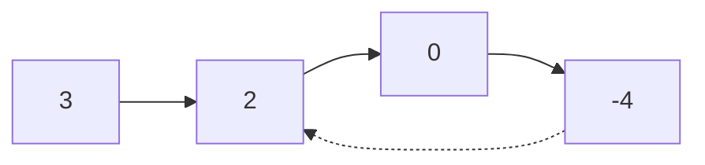
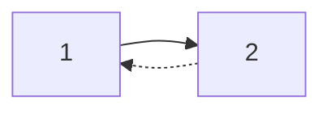
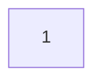

# Linked List Cycle

## Problem

Given the head of a linked list, determine if the list contains a cycle. A cycle exists when a node's next pointer points back to a previous node in the list, creating a loop.

Think of it like following a chain of rooms where each room has a door to the next room. If you eventually walk through a door and find yourself in a room you've already visited, there's a cycle. If you reach a room with no next door (null), there's no cycle.

The naive approach is to track every node you visit in a set. When you encounter a node already in the set, you've found a cycle. This works but uses O(n) extra space.

**The elegant solution:** Use two pointers moving at different speeds. Imagine two runners on a circular track versus a straight path. On a circular track, the faster runner will eventually lap the slower one. On a straight path, the faster runner just reaches the end first.

**Watch out for:**
- Empty lists and single-node lists with no cycle.
- A node pointing to itself creates a cycle of length 1.
- Compare node references, not node values (values can be duplicated).

**Diagram:**

Example 1 (cycle exists):


Example 2 (cycle exists):


Example 3 (no cycle):



## Why This Matters

This teaches Floyd's Cycle Detection algorithm (tortoise and hare), which appears in:
- Detecting infinite loops in state machines and workflows
- Finding duplicate entries in sequences with constant space
- Analyzing periodic patterns in numerical sequences
- Cycle detection in dependency graphs (circular dependencies)

The two-pointer technique with different speeds is a fundamental pattern used beyond linked lists in array problems, finding duplicates, and mathematical algorithms. Understanding this builds intuition for space-optimized solutions to problems that seem to require extra storage.

## Constraints

- The number of the nodes in the list is in the range [0, 10⁴].
- -10⁵ <= Node.val <= 10⁵
- pos is -1 or a **valid index** in the linked-list.

## Think About

1. What's the brute force approach? What's its time complexity?
2. Can you identify any patterns in the examples?
3. What data structure would help organize the information?

## Approach Hints

<details>
<summary>💡 Hint 1: How to Detect a Loop</summary>

If there's a cycle, a node will eventually point back to a previously visited node. How can you keep track of which nodes you've already seen? What's the trade-off between time and space?

Alternatively, think about what happens if two runners start at the same position but move at different speeds. What happens when they're on a circular track?

</details>

<details>
<summary>🎯 Hint 2: Floyd's Cycle Detection (Tortoise and Hare)</summary>

Use two pointers moving at different speeds:
- Slow pointer moves one step at a time
- Fast pointer moves two steps at a time

If there's a cycle, the fast pointer will eventually catch up to the slow pointer (they'll meet). If there's no cycle, the fast pointer will reach the end (null).

Why does this work? In a cycle, the fast pointer gains one position on the slow pointer with each iteration, so it must eventually catch up.

</details>

<details>
<summary>📝 Hint 3: Step-by-Step Algorithm</summary>

```
1. Initialize two pointers: slow = head, fast = head
2. While fast is not null and fast.next is not null:
   a. Move slow one step: slow = slow.next
   b. Move fast two steps: fast = fast.next.next
   c. If slow == fast, return true (cycle detected)
3. Return false (reached end, no cycle)
```

Time complexity: O(n)
Space complexity: O(1)

Alternative O(n) space approach: Use a hash set to track visited nodes.

</details>

## Complexity Analysis

| Approach | Time | Space | Notes |
|----------|------|-------|-------|
| Hash Set | O(n) | O(n) | Store visited nodes in set |
| **Two Pointers (Floyd's)** | **O(n)** | **O(1)** | Fast/slow pointers; optimal solution |
| Modify List | O(n) | O(1) | Mark visited nodes (destructive) |

## Common Mistakes

### 1. Not Checking for Null Before Moving Fast Pointer
```python
# WRONG: Will crash if fast.next is null
while fast:
    slow = slow.next
    fast = fast.next.next  # Crashes if fast.next is null

# CORRECT: Check both fast and fast.next
while fast and fast.next:
    slow = slow.next
    fast = fast.next.next
```

### 2. Checking Equality Before Moving Pointers
```python
# WRONG: Checks before first move, always returns true
slow, fast = head, head
while fast and fast.next:
    if slow == fast:
        return True
    slow = slow.next
    fast = fast.next.next

# CORRECT: Move first, then check
slow, fast = head, head
while fast and fast.next:
    slow = slow.next
    fast = fast.next.next
    if slow == fast:
        return True
return False
```

### 3. Using Node Values Instead of References
```python
# WRONG: Comparing values (nodes can have duplicate values)
if slow.val == fast.val:
    return True

# CORRECT: Compare node references
if slow == fast:
    return True
```

## Variations

| Variation | Change | Approach Adjustment |
|-----------|--------|---------------------|
| Find Cycle Start | Return node where cycle begins | After detecting cycle, use Floyd's algorithm phase 2 |
| Cycle Length | Find length of the cycle | After meeting, count steps until they meet again |
| Remove Cycle | Break the cycle | Find cycle start, then set previous node's next to null |
| Intersection Point | Find where two lists intersect | Similar two-pointer technique with length adjustment |

## Practice Checklist

**Correctness:**
- [ ] Handles empty list (null head)
- [ ] Handles single node with no cycle
- [ ] Handles single node pointing to itself
- [ ] Handles cycle at different positions
- [ ] Handles no cycle (linear list)

**Interview Readiness:**
- [ ] Can explain approach in 2 minutes
- [ ] Can code solution in 10 minutes
- [ ] Can draw diagram showing pointer movement
- [ ] Can explain why fast pointer catches slow

**Spaced Repetition Tracker:**
- [ ] Day 1: Initial solve
- [ ] Day 3: Solve without hints
- [ ] Day 7: Solve variations
- [ ] Day 14: Explain to someone
- [ ] Day 30: Quick review

---

**Strategy**: See [Linked List Pattern](../../strategies/data-structures/linked-lists.md)
