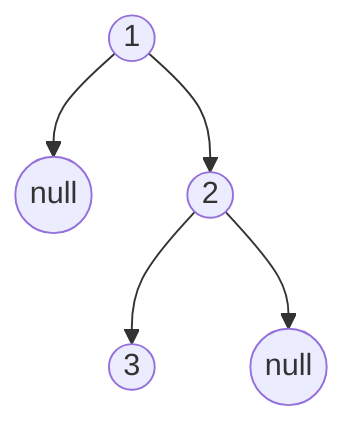

# Binary Tree Preorder Traversal

## Problem

Given the root of a binary tree, return the values of its nodes in preorder traversal order.

**Preorder traversal** means visiting nodes in this sequence: Root → Left subtree → Right subtree. You process the current node first, then recursively traverse its left child's subtree, and finally the right child's subtree.

Think of it like reading a family tree: you meet the parent first, then all descendants on the left side, then all descendants on the right side.

For example, given this tree:
```
    1
     \
      2
     /
    3
```

Preorder visits: 1 (root), then 2 (right child of 1), then 3 (left child of 2), giving [1, 2, 3].

You can solve this two ways:
1. **Recursively:** Natural fit since trees are recursive structures.
2. **Iteratively:** Using a stack to simulate the function call stack, useful if recursion depth is a concern.

**Watch out for:**
- Empty trees (null root) should return an empty array.
- The order matters: visiting the root before its children distinguishes preorder from inorder and postorder.

**Diagram:**



Example tree: `[1,null,2,3]`


## Why This Matters

Preorder traversal is used in:
- Creating a copy of a tree (you need to create parent nodes before children)
- Prefix expression evaluation in compilers
- Serializing tree structures for storage or transmission
- File system traversals where you process directories before their contents

Learning the three traversal patterns (preorder, inorder, postorder) builds foundational understanding for depth-first search in graphs, expression tree evaluation, and understanding how recursion maps to iterative solutions with explicit stacks.

## Examples

**Example 1:**
- Input: `root = []`
- Output: `[]`

**Example 2:**
- Input: `root = [1]`
- Output: `[1]`

## Constraints

- The number of nodes in the tree is in the range [0, 100].
- -100 <= Node.val <= 100

## Think About

1. What's the brute force approach? What's its time complexity?
2. Can you identify any patterns in the examples?
3. What data structure would help organize the information?

## Approach Hints

<details>
<summary>💡 Hint 1: Understanding Preorder Traversal</summary>

Preorder means "visit the current node BEFORE visiting its children." The order is: Root → Left → Right.

For a tree with root 1, left child 2, right child 3:
- Visit 1 first (root)
- Then visit left subtree (2 and its children)
- Then visit right subtree (3 and its children)

Can you think of a way to implement this naturally using function calls? What about without recursion?

</details>

<details>
<summary>🎯 Hint 2: Recursive vs Iterative Approach</summary>

**Recursive approach**: The structure of recursion naturally matches tree traversal:
1. If node is null, return
2. Add current node's value to result
3. Recursively traverse left subtree
4. Recursively traverse right subtree

**Iterative approach**: Use a stack to simulate the recursion:
1. Push root onto stack
2. While stack not empty:
   - Pop node and add its value
   - Push right child (so left is processed first)
   - Push left child

Why push right before left? Stack is LIFO (Last In, First Out).

</details>

<details>
<summary>📝 Hint 3: Step-by-Step Algorithms</summary>

**Recursive:**
```
function preorder(node, result):
    if node is null:
        return
    result.append(node.val)
    preorder(node.left, result)
    preorder(node.right, result)
```

**Iterative:**
```
1. If root is null, return []
2. Create empty result array and stack
3. Push root onto stack
4. While stack is not empty:
   a. Pop node from stack
   b. Add node.val to result
   c. If node.right exists, push to stack
   d. If node.left exists, push to stack
5. Return result
```

Time: O(n), Space: O(h) where h is height

</details>

## Complexity Analysis

| Approach | Time | Space | Notes |
|----------|------|-------|-------|
| **Recursive** | **O(n)** | **O(h)** | h = tree height; call stack space |
| **Iterative (Stack)** | **O(n)** | **O(h)** | Explicit stack instead of call stack |
| Morris Traversal | O(n) | O(1) | Modifies tree temporarily; rare in interviews |

## Common Mistakes

### 1. Wrong Order in Recursive Call
```python
# WRONG: This is inorder, not preorder
def preorder(node):
    if not node:
        return
    preorder(node.left)
    result.append(node.val)  # Should be first, not middle
    preorder(node.right)

# CORRECT: Visit root first
def preorder(node):
    if not node:
        return
    result.append(node.val)  # Root first
    preorder(node.left)
    preorder(node.right)
```

### 2. Pushing to Stack in Wrong Order
```python
# WRONG: Left will be processed after right
stack.append(node.left)
stack.append(node.right)

# CORRECT: Right first so left is processed first (LIFO)
if node.right:
    stack.append(node.right)
if node.left:
    stack.append(node.left)
```

### 3. Not Handling Empty Tree
```python
# WRONG: Crashes on null root
stack = [root]
while stack:
    node = stack.pop()

# CORRECT: Check for null root
if not root:
    return []
stack = [root]
```

## Variations

| Variation | Change | Approach Adjustment |
|-----------|--------|---------------------|
| Inorder Traversal | Left → Root → Right | Move result.append after left recursion |
| Postorder Traversal | Left → Right → Root | Move result.append after both recursions |
| Level Order | Level by level | Use queue (BFS) instead of stack |
| N-ary Tree | Multiple children | Loop through all children instead of just left/right |

## Practice Checklist

**Correctness:**
- [ ] Handles empty tree (null root)
- [ ] Handles single node
- [ ] Handles left-skewed tree
- [ ] Handles right-skewed tree
- [ ] Handles balanced tree
- [ ] Returns values in correct order

**Interview Readiness:**
- [ ] Can explain approach in 2 minutes
- [ ] Can code recursive solution in 5 minutes
- [ ] Can code iterative solution in 10 minutes
- [ ] Can explain when to use each approach
- [ ] Can draw traversal on example tree

**Spaced Repetition Tracker:**
- [ ] Day 1: Initial solve
- [ ] Day 3: Solve without hints
- [ ] Day 7: Solve variations
- [ ] Day 14: Explain to someone
- [ ] Day 30: Quick review

---

**Strategy**: See [Tree Pattern](../../prerequisites/trees.md)
