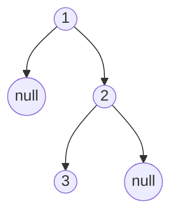

# Binary Tree Postorder Traversal

## Problem

Given the root of a binary tree, return the values of its nodes in postorder traversal order.

**Postorder traversal** means visiting nodes in this sequence: Left subtree → Right subtree → Root. You process both children completely before visiting the current node.

Think of it like cleaning up a file system: you must delete all files in subdirectories before you can delete the parent directory itself.

For example, given this tree:
```
    1
     \
      2
     /
    3
```

Postorder visits: 3 (left child of 2), then 2 (right child of 1), then 1 (root), giving [3, 2, 1].

This traversal is particularly useful when you need to process or compute something about child nodes before handling the parent. Examples include calculating tree height, deleting trees safely, or evaluating postfix expressions.

You can solve this two ways:
1. **Recursively:** Very natural since you just recurse on children first, then process the node.
2. **Iteratively:** Trickier than preorder because you need to visit children before the parent. Common approaches use two stacks or track visited nodes.

**Watch out for:**
- The key difference from preorder: you visit the root last, not first.
- Empty trees return an empty array.

**Diagram:**



Example tree: `[1,null,2,3]`


## Why This Matters

Postorder traversal is essential for:
- Safely deleting trees (must delete children before parent to avoid memory leaks)
- Computing values that depend on children (tree height, subtree sums, validation)
- Evaluating postfix expressions in compilers and calculators
- Dependency resolution (process dependencies before the dependent item)

This pattern teaches bottom-up processing, where you gather information from leaves upward. Combined with preorder (top-down) and inorder (sorted for BSTs), these three traversals form the foundation for understanding tree algorithms and graph depth-first search.

## Examples

**Example 1:**
- Input: `root = []`
- Output: `[]`

**Example 2:**
- Input: `root = [1]`
- Output: `[1]`

## Constraints

- The number of the nodes in the tree is in the range [0, 100].
- -100 <= Node.val <= 100

## Think About

1. What's the brute force approach? What's its time complexity?
2. Can you identify any patterns in the examples?
3. What data structure would help organize the information?

## Approach Hints

<details>
<summary>💡 Hint 1: Understanding Postorder Traversal</summary>

Postorder means "visit the current node AFTER visiting its children." The order is: Left → Right → Root.

For a tree with root 1, left child 2, right child 3:
- Visit left subtree first (2 and its children)
- Then visit right subtree (3 and its children)
- Finally visit the root (1)

This traversal is useful for deleting trees or computing values that depend on children (like tree height). How would you naturally implement this with recursion?

</details>

<details>
<summary>🎯 Hint 2: Recursive vs Iterative Approach</summary>

**Recursive approach**: Very clean and natural:
1. If node is null, return
2. Recursively traverse left subtree
3. Recursively traverse right subtree
4. Add current node's value to result

**Iterative approach**: Trickier than preorder because we need to visit children before the parent. Two methods:
- **Two stacks**: Use one stack for traversal, another to reverse the order
- **One stack + visited tracking**: Keep track of which nodes we've processed children for

The two-stack approach is easier: reverse preorder (root-right-left) to get postorder (left-right-root).

</details>

<details>
<summary>📝 Hint 3: Step-by-Step Algorithms</summary>

**Recursive:**
```
function postorder(node, result):
    if node is null:
        return
    postorder(node.left, result)
    postorder(node.right, result)
    result.append(node.val)  # Visit after children
```

**Iterative (Two Stacks):**
```
1. If root is null, return []
2. Create stack1 for traversal, stack2 for result
3. Push root to stack1
4. While stack1 is not empty:
   a. Pop node from stack1
   b. Push node to stack2
   c. If node.left exists, push to stack1
   d. If node.right exists, push to stack1
5. Pop all from stack2 into result
```

**Iterative (One Stack):**
```
Use a stack and track last visited node
Visit children before parent
```

Time: O(n), Space: O(h)

</details>

## Complexity Analysis

| Approach | Time | Space | Notes |
|----------|------|-------|-------|
| **Recursive** | **O(n)** | **O(h)** | h = tree height; call stack space |
| Iterative (Two Stacks) | O(n) | O(n) | Easier to implement, more space |
| **Iterative (One Stack)** | **O(n)** | **O(h)** | More complex logic, optimal space |
| Morris Traversal | O(n) | O(1) | Modifies tree temporarily; rare in interviews |

## Common Mistakes

### 1. Wrong Order in Recursive Call
```python
# WRONG: This is preorder, not postorder
def postorder(node):
    if not node:
        return
    result.append(node.val)  # Should be last, not first
    postorder(node.left)
    postorder(node.right)

# CORRECT: Visit root last
def postorder(node):
    if not node:
        return
    postorder(node.left)
    postorder(node.right)
    result.append(node.val)  # Root last
```

### 2. Incorrect Two-Stack Implementation
```python
# WRONG: Pushing children in wrong order
stack2.append(node)
if node.right:
    stack1.append(node.right)
if node.left:
    stack1.append(node.left)
# This gives reversed order

# CORRECT: Left first, then right
stack2.append(node)
if node.left:
    stack1.append(node.left)
if node.right:
    stack1.append(node.right)
```

### 3. Forgetting to Reverse or Pop from Second Stack
```python
# WRONG: Using stack2 directly (wrong order)
return stack2

# CORRECT: Pop from stack2 to reverse
while stack2:
    result.append(stack2.pop().val)
return result
```

## Variations

| Variation | Change | Approach Adjustment |
|-----------|--------|---------------------|
| Preorder Traversal | Root → Left → Right | Move result.append to beginning of function |
| Inorder Traversal | Left → Root → Right | Move result.append between left and right recursion |
| Level Order | Level by level | Use queue (BFS) instead of recursion/stack |
| N-ary Tree | Multiple children | Loop through all children before visiting root |
| Delete Tree | Delete all nodes | Use postorder to delete children before parent |

## Practice Checklist

**Correctness:**
- [ ] Handles empty tree (null root)
- [ ] Handles single node
- [ ] Handles left-skewed tree
- [ ] Handles right-skewed tree
- [ ] Handles balanced tree
- [ ] Returns values in correct order (left-right-root)

**Interview Readiness:**
- [ ] Can explain approach in 2 minutes
- [ ] Can code recursive solution in 5 minutes
- [ ] Can code iterative solution in 15 minutes
- [ ] Can explain difference from preorder/inorder
- [ ] Can name use cases (tree deletion, etc.)

**Spaced Repetition Tracker:**
- [ ] Day 1: Initial solve
- [ ] Day 3: Solve without hints
- [ ] Day 7: Solve variations
- [ ] Day 14: Explain to someone
- [ ] Day 30: Quick review

---

**Strategy**: See [Tree Pattern](../../strategies/data-structures/trees.md)
