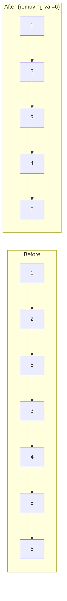

# Remove Linked List Elements

## Problem

Given the head of a linked list and an integer `val`, remove all nodes from the list that have `Node.val == val`, and return the new head of the modified list.

A **linked list** is a sequence of nodes where each node contains:
- A value (data)
- A pointer/reference to the next node in the sequence

**The challenge:** Removing nodes requires careful pointer manipulation. You need to:
1. Identify nodes with the target value
2. Bypass them by updating the previous node's `next` pointer
3. Handle the special case where the head itself needs to be removed

**Example visualization:**
```
Before: 1 → 2 → 6 → 3 → 4 → 5 → 6 (remove val=6)
After:  1 → 2 → 3 → 4 → 5
```

**Watch out for:**
- Multiple consecutive nodes with the target value
- The head node having the target value
- All nodes having the target value (return empty list)
- Empty input list

**Pro tip:** Using a dummy node before the head simplifies the logic by making all deletions uniform—you always modify a previous node's `next` pointer.

## Why This Matters

Linked list manipulation is foundational for understanding pointer-based data structures used throughout computing:
- **Memory management**: Operating systems use linked lists to track free memory blocks
- **Browser history**: Back/forward navigation uses doubly-linked lists
- **Undo/redo functionality**: Many applications maintain action histories as linked structures
- **File systems**: Directory entries and disk block allocation
- **Network protocols**: Packet buffers and queuing systems

The dummy node technique you'll learn here is a professional pattern used to simplify edge case handling in production code. It eliminates special-case logic for head modifications, making code cleaner and less error-prone.

**Diagram:**




## Examples

**Example 1:**
- Input: `head = [], val = 1`
- Output: `[]`

**Example 2:**
- Input: `head = [7,7,7,7], val = 7`
- Output: `[]`

## Constraints

- The number of nodes in the list is in the range [0, 10⁴].
- 1 <= Node.val <= 50
- 0 <= val <= 50

## Think About

1. What's the brute force approach? Why is it inefficient?
2. What property of the input can you exploit?
3. Would sorting or preprocessing help?
4. Can you reduce this to a problem you've seen before?

## Approach Hints

<details>
<summary>💡 Hint 1: Conceptual</summary>

The main challenge is handling removals at the head of the list versus removals in the middle. A dummy node before the head can simplify this by making all removals uniform - you always modify the previous node's next pointer.

</details>

<details>
<summary>🎯 Hint 2: Approach</summary>

Use a dummy node that points to the head. Maintain a current pointer that checks the next node's value. If next node should be removed, skip it by updating current.next = current.next.next. Otherwise, move current forward. This handles all cases uniformly including head removal.

</details>

<details>
<summary>📝 Hint 3: Algorithm</summary>

**With Dummy Node:**
1. Create dummy = new Node(0), dummy.next = head
2. current = dummy
3. While current.next exists:
   - If current.next.val == val:
     - current.next = current.next.next (skip the node)
   - Else:
     - current = current.next (move forward)
4. Return dummy.next

</details>

## Complexity Analysis

| Approach | Time | Space | Notes |
|----------|------|-------|-------|
| **Dummy Node** | **O(n)** | **O(1)** | Single pass, optimal solution |
| Recursive | O(n) | O(n) | Clean but uses call stack |
| Without Dummy | O(n) | O(1) | Requires special head handling |

## Common Mistakes

**Mistake 1: Not Handling Head Removal**

```python
# Wrong: Fails when head needs to be removed
def removeElements(head, val):
    current = head
    while current and current.next:
        if current.next.val == val:
            current.next = current.next.next
        else:
            current = current.next
    return head  # Returns wrong head if head.val == val
```

```python
# Correct: Use dummy node to handle all cases
def removeElements(head, val):
    dummy = ListNode(0)
    dummy.next = head
    current = dummy
    while current.next:
        if current.next.val == val:
            current.next = current.next.next
        else:
            current = current.next
    return dummy.next
```

**Mistake 2: Moving Pointer After Deletion**

```python
# Wrong: Skips checking next node after deletion
def removeElements(head, val):
    dummy = ListNode(0)
    dummy.next = head
    current = dummy
    while current.next:
        if current.next.val == val:
            current.next = current.next.next
            current = current.next  # Wrong: should stay at current
        else:
            current = current.next
    return dummy.next
```

```python
# Correct: Only move when not deleting
def removeElements(head, val):
    dummy = ListNode(0)
    dummy.next = head
    current = dummy
    while current.next:
        if current.next.val == val:
            current.next = current.next.next  # Stay at current
        else:
            current = current.next  # Move only when not deleting
    return dummy.next
```

**Mistake 3: Not Handling Consecutive Deletions**

```python
# Wrong: Only removes first occurrence in consecutive sequence
def removeElements(head, val):
    dummy = ListNode(0)
    dummy.next = head
    current = dummy
    while current.next:
        if current.next.val == val:
            current.next = current.next.next
            break  # Wrong: stops after first deletion
        current = current.next
    return dummy.next
```

```python
# Correct: Continue checking while condition is true
def removeElements(head, val):
    dummy = ListNode(0)
    dummy.next = head
    current = dummy
    while current.next:
        if current.next.val == val:
            current.next = current.next.next  # Loop continues
        else:
            current = current.next
    return dummy.next
```

## Variations

| Variation | Description | Difficulty |
|-----------|-------------|------------|
| Remove Duplicates | Remove all duplicate nodes | Easy |
| Remove Nth from End | Remove node at specific position from end | Medium |
| Delete Node in List | Delete given node (no head pointer) | Easy |
| Partition List | Rearrange based on value threshold | Medium |
| Remove Zero Sum | Remove consecutive sequences summing to zero | Medium |

## Practice Checklist

- [ ] Day 1: Solve using dummy node approach
- [ ] Day 2: Implement recursive solution
- [ ] Day 3: Try without dummy node (handle head separately)
- [ ] Week 1: Solve with all test cases including edge cases
- [ ] Week 2: Draw pointer diagrams for each step
- [ ] Month 1: Apply to similar linked list modification problems

**Strategy**: See [Linked List Pattern](../prerequisites/linked-lists.md)
