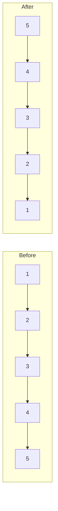

# Reverse Linked List

## Problem

Given the head of a singly linked list, reverse the direction of all the links between nodes and return the new head.

A **singly linked list** is a chain of nodes where each node contains data and a pointer to the next node. In the original list, nodes point from left to right (1→2→3→4→5). After reversing, you need to make them point from right to left (5→4→3→2→1), so that 5 becomes the new head.

**Key constraint:** You should reverse the list by rearranging the pointers, not by copying values into a new list. This is called an "in-place" reversal.

**Watch out for:**
- Losing your reference to the rest of the list when you change a pointer
- Forgetting to handle empty lists or single-node lists
- Creating cycles by not properly breaking the old connections


**Diagram:**




## Why This Matters

This is one of the most fundamental linked list operations you'll encounter. Pointer manipulation skills from this problem directly apply to:

- **Memory management** in systems programming
- **Graph traversals** where you need to navigate connections
- **Undo/redo functionality** in applications (navigating backward through history)
- More complex linked list problems like reversing in groups or detecting cycles

Mastering both the iterative and recursive approaches teaches you two distinct problem-solving patterns that appear throughout algorithm design. This problem appears frequently in coding interviews because it tests your ability to track multiple changing references simultaneously.

## Examples

**Example 1:**
- Input: `head = []`
- Output: `[]`

## Constraints

- The number of nodes in the list is the range [0, 5000].
- -5000 <= Node.val <= 5000

## Think About

1. What's the brute force approach? Why is it inefficient?
2. What property of the input can you exploit?
3. Would sorting or preprocessing help?
4. Can you reduce this to a problem you've seen before?

## Approach Hints

<details>
<summary>💡 Hint 1: Conceptual</summary>

To reverse a linked list, you need to change each node's next pointer to point to its previous node instead of its next node. Think about what information you need to track as you traverse: the current node, the previous node, and the next node (to avoid losing the rest of the list).

</details>

<details>
<summary>🎯 Hint 2: Approach</summary>

There are two classic approaches: (1) Iterative with three pointers (previous, current, next), or (2) Recursive by reversing the rest of the list first, then fixing the current node's connections. The iterative approach is more space-efficient (O(1) vs O(n) stack space).

</details>

<details>
<summary>📝 Hint 3: Algorithm</summary>

**Iterative Approach:**
1. Initialize prev = None, current = head
2. While current is not None:
   - Store next_node = current.next
   - Reverse the link: current.next = prev
   - Move forward: prev = current, current = next_node
3. Return prev (new head)

**Recursive Approach:**
1. Base case: if head is None or head.next is None, return head
2. Recursively reverse rest of list: new_head = reverse(head.next)
3. Fix connections: head.next.next = head, head.next = None
4. Return new_head

</details>

## Complexity Analysis

| Approach | Time | Space | Notes |
|----------|------|-------|-------|
| **Iterative** | **O(n)** | **O(1)** | Most efficient, single pass |
| Recursive | O(n) | O(n) | Elegant but uses call stack |
| Stack-based | O(n) | O(n) | Store nodes then rebuild |

## Common Mistakes

**Mistake 1: Losing Reference to Rest of List**

```python
# Wrong: Loses reference to rest of list
def reverseList(head):
    prev = None
    current = head
    while current:
        current.next = prev  # Lost reference to rest!
        prev = current
        current = current.next  # This is now None/prev
    return prev
```

```python
# Correct: Save next node before modifying
def reverseList(head):
    prev = None
    current = head
    while current:
        next_node = current.next  # Save before modifying
        current.next = prev
        prev = current
        current = next_node
    return prev
```

**Mistake 2: Incorrect Recursion Base Case**

```python
# Wrong: Doesn't handle single node or empty list
def reverseList(head):
    if not head:
        return None
    new_head = reverseList(head.next)  # Crashes on single node
    head.next.next = head
    head.next = None
    return new_head
```

```python
# Correct: Proper base case handling
def reverseList(head):
    if not head or not head.next:  # Handle both None and single node
        return head
    new_head = reverseList(head.next)
    head.next.next = head
    head.next = None
    return new_head
```

**Mistake 3: Not Setting Old Head's Next to None**

```python
# Wrong: Creates a cycle in the list
def reverseList(head):
    if not head or not head.next:
        return head
    new_head = reverseList(head.next)
    head.next.next = head
    # Missing: head.next = None
    return new_head
```

```python
# Correct: Break the old connection
def reverseList(head):
    if not head or not head.next:
        return head
    new_head = reverseList(head.next)
    head.next.next = head
    head.next = None  # Break old connection
    return new_head
```

## Variations

| Variation | Description | Difficulty |
|-----------|-------------|------------|
| Reverse Between Positions | Reverse sublist from position m to n | Medium |
| Reverse in K-Groups | Reverse nodes in groups of k | Hard |
| Palindrome Linked List | Check if list is palindrome (needs reversal) | Easy |
| Swap Nodes in Pairs | Swap adjacent nodes | Medium |
| Odd Even Linked List | Group odd/even positioned nodes | Medium |

## Practice Checklist

- [ ] Day 1: Implement iterative solution with three pointers
- [ ] Day 2: Implement recursive solution
- [ ] Day 3: Draw diagrams showing pointer changes at each step
- [ ] Week 1: Solve without hints, explain both approaches
- [ ] Week 2: Practice reverse between positions variant
- [ ] Month 1: Master reverse in k-groups (hard variant)

**Strategy**: See [Linked List Pattern](../strategies/data-structures/linked-lists.md)
