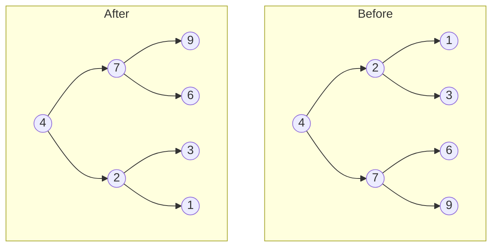

# Invert Binary Tree

## Problem

Given the root of a binary tree, invert the tree by swapping the left and right children of every node, then return the root of the modified tree.

A **binary tree inversion** is like looking at the tree in a mirror. Every node's left child becomes its right child and vice versa. This happens recursively at every level of the tree.

**Visual example:**
```
Before:        After:
    4            4
   / \          / \
  2   7        7   2
 / \ / \      / \ / \
1  3 6  9    9  6 3  1
```

This is a classic example where the recursive solution is beautifully simple: to invert a tree, invert its left subtree, invert its right subtree, then swap them. The entire algorithm can be written in just a few lines of code.

**Watch out for:**
- Forgetting to return the root after modification
- Swapping children before recursively inverting (creates incorrect references)
- Not handling empty trees or single nodes

**Diagram:**




## Why This Matters

This problem is a gateway to understanding **tree recursion**, one of the most elegant patterns in computer science:

- **Tree transformations** - Many operations (serialization, validation, conversion) follow this pattern
- **Recursive thinking** - Teaches you to solve problems by solving smaller versions of the same problem
- **Interview classic** - Famously straightforward yet revealing of coding skill
- **Mirror/symmetry operations** - Appears in graphics, game trees, and UI component hierarchies

The story goes that a Google engineer failed this problem in an interview and tweeted about it, making it famous. While it's simple, it perfectly tests whether you can think recursively and handle tree structures. The pattern you learn here applies to hundreds of other tree problems.

## Examples

**Example 1:**
- Input: `root = []`
- Output: `[]`

## Constraints

- The number of nodes in the tree is in the range [0, 100].
- -100 <= Node.val <= 100

## Think About

1. What's the brute force approach? Why is it inefficient?
2. What property of the input can you exploit?
3. Would sorting or preprocessing help?
4. Can you reduce this to a problem you've seen before?

## Approach Hints

<details>
<summary>💡 Hint 1: Conceptual Understanding</summary>

Think about what "inverting" means at each node. If you visit a node, what simple operation transforms its children? Consider how this operation would need to propagate throughout the entire tree structure.

</details>

<details>
<summary>🎯 Hint 2: Recursive Pattern</summary>

This problem has a natural recursive structure. At each node, you need to swap its children, but those children are also subtrees that need to be inverted. What's the base case? What happens when you reach a null node or a leaf?

</details>

<details>
<summary>📝 Hint 3: Implementation Strategy</summary>

Pseudocode approach:
1. Handle the base case (empty tree)
2. Recursively invert the left subtree
3. Recursively invert the right subtree
4. Swap the left and right children of the current node
5. Return the current node

Alternative: You could also use a level-order traversal (BFS with a queue) to swap children level by level.

</details>

## Complexity Analysis

| Approach | Time | Space | Notes |
|----------|------|-------|-------|
| Recursive DFS | O(n) | O(h) | h is height; worst case O(n) for skewed tree, O(log n) for balanced |
| **Iterative BFS** | **O(n)** | **O(w)** | w is max width; typically better space for balanced trees |
| Iterative DFS (Stack) | O(n) | O(h) | Similar to recursive but explicit stack |

**Optimal choice depends on tree shape:** BFS is generally preferred for balanced trees to minimize space.

## Common Mistakes

**Mistake 1: Forgetting to return the root**

```python
# Wrong - doesn't return the modified tree
def invertTree(root):
    if not root:
        return None
    root.left, root.right = root.right, root.left
    invertTree(root.left)
    invertTree(root.right)
    # Missing: return root
```

```python
# Correct
def invertTree(root):
    if not root:
        return None
    root.left, root.right = root.right, root.left
    invertTree(root.left)
    invertTree(root.right)
    return root
```

**Mistake 2: Swapping before recursive calls**

```python
# Wrong - swaps before inverting subtrees
def invertTree(root):
    if not root:
        return None
    # Swapping first causes incorrect references
    root.left, root.right = root.right, root.left
    invertTree(root.left)  # Now inverting the original right!
    invertTree(root.right) # Now inverting the original left!
    return root
```

```python
# Correct - invert subtrees first, then swap
def invertTree(root):
    if not root:
        return None
    left = invertTree(root.left)
    right = invertTree(root.right)
    root.left = right
    root.right = left
    return root
```

**Mistake 3: Not handling empty tree**

```python
# Wrong - will crash on empty tree
def invertTree(root):
    root.left, root.right = root.right, root.left  # NoneType error!
    invertTree(root.left)
    invertTree(root.right)
    return root
```

```python
# Correct
def invertTree(root):
    if not root:
        return None
    # Safe to proceed
    root.left, root.right = root.right, root.left
    invertTree(root.left)
    invertTree(root.right)
    return root
```

## Variations

| Variation | Difficulty | Key Difference |
|-----------|-----------|----------------|
| Mirror Binary Tree (Check) | Easy | Verify if tree is symmetric rather than inverting |
| Invert Only Odd Levels | Medium | Conditional inversion based on level number |
| Invert N-ary Tree | Medium | Reverse order of all children at each node |
| Serialize/Deserialize Inverted Tree | Hard | Combine tree inversion with encoding/decoding |

## Practice Checklist

- [ ] **Day 1:** Solve using recursive DFS
- [ ] **Day 3:** Implement iterative BFS approach
- [ ] **Day 7:** Solve again without looking at previous solution
- [ ] **Day 14:** Implement both recursive and iterative in under 10 minutes
- [ ] **Day 30:** Explain the approach to someone else or write it out

**Strategy**: See [Tree Pattern](../prerequisites/trees.md)
