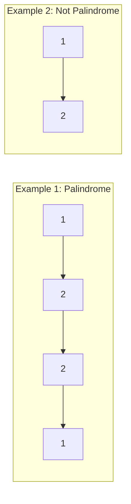

# Palindrome Linked List

## Problem

Given the head of a singly linked list, return `true` if the values in the list form a palindrome, or `false` otherwise.

A **palindrome** reads the same forwards and backwards. For example:
- `[1,2,2,1]` is a palindrome (reads 1-2-2-1 both ways)
- `[1,2,3,2,1]` is a palindrome (reads 1-2-3-2-1 both ways)
- `[1,2]` is NOT a palindrome (reads 1-2 forward but 2-1 backward)

The challenge with a linked list is that you can only traverse in one direction. Unlike an array where you can easily compare first and last elements, a singly linked list doesn't let you go backward.

**Approaches to consider:**
1. **Simple but space-inefficient:** Copy values to an array, then use two pointers from both ends
2. **Optimal:** Use the fast/slow pointer technique to find the middle, reverse the second half, then compare both halves

The optimal solution combines two fundamental linked list patterns: finding the middle (fast/slow pointers) and reversing a list.

**Watch out for:**
- Correctly finding the middle for both odd and even-length lists
- Reversing the second half without losing references
- Comparing the right number of nodes

**Diagram:**




## Why This Matters

This problem combines multiple fundamental techniques, making it an excellent learning vehicle:

- **Fast/slow pointers** - A classic pattern for finding the middle of a linked list in one pass
- **In-place list reversal** - Essential linked list manipulation skill
- **Space-time tradeoffs** - Compare O(n) space (array copy) vs. O(1) space (in-place)
- **Real-world applications** - Palindrome checking appears in DNA sequence analysis, language processing, and data validation

This appears frequently in interviews because it tests multiple skills simultaneously: pointer manipulation, algorithm composition (combining two techniques), and understanding space complexity. The optimal O(1) space solution is particularly elegant.

## Constraints

- The number of nodes in the list is in the range [1, 10⁵].
- 0 <= Node.val <= 9

## Think About

1. What's the brute force approach? Why is it inefficient?
2. What property of the input can you exploit?
3. Would sorting or preprocessing help?
4. Can you reduce this to a problem you've seen before?

## Approach Hints

<details>
<summary>💡 Hint 1: Palindrome Properties</summary>

A palindrome reads the same forwards and backwards. For a linked list, this means the first half should mirror the second half. How can you access both ends of a singly linked list to compare them? Consider the trade-offs between time and space complexity.

</details>

<details>
<summary>🎯 Hint 2: Two-Pointer Pattern</summary>

Use the fast-slow pointer technique to find the middle of the list. The slow pointer moves one step while fast moves two steps. When fast reaches the end, slow is at the middle. Then reverse the second half and compare it with the first half node by node.

</details>

<details>
<summary>📝 Hint 3: Step-by-Step Algorithm</summary>

Optimal O(n) time, O(1) space approach:
1. Use fast/slow pointers to find the middle
2. Reverse the second half of the list
3. Compare first half with reversed second half
4. Optional: Restore the list by reversing second half again
5. Return result

Alternative O(n) space approach:
- Copy values to an array
- Use two pointers from both ends to check palindrome

Example: 1 -> 2 -> 2 -> 1
- Find middle: slow at first 2
- Reverse second half: 1 -> 2, then 1 -> 2 (reversed)
- Compare: 1==1, 2==2, palindrome!

</details>

## Complexity Analysis

| Approach | Time | Space | Notes |
|----------|------|-------|-------|
| Copy to Array | O(n) | O(n) | Simple but uses extra space |
| Recursion | O(n) | O(n) | Clean code but call stack overhead |
| **Reverse Second Half** | **O(n)** | **O(1)** | Optimal - modifies list temporarily |
| Stack-based | O(n) | O(n) | Push first half to stack, compare with second |

**Optimal approach:** Reverse second half is best for space efficiency while maintaining linear time.

## Common Mistakes

**Mistake 1: Incorrect middle-finding logic**

```python
# Wrong - doesn't handle even-length lists correctly
def isPalindrome(head):
    slow = fast = head
    while fast and fast.next:
        slow = slow.next
        fast = fast.next.next
    # For even-length, slow might not be positioned correctly
    # Need to consider where slow ends up
```

```python
# Correct - handles both odd and even lengths
def isPalindrome(head):
    slow = fast = head
    while fast and fast.next:
        slow = slow.next
        fast = fast.next.next
    # For odd length: slow at middle
    # For even length: slow at start of second half
    return self.compareHalves(head, self.reverse(slow))
```

**Mistake 2: Not reversing second half properly**

```python
# Wrong - doesn't reverse correctly
def reverse(head):
    prev = None
    while head:
        head.next = prev  # Lost reference to next!
        prev = head
        head = head.next  # This is None now!
    return prev
```

```python
# Correct - save next before changing pointer
def reverse(head):
    prev = None
    while head:
        next_node = head.next  # Save next
        head.next = prev       # Reverse link
        prev = head            # Move prev forward
        head = next_node       # Move head forward
    return prev
```

**Mistake 3: Not handling single node or empty list**

```python
# Wrong - may crash on edge cases
def isPalindrome(head):
    slow = fast = head
    while fast.next and fast.next.next:  # Crashes if head is None
        slow = slow.next
        fast = fast.next.next
```

```python
# Correct - handle edge cases
def isPalindrome(head):
    if not head or not head.next:
        return True  # Single node or empty is palindrome
    slow = fast = head
    while fast and fast.next:
        slow = slow.next
        fast = fast.next.next
```

## Variations

| Variation | Difficulty | Key Difference |
|-----------|-----------|----------------|
| Valid Palindrome (String) | Easy | Check string with alphanumeric filtering |
| Palindrome Number | Easy | Check if integer is palindrome without converting to string |
| Longest Palindromic Substring | Medium | Find longest palindromic substring in a string |
| Palindrome Linked List II | Medium | Return all palindromic sublists |

## Practice Checklist

- [ ] **Day 1:** Solve using array copy approach (O(n) space)
- [ ] **Day 3:** Implement optimal reverse second half approach (O(1) space)
- [ ] **Day 7:** Solve without looking at previous solution
- [ ] **Day 14:** Handle all edge cases in under 20 minutes
- [ ] **Day 30:** Solve "Longest Palindromic Substring" variation

**Strategy**: See [String Pattern](../prerequisites/linked-lists.md)
