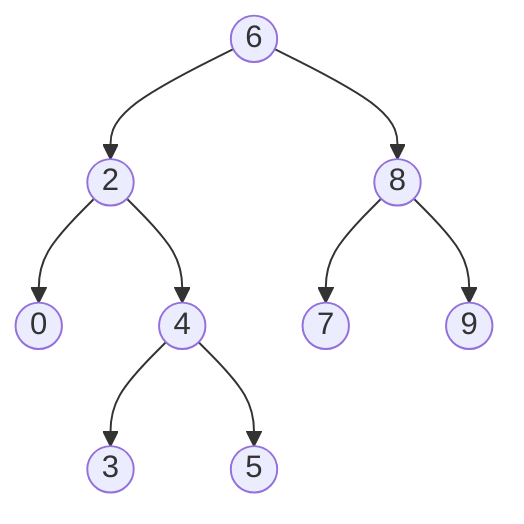

# Lowest Common Ancestor of a Binary Search Tree

## Problem

Given a binary search tree (BST) and two nodes `p` and `q` within that tree, find their lowest common ancestor (LCA). The LCA is the deepest node in the tree that has both `p` and `q` as descendants. An important edge case to remember: a node can be considered its own descendant, so if one of your target nodes is an ancestor of the other, that node is the LCA.

Before diving into the solution, let's clarify what a binary search tree is. A BST is a tree where every node follows this ordering property: all values in the left subtree are smaller than the node's value, and all values in the right subtree are larger. This property is the key to an efficient solution.

Think of the LCA as the "split point" where the paths to `p` and `q` diverge. For example, in a tree with root 6, if we're looking for nodes 2 and 8, the split happens right at node 6 because 2 goes left and 8 goes right. However, if we're looking for nodes 2 and 4, the split happens at node 2 itself, since 4 is in node 2's subtree.

The challenge is to leverage the BST's ordering property to find this split point efficiently, without unnecessarily traversing the entire tree.

**Diagram:**



Example: For nodes p=2 and q=8, the LCA is 6.
For nodes p=2 and q=4, the LCA is 2.


## Why This Matters

Finding the lowest common ancestor is a fundamental tree operation that appears throughout computer science. In file systems, the LCA helps determine the nearest common directory between two files. In version control systems like Git, finding the common ancestor of two branches is essential for merging. Network routing algorithms use LCA concepts to find optimal paths between nodes.

This problem is particularly valuable because it teaches you to exploit structural properties for efficiency. While general binary trees require O(n) traversal to find the LCA, binary search trees allow O(h) solutions where h is the tree height. This insight of leveraging data structure invariants appears repeatedly in algorithm design. The problem is also a frequent interview question at major tech companies, often used to assess your understanding of both tree traversal and how to optimize using BST properties.

## Examples

**Example 1:**
- Input: `root = [2,1], p = 2, q = 1`
- Output: `2`

## Constraints

- The number of nodes in the tree is in the range [2, 10⁵].
- -10⁹ <= Node.val <= 10⁹
- All Node.val are **unique**.
- p != q
- p and q will exist in the BST.

## Think About

1. What's the brute force approach? Why is it inefficient?
2. What property of the input can you exploit?
3. Would sorting or preprocessing help?
4. Can you reduce this to a problem you've seen before?

## Approach Hints

<details>
<summary>💡 Hint 1: BST Property</summary>

Remember the key property of a BST: for any node, all values in the left subtree are smaller, and all values in the right subtree are larger. How does this help you locate the LCA? Think about where p and q are positioned relative to the current node.

</details>

<details>
<summary>🎯 Hint 2: Split Point Detection</summary>

The LCA is the first node where p and q "split" - meaning one goes to the left subtree and one to the right (or one/both equal the current node). At any node, compare its value with p and q:
- If both p and q are smaller: LCA is in left subtree
- If both p and q are larger: LCA is in right subtree
- Otherwise: Current node is the LCA

</details>

<details>
<summary>📝 Hint 3: Implementation Strategy</summary>

Optimal O(h) time, O(1) space approach (h = tree height):

Iterative:
```
current = root
while current:
    if p.val < current.val and q.val < current.val:
        current = current.left
    else if p.val > current.val and q.val > current.val:
        current = current.right
    else:
        return current  # Found LCA
```

Recursive:
```
if both p and q < root: return LCA(root.left, p, q)
if both p and q > root: return LCA(root.right, p, q)
else: return root
```

Example: root=6, p=2, q=8
- 2 < 6 < 8, so 6 is the split point → LCA is 6

</details>

## Complexity Analysis

| Approach | Time | Space | Notes |
|----------|------|-------|-------|
| Path Storage | O(n) | O(n) | Store paths from root to p and q, find divergence |
| **Iterative BST** | **O(h)** | **O(1)** | Optimal - leverages BST property |
| Recursive BST | O(h) | O(h) | Same time but uses call stack |
| General Tree LCA | O(n) | O(n) | Doesn't use BST property |

Where h = height of tree. Best case O(log n) for balanced BST, worst case O(n) for skewed.

**Optimal approach:** Iterative BST search is best - simple and space-efficient.

## Common Mistakes

**Mistake 1: Not handling case where node is its own ancestor**

```python
# Wrong - doesn't consider p or q as potential LCA
def lowestCommonAncestor(root, p, q):
    if p.val < root.val and q.val < root.val:
        return lowestCommonAncestor(root.left, p, q)
    if p.val > root.val and q.val > root.val:
        return lowestCommonAncestor(root.right, p, q)
    # What if root == p or root == q?
    # This actually works! But the logic isn't explicit
```

```python
# Correct - explicitly handles all cases
def lowestCommonAncestor(root, p, q):
    # If root is one of p or q, or they split here, root is LCA
    if root.val == p.val or root.val == q.val:
        return root
    if p.val < root.val and q.val < root.val:
        return lowestCommonAncestor(root.left, p, q)
    if p.val > root.val and q.val > root.val:
        return lowestCommonAncestor(root.right, p, q)
    return root  # Split point
```

**Mistake 2: Not leveraging BST property**

```python
# Wrong - uses general tree approach, ignoring BST property
def lowestCommonAncestor(root, p, q):
    if not root or root == p or root == q:
        return root
    left = lowestCommonAncestor(root.left, p, q)
    right = lowestCommonAncestor(root.right, p, q)
    # This works but is O(n) instead of O(h)
    if left and right:
        return root
    return left if left else right
```

```python
# Correct - uses BST property for O(h) solution
def lowestCommonAncestor(root, p, q):
    while root:
        if p.val < root.val and q.val < root.val:
            root = root.left
        elif p.val > root.val and q.val > root.val:
            root = root.right
        else:
            return root
```

**Mistake 3: Using node equality instead of value comparison**

```python
# Wrong - compares node objects instead of values
def lowestCommonAncestor(root, p, q):
    if p < root and q < root:  # Node comparison is undefined!
        return lowestCommonAncestor(root.left, p, q)
```

```python
# Correct - compare node values
def lowestCommonAncestor(root, p, q):
    if p.val < root.val and q.val < root.val:
        return lowestCommonAncestor(root.left, p, q)
```

## Variations

| Variation | Difficulty | Key Difference |
|-----------|-----------|----------------|
| LCA of Binary Tree (not BST) | Medium | Can't use BST property, need general tree approach |
| LCA of Deepest Leaves | Medium | Find LCA of the deepest nodes |
| LCA of Multiple Nodes | Hard | Find LCA of k nodes, not just two |
| Distance Between Nodes in BST | Medium | Use LCA to calculate distance |

## Practice Checklist

- [ ] **Day 1:** Solve using iterative BST approach
- [ ] **Day 3:** Implement recursive version
- [ ] **Day 7:** Solve general binary tree LCA (without BST property)
- [ ] **Day 14:** Solve in under 10 minutes
- [ ] **Day 30:** Explain why BST property enables O(h) solution

**Strategy**: See [Binary Search Tree Pattern](../strategies/data-structures/trees.md)
