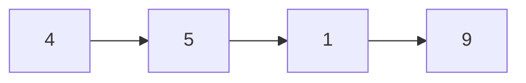
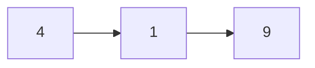

# Delete Node in a Linked List

## Problem

You're given a singly-linked list and asked to delete a specific node from it. Here's the twist: instead of being given access to the head of the list, you're only given direct access to the node that needs to be deleted. This unusual constraint makes the problem more interesting than a standard deletion.

In a typical linked list deletion, you would traverse from the head until you find the node before the one you want to delete, then update its next pointer. But without access to the head or the previous node, that approach is impossible. You need to think creatively about what "deleting" a node really means.

The node you're given is guaranteed to not be the tail of the list, which is a critical constraint. All node values are unique, and the node definitely exists within the list. Your task is to make the node "disappear" from the list logically, meaning its value should no longer appear when traversing the list, and the total node count should decrease by one. The order of all other values must remain unchanged.

**Diagram:**

Before deletion:


After deleting node with value 5:



## Why This Matters

This problem teaches a valuable lesson about perspective and constraints in problem-solving. When you can't solve a problem the "normal" way, you need to reframe your approach. The technique used here - copying values and shifting the deletion point - demonstrates lateral thinking that applies beyond linked lists.

Understanding pointer manipulation at this level is essential for implementing efficient data structures. Many advanced structures like skip lists, memory allocators, and garbage collectors rely on creative pointer tricks similar to this one. The problem also highlights the importance of reading constraints carefully: the guarantee that we're not deleting the tail node is what makes the solution possible.

In practical systems, this type of operation appears when implementing undo functionality, removing items from queues where you only have a reference to the item, or managing nodes in distributed systems where you may not have access to the full data structure. It's a common interview question that tests whether you can think beyond the obvious approach.

## Constraints

- The number of the nodes in the given list is in the range [2, 1000].
- -1000 <= Node.val <= 1000
- The value of each node in the list is **unique**.
- The node to be deleted is **in the list** and is **not a tail** node.

## Think About

1. What's the brute force approach? Why is it inefficient?
2. What property of the input can you exploit?
3. Would sorting or preprocessing help?
4. Can you reduce this to a problem you've seen before?

## Approach Hints

<details>
<summary>💡 Hint 1: Constraint Analysis</summary>

Since you don't have access to the head or the previous node, you can't change what points to the target node. But you do have access to the next node. What if instead of removing the node itself, you make it "become" the next node?

</details>

<details>
<summary>🎯 Hint 2: Value Copying Trick</summary>

The key insight is that you can't delete the node you're given, but you can make it disappear logically. Copy the value from the next node into the current node, then delete the next node instead. The current node now holds the next node's value and points to the node after that.

</details>

<details>
<summary>📝 Hint 3: Implementation</summary>

Optimal O(1) time and space:

```
1. Copy the value from node.next to node
2. Point node.next to node.next.next
3. Done - we've effectively "deleted" the current node
```

Example: Delete node with value 5 from [4,5,1,9]
- node points to 5
- Copy 1 into node: [4,1,1,9]
- Skip the second 1: [4,1,9]
- Result: 5 is gone!

Why this works: We're not actually deleting the physical node we were given. We're copying the next node's data into it and deleting the next node instead.

</details>

## Complexity Analysis

| Approach | Time | Space | Notes |
|----------|------|-------|-------|
| **Value Copy** | **O(1)** | **O(1)** | Optimal - single operation |
| Traverse from Head | O(n) | O(1) | Not possible - we don't have head! |
| Store All Values | O(n) | O(n) | Unnecessarily complex |

**Optimal approach:** Value copying is the only viable O(1) solution given the constraints.

## Common Mistakes

**Mistake 1: Trying to delete the actual node**

```python
# Wrong - can't delete without previous node reference
def deleteNode(node):
    # How do we update the previous node's next pointer?
    # We don't have access to it!
    prev.next = node.next  # prev doesn't exist!
```

```python
# Correct - copy next node's value and skip it
def deleteNode(node):
    node.val = node.next.val
    node.next = node.next.next
```

**Mistake 2: Not handling the next node properly**

```python
# Wrong - loses reference to rest of list
def deleteNode(node):
    node.val = node.next.val
    node.next = None  # Lost everything after!
```

```python
# Correct - maintain link to rest of list
def deleteNode(node):
    node.val = node.next.val
    node.next = node.next.next
```

**Mistake 3: Forgetting constraints guarantee**

```python
# Wrong - adds unnecessary checks
def deleteNode(node):
    if not node or not node.next:  # Unnecessary!
        return
    node.val = node.next.val
    node.next = node.next.next
```

```python
# Correct - trust the constraints
def deleteNode(node):
    # Constraints guarantee node is not tail
    node.val = node.next.val
    node.next = node.next.next
```

## Variations

| Variation | Difficulty | Key Difference |
|-----------|-----------|----------------|
| Remove Nth Node From End | Medium | Need to find the node to delete first |
| Delete Node in BST | Medium | Binary tree deletion with three cases |
| Remove Linked List Elements | Easy | Delete all nodes with specific value |
| Delete Middle Node | Medium | Find and delete the exact middle node |

## Practice Checklist

- [ ] **Day 1:** Implement value copying approach
- [ ] **Day 3:** Understand why we can't actually delete the given node
- [ ] **Day 7:** Solve "Remove Nth Node From End" variation
- [ ] **Day 14:** Solve in under 5 minutes
- [ ] **Day 30:** Explain the clever trick to someone else

**Strategy**: See [Linked List Pattern](../prerequisites/linked-lists.md)
