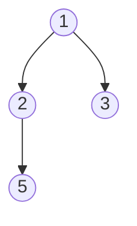

# Binary Tree Paths

## Problem

Given the root of a binary tree, find all paths from the root node to every leaf node. A leaf is a node with no children. Each path should be represented as a string showing the sequence of node values from root to leaf, with values separated by arrows ("->").

Think of each path as a journey from the tree's root down to a leaf, recording every node you visit along the way. For a tree with root 1 that has children 2 and 3, where 2 has a child 5, the paths would be "1->2->5" and "1->3". You need to find every possible journey from top to bottom.

The challenge is to explore all branches of the tree systematically without missing any paths or duplicating any. This is a classic depth-first search (DFS) problem where you need to explore each branch fully before backtracking to explore other branches. As you traverse down each branch, you build up the current path, and when you reach a leaf, you save that complete path.

An important detail: the output format requires arrows between node values, so you need to format strings like "1->2->5" rather than just collecting values. Also, be careful to only record paths that reach leaves - don't include paths that stop at internal nodes.

**Diagram:**



All root-to-leaf paths:
- 1 -> 2 -> 5
- 1 -> 3


## Why This Matters

Finding all root-to-leaf paths is a fundamental tree traversal operation with numerous applications. File systems use this pattern to enumerate all files (leaves) along with their directory paths. Decision tree algorithms in machine learning evaluate all paths from root to leaf to make classifications. Game AI explores all possible move sequences to find winning strategies.

This problem teaches depth-first search and backtracking, two essential algorithmic techniques. DFS is the natural way to explore tree structures completely, and backtracking - building up a path as you go and unwinding it as you return - is crucial for many search and enumeration problems. Mastering this pattern prepares you for maze solving, combination generation, and constraint satisfaction problems.

The problem also highlights an important implementation detail: managing mutable state during recursion. You need to build paths incrementally without accidentally sharing the same path object across different branches. Understanding when to copy data structures versus when to use immutable strings is key to correct implementation.

This is a medium-frequency interview question often used to assess your understanding of tree traversal and recursion. It's also a building block for harder problems like finding paths with specific sums, longest paths, or paths meeting certain criteria. The technique extends to graph traversal and appears in network routing, circuit design, and dependency analysis.

## Examples

**Example 1:**
- Input: `root = [1]`
- Output: `["1"]`

## Constraints

- The number of nodes in the tree is in the range [1, 100].
- -100 <= Node.val <= 100

## Think About

1. What's the brute force approach? Why is it inefficient?
2. What property of the input can you exploit?
3. Would sorting or preprocessing help?
4. Can you reduce this to a problem you've seen before?

## Approach Hints

<details>
<summary>💡 Hint 1: Recognize DFS Pattern</summary>

This is a classic depth-first search (DFS) problem. At each node, you have two choices: go left or go right. You need to explore all paths from root to leaves. Think about how recursion naturally models this "explore all branches" behavior.

</details>

<details>
<summary>🎯 Hint 2: Track Current Path</summary>

Use a helper function that takes the current node and the path built so far. When you reach a leaf (no left or right child), add the complete path to your results. Otherwise, recursively explore left and right subtrees, extending the current path with each node value.

</details>

<details>
<summary>📝 Hint 3: Backtracking Implementation</summary>

Pseudocode approach:
1. Create result list
2. Define DFS helper(node, current_path):
   - If node is null: return
   - Add node.val to current_path
   - If node is leaf: add current_path to results
   - Else: recursively call left and right children
3. Call DFS helper(root, "")
4. Return results

</details>

## Complexity Analysis

| Approach | Time | Space | Notes |
|----------|------|-------|-------|
| Iterative BFS | O(n) | O(n) | Need to store all paths |
| **DFS Recursive** | **O(n)** | **O(h)** | h = height; call stack + path storage |
| DFS with String Building | O(n²) | O(h) | String concatenation overhead |

## Common Mistakes

### Mistake 1: Not Checking for Leaf Node

```python
# WRONG: Adding path at every node instead of only leaves
def binaryTreePaths(root):
    result = []
    def dfs(node, path):
        if not node:
            return
        path += str(node.val)
        result.append(path)  # Bug: adds internal nodes too
        if node.left:
            dfs(node.left, path + "->")
        if node.right:
            dfs(node.right, path + "->")
    dfs(root, "")
    return result
```

```python
# CORRECT: Only add when at leaf node
def binaryTreePaths(root):
    result = []
    def dfs(node, path):
        if not node:
            return
        path += str(node.val)
        if not node.left and not node.right:  # Leaf check
            result.append(path)
        else:
            if node.left:
                dfs(node.left, path + "->")
            if node.right:
                dfs(node.right, path + "->")
    dfs(root, "")
    return result
```

### Mistake 2: Mutable List as Path (Shared Reference)

```python
# WRONG: Using mutable list without copying
def binaryTreePaths(root):
    result = []
    def dfs(node, path):
        if not node:
            return
        path.append(str(node.val))
        if not node.left and not node.right:
            result.append(path)  # Bug: all paths share same list reference
        dfs(node.left, path)
        dfs(node.right, path)
    dfs(root, [])
    return result
```

```python
# CORRECT: Either copy the list or use string (immutable)
def binaryTreePaths(root):
    result = []
    def dfs(node, path):
        if not node:
            return
        path = path + [str(node.val)]  # Create new list
        if not node.left and not node.right:
            result.append("->".join(path))
        dfs(node.left, path)
        dfs(node.right, path)
    dfs(root, [])
    return result
```

### Mistake 3: Forgetting Arrow Formatting

```python
# WRONG: No arrows between nodes
def binaryTreePaths(root):
    result = []
    def dfs(node, path):
        if not node:
            return
        path += str(node.val)  # Missing "->"
        if not node.left and not node.right:
            result.append(path)
        dfs(node.left, path)
        dfs(node.right, path)
    dfs(root, "")
    return result  # Returns "125", "13" instead of "1->2->5", "1->3"
```

```python
# CORRECT: Add arrows between nodes
def binaryTreePaths(root):
    result = []
    def dfs(node, path):
        if not node:
            return
        path += str(node.val)
        if not node.left and not node.right:
            result.append(path)
        else:
            path += "->"  # Add arrow for next level
            dfs(node.left, path)
            dfs(node.right, path)
    dfs(root, "")
    return result
```

## Variations

| Variation | Difficulty | Key Difference |
|-----------|------------|----------------|
| Path Sum | Easy | Check if root-to-leaf path sums to target |
| Path Sum II | Medium | Return all root-to-leaf paths with target sum |
| Sum Root to Leaf Numbers | Medium | Sum all numbers formed by root-to-leaf paths |
| Binary Tree Maximum Path Sum | Hard | Find maximum sum path (not necessarily root-to-leaf) |

## Practice Checklist

- [ ] Day 1: Solve with DFS recursion (20 min)
- [ ] Day 2: Implement iterative version with stack (15 min)
- [ ] Day 7: Solve again, handle edge cases (10 min)
- [ ] Day 14: Explain backtracking concept (5 min)
- [ ] Day 30: Code from memory (10 min)

**Strategy**: See [Tree Pattern](../prerequisites/trees.md)
