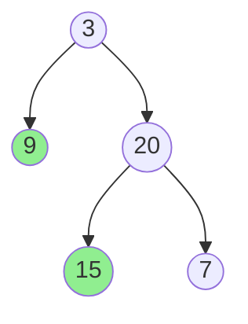

# Sum of Left Leaves

## Problem

Given the root node of a binary tree, calculate the total sum of all left leaf node values. A leaf is any node that has no children (both left and right pointers are null). A left leaf is specifically a leaf that appears as the left child of its parent node.

Here's the key distinction: not every leaf contributes to the sum, only those positioned as left children. For example, in a tree where node 3 has two children, 9 (left) and 20 (right), and node 20 has two children, 15 (left) and 7 (right), the left leaves are 9 and 15. Node 7 is a leaf but positioned as a right child, so it doesn't count. The sum would be 9 + 15 = 24.

You'll need to traverse the entire tree while keeping track of whether each node you visit is a left child. When you encounter a node that is both a leaf and a left child, add its value to your running total. This requires passing additional context during traversal, whether you use recursive depth-first search or iterative breadth-first search.


**Diagram:**



Example: For the tree above, left leaves are 9 and 15 (sum = 24)


## Why This Matters

Tree traversal problems are fundamental to computer science, appearing in file system navigation, organizational hierarchies, parsing syntax trees in compilers, and DOM manipulation in web development. This problem specifically teaches you to track contextual information during traversal, a pattern essential for more complex tree algorithms like path finding, ancestor queries, and tree reconstruction. The left leaf identification pattern appears in interview questions because it tests your ability to distinguish between similar nodes based on positional context, a common requirement when processing hierarchical data. Mastering this builds intuition for when to pass metadata through recursive calls versus when to inspect parent-child relationships directly.

## Examples

**Example 1:**
- Input: `root = [1]`
- Output: `0`

## Constraints

- The number of nodes in the tree is in the range [1, 1000].
- -1000 <= Node.val <= 1000

## Think About

1. What's the brute force approach? Why is it inefficient?
2. What property of the input can you exploit?
3. Would sorting or preprocessing help?
4. Can you reduce this to a problem you've seen before?

## Approach Hints

### Tier 1 Hint - Core Concept
A left leaf is a leaf node that is the left child of its parent. Traverse the tree (DFS or BFS) and track whether the current node is a left child. For each node, check if it's a leaf (both children are null). If it's both a left child AND a leaf, add its value to the sum. Otherwise, recurse on children.

### Tier 2 Hint - Implementation Details
Use recursive DFS with an additional parameter to track if the current node is a left child. Base case: if node is null, return 0. If node is a leaf (no left or right child) AND is a left child, return its value. Otherwise, recursively sum: `sumOfLeftLeaves(node.left, isLeft=True) + sumOfLeftLeaves(node.right, isLeft=False)`. Alternatively, use iterative BFS with a queue storing (node, is_left) pairs.

### Tier 3 Hint - Optimization Strategy
Recursive DFS is cleanest: O(n) time to visit all nodes, O(h) space for recursion stack where h is height. Helper function signature: `def helper(node, is_left)`. Key insight: a node is a left leaf if `is_left and not node.left and not node.right`. Sum all such nodes. Iterative solutions use explicit stack/queue but are more verbose without benefit.

## Complexity Analysis

| Approach | Time Complexity | Space Complexity | Notes |
|----------|----------------|------------------|-------|
| Recursive DFS | O(n) | O(h) | h = height, recursion stack |
| Iterative DFS (stack) | O(n) | O(h) | Explicit stack instead of recursion |
| Iterative BFS (queue) | O(n) | O(w) | w = max width of tree |
| Morris Traversal | O(n) | O(1) | Complex, not recommended for this |

## Common Mistakes

### Mistake 1: Counting all leaves instead of left leaves
```python
# Wrong - sums all leaves, not just left ones
def sumOfLeftLeaves(root):
    if not root:
        return 0
    if not root.left and not root.right:
        return root.val  # Wrong: all leaves counted
    return sumOfLeftLeaves(root.left) + sumOfLeftLeaves(root.right)
```

**Why it's wrong:** Must track whether a node is a left child. This sums all leaf nodes.

**Fix:** Pass a flag indicating if current node is left child.

### Mistake 2: Incorrect leaf identification
```python
# Wrong - doesn't check if node is actually a leaf
def sumOfLeftLeaves(root):
    if not root:
        return 0
    total = 0
    if root.left:  # WRONG - doesn't check if left child is a leaf
        total += root.left.val
    return total + sumOfLeftLeaves(root.left) + sumOfLeftLeaves(root.right)
```

**Why it's wrong:** Adds all left children, not just left leaves. Must verify the left child has no children.

**Fix:** Check `if root.left and not root.left.left and not root.left.right`.

### Mistake 3: Modifying tree structure
```python
# Wrong - adds unnecessary attributes
def sumOfLeftLeaves(root):
    if not root:
        return 0

    def dfs(node):
        if not node:
            return 0
        node.is_left = False  # WRONG - modifying tree
        if node.left:
            node.left.is_left = True
        # ... rest of logic
```

**Why it's wrong:** Shouldn't modify the input tree structure. Use function parameters instead.

**Fix:** Pass is_left as a parameter, don't store it in nodes.

## Variations

| Variation | Difference | Difficulty Δ |
|-----------|-----------|-------------|
| Sum of right leaves | Mirror problem for right children | 0 |
| Sum of all leaves | Sum both left and right leaves | -1 |
| Count left leaves | Count instead of sum | 0 |
| Maximum left leaf value | Find max instead of sum | 0 |
| Path to left leaves | Return paths to all left leaves | +1 |
| Left leaves at depth K | Only sum left leaves at specific depth | +1 |

## Practice Checklist

Track your progress on this problem:

- [ ] Solved using recursive DFS with is_left flag
- [ ] Implemented iterative BFS solution
- [ ] Correctly identified left leaves (not all leaves)
- [ ] After 1 day: Re-solved from memory
- [ ] After 1 week: Solved in < 10 minutes
- [ ] Explained leaf identification logic to someone

**Strategy**: See [Tree Pattern](../prerequisites/trees.md)
