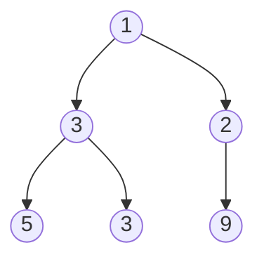

# Find Largest Value in Each Tree Row

## Problem

Given the root of a binary tree, you need to find the largest value at each level (or depth) of the tree. A level represents all nodes that are the same distance from the root. For instance, the root itself is at level 0, its children are at level 1, their children are at level 2, and so on.

Your task is to return an array where each element contains the maximum value found at the corresponding level. For example, if the tree has three levels, you'll return an array with three values representing the maximum at level 0, level 1, and level 2.

This problem can be approached using either breadth-first search (BFS), which naturally processes nodes level by level, or depth-first search (DFS), where you track the current depth as you traverse. An important edge case to consider: what should you return if the tree is empty?


**Diagram:**



Level 0: [1] -> max = 1
Level 1: [3,2] -> max = 3
Level 2: [5,3,9] -> max = 9
Output: [1,3,9]


## Why This Matters

Level-order traversal is foundational for many tree-based applications including organizational hierarchies, file system navigation, and HTML DOM manipulation. This problem teaches you how to process hierarchical data layer-by-layer, a pattern you'll encounter when rendering UI components, analyzing network topologies, or implementing autocomplete suggestions in search engines. Beyond the specific pattern, you're developing crucial skills in queue-based iteration (BFS) and recursive depth tracking (DFS), both of which appear frequently in technical interviews at companies like Google, Amazon, and Microsoft. The ability to aggregate information per level is also essential for tasks like calculating network latency at each hop or finding the widest point in a tree structure.

## Examples

**Example 1:**
- Input: `root = [1,2,3]`
- Output: `[1,3]`

## Constraints

- The number of nodes in the tree will be in the range [0, 10⁴].
- -2³¹ <= Node.val <= 2³¹ - 1

## Think About

1. What makes this problem challenging? What's the core difficulty?
2. Can you identify subproblems? Do they overlap?
3. What invariants must be maintained?
4. Is there a mathematical relationship to exploit?

## Approach Hints

### Hint 1: Level-by-Level Processing
How can you visit all nodes at the same depth before moving to the next depth? What data structure naturally supports processing nodes in the order they appear at each level?

### Hint 2: Tracking Maximum Per Level
As you process nodes at each level, how do you keep track of the maximum value seen so far for that level? When do you finalize the maximum and move to the next level?

### Hint 3: Alternative - Depth-First Approach
Can you use DFS instead of BFS? If you track the current depth during traversal, how can you update the maximum for that specific level? What data structure would store maximums indexed by level?

## Complexity Analysis

| Approach | Time Complexity | Space Complexity | Notes |
|----------|----------------|------------------|-------|
| BFS (Queue) | O(n) | O(w) | w = maximum width of tree (level with most nodes) |
| DFS (Recursive) | O(n) | O(h) | h = height of tree (recursion stack) |
| DFS (Array Indexed by Level) | O(n) | O(h) | Store max for each level during traversal |

## Common Mistakes

### Mistake 1: Not handling empty tree
```python
# Wrong: Crashes on empty tree
def largestValues(root):
    result = []
    queue = [root]  # Should check if root is None first
    while queue:
        # ... process level
    return result
```
**Why it's wrong**: If root is None, initializing queue with [None] will cause errors when accessing node.val. Must check `if not root: return []` first.

### Mistake 2: Incorrect level boundary detection in BFS
```python
# Wrong: Processes all nodes together instead of level-by-level
def largestValues(root):
    if not root:
        return []
    result = []
    queue = [root]
    while queue:
        node = queue.pop(0)
        result.append(node.val)  # Adds every node value individually
        if node.left:
            queue.append(node.left)
        if node.right:
            queue.append(node.right)
    return result
```
**Why it's wrong**: This doesn't process level-by-level. Need to capture the queue size at the start of each level iteration to process exactly that many nodes.

### Mistake 3: Wrong initial maximum value in DFS
```python
# Wrong: Assumes all values are positive
def largestValues(root):
    result = []
    def dfs(node, level):
        if not node:
            return
        if level == len(result):
            result.append(0)  # Should be node.val or -infinity
        result[level] = max(result[level], node.val)
        dfs(node.left, level + 1)
        dfs(node.right, level + 1)
    dfs(root, 0)
    return result
```
**Why it's wrong**: Initializing with 0 fails when all nodes at a level are negative. Should initialize with the first node's value at that level or use `-infinity`.

## Variations

| Variation | Difficulty | Description |
|-----------|-----------|-------------|
| Minimum Value in Each Row | Easy | Find minimum instead of maximum |
| Average Value in Each Row | Easy | Calculate average at each level |
| Count Nodes at Each Level | Easy | Return count of nodes per level |
| Right Side View of Tree | Medium | Return rightmost value at each level |
| Left Side View of Tree | Medium | Return leftmost value at each level |
| Zigzag Level Order | Medium | Alternate direction at each level |

## Practice Checklist

Track your progress on mastering this problem:

**Initial Practice**
- [ ] Implement BFS solution with queue
- [ ] Handle empty tree edge case
- [ ] Track level boundaries correctly (size-based iteration)

**After 1 Day**
- [ ] Implement DFS solution with level tracking
- [ ] Can you explain when to use BFS vs DFS?
- [ ] Test with single-node tree and skewed tree

**After 1 Week**
- [ ] Solve in under 12 minutes
- [ ] Implement both BFS and DFS from memory
- [ ] Optimize space: compare queue vs recursion stack

**After 1 Month**
- [ ] Solve right/left side view variations
- [ ] Implement zigzag level order traversal
- [ ] Apply level-order pattern to other tree problems

## Strategy

**Pattern**: Level-Order Traversal (BFS on Trees)
**Key Insight**: Use queue to process nodes level-by-level, tracking level boundaries to aggregate information per level.

**Strategy**: See [Tree Traversal Patterns](../strategies/data-structures/trees.md)
