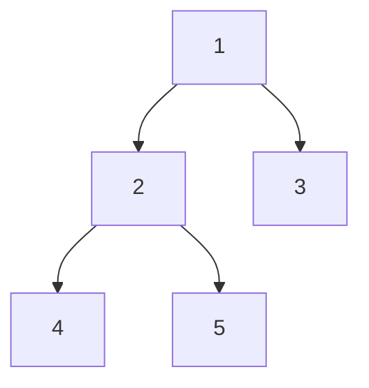

# Diameter of Binary Tree

## Problem

Given the root of a binary tree, find its diameter. The diameter is defined as the length of the longest path between any two nodes in the tree, where length is measured by counting the number of edges (not nodes) along the path.

A critical insight: this longest path doesn't necessarily pass through the root. It could be entirely within the left subtree, entirely within the right subtree, or pass through any internal node. For example, in a tree where the root has a deep left subtree but shallow right subtree, the diameter might connect two nodes deep in the left side.

To measure the path length, count edges (the connections between nodes), not the nodes themselves. So a path from node A through node B to node C has length 2 (two edges), even though it includes three nodes. This distinction matters when implementing your solution.

The key challenge is efficiently checking all possible paths. At each node, the longest path through that node equals the height of its left subtree plus the height of its right subtree. You'll need to track the maximum diameter seen across all nodes while simultaneously computing heights bottom-up.


**Diagram:**



```
Tree structure:
       1
      / \
     2   3
    / \
   4   5

Diameter calculation:
- Longest path: 4 -> 2 -> 1 -> 3 (3 edges)
- OR: 5 -> 2 -> 1 -> 3 (3 edges)
- The diameter is 3 (counting edges, not nodes)

For each node, diameter could be:
- Node 1: left_height(2) + right_height(1) = 3
- Node 2: left_height(1) + right_height(1) = 2
- Node 3: left_height(0) + right_height(0) = 0
- Node 4: left_height(0) + right_height(0) = 0
- Node 5: left_height(0) + right_height(0) = 0

Maximum diameter = 3
```


## Why This Matters

Tree diameter calculations appear in network design (finding the longest communication path), organizational analysis (measuring management chain length), and compiler optimization (analyzing abstract syntax trees). This problem teaches you the post-order traversal pattern where you process children before parents, essential for bottom-up tree algorithms. The technique of maintaining global state during recursion is widely used in dynamic programming on trees. You'll encounter similar patterns when calculating path sums in finance applications, finding critical paths in project management, or analyzing molecular structures in computational chemistry. Interview-wise, this is extremely popular at tech companies because it tests recursion, tree traversal, and the ability to optimize by combining multiple computations in a single pass. The pattern extends to harder problems involving weighted paths and constraint satisfaction.

## Examples

**Example 1:**
- Input: `root = [1,2]`
- Output: `1`

## Constraints

- The number of nodes in the tree is in the range [1, 10⁴].
- -100 <= Node.val <= 100

## Think About

1. What makes this problem challenging? What's the core difficulty?
2. Can you identify subproblems? Do they overlap?
3. What invariants must be maintained?
4. Is there a mathematical relationship to exploit?

## Approach Hints

### Hint 1: Diameter at Each Node
The diameter might pass through any node in the tree. For a given node, what would be the longest path that goes through that node? How does this relate to the heights of its left and right subtrees?

### Hint 2: Computing Heights
To find the diameter at a node, you need the height of both subtrees. Can you compute heights recursively while simultaneously tracking the maximum diameter encountered? What should each recursive call return?

### Hint 3: Global Maximum
As you traverse the tree computing heights, you'll compute potential diameters at every node. How can you keep track of the maximum diameter seen across all nodes? Should this be a global variable, or can you pass it through function parameters?

## Complexity Analysis

| Approach | Time Complexity | Space Complexity | Notes |
|----------|----------------|------------------|-------|
| DFS with Global Variable | O(n) | O(h) | h = height, space for recursion stack |
| Two-Pass (Inefficient) | O(n²) | O(h) | Compute height at each node separately |
| Post-Order with Return Tuple | O(n) | O(h) | Return (height, diameter) at each node |

## Common Mistakes

### Mistake 1: Confusing diameter with height
```python
# Wrong: Returns height, not diameter
def diameterOfBinaryTree(root):
    if not root:
        return 0
    left_height = diameterOfBinaryTree(root.left)
    right_height = diameterOfBinaryTree(root.right)
    return 1 + max(left_height, right_height)  # This computes height!
```
**Why it's wrong**: This computes tree height, not diameter. Diameter at a node is left_height + right_height, not max of them.

### Mistake 2: Not tracking global maximum
```python
# Wrong: Only returns diameter through root
def diameterOfBinaryTree(root):
    if not root:
        return 0

    def height(node):
        if not node:
            return 0
        return 1 + max(height(node.left), height(node.right))

    return height(root.left) + height(root.right)  # Only checks root
```
**Why it's wrong**: This only computes the diameter passing through the root node. The actual diameter might pass through some other node deeper in the tree.

### Mistake 3: Counting nodes instead of edges
```python
# Wrong: Counts nodes in path instead of edges
def diameterOfBinaryTree(root):
    max_diameter = [0]

    def height(node):
        if not node:
            return 0
        left = height(node.left)
        right = height(node.right)
        max_diameter[0] = max(max_diameter[0], left + right + 1)  # +1 counts node
        return 1 + max(left, right)

    height(root)
    return max_diameter[0]
```
**Why it's wrong**: Diameter is measured in edges, not nodes. Should be `left + right` without the `+ 1`.

## Variations

| Variation | Difficulty | Description |
|-----------|-----------|-------------|
| Maximum Depth of Binary Tree | Easy | Find height of tree |
| Balanced Binary Tree | Easy | Check if tree is height-balanced |
| Binary Tree Maximum Path Sum | Hard | Find path with maximum sum (values matter) |
| Longest Univalue Path | Medium | Longest path with same values |
| Width of Binary Tree | Medium | Maximum width at any level |

## Practice Checklist

Track your progress on mastering this problem:

**Initial Practice**
- [ ] Implement DFS with global variable to track max diameter
- [ ] Write helper function to compute height
- [ ] Handle empty tree and single node edge cases

**After 1 Day**
- [ ] Implement without global variable (return tuple)
- [ ] Can you explain why you need post-order traversal?
- [ ] Trace execution on example tree manually

**After 1 Week**
- [ ] Solve in under 12 minutes
- [ ] Implement both approaches (global var and return tuple)
- [ ] Draw recursion tree for small example

**After 1 Month**
- [ ] Solve Binary Tree Maximum Path Sum (hard variation)
- [ ] Implement similar pattern for longest univalue path
- [ ] Identify other problems using same height + global max pattern

## Strategy

**Pattern**: Post-Order Tree Traversal with Global State
**Key Insight**: At each node, diameter = left_height + right_height. Track maximum across all nodes while computing heights bottom-up.

**Strategy**: See [Tree Pattern](../strategies/data-structures/trees.md)
