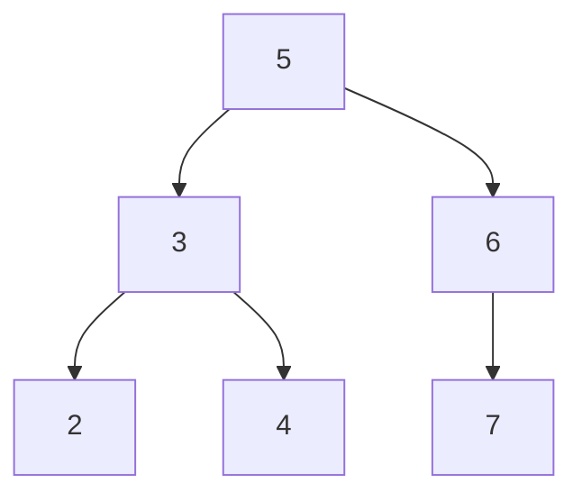

# Two Sum IV - Input is a BST

## Problem

Given the root of a binary search tree (a tree where every node's value is greater than all values in its left subtree and smaller than all values in its right subtree) and a target integer k, determine whether any two distinct nodes in the tree have values that sum to k. A binary search tree (BST) maintains sorted order, which you can leverage for efficiency. The key word here is "distinct" - you cannot use the same node twice, even if 2 times its value equals k.

For example, if you have a BST with values [5, 3, 6, 2, 4, 7] and k = 9, you'd look for any pair like 3 + 6 = 9 (which exists). But if k = 10 and you have a node with value 5, you cannot count it twice as 5 + 5 = 10.

Return true if such a pair exists, otherwise return false. Note that unlike the classic Two Sum problem where you work with an array, here you're navigating a tree structure, which means you need to traverse nodes rather than iterate through indices.


**Diagram:**



**Example 1:** BST = [5,3,6,2,4,null,7], k = 9
- Looking for two nodes that sum to 9
- Found: 3 + 6 = 9
- Output: true


**Example 2:** BST = [5,3,6,2,4,null,7], k = 28
- Looking for two nodes that sum to 28
- No such pair exists in this BST
- Output: false


## Why This Matters

This problem appears frequently in technical interviews because it tests whether you understand both the classic Two Sum pattern and how to adapt it to tree structures. In production systems, BSTs are used in database indexing, file systems, and memory management where you often need to search for pairs or ranges of values efficiently. The problem teaches you to recognize that a BST's inorder traversal produces a sorted sequence, connecting your knowledge of array algorithms to tree algorithms. It also demonstrates the trade-off between space complexity (storing all values in a hash set) versus time complexity (leveraging BST properties for searching). Many engineers encounter similar patterns when implementing autocomplete features, finding pairs of transactions that sum to a target amount, or optimizing search operations in sorted data structures.

## Constraints

- The number of nodes in the tree is in the range [1, 10⁴].
- -10⁴ <= Node.val <= 10⁴
- root is guaranteed to be a **valid** binary search tree.
- -10⁵ <= k <= 10⁵

## Think About

1. What makes this problem challenging? What's the core difficulty?
2. Can you identify subproblems? Do they overlap?
3. What invariants must be maintained?
4. Is there a mathematical relationship to exploit?

## Approach Hints

### Hint 1: Hash Set with Tree Traversal
Treat this like the classic Two Sum problem, but traverse a tree instead of an array. Use any tree traversal method (inorder, preorder, or postorder) and maintain a hash set. For each node value, check if (k - value) exists in the set. If yes, return true. If not, add the current value to the set and continue. What's the space complexity?

### Hint 2: BST Property with Inorder Traversal
Remember that an inorder traversal of a BST produces a sorted array. Perform inorder traversal to collect all values into a sorted list, then use the two-pointer technique from the sorted array Two Sum problem. Start with pointers at the beginning and end, adjusting based on the sum compared to k.

### Hint 3: Optimized BST Search
For each node, search for (k - node.val) in the BST using the tree's search property. This avoids storing all values. Start from root, recursively check if the complement exists in either subtree. Be careful not to use the same node twice. This approach leverages the BST structure but has different complexity trade-offs.

## Complexity Analysis

| Approach | Time Complexity | Space Complexity | Notes |
|----------|----------------|------------------|-------|
| Hash Set + DFS | O(n) | O(n) | Store all values, simple and fast |
| Inorder + Two Pointers | O(n) | O(n) | Sorted array enables two-pointer |
| BST Search for Each Node | O(n * h) | O(h) | h is height, worst case O(n²) for skewed tree |
| Iterative Inorder + Set | O(n) | O(h) | Space-optimized, uses implicit stack |

## Common Mistakes

### Mistake 1: Using the same node twice
```
// Wrong: Not checking if same node is used
function findTarget(root, k) {
    if (!root) return false;
    // Searching entire tree including current node
    return search(root, root, k - root.val);
}
```
**Why it's wrong**: The search function might find the current node itself when looking for the complement, violating the "distinct nodes" requirement.

**Correct approach**: Either use a set to track seen values, or ensure the search excludes the current node by passing node reference.

### Mistake 2: Not handling BST traversal correctly
```
// Wrong: Random traversal order
function inorder(node, result) {
    result.push(node.val);  // Should visit left first!
    if (node.left) inorder(node.left, result);
    if (node.right) inorder(node.right, result);
}
```
**Why it's wrong**: Inorder traversal must visit left subtree, then node, then right subtree to maintain sorted order in BST.

**Correct approach**: Left -> Node -> Right order: `inorder(left); visit(node); inorder(right);`

### Mistake 3: Inefficient BST search implementation
```
// Wrong: Linear search instead of BST search
function search(root, target) {
    // Checking every node linearly
    if (!root) return false;
    if (root.val === target) return true;
    return search(root.left, target) || search(root.right, target);  // O(n) search
}
```
**Why it's wrong**: This ignores the BST property. Should compare target with current value to decide whether to go left or right, achieving O(h) search.

**Correct approach**: Compare and go left if target < node.val, right if target > node.val.

## Variations

| Variation | Difference | Difficulty Increase |
|-----------|------------|---------------------|
| Two Sum in sorted array | Input is array not tree | None (easier) |
| Two Sum III - Data structure design | Support add and find operations | Medium (design problem) |
| Two Sum in arbitrary binary tree | Not a BST, no sorted property | None (simpler, just use set) |
| K Sum in BST | Find k numbers that sum to target | Hard (requires backtracking) |
| Count pairs with given sum | Count all pairs instead of boolean | Medium (need to track all pairs) |

## Practice Checklist

Track your progress mastering this problem:

- [ ] Solve using hash set approach
- [ ] Implement inorder traversal correctly
- [ ] Apply two-pointer technique on sorted array
- [ ] Handle edge cases (single node, two nodes, no solution)
- [ ] Implement without bugs on first try
- [ ] Explain why BST property helps
- [ ] Test with k = 2*node.val (same value twice)
- [ ] Solve in under 15 minutes
- [ ] Compare all three approaches
- [ ] Revisit after 3 days (spaced repetition)
- [ ] Revisit after 1 week (spaced repetition)
- [ ] Solve for arbitrary binary tree (not BST)

**Strategy**: See [Binary Search Tree Pattern](../prerequisites/trees.md)
