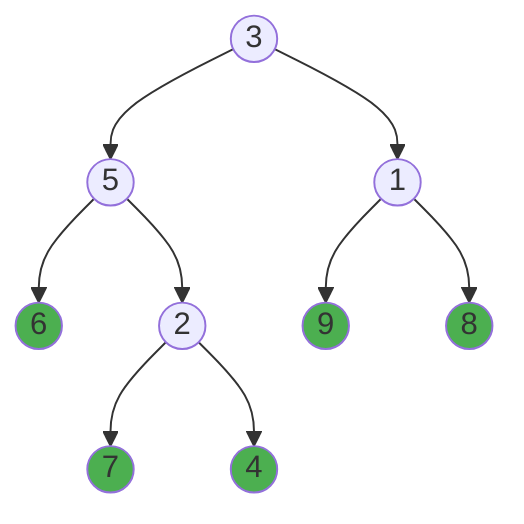

# Leaf-Similar Trees

## Problem

In a binary tree, a leaf node is a node that has no children (both its left and right pointers are null). The leaf value sequence of a tree is formed by collecting all leaf node values from left to right order.



In the tree diagram above, the leaf nodes (highlighted in green) are those without any children. Reading from left to right, the leaf sequence is `(6, 7, 4, 9, 8)`. Notice that we encounter the leaves in a specific order determined by how we traverse the tree: we always visit the left subtree completely before moving to the right subtree.

Given the root nodes of two binary trees (`root1` and `root2`), your task is to determine whether these trees are leaf-similar. Two trees are considered leaf-similar if and only if their leaf value sequences are identical. Return `true` if the trees are leaf-similar, and `false` otherwise.

The key challenge is correctly identifying leaf nodes (be careful not to confuse nodes with one child as leaves) and maintaining the proper left-to-right traversal order. Different tree structures can produce the same leaf sequence, so structural differences don't matter - only the final sequence of leaf values.

## Why This Matters

Tree traversal is one of the most fundamental skills in computer science, appearing in countless real-world applications. Understanding depth-first search (DFS) and how to navigate hierarchical structures is essential for working with file systems (where directories are nodes and files are leaves), database indexes (B-trees and B+ trees store data in leaf nodes), XML/JSON parsing (document object models are tree structures), compiler design (abstract syntax trees represent program structure), and AI decision trees. The pattern of collecting values from specific nodes during traversal appears in many algorithmic problems, from finding paths to validating tree properties. Mastering this problem builds the recursive thinking skills needed for more complex graph algorithms and prepares you for common technical interview questions involving tree manipulation and comparison.

## Constraints

- The number of nodes in each tree will be in the range [1, 200].
- Both of the given trees will have values in the range [0, 200].

## Think About

1. What makes this problem challenging? What's the core difficulty?
2. Can you identify subproblems? Do they overlap?
3. What invariants must be maintained?
4. Is there a mathematical relationship to exploit?

## Approach Hints

### Hint 1 - Conceptual Foundation
A leaf node is a node with no children (both left and right are null). You need to collect all leaf values from both trees in left-to-right order. What traversal method naturally visits nodes from left to right? How can you identify and collect only the leaf nodes?

### Hint 2 - Traversal Strategy
Use Depth-First Search (DFS) to traverse each tree. During traversal, when you reach a node, check if it's a leaf (node.left is null AND node.right is null). If it is, add its value to a list. Continue traversing left subtree before right subtree to maintain left-to-right order.

### Hint 3 - Implementation Strategy
Create a helper function that performs DFS on a tree and returns a list of leaf values. The function should: (1) Base case: if node is null, return. (2) If node is a leaf, add its value to the result list. (3) Recursively call on left child, then right child. Call this helper on both trees and compare the resulting lists for equality.

## Complexity Analysis

| Approach | Time Complexity | Space Complexity | Notes |
|----------|----------------|------------------|-------|
| DFS with List Storage | O(n + m) | O(n + m) | Store all leaf values, n and m are tree sizes |
| DFS with Simultaneous Traversal | O(n + m) | O(h1 + h2) | Use stacks/recursion, h is tree height |
| BFS with Queue | O(n + m) | O(w1 + w2) | Level-order traversal, w is max width |

## Common Mistakes

### Mistake 1: Including Non-Leaf Nodes
```python
# INCORRECT: Adds all nodes instead of just leaves
def get_leaves(root, leaves):
    if not root:
        return
    leaves.append(root.val)  # Wrong: adds every node
    get_leaves(root.left, leaves)
    get_leaves(root.right, leaves)
```
**Why it's wrong:** This collects all node values in pre-order, not just leaves. A leaf must have both children as null.

**Correct approach:**
```python
# CORRECT: Only adds leaf nodes
def get_leaves(root, leaves):
    if not root:
        return
    # Check if it's a leaf (no children)
    if not root.left and not root.right:
        leaves.append(root.val)
    get_leaves(root.left, leaves)
    get_leaves(root.right, leaves)
```

### Mistake 2: Wrong Traversal Order
```python
# INCORRECT: Right-to-left traversal
def get_leaves(root, leaves):
    if not root:
        return
    if not root.left and not root.right:
        leaves.append(root.val)
    get_leaves(root.right, leaves)  # Wrong: visits right first
    get_leaves(root.left, leaves)
```
**Why it's wrong:** The problem requires left-to-right order. Visiting right subtree before left reverses the order.

**Correct approach:**
```python
# CORRECT: Left-to-right traversal
def get_leaves(root, leaves):
    if not root:
        return
    if not root.left and not root.right:
        leaves.append(root.val)
    get_leaves(root.left, leaves)   # Correct: left first
    get_leaves(root.right, leaves)  # Then right
```

### Mistake 3: Incorrect Leaf Detection
```python
# INCORRECT: Considers nodes with one child as leaves
def get_leaves(root, leaves):
    if not root:
        return
    # Wrong: this includes nodes with one child
    if not root.left or not root.right:
        leaves.append(root.val)
    get_leaves(root.left, leaves)
    get_leaves(root.right, leaves)
```
**Why it's wrong:** Using OR (or) instead of AND (and) means nodes with only one child are considered leaves. A true leaf has NO children at all.

## Problem Variations

| Variation | Difficulty | Key Difference |
|-----------|-----------|----------------|
| Same Tree | Easy | Check if two trees are structurally identical |
| Symmetric Tree | Easy | Check if tree is mirror of itself |
| Sum of Left Leaves | Easy | Calculate sum of all left leaf nodes only |
| Path Sum Root to Leaf | Easy | Find if path exists with given sum |
| Binary Tree Paths | Medium | Return all root-to-leaf paths as strings |
| Smallest String from Leaf | Medium | Find lexicographically smallest string from leaf to root |

## Practice Checklist

- [ ] First solve: Implement DFS with list collection
- [ ] Handle edge cases: Single node tree, all left skewed, all right skewed
- [ ] Optimize: Consider space optimization with simultaneous traversal
- [ ] Review after 1 day: Explain DFS traversal order clearly
- [ ] Review after 1 week: Implement without looking at notes
- [ ] Interview ready: Extend to other tree traversal problems

## Strategy

**Pattern**: Depth-First Search (DFS) / Tree Traversal
- Master recursive tree traversal
- Learn leaf node identification
- Understand traversal order impact on results

See [Tree Pattern](../prerequisites/trees.md) for the complete strategy guide.
