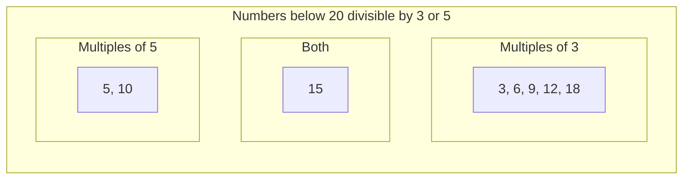

# Multiples of 3 or 5

## Problem

Find the sum of all positive integers below a given limit that are divisible by 3 or 5. For example, below 10, the multiples of 3 or 5 are 3, 5, 6, and 9, which sum to 23.

Think of this as collecting all numbers in a range that satisfy a certain divisibility condition. A number is divisible by 3 if it leaves no remainder when divided by 3 (we can check this using the modulo operator: `number % 3 == 0`). The same applies for 5.

## Why This Matters

This problem introduces fundamental programming concepts: iteration with loops, conditional logic with modulo operator, and accumulator patterns. These building blocks appear in virtually every algorithm. The mathematical insight here (inclusion-exclusion principle) also previews more advanced counting techniques.

In real-world applications, similar divisibility checks appear in scheduling systems (events every N days), data validation, and pagination logic. The optimization from O(n) to O(1) demonstrates the power of mathematical insight over brute force computation.

> **For beginners:** Don't worry if the math formula seems intimidating at first. The brute force approach (simple loop) works perfectly fine for small inputs. Start there, understand why it works, and then learn the optimization when you're ready.

## Examples

**Example 1:**

- Input: `limit = 10`
- Output: `23`
- Explanation: Numbers divisible by 3 or 5 below 10 are: 3, 5, 6, 9. Their sum is 3 + 5 + 6 + 9 = 23.

<details>
<summary>Step-by-step trace (click to expand)</summary>

**Brute Force Approach:**

```
Check 1: 1%3≠0, 1%5≠0 → skip
Check 2: 2%3≠0, 2%5≠0 → skip
Check 3: 3%3=0        → add 3,  sum = 3
Check 4: 4%3≠0, 4%5≠0 → skip
Check 5: 5%5=0        → add 5,  sum = 8
Check 6: 6%3=0        → add 6,  sum = 14
Check 7: 7%3≠0, 7%5≠0 → skip
Check 8: 8%3≠0, 8%5≠0 → skip
Check 9: 9%3=0        → add 9,  sum = 23
Final answer: 23 ✓
```

**Formula Approach:**

```
Sum(3):  m = 9÷3 = 3  →  3 × (3×4÷2) = 3 × 6 = 18
Sum(5):  m = 9÷5 = 1  →  5 × (1×2÷2) = 5 × 1 = 5
Sum(15): m = 9÷15 = 0 →  0

Answer = 18 + 5 - 0 = 23 ✓
```

</details>

**Example 2:**

- Input: `limit = 20`
- Output: `78`
- Explanation: Multiples of 3 or 5 below 20: 3, 5, 6, 9, 10, 12, 15, 18. Sum = 78.

## Constraints

- 1 <= limit <= 10^9

## Think About

1. What's the simplest approach that works?
2. Can you identify a mathematical pattern or formula?
3. What are the bounds of your search space?
4. How can you verify your answer?

---

## Approach Hints

<details>
<summary>Hint 1: Getting Started</summary>

Loop through all numbers from 1 to limit-1 and check divisibility. A number is divisible by n if `(number % n == 0)`. Keep a running sum of all numbers that are divisible by 3 OR divisible by 5.

```python
sum = 0
for number in range(1, limit):  # 1 to limit-1
    if number % 3 == 0 or number % 5 == 0:
        sum = sum + number
return sum
```

Be careful: some numbers are divisible by both 3 AND 5 (like 15). But the `or` condition handles this correctly — if a number passes either check, it gets added exactly once.

</details>

<details>
<summary>Hint 2: Key Insight</summary>

For really big numbers (like 1 billion), checking every single number is too slow. We can use math to skip the loop entirely!

**Step 1: Spot the Pattern**

Write out the multiples of 3 below 10:

```
3, 6, 9
```

Now rewrite each as a product:

```
3×1, 3×2, 3×3
```

Factor out the 3:

```
3 × (1 + 2 + 3) = 3 × 6 = 18
```

The sum of multiples of 3 equals **3 times the sum of consecutive integers from 1 to m**, where *m* is how many multiples exist.

**Step 2: Find m (the count of multiples)**

Ask: "How many multiples of 3 are below 10?"

Count them: 3, 6, 9 → that's **3 multiples**.

The formula: `m = floor((limit - 1) / k)`

- Python: `m = (limit - 1) // 3`  →  `m = 9 // 3 = 3`
- JavaScript: `Math.floor((10 - 1) / 3)`  →  `3`

> **Why (limit - 1)?** The problem says "below limit", not "including limit". For limit=10, we check 1-9, not 1-10. So we use 9, not 10.

**Step 3: Use the Arithmetic Series Formula**

The sum 1 + 2 + 3 + ... + m equals `m × (m + 1) / 2`.

Putting it together:

```
Sum of multiples of k = k × m × (m + 1) / 2
```

*Example for multiples of 3 below 10:*

- m = 3
- Sum = 3 × (3 × 4 / 2) = 3 × 6 = **18** ✓

**Step 4: The Overlap Problem**

If we add sum(multiples of 3) + sum(multiples of 5), we count some numbers twice:

- 15 is divisible by both 3 and 5
- 30 is divisible by both 3 and 5
- etc.

**Step 5: The Solution (Inclusion-Exclusion)**

Subtract the overlap:

```
Answer = Sum(3) + Sum(5) - Sum(LCM(3,5))
       = Sum(3) + Sum(5) - Sum(15)
```

*Note: We subtract multiples of 15 because 15 is the **Least Common Multiple (LCM)** of 3 and 5. For coprime numbers like 3 and 5, LCM equals their product. But for non-coprime numbers (e.g., 4 and 6), you must use LCM(4,6) = 12, not 4 × 6 = 24.*

**Worked Example (limit = 10):**

```
Sum(3):  m = 9//3 = 3  →  3 × 3 × 4 / 2 = 18
Sum(5):  m = 9//5 = 1  →  5 × 1 × 2 / 2 = 5
Sum(15): m = 9//15 = 0 →  15 × 0 × 1 / 2 = 0

Answer = 18 + 5 - 0 = 23 ✓
```

</details>

<details>
<summary>Hint 3: Optimization</summary>

Create a helper function to compute the sum of all multiples of k below n:

```
def sum_multiples(k, n):
    m = (n - 1) // k  # how many multiples of k exist below n
    return k * m * (m + 1) // 2
```

Then: `answer = sum_multiples(3, limit) + sum_multiples(5, limit) - sum_multiples(15, limit)`

This runs in O(1) time instead of O(n)!

</details>

---

## Complexity Analysis

| Approach | Time | Space | Trade-off | Real Impact (limit = 10⁹) |
|----------|------|-------|-----------|---------------------------|
| Brute Force (Loop) | O(n) | O(1) | Simple but slow for large n | ~1 billion iterations (~10+ seconds) |
| Optimal (Formula) | O(1) | O(1) | Fast for any n, requires math insight | 3 calculations (instant) |

---

## Key Concept

**Modulo operator and arithmetic series**

The modulo operator (%) gives the remainder after division. It's perfect for checking divisibility:

- `n % 3 == 0` means n is divisible by 3
- `n % 5 == 0` means n is divisible by 5

The arithmetic series formula: 1 + 2 + 3 + ... + n = n × (n+1) / 2 is one of the most useful formulas in computer science. It appears in complexity analysis, algorithm optimization, and many mathematical problems.

The inclusion-exclusion principle states: |A ∪ B| = |A| + |B| - |A ∩ B|. For our problem, we want multiples of 3 OR 5, so we add both but subtract their overlap (multiples of 15).

**Visualizing Inclusion-Exclusion (for limit = 20):**



If we count A (3,6,9,12,15,18) and B (5,10,15) separately, we count 15 twice. Subtracting the overlap fixes this.

---

## Common Mistakes

1. **Double-counting multiples of 15**: Numbers like 15, 30, 45 are divisible by both 3 and 5. If you simply add sum(3) + sum(5), you count these twice. Fix: subtract sum(15).

2. **Off-by-one errors**: The problem says "below limit", not "up to and including limit". So for limit=10, check numbers 1 through 9, not 1 through 10. This is why the formula uses `(limit - 1) // k` instead of `limit // k`.

3. **Integer overflow**: For very large limits (near 10^9), intermediate calculations might overflow. Use appropriate data types (long in Java, no issue in Python).

---

## Variations

| Variation | Change | Approach Adjustment |
|-----------|--------|---------------------|
| Different divisors | Find multiples of 7 or 11 | Same formula, change k values and LCM |
| Three divisors | Multiples of 3, 5, or 7 | Inclusion-exclusion with 3 sets: A+B+C - AB - AC - BC + ABC |
| Range sum | Sum between two limits | sum(high) - sum(low) |

---

## Practice Checklist

**Correctness:**

- [ ] Handles basic cases (limit = 10, 20)
- [ ] Handles edge cases (limit = 1, limit = 1000000000)
- [ ] Produces correct output format

**Understanding:**

- [ ] Can explain the mathematical insight
- [ ] Understands why the approach works
- [ ] Can estimate complexity without running code

**Mastery:**

- [ ] Solved without hints
- [ ] Can explain to someone else
- [ ] Identified optimization opportunities

**Spaced Repetition Tracker:**

- [ ] Day 1: Initial solve
- [ ] Day 3: Solve without hints
- [ ] Day 7: Explain the concept
- [ ] Day 14: Optimize if possible

---

**Euler Reference:** [Problem 1](https://projecteuler.net/problem=1)

**Next Step:** After mastering this, try [F002: Sum Square Difference](./F002_sum_square_difference.md)
