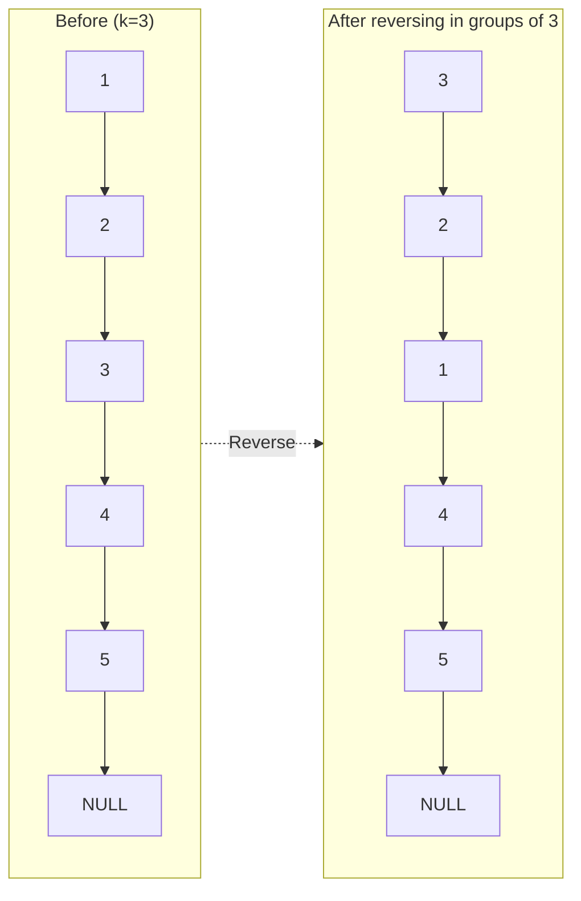

# Reverse Nodes in k-Group

## Problem

Reverse nodes in groups of k. Nodes not forming a complete group stay in original order.

**Diagram:**

Example 1: k = 2


Example 2: k = 3



## Why This Matters

Linked lists teach pointer manipulation and in-place modifications. Understanding node relationships is key to many advanced structures.

## Constraints

- The number of nodes in the list is n.
- 1 <= k <= n <= 5000
- 0 <= Node.val <= 1000

## Think About

1. What's the brute force approach? What's its time complexity?
2. Can you identify any patterns in the examples?
3. What data structure would help organize the information?

**Strategy**: See [Linked List Pattern](../prerequisites/linked-lists.md)

## Approach Hints

<details>
<summary>🔑 Key Insight</summary>

You need to reverse exactly k nodes at a time, which means you must: (1) check if k nodes remain, (2) reverse those k nodes in-place, (3) connect them back to the rest of the list. The key is maintaining pointers to the group's predecessor and the tail of the reversed group to reconnect properly.

</details>

<details>
<summary>🎯 Main Approach</summary>

Use a dummy node before the head to simplify edge cases. For each group: count k nodes ahead to verify you have enough, reverse those k nodes using the standard three-pointer reversal technique, then reconnect the reversed group. Keep track of the previous group's tail to link groups together. If fewer than k nodes remain, leave them unreversed.

</details>

<details>
<summary>⚡ Optimization Tip</summary>

The reversal can be done in-place with O(1) space by carefully manipulating pointers. Use a helper function to reverse exactly k nodes starting from a given node, returning the new head and tail. This makes the main logic cleaner and easier to debug. Remember to check if there are k nodes remaining before attempting reversal.

</details>

## Complexity Analysis

| Approach | Time | Space | Notes |
|----------|------|-------|-------|
| Array Conversion | O(n) | O(n) | Convert to array, reverse chunks, rebuild list |
| In-place Reversal | O(n) | O(1) | Optimal - reverse groups directly in the list |

## Common Mistakes

1. **Not checking if k nodes remain before reversing**
   ```python
   # Wrong: Reversing without counting ahead
   current = head
   for i in range(k):
       next_node = current.next
       current.next = prev
       prev = current
       current = next_node  # Could be None!

   # Correct: Count first, then reverse
   # Check if k nodes exist
   temp = head
   for i in range(k):
       if not temp:
           return head  # Less than k nodes remain
       temp = temp.next
   # Now safe to reverse
   ```

2. **Losing connection between reversed groups**
   ```python
   # Wrong: Not tracking the tail of previous group
   new_head = reverse_k_nodes(head, k)
   # Lost reference to connect next group!

   # Correct: Keep track of group connections
   prev_group_tail = dummy
   while has_k_nodes(current, k):
       group_start = current
       new_group_head = reverse_k_nodes(current, k)
       prev_group_tail.next = new_group_head
       prev_group_tail = group_start  # Old head is new tail
       current = group_start.next
   ```

3. **Incorrect pointer updates during reversal**
   ```python
   # Wrong: Losing track of the next group
   for i in range(k):
       next_node = current.next
       current.next = prev
       prev = current
       current = next_node
   # Lost reference to continue to next group!

   # Correct: Save the next group's start
   next_group_start = None
   for i in range(k):
       if i == k - 1:
           next_group_start = current.next
       next_node = current.next
       current.next = prev
       prev = current
       current = next_node
   return prev, next_group_start  # Return both new head and continuation point
   ```

## Variations

| Variation | Difficulty | Key Difference |
|-----------|------------|----------------|
| Reverse Linked List | Easy | Reverse entire list (k = n) |
| Reverse Linked List II | Medium | Reverse nodes between positions m and n |
| Swap Nodes in Pairs | Medium | Special case where k = 2 |
| Rotate List | Medium | Rotate entire list instead of reversing groups |

## Practice Checklist

- [ ] Solved without hints
- [ ] Optimal time complexity achieved
- [ ] Clean, readable code
- [ ] Handled all edge cases (k=1, k=n, incomplete final group)
- [ ] Can explain approach clearly

**Spaced Repetition:** Review in 1 day → 3 days → 7 days → 14 days → 30 days

---
**Strategy Reference:** [Linked List Patterns](../../prerequisites/linked-lists.md)
