# First Missing Positive

## Problem

Find the smallest missing positive integer in an unsorted array. Your algorithm must run in **O(n) time** and use **O(1) extra space**.

```
Visualization:
Input:  [3, 4, -1, 1]
         ↓  ↓   ↓  ↓
Think: The answer MUST be in range [1, n+1]
       Array length n=4, so answer is in [1,5]

Key insight: Use the array itself as a hash table!
Position 0 should hold value 1
Position 1 should hold value 2
Position i should hold value i+1
```

## Why This Matters

This is one of the most elegant examples of the **cyclic sort** pattern - a technique where you use array indices as a hash table. It demonstrates:

- **Constraint-driven thinking**: O(1) space eliminates obvious solutions (sets, sorting)
- **Index manipulation**: Treating positions as buckets for specific values
- **Invariant maintenance**: Each element moves to its "correct" position
- **Interview frequency**: Common follow-up after "Find Duplicate" problems

**Real-world applications:**
- Memory allocators finding first free block
- Database systems finding first available ID after deletions
- Resource managers tracking available slots
- File systems locating free inodes

## Examples

**Example 1:**
- Input: `nums = [1,2,0]`
- Output: `3`
- Explanation: The numbers in the range [1,2] are all in the array.

**Example 2:**
- Input: `nums = [3,4,-1,1]`
- Output: `2`
- Explanation: 1 is in the array but 2 is missing.

**Example 3:**
- Input: `nums = [7,8,9,11,12]`
- Output: `1`
- Explanation: The smallest positive integer 1 is missing.

**Example 4:**
- Input: `nums = [1]`
- Output: `2`
- Explanation: Array contains only 1, so 2 is the first missing.

**Example 5:**
- Input: `nums = [1,2,3,4,5]`
- Output: `6`
- Explanation: All values [1..5] present, so answer is n+1.

## Constraints

- 1 <= nums.length <= 10⁵
- -2³¹ <= nums[i] <= 2³¹ - 1

## Think About

1. Why must the answer be in the range [1, n+1]? (Pigeonhole principle!)
2. How can you use the array indices to "mark" which numbers are present?
3. What values should you ignore during placement? (negatives, zeros, values > n)
4. How do you handle duplicates during cyclic sorting?

---

## Approach Hints

<details>
<summary>💡 Hint 1: The answer must be in range [1, n+1]</summary>

**Socratic questions:**
- If array has length n=5, what's the maximum answer?
- Can the answer ever be greater than n+1?
- What happens if all values [1, 2, 3, 4, 5] are present?

**Key insight:** By the pigeonhole principle, if you have n positions and all values [1..n] are present, the answer is n+1. Otherwise, at least one value in [1..n] is missing, and that's your answer.

```
Array of length 4:
- Best case: [1,2,3,4] → answer is 5
- Missing case: [1,2,4,4] → answer is 3 (missing from [1..4])
- Large values: [10,20,30,40] → answer is 1 (all values > n)
```

This means we only care about values in range [1..n]!

</details>

<details>
<summary>🎯 Hint 2: Multiple approaches with trade-offs</summary>

**Approach 1: Sorting (violates space constraint if not in-place)**
```
Sort array → O(n log n) time
Scan for first gap → O(n)
Total: O(n log n) time, O(1) space if in-place sort
BUT: Doesn't meet O(n) time requirement!
```

**Approach 2: Hash Set (violates space constraint)**
```
Add all positive nums to set → O(n)
Check 1, 2, 3, ... until not found → O(n)
Total: O(n) time, O(n) space
BUT: Uses extra space!
```

**Approach 3: Mark indices with negation**
```
- Ignore negatives, zeros, values > n
- For each valid value x, mark nums[x-1] as negative
- First positive index i means (i+1) is missing
Total: O(n) time, O(1) space ✓
BUT: Requires careful handling of already-negative values
```

**Approach 4: Cyclic Sort (optimal)**
```
- Place each value x at index x-1 (value x belongs at position x-1)
- After placement, scan for first index where nums[i] != i+1
Total: O(n) time, O(1) space ✓
BEST: Clearest invariant, easiest to reason about
```

</details>

<details>
<summary>📝 Hint 3: Cyclic sort pseudocode</summary>

```
Phase 1: Place each element at its "correct" position
─────────────────────────────────────────────────────
for i = 0 to n-1:
    while nums[i] is in range [1, n] and nums[i] != nums[nums[i] - 1]:
        # Value nums[i] should go to index nums[i]-1
        correct_index = nums[i] - 1
        swap(nums[i], nums[correct_index])

    # After while loop, nums[i] is either:
    # - At its correct position (nums[i] == i+1)
    # - Out of range (< 1 or > n)
    # - A duplicate of the value at its correct position

Phase 2: Find first position where value doesn't match
────────────────────────────────────────────────────────
for i = 0 to n-1:
    if nums[i] != i + 1:
        return i + 1

# If all positions correct, answer is n+1
return n + 1

Edge cases to handle:
─────────────────────
1. While loop condition: nums[i] != nums[nums[i]-1] prevents infinite loop on duplicates
2. Range check: Only place values in [1, n]
3. Index bounds: nums[i]-1 must be valid index
```

**Why the while loop doesn't infinite loop:**
- Each swap places at least one element at its correct position
- Once an element is at its correct position, it never moves again
- At most n swaps total across all iterations

</details>

---

## Complexity Analysis

| Approach | Time | Space | Notes |
|----------|------|-------|-------|
| Brute force (check 1,2,3...) | O(n²) | O(1) | Check each value linearly |
| Sorting | O(n log n) | O(1) | Fails time constraint |
| Hash Set | O(n) | O(n) | Fails space constraint |
| Index negation marking | O(n) | O(1) | Requires preprocessing negatives |
| **Cyclic Sort** | **O(n)** | **O(1)** | **Optimal** |

**Why Cyclic Sort is O(n):**
- Outer loop: O(n) iterations
- Inner while loop: Each element is swapped at most once (amortized O(1))
- Total swaps across entire algorithm: ≤ n
- Second scan: O(n)
- **Total: O(n) with O(1) extra space**

---

## Common Mistakes

### 1. Infinite loop on duplicates
```python
# WRONG: Infinite loop if nums[i] == nums[correct_index]
while nums[i] in range [1, n]:
    correct_index = nums[i] - 1
    swap(nums[i], nums[correct_index])  # If both are same, loops forever!

# CORRECT: Check they're different before swapping
while nums[i] in range [1, n] and nums[i] != nums[nums[i] - 1]:
    correct_index = nums[i] - 1
    swap(nums[i], nums[correct_index])
```

### 2. Not checking range before using as index
```python
# WRONG: nums[i] could be negative or > n
correct_index = nums[i] - 1
swap(nums[i], nums[correct_index])  # Index out of bounds!

# CORRECT: Validate range first
while 1 <= nums[i] <= n and nums[i] != nums[nums[i] - 1]:
    correct_index = nums[i] - 1
    swap(nums[i], nums[correct_index])
```

### 3. Using a for loop instead of while for placement
```python
# WRONG: Only tries to place once, might not finish
for i in range(n):
    if 1 <= nums[i] <= n:
        correct_index = nums[i] - 1
        swap(nums[i], nums[correct_index])  # What if swapped value also needs placement?

# CORRECT: Use while to keep placing until position is settled
for i in range(n):
    while 1 <= nums[i] <= n and nums[i] != nums[nums[i] - 1]:
        correct_index = nums[i] - 1
        swap(nums[i], nums[correct_index])
```

### 4. Forgetting to return n+1 when all present
```python
# WRONG: Doesn't handle the "all values present" case
for i in range(n):
    if nums[i] != i + 1:
        return i + 1
# Missing return statement!

# CORRECT: Return n+1 if all [1..n] are present
for i in range(n):
    if nums[i] != i + 1:
        return i + 1
return n + 1
```

### 5. Off-by-one in index conversion
```python
# WRONG: Value-to-index mapping incorrect
correct_index = nums[i]  # Value 1 goes to index 1? No!

# CORRECT: Value k goes to index k-1
correct_index = nums[i] - 1  # Value 1 goes to index 0
```

---

## Visual Walkthrough

```mermaid
graph TD
    A["Input: [3, 4, -1, 1]<br/>Goal: Place value k at index k-1"] --> B["i=0: nums[0]=3<br/>3 should be at index 2"]
    B --> C["Swap nums[0] with nums[2]<br/>[−1, 4, 3, 1]"]
    C --> D["Still i=0: nums[0]=−1<br/>−1 out of range, skip"]
    D --> E["i=1: nums[1]=4<br/>4 should be at index 3"]
    E --> F["Swap nums[1] with nums[3]<br/>[−1, 1, 3, 4]"]
    F --> G["Still i=1: nums[1]=1<br/>1 should be at index 0"]
    G --> H["Swap nums[1] with nums[0]<br/>[1, −1, 3, 4]"]
    H --> I["i=2: nums[2]=3<br/>Already at correct position"]
    I --> J["i=3: nums[3]=4<br/>Already at correct position"]
    J --> K["Scan: nums[1] != 2<br/>Answer: 2"]
```



**Detailed step-by-step:**

```
Initial: [3, 4, -1, 1]
         Index: 0  1   2  3
         Want:  1  2   3  4  (ideal placement)

i=0, nums[0]=3
├─ 3 should be at index 2
├─ Swap nums[0] ↔ nums[2]
└─ After: [-1, 4, 3, 1]

i=0, nums[0]=-1
├─ -1 is out of range [1,4]
└─ Skip (leave it)

i=1, nums[1]=4
├─ 4 should be at index 3
├─ Swap nums[1] ↔ nums[3]
└─ After: [-1, 1, 3, 4]

i=1, nums[1]=1
├─ 1 should be at index 0
├─ Swap nums[1] ↔ nums[0]
└─ After: [1, -1, 3, 4]

i=1, nums[1]=-1
├─ -1 is out of range
└─ Done with position 1

i=2, nums[2]=3
├─ 3 is at index 2 (correct!)
└─ Done

i=3, nums[3]=4
├─ 4 is at index 3 (correct!)
└─ Done

Final placement: [1, -1, 3, 4]

Scan phase:
├─ i=0: nums[0]=1, expect 1 ✓
├─ i=1: nums[1]=-1, expect 2 ✗
└─ Answer: 2
```

---

## Variations

| Variation | Change | Approach Adjustment |
|-----------|--------|---------------------|
| **Find all missing positives** | Return all missing | After cyclic sort, collect all i where nums[i] != i+1 |
| **First missing in range [0,n]** | Include 0 | Adjust placement: value k goes to index k (not k-1) |
| **Find duplicate and missing** | Find both | During placement, duplicate won't have a correct spot |
| **K missing positive numbers** | Find first k missing | Continue scanning after finding first, collect k results |
| **Immutable array** | Cannot modify input | Fall back to hash set approach, O(n) space |

---

## Practice Checklist

**Correctness:**
- [ ] Handles all positive numbers
- [ ] Handles negative numbers
- [ ] Handles zero
- [ ] Handles duplicates
- [ ] Handles all values present (return n+1)
- [ ] Handles single element
- [ ] Handles large values (> n)

**Algorithm Understanding:**
- [ ] Can explain why answer is in [1, n+1]
- [ ] Can describe cyclic sort invariant
- [ ] Can explain why while loop doesn't infinite loop
- [ ] Can trace through placement step-by-step

**Interview Readiness:**
- [ ] Can explain O(n) time analysis
- [ ] Can prove O(1) space usage
- [ ] Can code solution in 15 minutes
- [ ] Can handle edge cases without hints
- [ ] Can compare to alternative approaches

**Spaced Repetition Tracker:**
- [ ] Day 1: Study cyclic sort pattern
- [ ] Day 3: Implement from scratch
- [ ] Day 7: Code with all edge cases
- [ ] Day 14: Explain to someone else
- [ ] Day 30: Speed run (< 10 min)

---

**Strategy**: See [Cyclic Sort Pattern](../../strategies/patterns/cyclic-sort.md) | [Index as Hash Table](../../strategies/patterns/index-as-hash.md)
