# N-Queens

## Problem

Place `n` queens on an `n×n` chessboard such that **no two queens attack each other**. Return all distinct solutions.

A queen can attack horizontally, vertically, and diagonally. Each solution contains a distinct board configuration where 'Q' represents a queen and '.' represents an empty space.

**Diagram:**

```
N-Queens Problem (n=4) - Two valid solutions:

Solution 1:              Solution 2:
┌───┬───┬───┬───┐       ┌───┬───┬───┬───┐
│ . │ Q │ . │ . │       │ . │ . │ Q │ . │
├───┼───┼───┼───┤       ├───┼───┼───┼───┤
│ . │ . │ . │ Q │       │ Q │ . │ . │ . │
├───┼───┼───┼───┤       ├───┼───┼───┼───┤
│ Q │ . │ . │ . │       │ . │ . │ . │ Q │
├───┼───┼───┼───┤       ├───┼───┼───┼───┤
│ . │ . │ Q │ . │       │ . │ Q │ . │ . │
└───┴───┴───┴───┘       └───┴───┴───┴───┘

Rules:
• No two queens can be in the same row
• No two queens can be in the same column
• No two queens can be on the same diagonal
• Q = Queen placement, . = Empty cell
```

## Why This Matters

The N-Queens problem is the **canonical example of backtracking**. It teaches fundamental concepts that appear in:

- **Constraint satisfaction problems (CSP)**: Sudoku, graph coloring, scheduling
- **Search space pruning**: Early termination when constraints violated
- **State space exploration**: Systematically generating all valid configurations
- **Recursive problem decomposition**: Breaking n-queens into "place queen in row i" subproblems

**Real-world applications:**
- Task scheduling with resource conflicts
- Circuit board layout with interference constraints
- Network routing avoiding congested paths
- Meeting room assignment with availability constraints

This problem is asked frequently in interviews to test backtracking understanding and optimization skills.

## Examples

**Example 1:**
- Input: `n = 4`
- Output: `[[".Q..","...Q","Q...","..Q."],["..Q.","Q...","...Q",".Q.."]]`
- Explanation: There are exactly 2 distinct solutions to the 4-queens puzzle.

**Example 2:**
- Input: `n = 1`
- Output: `[["Q"]]`
- Explanation: Only one cell, place the single queen there.

**Example 3:**
- Input: `n = 2`
- Output: `[]`
- Explanation: No solution exists for 2×2 board (2 queens always attack each other).

**Example 4:**
- Input: `n = 3`
- Output: `[]`
- Explanation: No solution exists for 3×3 board.

## Constraints

- 1 <= n <= 9

## Think About

1. Why place queens row-by-row instead of all at once?
2. How can you efficiently check if two queens are on the same diagonal?
3. What data structures help quickly check column and diagonal conflicts?
4. When should you stop exploring a branch? (Early pruning!)

---

## Approach Hints

<details>
<summary>💡 Hint 1: Row-by-row placement insight</summary>

**Socratic questions:**
- How many queens must be placed total?
- Can two queens be in the same row?
- If you place one queen per row, what does that guarantee?

**Key insight:** Since we need exactly n queens and have n rows, and no two queens can share a row, we must place **exactly one queen per row**.

This simplifies the problem:
- Process rows sequentially (row 0, then row 1, etc.)
- For each row, try placing a queen in each column
- Check if placement is valid (no column/diagonal conflicts)
- Recurse to next row if valid
- Backtrack if no valid placement found

```
Decision tree for n=4:
Row 0: Try columns 0, 1, 2, 3
├─ Queen at (0,0)
│  └─ Row 1: Try columns 0, 1, 2, 3
│     ├─ (0,1) conflicts with (0,0) ✗
│     ├─ (1,1) conflicts diagonally with (0,0) ✗
│     └─ (1,2) is valid ✓
│        └─ Row 2: Continue...
├─ Queen at (0,1)
│  └─ Row 1: ...
```

This reduces the search space from n^(n²) to n^n (still exponential but manageable).

</details>

<details>
<summary>🎯 Hint 2: Multiple approaches with trade-offs</summary>

**Approach 1: Brute force with validation**
```
Generate all possible placements of n queens on n×n board
For each placement:
    Check if any two queens attack each other
    If valid, add to solutions
Total: O(n^(n²)) placements × O(n²) validation = Intractable
```

**Approach 2: Backtracking with basic validation**
```
Place queens row-by-row
For each placement, scan all previous queens to check conflicts
Time: O(n!) × O(n) per validation
Space: O(n) recursion depth
BETTER: Prunes invalid branches early
```

**Approach 3: Backtracking with sets (optimal)**
```
Maintain sets for:
- Occupied columns
- Occupied diagonals (slope +1)
- Occupied anti-diagonals (slope -1)

Place queens row-by-row
Check sets in O(1) instead of scanning
Time: O(n!) with heavy pruning
Space: O(n) for sets + O(n) recursion
BEST: O(1) conflict checking
```

**Diagonal formula insight:**
- Diagonal (slope +1): All cells on same diagonal have `row - col = constant`
- Anti-diagonal (slope -1): All cells on same diagonal have `row + col = constant`

</details>

<details>
<summary>📝 Hint 3: Backtracking pseudocode with sets</summary>

```python
Initialize:
─────────
cols = set()           # Column indices with queens
diag = set()           # Diagonals (row - col values)
anti_diag = set()      # Anti-diagonals (row + col values)
board = [['.' for _ in range(n)] for _ in range(n)]
solutions = []

Backtrack function:
───────────────────
def backtrack(row):
    if row == n:
        # Placed all queens successfully!
        solutions.append(copy_board(board))
        return

    for col in range(n):
        # Check if column/diagonals are occupied
        if col in cols or (row - col) in diag or (row + col) in anti_diag:
            continue  # Skip this position (pruning!)

        # Place queen (make choice)
        board[row][col] = 'Q'
        cols.add(col)
        diag.add(row - col)
        anti_diag.add(row + col)

        # Recurse to next row
        backtrack(row + 1)

        # Remove queen (undo choice - backtrack)
        board[row][col] = '.'
        cols.remove(col)
        diag.remove(row - col)
        anti_diag.remove(row + col)

Start backtracking:
───────────────────
backtrack(0)
return solutions

Edge cases:
───────────
1. n=1: Single cell, trivial solution
2. n=2, n=3: No solutions exist (prove by exhaustion)
3. n≥4: Multiple solutions exist
```

**Why this works:**
- Sets give O(1) lookup for conflicts
- Backtracking explores only valid partial solutions
- Early pruning drastically reduces search space

</details>

---

## Complexity Analysis

| Approach | Time | Space | Notes |
|----------|------|-------|-------|
| Brute force enumeration | O(n^(n²)) | O(n²) | Check all queen placements |
| Backtracking with linear scan | O(n!) × O(n) | O(n²) | Scan previous queens each time |
| **Backtracking with sets** | **O(n!)** | **O(n)** | **Optimal conflict checking** |
| With symmetry pruning | O(n!/8) | O(n) | Use board symmetries (advanced) |

**Why O(n!) time:**
- Row 0: n choices
- Row 1: ≤ n-2 valid choices (column and diagonals blocked)
- Row 2: ≤ n-4 valid choices
- ...
- Worst case: O(n × (n-2) × (n-4) × ...) ≈ O(n!)

**Space breakdown:**
- Recursion depth: O(n)
- Sets (cols, diag, anti_diag): O(n) entries each
- Board representation: O(n²) for output, not counted in auxiliary space
- **Total auxiliary space: O(n)**

---

## Common Mistakes

### 1. Checking diagonals inefficiently
```python
# WRONG: Scanning all previous placements every time
def is_valid(row, col, queens):
    for prev_row, prev_col in queens:
        if prev_col == col:  # Same column
            return False
        if abs(prev_row - row) == abs(prev_col - col):  # Diagonal
            return False
    return True  # O(n) scan every placement!

# CORRECT: Use sets for O(1) lookup
if col in cols or (row - col) in diag or (row + col) in anti_diag:
    continue
```

### 2. Not backtracking properly
```python
# WRONG: Forgetting to remove queen after recursion
board[row][col] = 'Q'
cols.add(col)
backtrack(row + 1)
# Missing: Remove queen! This leaves board/sets in wrong state

# CORRECT: Always undo changes
board[row][col] = 'Q'
cols.add(col)
backtrack(row + 1)
board[row][col] = '.'  # Undo placement
cols.remove(col)       # Undo set addition
```

### 3. Incorrect diagonal formula
```python
# WRONG: Both diagonals using same formula
if (row - col) in diagonals or (row - col) in anti_diagonals:
    continue

# CORRECT: Different formulas for different slopes
if (row - col) in diag or (row + col) in anti_diag:
    continue
```

### 4. Modifying board during iteration
```python
# WRONG: Mutating solutions list with live board reference
solutions.append(board)  # All solutions will be the same!

# CORRECT: Make a copy of the board
solutions.append([''.join(row) for row in board])
```

### 5. Not handling base case
```python
# WRONG: Missing base case
def backtrack(row):
    for col in range(n):
        # ... place queen and recurse ...
        backtrack(row + 1)
    # What happens when row == n?

# CORRECT: Check if all queens placed
def backtrack(row):
    if row == n:
        solutions.append(copy_board(board))
        return
    # ... rest of logic
```

---

## Visual Walkthrough

```mermaid
graph TD
    A["N-Queens n=4<br/>Start: row=0"] --> B["Try col=0<br/>Place Q at (0,0)"]
    B --> C["Row=1, try col=0<br/>Conflict: same column ✗"]
    B --> D["Row=1, try col=1<br/>Conflict: diagonal ✗"]
    B --> E["Row=1, try col=2<br/>Valid! Place Q at (1,2)"]
    E --> F["Row=2, try col=0<br/>Conflict: diagonal ✗"]
    E --> G["Row=2, try col=1<br/>Valid! Place Q at (2,1)"]
    G --> H["Row=3: All positions conflict ✗<br/>Backtrack to row=2"]
    H --> I["Row=2, try col=3<br/>Conflict: diagonal ✗"]
    I --> J["No more options at row=2<br/>Backtrack to row=1"]
    J --> K["Try col=3 at row=1...<br/>Eventually finds solution"]
```



**Step-by-step for n=4:**

```
Initial board:
. . . .
. . . .
. . . .
. . . .

Step 1: Row 0, try col 0
Q . . .    cols={0}, diag={0}, anti={0}
. . . .
. . . .
. . . .

Step 2: Row 1, try col 0
Q . . .    col=0 in cols? YES → skip
. . . .

Step 3: Row 1, try col 1
Q . . .    (1-1)=0 in diag? YES → skip (diagonal conflict)
. . . .

Step 4: Row 1, try col 2
Q . . .    col=2 ✓, (1-2)=-1 ✓, (1+2)=3 ✓
. . Q .    cols={0,2}, diag={0,-1}, anti={0,3}
. . . .
. . . .

Step 5: Row 2, try col 0
Q . . .    (2-0)=2 not in diag ✓, but try placement...
. . Q .
. . . .
. . . .    [Continue exploration...]

After exhaustive search:
Solution 1:          Solution 2:
. Q . .              . . Q .
. . . Q              Q . . .
Q . . .              . . . Q
. . Q .              . Q . .
```

---

## Variations

| Variation | Change | Approach Adjustment |
|-----------|--------|---------------------|
| **Count solutions only** | Return count, not boards | Don't build board, just count valid placements |
| **N-Queens II** | Same as count only | Remove board construction overhead |
| **First solution only** | Return as soon as one found | Add early return in base case |
| **Symmetric solutions distinct** | Consider rotations/reflections same | Use canonical form or divide count by 8 |
| **Toroidal board** | Board wraps around | Adjust diagonal formulas for wraparound |
| **Multiple piece types** | Knights, bishops, etc. | Generalize conflict checking function |

---

## Practice Checklist

**Correctness:**
- [ ] Handles n=1 (base case)
- [ ] Handles n=2, n=3 (no solution)
- [ ] Handles n=4 (2 solutions)
- [ ] Handles n=8 (92 solutions)
- [ ] Returns all distinct solutions
- [ ] Board format correct (Q and . characters)

**Algorithm Understanding:**
- [ ] Can explain row-by-row placement
- [ ] Can derive diagonal formulas
- [ ] Can explain why sets improve performance
- [ ] Can trace backtracking tree
- [ ] Can explain pruning vs exhaustive search

**Interview Readiness:**
- [ ] Can code solution in 20 minutes
- [ ] Can explain time complexity derivation
- [ ] Can discuss optimization techniques
- [ ] Can handle follow-up variations
- [ ] Can compare to other CSP problems

**Spaced Repetition Tracker:**
- [ ] Day 1: Study backtracking pattern
- [ ] Day 3: Implement basic version
- [ ] Day 7: Optimize with sets
- [ ] Day 14: Solve without hints
- [ ] Day 30: Speed run (< 15 min)

---

**Strategy**: See [Backtracking Pattern](../../strategies/patterns/backtracking.md) | [Constraint Satisfaction](../../strategies/patterns/constraint-satisfaction.md)
