# Minimum Window Substring

## Problem

Given two strings `s` and `t`, find the **minimum window substring** of `s` such that every character in `t` (including duplicates) is included in the window. If no such substring exists, return the empty string `""`.

The test cases are generated such that the answer is **unique**.

```
Visualization:
s = "ADOBECODEBANC"
t = "ABC"

Windows containing all characters of t:
"ADOBEC" - contains A, B, C ✓
"ODEBANC" - contains A, B, C ✓
"BANC" - contains A, B, C ✓ (minimum!)

Key insight: Expand to satisfy, contract to optimize!
```

## Why This Matters

This is the **quintessential variable-size sliding window** problem. It teaches:

- **Dynamic window expansion/contraction**: Growing to meet requirements, shrinking to optimize
- **Frequency tracking**: Using hash maps to track character counts
- **Two-pointer technique**: Maintaining left/right boundaries efficiently
- **Optimization under constraints**: Minimizing while satisfying requirements

**Real-world applications:**
- DNA sequence analysis (finding minimal gene segments)
- Log file processing (finding time windows containing all error types)
- Data compression (finding minimal substrings containing character sets)
- Network packet analysis (finding minimal intervals with all event types)

This problem appears frequently in interviews to test sliding window mastery and optimization skills.

## Examples

**Example 1:**
- Input: `s = "ADOBECODEBANC", t = "ABC"`
- Output: `"BANC"`
- Explanation: The minimum window substring "BANC" includes 'A', 'B', and 'C' from string t.

**Example 2:**
- Input: `s = "a", t = "a"`
- Output: `"a"`
- Explanation: The entire string s is the minimum window.

**Example 3:**
- Input: `s = "a", t = "aa"`
- Output: `""`
- Explanation: Both 'a's from t must be included in the window. Since the largest window of s only has one 'a', return empty string.

**Example 4:**
- Input: `s = "ab", t = "b"`
- Output: `"b"`
- Explanation: Single character "b" is the minimum window.

**Example 5:**
- Input: `s = "ADOBECODEBANC", t = "AABC"`
- Output: `"ADOBEC"`
- Explanation: Need 2 A's, 1 B, 1 C. "ADOBEC" is minimal window containing all.

## Constraints

- m == s.length
- n == t.length
- 1 <= m, n <= 10⁵
- s and t consist of uppercase and lowercase English letters.

## Think About

1. How do you know when a window contains all required characters?
2. When should you expand the window? When should you shrink it?
3. What data structure efficiently tracks character frequencies?
4. How do you track "number of unique characters satisfied"?

---

## Approach Hints

<details>
<summary>💡 Hint 1: The expand-contract pattern</summary>

**Socratic questions:**
- What happens if you fix the left boundary and move the right?
- Once you have a valid window, how do you know if it's minimal?
- Can you make it smaller by moving the left boundary?

**Key insight:** Use a **variable-size sliding window** with two phases:

1. **Expand phase**: Move `right` pointer to include more characters until window is **valid** (contains all characters of `t`)
2. **Contract phase**: Move `left` pointer to shrink window while keeping it **valid**, updating minimum

```
s = "ADOBECODEBANC", t = "ABC"

Expand until valid:
A D O B E C ...
^         ^
left      right
Status: Has A, B, C → VALID

Contract to minimize:
A D O B E C ...
    ^     ^
    left  right
Still valid? YES
Continue contracting...
```

The algorithm alternates: expand when invalid, contract when valid.

</details>

<details>
<summary>🎯 Hint 2: Multiple approaches with trade-offs</summary>

**Approach 1: Brute force - check all substrings**
```
For each starting position i:
    For each ending position j >= i:
        Check if s[i:j+1] contains all chars of t
        Update minimum if valid
Time: O(n² × m) where checking takes O(m)
Space: O(1)
TOO SLOW for large inputs!
```

**Approach 2: Sliding window with character counting**
```
Use two hash maps:
- need: frequency of each char in t
- window: frequency of each char in current window

Expand right until window contains all required chars
Contract left while window remains valid
Update minimum window during contraction

Time: O(m + n)
Space: O(k) where k = unique characters in t (at most 52 for letters)
OPTIMAL!
```

**Key optimization:** Instead of comparing full hash maps every time, track:
- `required`: number of unique characters in t
- `formed`: number of unique characters in window with correct frequency

Valid when `formed == required`.

</details>

<details>
<summary>📝 Hint 3: Sliding window pseudocode</summary>

```python
Initialize:
──────────
need = Counter(t)           # Frequency map for t
window = {}                 # Frequency map for current window
required = len(need)        # Number of unique chars needed
formed = 0                  # Number of unique chars satisfied
left, right = 0, 0
min_len = infinity
min_window = ""

Sliding window:
───────────────
while right < len(s):
    # Expand: Add character at right to window
    char = s[right]
    window[char] = window.get(char, 0) + 1

    # Check if this character's requirement is now satisfied
    if char in need and window[char] == need[char]:
        formed += 1

    # Contract: Try to minimize window while valid
    while formed == required and left <= right:
        # Update minimum window if current is smaller
        if right - left + 1 < min_len:
            min_len = right - left + 1
            min_window = s[left:right+1]

        # Remove character at left from window
        char = s[left]
        window[char] -= 1
        if char in need and window[char] < need[char]:
            formed -= 1  # No longer satisfied

        left += 1

    right += 1

return min_window

Edge cases:
───────────
1. t longer than s → impossible, return ""
2. s and t identical → return s
3. No valid window → return ""
4. Multiple chars in t with same frequency → track counts correctly
```

**Why this works:**
- Each character is visited at most twice (once by right, once by left)
- Hash map operations are O(1)
- Total time: O(m + n)

</details>

---

## Complexity Analysis

| Approach | Time | Space | Notes |
|----------|------|-------|-------|
| Brute force (all substrings) | O(n² × m) | O(1) | Check each substring |
| Sliding window with map comparison | O(n × k) | O(k) | Compare maps each iteration |
| **Sliding window with counter** | **O(m + n)** | **O(k)** | **Optimal, k ≤ 52** |
| Sliding window optimized | O(m + n) | O(1) | Use arrays for ASCII |

**Why O(m + n):**
- Build `need` map: O(n) where n = len(t)
- Sliding window: Each character in s visited at most twice (right pointer once, left pointer once): O(m) where m = len(s)
- Hash map operations (insert, lookup): O(1)
- **Total: O(n + m + m) = O(m + n)**

**Space optimization:**
- Hash maps: O(k) where k = unique characters in t
- For English letters: k ≤ 52 (26 lowercase + 26 uppercase)
- Can use arrays of size 128 for ASCII instead of hash maps

---

## Common Mistakes

### 1. Not handling duplicate characters correctly
```python
# WRONG: Only checking presence, not frequency
need = set(t)  # Loses frequency information!
if char in need:
    formed += 1  # Incorrect for duplicates

# CORRECT: Track frequencies
need = Counter(t)  # {'A': 2, 'B': 1, 'C': 1}
if char in need and window[char] == need[char]:
    formed += 1
```

### 2. Comparing entire hash maps every iteration
```python
# WRONG: O(k) comparison every iteration
while is_valid_window(window, need):  # O(k) each time!
    left += 1

# CORRECT: Track validity with counter
while formed == required:  # O(1) check
    left += 1
```

### 3. Not shrinking window optimally
```python
# WRONG: Only shrinking by 1, not while valid
if formed == required:
    left += 1  # Might still be valid!

# CORRECT: Contract while still valid
while formed == required:
    # Update minimum
    left += 1
```

### 4. Off-by-one in window size calculation
```python
# WRONG: Incorrect length
window_len = right - left  # Missing the +1!

# CORRECT: Inclusive range
window_len = right - left + 1
```

### 5. Updating formed incorrectly
```python
# WRONG: Incrementing/decrementing at wrong times
if char in need:
    formed += 1  # Even if already satisfied!

# CORRECT: Only increment when exactly reaching requirement
if char in need and window[char] == need[char]:
    formed += 1  # First time satisfying this char

# When contracting:
if char in need and window[char] < need[char]:
    formed -= 1  # Just fell below requirement
```

### 6. Not initializing window map properly
```python
# WRONG: Accessing before initializing
window[char] += 1  # KeyError if char not in window!

# CORRECT: Use get with default
window[char] = window.get(char, 0) + 1
# Or use defaultdict(int)
```

---

## Visual Walkthrough

```mermaid
graph TD
    A["s = 'ADOBECODEBANC', t = 'ABC'<br/>need = {A:1, B:1, C:1}, required=3"] --> B["Expand: right=0-4<br/>window='ADOBE', formed=2<br/>Missing C"]
    B --> C["Expand: right=5<br/>window='ADOBEC', formed=3 ✓<br/>VALID!"]
    C --> D["Contract: left=0→1<br/>window='DOBEC', formed=2<br/>Lost A, INVALID"]
    D --> E["Expand: right=6-8<br/>window='DOBECODE', formed=2"]
    E --> F["Expand: right=9-10<br/>window='OBECODEBAN', formed=3 ✓"]
    F --> G["Contract: left→7<br/>window='BANC', still valid<br/>Update min='BANC'"]
```



**Detailed step-by-step:**

```
s = "ADOBECODEBANC", t = "ABC"
need = {A:1, B:1, C:1}, required = 3

Initial: left=0, right=0, formed=0, min_len=∞

Step 1: right=0, s[0]='A'
├─ window={'A':1}, formed=1
├─ Not valid yet (formed < required)
└─ Continue expanding

Step 2-4: right=1-3, chars 'D','O','B'
├─ window={'A':1,'D':1,'O':1,'B':1}, formed=2
├─ Still not valid
└─ Continue expanding

Step 5: right=4, s[4]='E'
├─ window={'A':1,'D':1,'O':1,'B':1,'E':1}, formed=2
└─ Continue

Step 6: right=5, s[5]='C'
├─ window={'A':1,'D':1,'O':1,'B':1,'E':1,'C':1}, formed=3 ✓
├─ VALID! Window = "ADOBEC" (len=6)
└─ Try contracting

Contract phase:
├─ left=0, remove 'A': window={'A':0,...}, formed=2 ✗
├─ No longer valid, stop contracting
└─ min_window = "ADOBEC"

Step 7-9: right=6-8, expanding again...
├─ window={'D':1,'O':2,'B':1,'E':2,'C':1}, formed=2
└─ Not valid (missing A)

Step 10: right=9, s[9]='B'
├─ window={'D':1,'O':2,'B':2,'E':2,'C':1}, formed=2
└─ Continue

Step 11: right=10, s[10]='A'
├─ window={'D':1,'O':2,'B':2,'E':2,'C':1,'A':1}, formed=3 ✓
├─ VALID! Window = "DOBECODEBAN" (len=11)
└─ Try contracting

Contract phase:
├─ left=1, remove 'D': window={'O':2,'B':2,'E':2,'C':1,'A':1}, formed=3 ✓
├─ Still valid! (len=10)
├─ left=2, remove 'O': still formed=3 ✓ (len=9)
├─ ... continue until...
├─ left=7, window="BANC" (len=4), formed=3 ✓
├─ Update min_window = "BANC"
└─ left=8, remove 'B': formed=2 ✗, stop

Final answer: "BANC"
```

---

## Variations

| Variation | Change | Approach Adjustment |
|-----------|--------|---------------------|
| **Longest window with ≤k distinct** | Max instead of min | Similar sliding window, different condition |
| **Permutation in string** | Exact match required | Fixed-size window of len(t) |
| **Find all anagrams** | All windows | Collect all valid starting positions |
| **Minimum window subsequence** | Order matters | Different approach: two-pointer greedy |
| **Case-insensitive** | Ignore case | Normalize to lowercase before processing |
| **Allow partial match** | At least k chars from t | Modify required counter |

---

## Practice Checklist

**Correctness:**
- [ ] Handles exact match (s == t)
- [ ] Handles no solution (return "")
- [ ] Handles duplicates in t
- [ ] Handles single character window
- [ ] Handles entire string as window
- [ ] Handles case sensitivity
- [ ] Handles different character frequencies

**Algorithm Understanding:**
- [ ] Can explain expand vs contract phases
- [ ] Can explain formed counter logic
- [ ] Can trace window movement step-by-step
- [ ] Can explain why O(m+n) time
- [ ] Can optimize space with arrays

**Interview Readiness:**
- [ ] Can code solution in 20 minutes
- [ ] Can explain complexity analysis
- [ ] Can handle edge cases without hints
- [ ] Can discuss variations
- [ ] Can optimize for different constraints

**Spaced Repetition Tracker:**
- [ ] Day 1: Study sliding window pattern
- [ ] Day 3: Implement basic version
- [ ] Day 7: Code with all edge cases
- [ ] Day 14: Solve without hints
- [ ] Day 30: Speed run (< 15 min)

---

**Strategy**: See [Sliding Window Pattern](../../strategies/patterns/sliding-window.md) | [Two Pointers](../../strategies/patterns/two-pointers.md)
