# Largest Rectangle in Histogram

## Problem

Given an array of integers `heights` representing the histogram's bar heights where the width of each bar is 1, return the area of the **largest rectangle** in the histogram.

**Diagram:**

Example 1: Input: heights = [2,1,5,6,2,3]
```
        6
        █
        █ 5
        █ █
        █ █     3
        █ █     █
    2   █ █ 2   █
    █ 1 █ █ █   █
    █ █ █ █ █   █
────────────────────
    2 1 5 6 2 3

Largest rectangle area = 10 (height 5, width 2)
Rectangle at indices 2-3 with height 5:
        █ █
        █ █
Area = 5 × 2 = 10
```

Example 2: Input: heights = [2,4]
```
      4
      █
      █
  2   █
  █   █
──────────
  2   4

Largest rectangle area = 4
```

```
Key insight: For each bar, the maximum rectangle with that bar as
the minimum height extends from the first smaller bar on the left
to the first smaller bar on the right.
```

## Why This Matters

This is the **canonical monotonic stack problem**. It teaches fundamental patterns that appear in:

- **Next/Previous smaller element**: Using stack to find boundaries efficiently
- **Stack invariant maintenance**: Keeping stack monotonically increasing
- **Area calculation from boundaries**: Computing rectangles from left/right limits
- **Amortized analysis**: Understanding why O(n) despite nested operations

**Real-world applications:**
- Image processing: Finding largest empty rectangles in binary images
- Architecture: Optimizing building layouts and floor plans
- Graphics: Rectangle packing and texture atlases
- Data visualization: Bar chart analysis and optimization

This problem appears frequently in interviews to test monotonic stack understanding and optimization skills.

## Examples

**Example 1:**
- Input: `heights = [2,1,5,6,2,3]`
- Output: `10`
- Explanation: The largest rectangle has height 5 and width 2 (indices 2-3), area = 10.

**Example 2:**
- Input: `heights = [2,4]`
- Output: `4`
- Explanation: The largest rectangle has height 2 and width 2, or height 4 and width 1. Both give area 4.

**Example 3:**
- Input: `heights = [1]`
- Output: `1`
- Explanation: Single bar with height 1 and width 1, area = 1.

**Example 4:**
- Input: `heights = [2,1,2]`
- Output: `3`
- Explanation: Rectangle with height 1 spanning all 3 bars, area = 1 × 3 = 3.

**Example 5:**
- Input: `heights = [4,2,0,3,2,5]`
- Output: `6`
- Explanation: Rectangle with height 2 spanning indices 3-5 (width 3), area = 2 × 3 = 6.

## Constraints

- 1 <= heights.length <= 10⁵
- 0 <= heights[i] <= 10⁴

## Think About

1. For each bar, what determines the maximum width of rectangle using that bar as the minimum height?
2. How can you efficiently find the nearest smaller bar to the left? To the right?
3. What stack property helps maintain this information during a single pass?
4. When should you push to the stack? When should you pop?

---

## Approach Hints

<details>
<summary>💡 Hint 1: Rectangle width determined by boundaries</summary>

**Socratic questions:**
- For a rectangle with height `h`, what prevents it from extending left?
- What prevents it from extending right?
- How wide can a rectangle be if bar `i` is its minimum height?

**Key insight:** For each bar at index `i` with height `h`:
- The rectangle with height `h` can extend:
  - **Left boundary**: First bar to the left with height < h
  - **Right boundary**: First bar to the right with height < h
- **Width** = right_boundary - left_boundary - 1

```
heights = [2, 1, 5, 6, 2, 3]
          0  1  2  3  4  5

For bar at index 3 (height 6):
├─ Left boundary: index 2 has height 5 (not smaller), continue left
├─ Left boundary: index 1 has height 1 (smaller!) → left_bound = 1
├─ Right boundary: index 4 has height 2 (smaller!) → right_bound = 4
└─ Width = 4 - 1 - 1 = 2, but height only 6, so area = 6 × 1 = 6

For bar at index 2 (height 5):
├─ Left boundary: index 1 has height 1 (smaller!) → left_bound = 1
├─ Right boundary: index 4 has height 2 (smaller!) → right_bound = 4
└─ Width = 4 - 1 - 1 = 2, area = 5 × 2 = 10 ✓ Maximum!
```

This suggests we need to find "next smaller element" efficiently!

</details>

<details>
<summary>🎯 Hint 2: Multiple approaches with trade-offs</summary>

**Approach 1: Brute force - try all rectangles**
```
For each starting position i:
    For each ending position j >= i:
        Find minimum height in [i, j]
        Calculate area = min_height × (j - i + 1)
        Update maximum
Time: O(n³) - finding min takes O(n)
Space: O(1)
TOO SLOW!
```

**Approach 2: Expand around each bar**
```
For each bar i:
    Expand left while heights are >= heights[i]
    Expand right while heights are >= heights[i]
    Calculate area = heights[i] × width
    Update maximum
Time: O(n²) - expansion can take O(n) per bar
Space: O(1)
BETTER but still slow for large inputs
```

**Approach 3: Precompute boundaries with two passes**
```
Pass 1: For each i, find left boundary (previous smaller)
Pass 2: For each i, find right boundary (next smaller)
Pass 3: For each i, calculate area using boundaries

Using monotonic stack for boundary finding:
Time: O(n) - each element pushed/popped once
Space: O(n) - for stacks and boundary arrays
GOOD!
```

**Approach 4: Single-pass monotonic stack (optimal)**
```
Maintain monotonically increasing stack
When popping (found smaller element):
    - Popped element is the height
    - Current element is right boundary
    - Stack top (after pop) is left boundary
    - Calculate area immediately

Time: O(n) - each element pushed/popped once
Space: O(n) - for stack only
BEST: Single pass, immediate calculation
```

</details>

<details>
<summary>📝 Hint 3: Monotonic stack pseudocode</summary>

```python
Initialize:
──────────
stack = []  # Stores indices, maintains increasing heights
max_area = 0

Main algorithm:
───────────────
for i in range(len(heights)):
    # Maintain monotonic increasing stack
    # Pop while current height < height at stack top
    while stack and heights[i] < heights[stack[-1]]:
        height_idx = stack.pop()
        height = heights[height_idx]

        # Calculate width for this height
        if stack:
            width = i - stack[-1] - 1  # Between prev smaller and current
        else:
            width = i  # No smaller element on left, extends to beginning

        area = height × width
        max_area = max(max_area, area)

    stack.append(i)

# Process remaining bars in stack
while stack:
    height_idx = stack.pop()
    height = heights[height_idx]

    if stack:
        width = len(heights) - stack[-1] - 1  # Extends to end
    else:
        width = len(heights)  # No smaller element, entire array

    area = height × width
    max_area = max(max_area, area)

return max_area

Stack invariant:
────────────────
- Stack contains indices in increasing order
- heights[stack[i]] < heights[stack[i+1]] for all i
- When we see a smaller height, pop and calculate areas

Why this works:
───────────────
- Each bar is pushed exactly once
- Each bar is popped at most once
- When popped, we know both boundaries (left = prev in stack, right = current i)
- Total operations: O(n) pushes + O(n) pops = O(n)
```

**Edge cases:**
1. Empty stack after pop: Rectangle extends to beginning (width = i)
2. Bars remaining in stack: Rectangles extend to end
3. All increasing heights: Process all in cleanup phase
4. All decreasing heights: Process each immediately

</details>

---

## Complexity Analysis

| Approach | Time | Space | Notes |
|----------|------|-------|-------|
| Brute force (all rectangles) | O(n³) | O(1) | Find min for each range |
| Expand around each bar | O(n²) | O(1) | Expand can take O(n) |
| Two-pass boundary computation | O(n) | O(n) | Separate left/right passes |
| **Single-pass monotonic stack** | **O(n)** | **O(n)** | **Optimal** |

**Why O(n) time:**
- Each of n bars is pushed to stack exactly once: O(n)
- Each of n bars is popped at most once: O(n)
- Each pop does O(1) work (area calculation)
- **Total: O(n) amortized**

**Space breakdown:**
- Stack can hold up to n indices in worst case (all increasing)
- No other data structures needed
- **Total space: O(n)**

---

## Common Mistakes

### 1. Not handling empty stack correctly
```python
# WRONG: Crashes when stack is empty
while stack and heights[i] < heights[stack[-1]]:
    height_idx = stack.pop()
    width = i - stack[-1] - 1  # Error if stack now empty!

# CORRECT: Check if stack is empty after pop
while stack and heights[i] < heights[stack[-1]]:
    height_idx = stack.pop()
    if stack:
        width = i - stack[-1] - 1
    else:
        width = i  # Extends to beginning
```

### 2. Storing heights instead of indices
```python
# WRONG: Lose position information
stack.append(heights[i])  # Can't calculate width later!

# CORRECT: Store indices to calculate width
stack.append(i)
height = heights[stack[-1]]
```

### 3. Forgetting to process remaining stack
```python
# WRONG: Missing bars that extend to end
for i in range(len(heights)):
    # ... process ...
return max_area  # Stack might not be empty!

# CORRECT: Process all remaining bars
while stack:
    height_idx = stack.pop()
    # Calculate area extending to end
```

### 4. Incorrect width calculation
```python
# WRONG: Off-by-one error
width = i - stack[-1]  # Should subtract and account for boundaries

# CORRECT: Distance between boundaries
width = i - stack[-1] - 1  # Excludes both boundaries
```

### 5. Not maintaining monotonic invariant
```python
# WRONG: Only popping once
if stack and heights[i] < heights[stack[-1]]:
    stack.pop()  # What if next element is also larger?

# CORRECT: Pop while violating invariant
while stack and heights[i] < heights[stack[-1]]:
    stack.pop()
```

### 6. Calculating area at wrong time
```python
# WRONG: Calculating during push
stack.append(i)
area = heights[i] × width  # Don't know boundaries yet!

# CORRECT: Calculate during pop (when boundaries known)
while stack and heights[i] < heights[stack[-1]]:
    height_idx = stack.pop()
    # NOW we know right boundary (i) and left boundary (stack top)
    area = heights[height_idx] × width
```

---

## Visual Walkthrough

```mermaid
graph TD
    A["heights = [2,1,5,6,2,3]<br/>stack=[], max=0"] --> B["i=0: h=2<br/>Stack empty, push 0<br/>stack=[0]"]
    B --> C["i=1: h=1<br/>1 < 2, pop 0<br/>Area: 2×1=2, max=2"]
    C --> D["Push 1<br/>stack=[1]"]
    D --> E["i=2: h=5<br/>5 > 1, push 2<br/>stack=[1,2]"]
    E --> F["i=3: h=6<br/>6 > 5, push 3<br/>stack=[1,2,3]"]
    F --> G["i=4: h=2<br/>2 < 6, pop 3<br/>Area: 6×1=6, max=6"]
    G --> H["2 < 5, pop 2<br/>Area: 5×2=10, max=10"]
    H --> I["2 > 1, push 4<br/>stack=[1,4]"]
    I --> J["i=5: h=3<br/>3 > 2, push 5<br/>stack=[1,4,5]"]
    J --> K["Cleanup: pop 5<br/>Area: 3×4=12? NO<br/>3×(6-1-1)=12"]
```



**Detailed step-by-step:**

```
heights = [2, 1, 5, 6, 2, 3]
          0  1  2  3  4  5

i=0, h=2:
├─ Stack empty, push 0
└─ stack=[0], max=0

i=1, h=1:
├─ 1 < heights[0]=2, pop 0
├─ Stack empty after pop, width = 1
├─ Area = 2 × 1 = 2, max=2
├─ Push 1
└─ stack=[1]

i=2, h=5:
├─ 5 > heights[1]=1, no pop
├─ Push 2
└─ stack=[1,2]

i=3, h=6:
├─ 6 > heights[2]=5, no pop
├─ Push 3
└─ stack=[1,2,3]

i=4, h=2:
├─ 2 < heights[3]=6, pop 3
│  ├─ height=6, stack top now 2
│  ├─ width = 4 - 2 - 1 = 1
│  └─ area = 6 × 1 = 6, max=6
├─ 2 < heights[2]=5, pop 2
│  ├─ height=5, stack top now 1
│  ├─ width = 4 - 1 - 1 = 2
│  └─ area = 5 × 2 = 10, max=10 ✓
├─ 2 > heights[1]=1, stop popping
├─ Push 4
└─ stack=[1,4]

i=5, h=3:
├─ 3 > heights[4]=2, no pop
├─ Push 5
└─ stack=[1,4,5]

Cleanup (process remaining):
├─ Pop 5: height=3
│  ├─ Stack top = 4
│  ├─ width = 6 - 4 - 1 = 1
│  └─ area = 3 × 1 = 3
├─ Pop 4: height=2
│  ├─ Stack top = 1
│  ├─ width = 6 - 1 - 1 = 4
│  └─ area = 2 × 4 = 8
└─ Pop 1: height=1
   ├─ Stack empty
   ├─ width = 6 (entire array)
   └─ area = 1 × 6 = 6

Final answer: max_area = 10
```

---

## Variations

| Variation | Change | Approach Adjustment |
|-----------|--------|---------------------|
| **Maximal rectangle in matrix** | 2D version | Apply histogram to each row using previous rows |
| **Largest rectangle of 1s** | Binary matrix | Convert each row to histogram, apply this algorithm |
| **Count rectangles** | Count instead of max | Count during each pop instead of tracking max |
| **K largest rectangles** | Find top-K | Use heap to maintain top-K areas |
| **Width-constrained rectangle** | Max width W | Only calculate if width <= W |
| **Non-unit bar widths** | Different widths | Adjust width calculation to sum bar widths |

---

## Practice Checklist

**Correctness:**
- [ ] Handles single bar
- [ ] Handles all same height
- [ ] Handles strictly increasing
- [ ] Handles strictly decreasing
- [ ] Handles zeros in heights
- [ ] Handles empty stack correctly
- [ ] Processes remaining stack

**Algorithm Understanding:**
- [ ] Can explain monotonic stack invariant
- [ ] Can derive width calculation formula
- [ ] Can explain why O(n) amortized
- [ ] Can trace stack state step-by-step
- [ ] Can identify when to push vs pop

**Interview Readiness:**
- [ ] Can code solution in 20 minutes
- [ ] Can explain amortized analysis
- [ ] Can handle edge cases without hints
- [ ] Can discuss 2D extension
- [ ] Can compare to other approaches

**Spaced Repetition Tracker:**
- [ ] Day 1: Study monotonic stack pattern
- [ ] Day 3: Implement basic version
- [ ] Day 7: Code with all edge cases
- [ ] Day 14: Solve without hints
- [ ] Day 30: Speed run (< 15 min)

---

**Strategy**: See [Monotonic Stack Pattern](../../strategies/patterns/monotonic-stack.md) | [Next Smaller Element](../../strategies/patterns/next-smaller-element.md)
