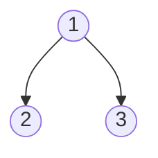

# Binary Tree Maximum Path Sum

## Problem

Find the maximum sum of any path in a binary tree (not necessarily root-to-leaf).

**Diagram:**

Example 1: Input: root = [1,2,3], Output: 6
Path: 2 -> 1 -> 3 = 6



Example 2: Input: root = [-10,9,20,null,null,15,7], Output: 42
Path: 15 -> 20 -> 7 = 42

```mermaid
flowchart TD
    A((-10)) --> B((9))
    A --> C((20))
    C --> D((15))
    C --> E((7))
```


## Why This Matters

Tree problems develop recursive thinking and hierarchical data navigation. Mastering tree traversals unlocks graph algorithms.

## Constraints

- The number of nodes in the tree is in the range [1, 3 * 10⁴].
- -1000 <= Node.val <= 1000

## Think About

1. What's the brute force approach? What's its time complexity?
2. Can you identify any patterns in the examples?
3. What data structure would help organize the information?

**Strategy**: See [Tree Pattern](../prerequisites/trees.md)

## Approach Hints

<details>
<summary>🔑 Key Insight</summary>
The maximum path can pass through any node, and at each node, you need to decide whether to include the left subtree, right subtree, both, or neither. This requires thinking about two different values: the maximum path through a node vs. the maximum path that can be extended upward from a node.
</details>

<details>
<summary>🎯 Main Approach</summary>
Use post-order DFS traversal (process children before parent). For each node, calculate the maximum single-path sum that can be extended to its parent (node value + max of left or right path, or just node value). Simultaneously track the global maximum by considering the path that uses both left and right subtrees through the current node.
</details>

<details>
<summary>⚡ Optimization Tip</summary>
When calculating the path that can be extended upward, ignore negative contributions from child paths (use max(0, child_path)). This handles negative values elegantly without separate edge case logic.
</details>

## Complexity Analysis

| Approach | Time | Space | Notes |
|----------|------|-------|-------|
| Optimal (DFS) | O(n) | O(h) | Visit each node once; space for recursion stack where h is tree height |

## Common Mistakes

1. **Confusing path through node vs. path from node**
   ```python
   # Wrong: Returning the path that goes through both children
   def maxPathSum(node):
       if not node:
           return 0
       left = maxPathSum(node.left)
       right = maxPathSum(node.right)
       return node.val + left + right  # Cannot extend this upward!

   # Correct: Track two separate values
   def helper(node):
       if not node:
           return 0
       left = max(0, helper(node.left))
       right = max(0, helper(node.right))
       # Update global max with path through node
       self.max_sum = max(self.max_sum, node.val + left + right)
       # Return path that can extend upward
       return node.val + max(left, right)
   ```

2. **Forgetting to handle negative values**
   ```python
   # Wrong: Including negative paths
   left = helper(node.left)
   right = helper(node.right)
   return node.val + max(left, right)

   # Correct: Ignore negative contributions
   left = max(0, helper(node.left))
   right = max(0, helper(node.right))
   return node.val + max(left, right)
   ```

3. **Not initializing global maximum correctly**
   ```python
   # Wrong: Starting with 0 when all values might be negative
   self.max_sum = 0

   # Correct: Initialize with first node's value or negative infinity
   self.max_sum = float('-inf')
   ```

## Variations

| Variation | Difficulty | Key Difference |
|-----------|------------|----------------|
| Binary Tree Maximum Path Sum (Root to Leaf) | Medium | Path must start at root and end at leaf |
| Diameter of Binary Tree | Easy | Count edges instead of sum values |
| Path Sum III | Medium | Path must sum to a specific target |
| Longest Univalue Path | Medium | Path nodes must have same value |

## Practice Checklist

- [ ] Solved without hints
- [ ] Optimal time complexity achieved
- [ ] Clean, readable code
- [ ] Handled all edge cases
- [ ] Can explain approach clearly

**Spaced Repetition:** Review in 1 day → 3 days → 7 days → 14 days → 30 days

---
**Strategy Reference:** [Tree Patterns](../../prerequisites/trees.md)
