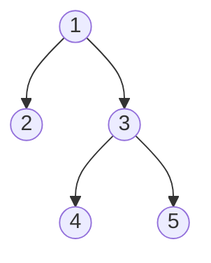

# Serialize and Deserialize Binary Tree

## Problem

Your task is to create methods that can convert a binary tree into a string representation and then reconstruct the original tree from that string.

Serialization transforms a tree data structure into a text format suitable for storage or network transmission. Deserialization performs the reverse operation, rebuilding the tree from the text representation.

You have complete freedom in choosing your encoding scheme. The only requirement is that your serialization format must allow perfect reconstruction of the original binary tree structure.

**Note:** You may design any string format you prefer for the serialization. Creativity in your approach is encouraged.


**Visual Reference:**

Example: Serialize and deserialize a binary tree


Serialization example:
```
Tree structure above can be serialized as:
"1,2,null,null,3,4,null,null,5,null,null"

Or using level-order:
"[1,2,3,null,null,4,5]"

Deserialization:
Parse the string and reconstruct the exact same tree structure
```


## Why This Matters

Tree problems develop recursive thinking and hierarchical data navigation. Mastering tree traversals unlocks graph algorithms.

## Examples

**Example 1:**
- Input: `root = []`
- Output: `[]`

## Constraints

- The number of nodes in the tree is in the range [0, 10⁴].
- -1000 <= Node.val <= 1000

## Think About

1. What's the brute force approach? Why is it inefficient?
2. What property of the input can you exploit?
3. Would sorting or preprocessing help?
4. Can you reduce this to a problem you've seen before?

**Strategy**: See [Tree Pattern](../prerequisites/trees.md)

## Approach Hints

<details>
<summary>Key Insight</summary>
A tree traversal that includes null markers can uniquely identify the tree structure. Preorder traversal (root, left, right) with explicit null markers allows you to reconstruct the tree by reading values in the same order. The key is encoding structural information (nulls) along with node values.
</details>

<details>
<summary>Main Approach</summary>
For serialization, perform a preorder traversal and append each node's value to a string, using a special marker (like "null" or "#") for empty children. Separate values with delimiters (like commas). For deserialization, split the string and recursively build the tree: read a value, create a node, recursively build left subtree, then right subtree. Use an index or queue to track position in the serialized string.
</details>

<details>
<summary>Optimization Tip</summary>
Use a queue-based approach (BFS/level-order) instead of recursion to avoid stack overflow on deep trees. Alternatively, use an iterative preorder traversal with an explicit stack. For space efficiency, use single characters as delimiters and compact number encoding if values have known ranges.
</details>

## Complexity Analysis

| Approach | Time | Space | Notes |
|----------|------|-------|-------|
| Preorder with Recursion | O(n) | O(n) | Serialize and deserialize both visit each node once |
| Level-order with Queue | O(n) | O(n) | More suitable for wide trees, avoids deep recursion |
| Optimal | O(n) | O(n) | Linear in number of nodes, optimal as every node must be processed |

## Common Mistakes

1. **Not Handling Null Nodes**
   ```python
   # Wrong: Loses structure information
   def serialize(self, root):
       if not root:
           return ""
       return str(root.val) + "," + self.serialize(root.left) + "," + self.serialize(root.right)

   # Correct: Include null markers
   def serialize(self, root):
       if not root:
           return "null"
       return str(root.val) + "," + self.serialize(root.left) + "," + self.serialize(root.right)
   ```

2. **Incorrect Deserialization Order**
   ```python
   # Wrong: Doesn't maintain preorder sequence
   def deserialize(self, data):
       vals = data.split(",")
       root = TreeNode(int(vals[0]))
       # Incorrectly processes remaining values

   # Correct: Use index or iterator to track position
   def deserialize(self, data):
       vals = data.split(",")
       self.index = 0
       def build():
           if vals[self.index] == "null":
               self.index += 1
               return None
           node = TreeNode(int(vals[self.index]))
           self.index += 1
           node.left = build()
           node.right = build()
           return node
       return build()
   ```

3. **Not Choosing Consistent Delimiter**
   ```python
   # Wrong: Value "12" could be confused with "1,2"
   result = str(root.val) + self.serialize(root.left)

   # Correct: Use clear delimiters
   result = str(root.val) + "," + self.serialize(root.left)
   ```

## Variations

| Variation | Difficulty | Key Difference |
|-----------|------------|----------------|
| Serialize BST | Medium | Can omit null markers due to BST property |
| Serialize N-ary Tree | Medium | Need to encode variable number of children |
| Encode Tree to File | Medium | Add compression or binary encoding |

## Practice Checklist

- [ ] Solved without hints
- [ ] Optimal time complexity achieved
- [ ] Clean, readable code
- [ ] Handled all edge cases
- [ ] Can explain approach clearly

**Spaced Repetition:** Review in 1 day → 3 days → 7 days → 14 days → 30 days

---
**Strategy Reference:** [Tree Traversal](../../prerequisites/trees.md)
