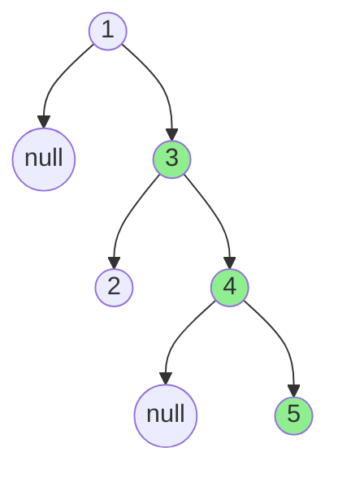
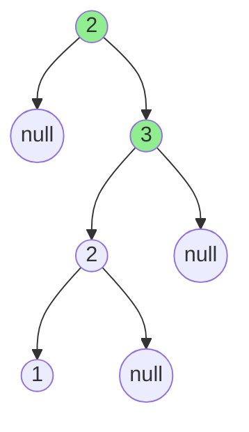

# Binary Tree Longest Consecutive Sequence

## Problem

You are given the `root` node of a binary tree. Your goal is to find the longest path in this tree where each node's value is exactly one greater than its parent's value in the path.

Such a path is called a **consecutive sequence path** because values increment by exactly 1 as you traverse down the path.

Important: The path must follow parent-to-child edges only (no backtracking to parents), but it can begin at any node in the tree.

Return the length of the longest such consecutive increasing path.


**Visual Reference:**

Example 1: Longest consecutive sequence of length 3

Path: 3 → 4 → 5 (length = 3)

Example 2: Longest consecutive sequence of length 2

Path: 2 → 3 (length = 2)


## Why This Matters

Tree problems develop recursive thinking and hierarchical data navigation. Mastering tree traversals unlocks graph algorithms.

## Constraints

- The number of nodes in the tree is in the range [1, 3 * 10⁴].
- -3 * 10⁴ <= Node.val <= 3 * 10⁴

## Think About

1. What's the brute force approach? Why is it inefficient?
2. What property of the input can you exploit?
3. Would sorting or preprocessing help?
4. Can you reduce this to a problem you've seen before?

**Strategy**: See [Tree Pattern](../strategies/data-structures/trees.md)

## Approach Hints

<details>
<summary>Key Insight</summary>
This is a path problem in a tree where you need to track consecutive increasing sequences. Each node can either extend a consecutive sequence from its parent (if node.val = parent.val + 1) or start a new sequence. The key is passing down parent information during traversal.
</details>

<details>
<summary>Main Approach</summary>
Use DFS to traverse the tree. At each node, check if it continues the consecutive sequence from its parent. If node.val equals parent.val + 1, extend the current sequence length; otherwise, start a new sequence with length 1. Pass the current sequence length to child nodes. Track the maximum sequence length seen globally during traversal.
</details>

<details>
<summary>Optimization Tip</summary>
You can solve this with a single DFS pass. Pass both the parent's value and current sequence length to the recursive function. Update the global maximum at each node. No need for multiple passes or storing paths - the recursive call handles everything in O(n) time.
</details>

## Complexity Analysis

| Approach | Time | Space | Notes |
|----------|------|-------|-------|
| DFS with Path Tracking | O(n) | O(n) | Visit each node once, recursion stack for tree height |
| BFS with State | O(n) | O(n) | Level-order traversal with sequence length state |
| Optimal | O(n) | O(h) | DFS with minimal state, h is tree height |

## Common Mistakes

1. **Only Checking Direct Parent-Child**
   ```python
   # Wrong: Doesn't track sequence length from ancestors
   def dfs(node):
       if not node:
           return 0
       left = dfs(node.left)
       right = dfs(node.right)
       return 1 + max(left, right)

   # Correct: Pass parent value and current length
   def dfs(node, parent_val, length):
       if not node:
           return length
       if node.val == parent_val + 1:
           length += 1
       else:
           length = 1
       return max(length, dfs(node.left, node.val, length),
                  dfs(node.right, node.val, length))
   ```

2. **Not Updating Global Maximum**
   ```python
   # Wrong: Only returns final value, misses intermediate sequences
   def longestConsecutive(self, root):
       return self.dfs(root, float('-inf'), 0)

   # Correct: Track global maximum
   def longestConsecutive(self, root):
       self.max_length = 0
       def dfs(node, parent_val, length):
           if not node:
               return
           length = length + 1 if node.val == parent_val + 1 else 1
           self.max_length = max(self.max_length, length)
           dfs(node.left, node.val, length)
           dfs(node.right, node.val, length)
       dfs(root, float('-inf'), 0)
       return self.max_length
   ```

3. **Allowing Sequences to Go Through Parent**
   ```python
   # Wrong: Path can go child -> parent -> child
   # (violates "parent-to-child edges only" constraint)

   # Correct: Only consider downward paths
   # Always pass information from parent to children, never combine paths
   ```

## Variations

| Variation | Difficulty | Key Difference |
|-----------|------------|----------------|
| Binary Tree Longest Consecutive Sequence II | Hard | Allow both increasing and decreasing sequences |
| Path with Any Difference | Medium | Consecutive with difference k instead of 1 |
| Longest Path in Tree | Medium | Remove consecutive constraint, find any longest path |

## Practice Checklist

- [ ] Solved without hints
- [ ] Optimal time complexity achieved
- [ ] Clean, readable code
- [ ] Handled all edge cases
- [ ] Can explain approach clearly

**Spaced Repetition:** Review in 1 day → 3 days → 7 days → 14 days → 30 days

---
**Strategy Reference:** [Tree DFS Pattern](../../strategies/data-structures/trees.md)
