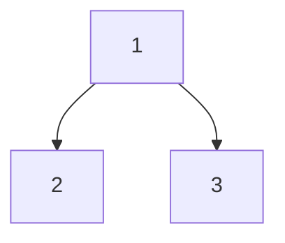

# Binary Tree Longest Consecutive Sequence II

## Problem

Given a binary tree's `root`, find the length of the longest path where consecutive nodes have values differing by exactly one.

A valid consecutive path can be either ascending or descending in value.

- For instance, `[1,2,3,4]` and `[4,3,2,1]` are both valid sequences, but `[1,2,4,3]` is not.

Additionally, the path may follow a child-parent-child pattern, not necessarily a strict parent-child direction.


**Diagram:**



```
Example 1:
Tree structure:
    1
   / \
  2   3

Consecutive sequences:
- Ascending: 1 -> 2 (length 2)
- Descending: 2 -> 1 (length 2)
- None involving 3 consecutively with 1

Longest consecutive sequence: 2

Example 2:
Tree structure:
    2
   / \
  1   3

Consecutive sequences:
- Ascending: 1 -> 2 -> 3 (length 3)
  (path goes: left child -> parent -> right child)
- Descending: 3 -> 2 -> 1 (length 3)
  (same path, different direction)

Longest consecutive sequence: 3

Key insight: Path can go child -> parent -> child
```


## Why This Matters

Tree problems develop recursive thinking and hierarchical data navigation. Mastering tree traversals unlocks graph algorithms.

## Constraints

- The number of nodes in the tree is in the range [1, 3 * 10⁴].
- -3 * 10⁴ <= Node.val <= 3 * 10⁴

## Think About

1. What makes this problem challenging? What's the core difficulty?
2. Can you identify subproblems? Do they overlap?
3. What invariants must be maintained?
4. Is there a mathematical relationship to exploit?

**Strategy**: See [Tree Pattern](../strategies/data-structures/trees.md)

## Approach Hints

<details>
<summary>Key Insight</summary>
A consecutive sequence can change direction at any node (child-parent-child). This means you need to track both ascending and descending sequences separately at each node, then combine them at the parent to form a complete path.
</details>

<details>
<summary>Main Approach</summary>
Use post-order traversal (process children before parent). For each node, track two values: longest ascending sequence ending at this node, and longest descending sequence ending at this node. The maximum consecutive path through a node is the sum of its ascending and descending sequences (minus 1 to avoid counting the node twice).
</details>

<details>
<summary>Optimization Tip</summary>
Return a tuple (ascending_length, descending_length) from each recursive call. At each node, if child.val = parent.val + 1, extend the ascending sequence; if child.val = parent.val - 1, extend the descending sequence. The global maximum can be updated at each node by combining ascending and descending paths.
</details>

## Complexity Analysis

| Approach | Time | Space | Notes |
|----------|------|-------|-------|
| Brute Force | O(n^2) | O(h) | Try all paths from each node |
| Optimal | O(n) | O(h) | Single post-order traversal, h = tree height |

## Common Mistakes

1. **Only considering parent-to-child paths**
   ```python
   # Wrong: Missing child-parent-child paths
   def dfs(node):
       if not node:
           return 0
       left = dfs(node.left)
       right = dfs(node.right)
       return max(left, right) + 1  # Only considers downward paths

   # Correct: Track both directions and combine them
   def dfs(node):
       if not node:
           return (0, 0)  # (ascending, descending)
       left_asc, left_desc = dfs(node.left)
       right_asc, right_desc = dfs(node.right)
       # Combine paths at current node
   ```

2. **Forgetting to reset sequence when values don't differ by 1**
   ```python
   # Wrong: Assuming continuity
   if node.left and node.left.val == node.val + 1:
       asc = left_asc + 1
   # Missing: else case should reset to 1, not 0

   # Correct: Every node starts a sequence of length 1
   asc = 1
   if node.left and node.left.val == node.val + 1:
       asc = max(asc, left_asc + 1)
   ```

3. **Returning the wrong value from recursion**
   ```python
   # Wrong: Returning combined path length
   def dfs(node):
       asc, desc = calculate()
       return asc + desc - 1  # Can't extend this upward

   # Correct: Return both directions separately
   def dfs(node):
       asc, desc = calculate()
       global_max = max(global_max, asc + desc - 1)
       return (asc, desc)  # Parent needs both values
   ```

## Variations

| Variation | Difficulty | Key Difference |
|-----------|------------|----------------|
| Binary Tree Longest Consecutive Sequence I | Medium | Only parent-to-child paths, single direction |
| Longest Path in Binary Tree | Medium | No consecutive requirement, just longest path |
| Path Sum III | Medium | Sum instead of consecutive values |

## Practice Checklist

- [ ] Solved without hints
- [ ] Optimal time complexity achieved
- [ ] Clean, readable code
- [ ] Handled all edge cases
- [ ] Can explain approach clearly

**Spaced Repetition:** Review in 1 day → 3 days → 7 days → 14 days → 30 days

---
**Strategy Reference:** [Tree Patterns](../../strategies/data-structures/trees.md)
