# Binary Tree Cameras

## Problem

Given the `root` of a binary tree, you need to place surveillance cameras on certain nodes. Each camera placed at a node has the capability to monitor three entities: the node itself, its direct parent, and both of its immediate children.

Calculate and return the minimum number of cameras required to ensure complete surveillance coverage of every node in the tree.


**Diagram:**

```mermaid
graph TD
    subgraph "Example 1: 1 camera needed"
        A1[0] --> B1[0 📷]
        B1 --> C1[0]
        B1 --> D1[null]
    end

    subgraph "Example 2: 2 cameras needed"
        A2[0] --> B2[0 📷]
        A2 --> C2[0]
        B2 --> D2[0]
        B2 --> E2[0]
        C2 --> F2[0 📷]
    end
```



```
Example 1: Minimum 1 camera
      0
      |
    [0] ← camera here covers parent, self, and children
     /
    0

Example 2: Minimum 2 cameras
        0
       / \
    [0]   0
     /     \
    0     [0] ← cameras cover all nodes

Camera at node covers: parent + self + children
```


## Why This Matters

Tree problems develop recursive thinking and hierarchical data navigation. Mastering tree traversals unlocks graph algorithms.

## Constraints

- The number of nodes in the tree is in the range [1, 1000].
- Node.val == 0

## Think About

1. What makes this problem challenging? What's the core difficulty?
2. Can you identify subproblems? Do they overlap?
3. What invariants must be maintained?
4. Is there a mathematical relationship to exploit?

## Approach Hints

<details>
<summary>🔑 Key Insight</summary>
Greedy strategy from bottom-up: it's better to place cameras at parents rather than leaf nodes, because a camera at a parent can cover more nodes (itself, its parent, and its children). Process the tree in post-order (children before parents).
</details>

<details>
<summary>🎯 Main Approach</summary>
Use a post-order DFS where each node returns one of three states: 0 (needs coverage), 1 (has camera), 2 (is covered). If any child needs coverage (state 0), place a camera at the current node. If any child has a camera, the current node is covered. Leaf nodes initially need coverage, forcing their parents to have cameras.
</details>

<details>
<summary>⚡ Optimization Tip</summary>
Handle the root node specially: if the root returns state 0 (needs coverage) after processing all children, you must place one more camera at the root. This is the only case where you need to check the return value explicitly.
</details>

## Complexity Analysis

| Approach | Time | Space | Notes |
|----------|------|-------|-------|
| Greedy Post-order | O(n) | O(h) | h = tree height for recursion stack |
| Optimal | O(n) | O(h) | Single pass through all nodes |

## Common Mistakes

1. **Placing Cameras at Leaves**
   ```python
   # Wrong: Greedy approach starting from leaves
   def dfs(node):
       if not node.left and not node.right:
           place_camera(node)  # Inefficient!

   # Correct: Let leaves be covered by their parents
   def dfs(node):
       if not node.left and not node.right:
           return 0  # Needs coverage
   ```

2. **Not Handling Root Node Specially**
   ```python
   # Wrong: Assuming root is always covered
   def minCameraCover(root):
       dfs(root)
       return camera_count

   # Correct: Check if root needs coverage after DFS
   def minCameraCover(root):
       if dfs(root) == 0:  # Root needs coverage
           self.cameras += 1
       return self.cameras
   ```

3. **Confusing State Transitions**
   ```python
   # Wrong: Incorrect state logic
   if left == 1 or right == 1:
       return 1  # Camera at current node? No!

   # Correct: Proper state transitions
   if left == 0 or right == 0:
       self.cameras += 1
       return 1  # Place camera here
   if left == 1 or right == 1:
       return 2  # Covered by child
   return 0  # Needs coverage
   ```

## Variations

| Variation | Difficulty | Key Difference |
|-----------|------------|----------------|
| Minimum Vertex Cover | Hard | General graph instead of tree |
| Binary Tree Coloring | Medium | Different coverage rules |
| Distribute Coins in Binary Tree | Medium | Resource distribution instead of coverage |

## Practice Checklist

- [ ] Solved without hints
- [ ] Optimal time complexity achieved
- [ ] Clean, readable code
- [ ] Handled all edge cases
- [ ] Can explain approach clearly

**Spaced Repetition:** Review in 1 day → 3 days → 7 days → 14 days → 30 days

---
**Strategy Reference:** [Tree Patterns](../../prerequisites/trees.md)
