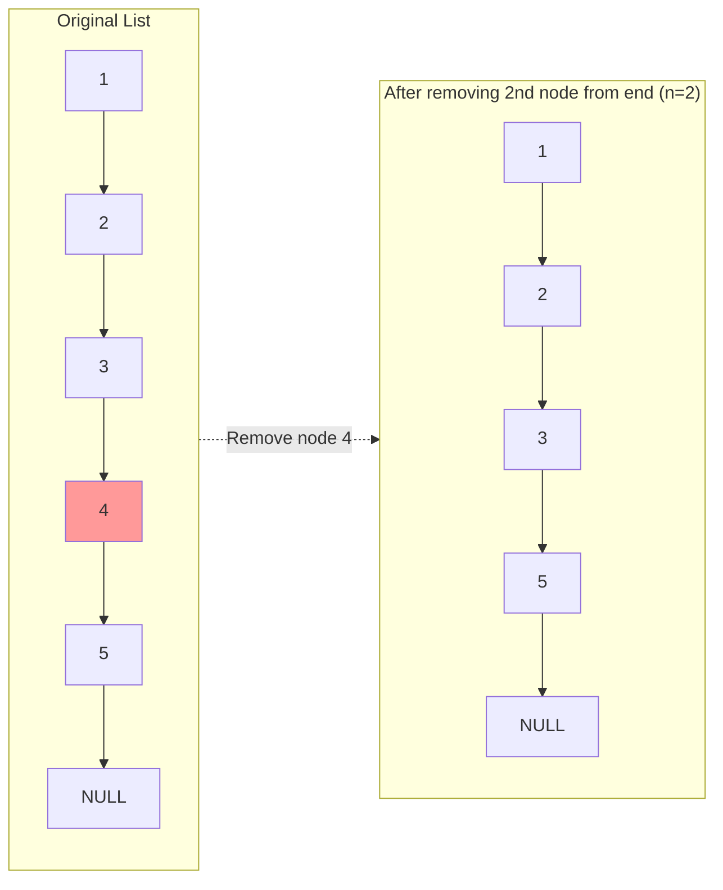

# Remove Nth Node From End of List

## Problem

Given a linked list and a number n, remove the nth node counting from the end of the list, then return the modified list's head. The tricky part is that linked lists only allow forward traversal, so you can't simply count backwards. For instance, in a list 1→2→3→4→5, removing the 2nd node from the end means removing node 4, resulting in 1→2→3→5. You need to identify the target node without making two passes through the list (an inefficient approach). The key insight involves maintaining a fixed gap between two pointers. Consider edge cases carefully: what if n equals the length of the list, meaning you must remove the head? What if the list contains only one node and you need to remove it?

**Diagram:**




## Why This Matters

The two-pointer technique you'll master here is fundamental to dozens of linked list and array problems. Operating systems use similar pointer manipulation for memory management and process scheduling. Implementing undo/redo functionality in applications relies on traversing and modifying linked structures. The dummy node pattern eliminates special-case handling, a principle that makes production code cleaner and less error-prone. This problem teaches you to think spatially about data structures: maintaining invariants like "these two pointers are always n nodes apart" is a powerful problem-solving strategy. Buffer management in network protocols and I/O systems uses comparable relative-positioning techniques. It's a high-frequency interview question because it tests whether you can think beyond naive solutions and handle edge cases gracefully. The single-pass constraint forces you to develop spatial reasoning about data structure traversal.

## Examples

**Example 1:**
- Input: `head = [1], n = 1`
- Output: `[]`

**Example 2:**
- Input: `head = [1,2], n = 1`
- Output: `[1]`

## Constraints

- The number of nodes in the list is sz.
- 1 <= sz <= 30
- 0 <= Node.val <= 100
- 1 <= n <= sz

## Think About

1. How can you find the nth node from the end without knowing the list length?
2. What if you had to make only one pass through the list?
3. How can two pointers maintain a fixed distance between them?
4. What edge case requires special handling (hint: removing the head)?

---

## Approach Hints

<details>
<summary>💡 Hint 1: The two-pointer insight</summary>

The key insight: If two pointers are **n nodes apart**, when the fast pointer reaches the end, the slow pointer will be exactly n nodes from the end.

**Think about:**
- If fast pointer is at node 5 and slow at node 2, they're 3 nodes apart
- When fast reaches NULL (end), slow is 3 nodes from the end
- This works in a single pass through the list

```
List: 1 → 2 → 3 → 4 → 5 → NULL, n=2

Step 1: Move fast n steps ahead
        s           f
        1 → 2 → 3 → 4 → 5 → NULL

Step 2: Move both until fast reaches end
                    s           f
        1 → 2 → 3 → 4 → 5 → NULL

Slow is now n nodes from end!
```

</details>

<details>
<summary>🎯 Hint 2: The dummy node trick</summary>

What if n equals the list length? You'd need to remove the head node, which is a special case.

**Solution:** Use a dummy node before the head.

```
Original: 1 → 2 → 3 → NULL, n=3 (remove head)

With dummy:
dummy → 1 → 2 → 3 → NULL
  ↑
This simplifies head removal!
```

The dummy node ensures you always have a previous node to update, even when removing the head.

**Why it works:**
- Dummy.next always points to the true head
- You can treat all cases uniformly
- Return dummy.next as the new head

</details>

<details>
<summary>📝 Hint 3: Complete algorithm</summary>

```
create dummy node pointing to head
fast = dummy
slow = dummy

# Step 1: Move fast n+1 steps ahead
# (n+1 so slow ends up BEFORE the node to delete)
for i in range(n + 1):
    if fast is None:
        return head  # n > list length
    fast = fast.next

# Step 2: Move both pointers until fast reaches end
while fast is not None:
    fast = fast.next
    slow = slow.next

# Step 3: Remove the target node
# slow is now before the node to delete
slow.next = slow.next.next

return dummy.next
```

**Why n+1 steps?**
- We need slow to stop at the node BEFORE the one to delete
- This allows us to do `slow.next = slow.next.next`

**Edge case handled:**
- If removing head, slow stays at dummy, and `dummy.next` is updated correctly

</details>

---

## Complexity Analysis

| Approach | Time | Space | Trade-off |
|----------|------|-------|-----------|
| Two-pass (count length first) | O(L) | O(1) | Simple but requires 2 passes |
| **Two-pointer (one pass)** | **O(L)** | **O(1)** | Optimal: single pass |
| Recursive | O(L) | O(L) | Elegant but uses call stack |

**Where L is the list length**

**Why two-pointer wins:**
- Single pass through the list
- O(1) extra space (just two pointers)
- Handles all edge cases cleanly with dummy node
- Interview-preferred solution

**Space breakdown:**
- Two pointers: O(1)
- Dummy node: O(1)
- No auxiliary data structures needed

---

## Common Mistakes

### 1. Off-by-one error in pointer distance
```python
# WRONG: Fast moves n steps, slow ends up AT the node to delete
for i in range(n):
    fast = fast.next
# Now can't easily delete slow's position!

# CORRECT: Fast moves n+1 steps, slow ends up BEFORE the node
for i in range(n + 1):
    fast = fast.next
# Now slow.next is the node to delete
```

### 2. Not using a dummy node
```python
# WRONG: Special case needed for removing head
if n == length:
    return head.next  # Remove head
# ... rest of logic ...

# CORRECT: Dummy node handles all cases uniformly
dummy = ListNode(0)
dummy.next = head
# ... algorithm ...
return dummy.next  # Works whether head was removed or not
```

### 3. Null pointer exception
```python
# WRONG: Doesn't check if fast becomes None
for i in range(n + 1):
    fast = fast.next  # Might become None!

while fast is not None:  # This check is too late!
    fast = fast.next
    slow = slow.next

# CORRECT: Check during the initial advance
for i in range(n + 1):
    if fast is None:
        break  # or handle edge case
    fast = fast.next
```

### 4. Forgetting to handle edge cases
```python
# WRONG: Doesn't handle single-node list
# List: [1], n=1
# After deletion: should return []

# CORRECT: Dummy node automatically handles this
dummy = ListNode(0)
dummy.next = head  # Even works for single node
# ... algorithm ...
return dummy.next  # Returns None if list becomes empty
```

---

## Variations

| Variation | Change | Approach Adjustment |
|-----------|--------|---------------------|
| **Remove nth from start** | Count from beginning | Simple: advance n-1 times, delete next |
| **Remove all occurrences of value** | Delete matching nodes | Track previous, skip matching nodes |
| **Remove duplicates** | Delete duplicate values | Track previous, compare values |
| **Find nth from end (no deletion)** | Just return the node | Same two-pointer, but don't delete |
| **Return deleted node's value** | Return value instead of list | Same algo, capture node.val before deletion |

**Find nth from end variation:**
```python
def findNthFromEnd(head, n):
    fast = slow = head

    # Move fast n steps ahead
    for _ in range(n):
        if not fast:
            return None
        fast = fast.next

    # Move both until fast reaches end
    while fast:
        fast = fast.next
        slow = slow.next

    return slow  # This is the nth node from end
```

---

## Visual Walkthrough

```
List: 1 → 2 → 3 → 4 → 5 → NULL, n=2 (remove 4)

Step 0: Create dummy
dummy → 1 → 2 → 3 → 4 → 5 → NULL
  ↑
fast, slow

Step 1: Move fast n+1=3 steps ahead
dummy → 1 → 2 → 3 → 4 → 5 → NULL
  ↑                 ↑
slow              fast

Step 2: Move both until fast hits NULL
dummy → 1 → 2 → 3 → 4 → 5 → NULL
              ↑                 ↑
            slow              fast

Step 3: Delete slow.next (node 4)
dummy → 1 → 2 → 3 ----→ 5 → NULL
              ↑
            slow

Result: dummy.next = 1 → 2 → 3 → 5 → NULL
```

**Edge case: Remove head (n = list length)**
```
List: 1 → 2 → 3 → NULL, n=3

Step 0: Create dummy
dummy → 1 → 2 → 3 → NULL
  ↑
fast, slow

Step 1: Move fast n+1=4 steps ahead
dummy → 1 → 2 → 3 → NULL
  ↑                       ↑
slow                    fast (None after 4 steps)

Step 2: (Loop doesn't run, fast already None)

Step 3: Delete slow.next (node 1, the head)
dummy ----→ 2 → 3 → NULL

Result: dummy.next = 2 → 3 → NULL (head successfully removed!)
```

---

## Practice Checklist

**Correctness:**
- [ ] Handles removing head (n = list length)
- [ ] Handles single-node list
- [ ] Handles removing tail (n = 1)
- [ ] Handles middle node removal
- [ ] Correctly maintains n+1 gap between pointers

**Code Quality:**
- [ ] Uses dummy node pattern
- [ ] Clean two-pointer logic
- [ ] No null pointer exceptions
- [ ] Handles all edge cases

**Interview Readiness:**
- [ ] Can explain two-pointer technique in 2 minutes
- [ ] Can code solution in 8 minutes
- [ ] Can discuss why n+1 gap is needed
- [ ] Can handle follow-up variations

**Spaced Repetition Tracker:**
- [ ] Day 1: Initial solve
- [ ] Day 3: Solve without looking at hints
- [ ] Day 7: Solve "find nth from end" variation
- [ ] Day 14: Explain approach to someone else
- [ ] Day 30: Quick review and edge case testing

---

**Strategy**: See [Linked List Pattern](../../strategies/data-structures/linked-lists.md)
